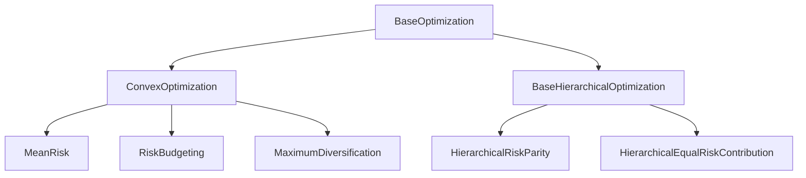

# 投资组合优化

<cite>
**本文档中引用的文件**   
- [__init__.py](file://src/skfolio/optimization/__init__.py)
- [_base.py](file://src/skfolio/optimization/_base.py)
- [convex/\_\_init\_\_.py](file://src/skfolio/optimization/convex/__init__.py)
- [cluster/\_\_init\_\_.py](file://src/skfolio/optimization/cluster/__init__.py)
- [_mean_risk.py](file://src/skfolio/optimization/convex/_mean_risk.py)
- [_risk_budgeting.py](file://src/skfolio/optimization/convex/_risk_budgeting.py)
- [_maximum_diversification.py](file://src/skfolio/optimization/convex/_maximum_diversification.py)
- [_hrp.py](file://src/skfolio/optimization/cluster/hierarchical/_hrp.py)
- [_herc.py](file://src/skfolio/optimization/cluster/hierarchical/_herc.py)
- [_base.py](file://src/skfolio/optimization/convex/_base.py)
- [_benchmark_tracker.py](file://src/skfolio/optimization/convex/_benchmark_tracker.py)
- [_distributionally_robust.py](file://src/skfolio/optimization/convex/_distributionally_robust.py)
- [examples/mean_risk/plot_1_maximum_sharpe_ratio.py](file://examples/mean_risk/plot_1_maximum_sharpe_ratio.py)
- [examples/mean_risk/plot_2_minimum_CVaR.py](file://examples/mean_risk/plot_2_minimum_CVaR.py)
- [examples/mean_risk/plot_3_efficient_frontier.py](file://examples/mean_risk/plot_3_efficient_frontier.py)
- [examples/risk_budgeting/plot_1_risk_parity_variance.py](file://examples/risk_budgeting/plot_1_risk_parity_variance.py)
- [examples/risk_budgeting/plot_2_risk_budgeting_CVaR.py](file://examples/risk_budgeting/plot_2_risk_budgeting_CVaR.py)
- [examples/maximum_diversification/plot_1_maximum_diversification.py](file://examples/maximum_diversification/plot_1_maximum_diversification.py)
- [examples/clustering/plot_1_hrp_cvar.py](file://examples/clustering/plot_1_hrp_cvar.py)
- [examples/clustering/plot_2_herc_cdar.py](file://examples/clustering/plot_2_herc_cdar.py)
- [examples/clustering/plot_3_hrp_vs_herc.py](file://examples/clustering/plot_3_hrp_vs_herc.py)
</cite>

## 目录
1. [引言](#引言)
2. [核心优化器概述](#核心优化器概述)
3. [均值-风险优化 (MeanRisk)](#均值-风险优化-meanrisk)
4. [风险预算优化 (RiskBudgeting)](#风险预算优化-riskbudgeting)
5. [最大分散化优化 (MaximumDiversification)](#最大分散化优化-maximumdiversification)
6. [分层聚类优化 (HRP, HERC)](#分层聚类优化-hrp-herc)
7. [性能与数值稳定性](#性能与数值稳定性)
8. [结论](#结论)

## 引言
本文件旨在全面记录 `skfolio` 库中的所有投资组合优化算法。我们将深入探讨 `MeanRisk`、`RiskBudgeting`、`HierarchicalRiskParity` (HRP)、`HierarchicalEqualRiskContribution` (HERC) 和 `MaximumDiversification` 等核心优化器。文档将详细解释每个优化器的数学原理、适用场景、配置参数，并提供与 `examples` 目录中脚本关联的代码示例。

## 核心优化器概述
`skfolio` 库的优化模块遵循一个清晰的层次结构。所有优化器都继承自 `BaseOptimization` 基类，该基类提供了通用的接口和功能，如 `fit`、`predict` 和 `score`。优化器主要分为两大类：
1.  **凸优化 (Convex Optimization)**: 包括 `MeanRisk`、`RiskBudgeting` 和 `MaximumDiversification`。这类优化器通过求解凸优化问题来找到全局最优解。
2.  **分层聚类优化 (Cluster Optimization)**: 包括 `HierarchicalRiskParity` (HRP) 和 `HierarchicalEqualRiskContribution` (HERC)。这类优化器利用资产间的距离矩阵和分层聚类算法来构建投资组合，不依赖于传统的协方差矩阵。



**Diagram sources**
- [__init__.py](file://src/skfolio/optimization/__init__.py)
- [_base.py](file://src/skfolio/optimization/_base.py)
- [convex/\_\_init\_\_.py](file://src/skfolio/optimization/convex/__init__.py)
- [cluster/\_\_init\_\_.py](file://src/skfolio/optimization/cluster/__init__.py)

## 均值-风险优化 (MeanRisk)

`MeanRisk` 优化器是 `skfolio` 中最灵活和功能最强大的凸优化器之一。它允许用户在多种目标函数和风险度量之间进行选择，从而构建出满足不同投资目标的投资组合。

### 数学原理与目标函数
`MeanRisk` 优化器可以求解四种不同的目标函数：

1.  **最小化风险 (MINIMIZE_RISK)**:
    ```math
    \begin{cases}
    \begin{aligned}
    &\min_{w} & & risk_{i}(w) \\
    &\text{s.t.} & & w^T \cdot \mu \ge min\_return \\
    & & & A \cdot w \ge b \\
    & & & risk_{j}(w) \le max\_risk_{j} \quad \forall \; j \ne i
    \end{aligned}
    \end{cases}
    ```

2.  **最大化预期收益 (MAXIMIZE_RETURN)**:
    ```math
    \begin{cases}
    \begin{aligned}
    &\max_{w} & & w^T \cdot \mu \\
    &\text{s.t.} & & risk_{i}(w) \le max\_risk_{i} \\
    & & & A \cdot w \ge b \\
    & & & risk_{j}(w) \le max\_risk_{j} \quad \forall \; j \ne i
    \end{aligned}
    \end{cases}
    ```

3.  **最大化效用 (MAXIMIZE_UTILITY)**:
    ```math
    \begin{cases}
    \begin{aligned}
    &\max_{w} & & w^T \cdot \mu - \lambda \times risk_{i}(w)\\
    &\text{s.t.} & & risk_{i}(w) \le max\_risk_{i} \\
    & & & w^T \cdot \mu \ge min\_return \\
    & & & A \cdot w \ge b \\
    & & & risk_{j}(w) \le max\_risk_{j} \quad \forall \; j \ne i
    \end{aligned}
    \end{cases}
    ```
    其中，`λ` (由 `risk_aversion` 参数控制) 是风险厌恶系数。

4.  **最大化比率 (MAXIMIZE_RATIO)**:
    ```math
    \begin{cases}
    \begin{aligned}
    &\max_{w} & & \frac{w^T \cdot \mu - r_{f}}{risk_{i}(w)}\\
    &\text{s.t.} & & risk_{i}(w) \le max\_risk_{i} \\
    & & & w^T \cdot \mu \ge min\_return \\
    & & & A \cdot w \ge b \\
    & & & risk_{j}(w) \le max\_risk_{j} \quad \forall \; j \ne i
    \end{aligned}
    \end{cases}
    ```
    这通常用于最大化夏普比率（当 `risk_measure` 为标准差时）。

**Section sources**
- [_mean_risk.py](file://src/skfolio/optimization/convex/_mean_risk.py#L31-L80)

### 风险度量
`MeanRisk` 支持多种风险度量，包括方差、半方差、CVaR（条件风险价值）、CDaR（条件回撤风险）等。用户可以通过 `risk_measure` 参数进行选择。

### 权重约束
`MeanRisk` 提供了丰富的权重约束选项：
-   `min_weights` 和 `max_weights`: 定义每个资产的最小和最大权重。
-   `budget`: 定义总投资预算（所有权重之和）。
-   `min_budget` 和 `max_budget`: 定义预算的上下限。
-   `max_short` 和 `max_long`: 分别定义多头和空头头寸的最大值。
-   `cardinality`: 通过混合整数规划限制投资资产的数量。
-   `group_cardinalities`: 对特定资产组设置基数约束。

### 交易成本与管理费
`MeanRisk` 可以将交易成本和管理费纳入优化过程：
-   **交易成本**: 通过 `transaction_costs` 参数定义，成本模型为 `total_cost = Σ c_i * |w_i - w_prev_i|`，其中 `c_i` 是资产 `i` 的交易成本，`w_prev_i` 是其前一个权重。该成本会从预期收益中扣除。
-   **管理费**: 通过 `management_fees` 参数定义，成本模型为 `total_fee = Σ f_i * w_i`，其中 `f_i` 是资产 `i` 的管理费。该费用同样会从预期收益中扣除。

### 代码示例
以下代码展示了如何使用 `MeanRisk` 优化器来最大化夏普比率：

```python
from skfolio import MeanRisk, RiskMeasure
from skfolio.datasets import load_sp500

# 加载数据
X = load_sp500()

# 创建并配置优化器
opt = MeanRisk(
    objective_function="MAXIMIZE_RATIO",
    risk_measure=RiskMeasure.STANDARD_DEVIATION,
    min_weights=0.0,
    max_weights=0.3
)

# 拟合并获取投资组合
portfolio = opt.fit_predict(X)
```

**Section sources**
- [_mean_risk.py](file://src/skfolio/optimization/convex/_mean_risk.py)
- [examples/mean_risk/plot_1_maximum_sharpe_ratio.py](file://examples/mean_risk/plot_1_maximum_sharpe_ratio.py)

## 风险预算优化 (RiskBudgeting)

`RiskBudgeting` 优化器旨在构建一个风险预算分配的投资组合，其中每个资产对总风险的贡献与其预设的风险预算成正比。当所有资产的风险预算相等时，它就退化为风险平价（Risk Parity）策略。

### 数学原理
`RiskBudgeting` 优化器求解以下凸优化问题：
```math
\begin{cases}
\begin{aligned}
& \min_{w,s} && \mathrm{Risk}(w) \\
& \text{s.t.} && budget^{\top}\log(w) \ge 0 \\
&             && \mathbf{1}^{\top} w = s \\
&             && expected\_return(w) \ge s\, min\_return \\
&             && A w \le s\, b \\
&             && w \ge 0
\end{aligned}
\end{cases}
```
其中 `budget` 是风险预算向量。该问题通过一个辅助变量 `s` 和对数变换来确保凸性。

### 风险预算参数
-   `risk_budget`: 一个数组或字典，用于指定每个资产的风险预算。如果未提供，则默认为等权重（即风险平价）。

### 适用场景
`RiskBudgeting` 特别适用于希望主动管理风险来源的投资者。例如，投资者可以为低波动性资产分配更高的风险预算，以增加其在投资组合中的影响力。

### 代码示例
以下代码展示了如何使用 `RiskBudgeting` 优化器来构建一个风险平价投资组合：

```python
from skfolio import RiskBudgeting, RiskMeasure
from skfolio.datasets import load_sp500

# 加载数据
X = load_sp500()

# 创建并配置优化器（使用默认的等风险预算）
opt = RiskBudgeting(
    risk_measure=RiskMeasure.VARIANCE,
    min_weights=0.0
)

# 拟合并获取投资组合
portfolio = opt.fit_predict(X)
```

**Section sources**
- [_risk_budgeting.py](file://src/skfolio/optimization/convex/_risk_budgeting.py)
- [examples/risk_budgeting/plot_1_risk_parity_variance.py](file://examples/risk_budgeting/plot_1_risk_parity_variance.py)

## 最大分散化优化 (MaximumDiversification)

`MaximumDiversification` 优化器的目标是最大化投资组合的分散化比率（Diversification Ratio），该比率定义为投资组合中各资产加权波动率之和与投资组合总波动率的比值。

### 数学原理
`MaximumDiversification` 是 `MeanRisk` 优化器的一个特例。它通过将 `MeanRisk` 的目标函数中的预期收益 `μ` 替换为资产的波动率向量 `σ` 来实现。其优化问题可以表述为：
```math
\max_w \frac{\sum_{i=1}^{N} \sigma_i w_i}{\sqrt{w^T \Sigma w}}
```
其中 `σ_i` 是资产 `i` 的波动率，`Σ` 是协方差矩阵。

### 实现细节
在 `skfolio` 中，`MaximumDiversification` 类继承自 `MeanRisk`，并通过设置 `objective_function=MAXIMIZE_RATIO` 和 `risk_measure=STANDARD_DEVIATION`，并重写 `expected_return` 为加权波动率来实现。

### 适用场景
该策略适用于希望最大化投资组合分散化效果的投资者，尤其是在资产间相关性较低时，能有效降低整体风险。

### 代码示例
以下代码展示了如何使用 `MaximumDiversification` 优化器：

```python
from skfolio import MaximumDiversification, RiskMeasure
from skfolio.datasets import load_sp500

# 加载数据
X = load_sp500()

# 创建并配置优化器
opt = MaximumDiversification(
    min_weights=0.0,
    max_weights=0.2
)

# 拟合并获取投资组合
portfolio = opt.fit_predict(X)
```

**Section sources**
- [_maximum_diversification.py](file://src/skfolio/optimization/convex/_maximum_diversification.py)
- [examples/maximum_diversification/plot_1_maximum_diversification.py](file://examples/maximum_diversification/plot_1_maximum_diversification.py)

## 分层聚类优化 (HRP, HERC)

分层聚类优化器利用资产间的距离矩阵和分层聚类算法来构建投资组合，其核心思想是将资产分组，并在组内和组间进行风险分配。

### 树状结构构建
1.  **距离矩阵**: 使用 `distance_estimator` (默认为皮尔逊距离) 计算资产间的距离矩阵。
2.  **分层聚类**: 使用 `hierarchical_clustering_estimator` (默认为Ward方差最小化算法) 基于距离矩阵计算链接矩阵（linkage matrix），形成一个树状图（dendrogram）。
3.  **最优叶序**: 使用 `optimal_leaf_ordering` 算法对树状图的叶节点进行重新排序，以最小化相邻资产间的距离。

### 递归分配逻辑

#### 分层风险平价 (HierarchicalRiskParity, HRP)
HRP 采用自上而下的递归二分法：
1.  从树状图的根节点开始。
2.  将当前节点（集群）递归地分成两个子集群。
3.  对每个子集群，计算一个逆风险分配（inverse-risk allocation）的总风险。
4.  计算权重因子 `α = 1 - left_risk / (left_risk + right_risk)`。
5.  将当前集群的权重按 `α` 和 `(1-α)` 的比例分配给左右两个子集群。
6.  重复步骤2-5，直到到达叶节点。

#### 分层等风险贡献 (HierarchicalEqualRiskContribution, HERC)
HERC 与 HRP 的主要区别在于它利用了树状图的完整结构，而不仅仅是二分：
1.  首先，使用分层聚类算法将资产划分为 `n_clusters` 个集群。
2.  计算每个集群的总风险（基于逆风险分配）。
3.  从树状图的根节点开始，递归地向下遍历。
4.  在每个非叶节点，根据其左右子树所包含的集群的风险总和，使用风险平价原则来分配权重。
5.  最后，将集群间的权重与集群内部的权重（逆风险分配）相结合，得到最终的资产权重。
6.  **权重约束**: 与 HRP 不同，HERC 在递归分配过程中无法直接应用权重约束。因此，`skfolio` 在分配完成后，通过求解一个凸优化问题来最小化最终权重与初始权重之间的相对偏差，从而施加约束。

### 代码示例
以下代码展示了如何使用 HRP 和 HERC 优化器：

```python
from skfolio import HierarchicalRiskParity, HierarchicalEqualRiskContribution
from skfolio.datasets import load_sp500

# 加载数据
X = load_sp500()

# 使用 HRP
hrp_opt = HierarchicalRiskParity(risk_measure="CVaR")
hrp_portfolio = hrp_opt.fit_predict(X)

# 使用 HERC
herc_opt = HierarchicalEqualRiskContribution(risk_measure="CDaR")
herc_portfolio = herc_opt.fit_predict(X)
```

**Section sources**
- [_hrp.py](file://src/skfolio/optimization/cluster/hierarchical/_hrp.py)
- [_herc.py](file://src/skfolio/optimization/cluster/hierarchical/_herc.py)
- [examples/clustering/plot_1_hrp_cvar.py](file://examples/clustering/plot_1_hrp_cvar.py)
- [examples/clustering/plot_2_herc_cdar.py](file://examples/clustering/plot_2_herc_cdar.py)
- [examples/clustering/plot_3_hrp_vs_herc.py](file://examples/clustering/plot_3_hrp_vs_herc.py)

## 性能与数值稳定性

### 求解器选择
`skfolio` 默认使用 `CLARABEL` 求解器，因为它在数值稳定性和性能方面优于 `ECOS` 和 `SCS`。对于需要混合整数规划（MIP）的问题（如 `cardinality` 约束），建议使用 `SCIP` 或商业求解器（如 MOSEK, GUROBI）。

### 数值稳定性问题
-   **协方差矩阵**: 当资产数量接近或超过观测期数量时，样本协方差矩阵可能接近奇异，导致优化不稳定。建议使用 `LedoitWolf` 等收缩估计器。
-   **距离矩阵**: 距离矩阵的计算对异常值敏感。确保输入数据经过适当的预处理。
-   **Wasserstein球半径**: 在 `DistributionallyRobustCVaR` 中，`wasserstein_ball_radius` 参数需要仔细调整，过大的值可能导致过于保守的投资组合。

## 结论
`skfolio` 提供了一套全面且灵活的投资组合优化工具。`MeanRisk` 优化器适用于需要精确控制风险和收益的场景；`RiskBudgeting` 优化器为风险预算分配提供了强大的框架；`MaximumDiversification` 优化器专注于最大化分散化；而 `HRP` 和 `HERC` 等分层聚类优化器则提供了一种稳健的、不依赖于协方差矩阵的投资组合构建方法。通过理解每个优化器的数学原理和配置参数，用户可以根据其特定的投资目标和约束条件，选择最合适的策略。