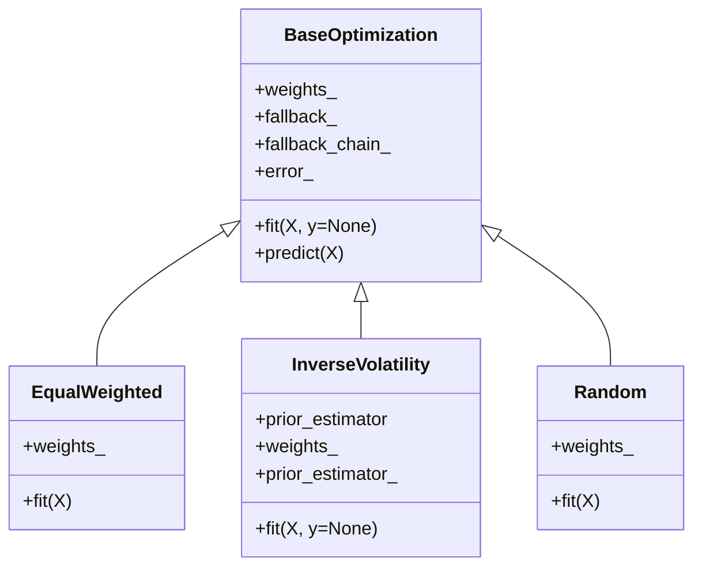
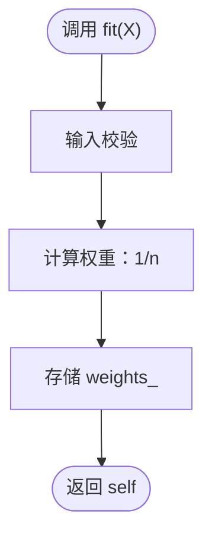
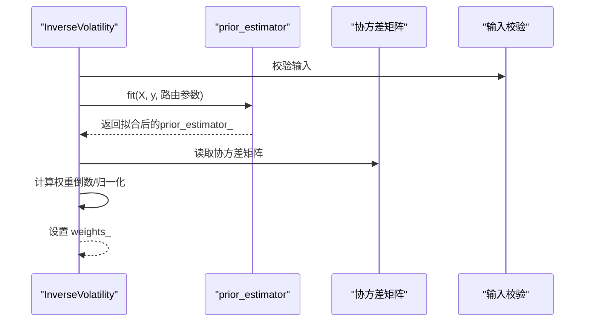
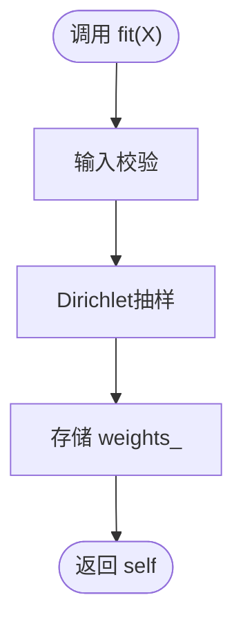
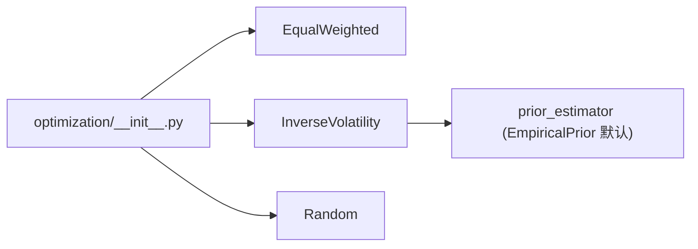

# 朴素优化

<cite>
**本文引用的文件**
- [src/skfolio/optimization/naive/_naive.py](file://src/skfolio/optimization/naive/_naive.py)
- [src/skfolio/optimization/naive/__init__.py](file://src/skfolio/optimization/naive/__init__.py)
- [src/skfolio/optimization/__init__.py](file://src/skfolio/optimization/__init__.py)
- [tests/test_optimization/test_naive/test_naive.py](file://tests/test_optimization/test_naive/test_naive.py)
- [docs/user_guide/optimization.rst](file://docs/user_guide/optimization.rst)
- [examples/risk_budgeting/plot_1_risk_parity_variance.py](file://examples/risk_budgeting/plot_1_risk_parity_variance.py)
</cite>

## 目录
1. [引言](#引言)
2. [项目结构](#项目结构)
3. [核心组件](#核心组件)
4. [架构总览](#架构总览)
5. [详细组件分析](#详细组件分析)
6. [依赖关系分析](#依赖关系分析)
7. [性能考量](#性能考量)
8. [故障排查指南](#故障排查指南)
9. [结论](#结论)
10. [附录](#附录)

## 引言
本章节面向“朴素投资组合优化策略”，重点记录三类简单规则：等权重（Equal Weighted）、逆波动率（Inverse Volatility）、随机权重（Random）。它们在src/skfolio/optimization/naive/_naive.py中以scikit-learn风格的Estimator形式实现，作为基准模型（benchmark），用于与更复杂的优化器进行性能对比。朴素策略具有实现简单、计算高效、易于理解的特点；但同时忽略资产间的相关性与风险特征，可能在多资产组合中导致风险分散不足或权重过于集中。本文将系统阐述其实现逻辑、数据流、错误处理与回退机制，并给出使用示例与适用场景。

## 项目结构
朴素优化位于优化模块的naive子包下，对外通过优化模块统一导出，便于用户按需导入。

图表来源
- [src/skfolio/optimization/__init__.py](file://src/skfolio/optimization/__init__.py#L1-L43)
- [src/skfolio/optimization/naive/__init__.py](file://src/skfolio/optimization/naive/__init__.py#L1-L6)
- [src/skfolio/optimization/naive/_naive.py](file://src/skfolio/optimization/naive/_naive.py#L1-L355)

章节来源
- [src/skfolio/optimization/__init__.py](file://src/skfolio/optimization/__init__.py#L1-L43)
- [src/skfolio/optimization/naive/__init__.py](file://src/skfolio/optimization/naive/__init__.py#L1-L6)

## 核心组件
- 等权重（EqualWeighted）
  - 每个资产权重相等，为1/n_assets，无需估计协方差或预期收益，fit过程仅做输入校验并直接赋值。
- 逆波动率（InverseVolatility）
  - 基于先验估计器返回的协方差矩阵，计算各资产波动率的倒数并归一化，形成权重向量。支持可插拔的先验估计器（默认EmpiricalPrior）。
- 随机（Random）
  - 权重从标准单纯形上的Dirichlet分布抽取，保证和为1，适合探索权重空间或稳健性测试。

上述三个类均继承自BaseOptimization，复用统一的fit/predict接口、回退链路（fallback_chain_）、失败追踪（error_）与回退结果记录（fallback_）等能力，确保与复杂优化器一致的使用体验。

章节来源
- [src/skfolio/optimization/naive/_naive.py](file://src/skfolio/optimization/naive/_naive.py#L161-L257)
- [src/skfolio/optimization/naive/_naive.py](file://src/skfolio/optimization/naive/_naive.py#L20-L159)
- [src/skfolio/optimization/naive/_naive.py](file://src/skfolio/optimization/naive/_naive.py#L259-L355)

## 架构总览
朴素优化策略遵循skfolio优化模块的通用模式：Estimator.fit(X)存储weights_，Estimator.predict(X)返回Portfolio对象，支持先验估计器（prior_estimator）与元数据路由（metadata routing）。InverseVolatility通过prior_estimator获取协方差矩阵，再计算权重；EqualWeighted与Random不依赖协方差，直接生成权重。

图表来源
- [src/skfolio/optimization/naive/_naive.py](file://src/skfolio/optimization/naive/_naive.py#L161-L257)
- [src/skfolio/optimization/naive/_naive.py](file://src/skfolio/optimization/naive/_naive.py#L20-L159)
- [src/skfolio/optimization/naive/_naive.py](file://src/skfolio/optimization/naive/_naive.py#L259-L355)

## 详细组件分析

### 等权重（EqualWeighted）
- 实现要点
  - 输入校验后，直接将权重设为均匀分布，sum=1。
  - 不涉及协方差或预期收益估计，计算开销极低。
- 数据流
  - fit → 校验 → 计算权重 → 存储weights_。
- 错误处理
  - 继承自BaseOptimization，具备统一的回退与失败追踪能力。
- 复杂度
  - 时间复杂度O(n_assets)，空间复杂度O(n_assets)。

图表来源
- [src/skfolio/optimization/naive/_naive.py](file://src/skfolio/optimization/naive/_naive.py#L237-L256)

章节来源
- [src/skfolio/optimization/naive/_naive.py](file://src/skfolio/optimization/naive/_naive.py#L161-L257)
- [tests/test_optimization/test_naive/test_naive.py](file://tests/test_optimization/test_naive/test_naive.py#L43-L58)

### 逆波动率（InverseVolatility）
- 实现要点
  - 通过prior_estimator.fit获取协方差矩阵，取对角元素的平方根作为波动率，取倒数并归一化得到权重。
  - 支持指定prior_estimator，默认EmpiricalPrior；支持metadata routing与回退链路。
- 数据流
  - fit → 路由参数 → 拟合prior_estimator → 读取协方差 → 计算权重 → 存储weights_。
- 错误处理
  - 继承自BaseOptimization，具备统一的回退与失败追踪能力。
- 复杂度
  - 协方差估计与矩阵分解通常主导时间复杂度，整体约O(n_assets^3)（取决于协方差估计器实现）；权重计算O(n_assets)。

图表来源
- [src/skfolio/optimization/naive/_naive.py](file://src/skfolio/optimization/naive/_naive.py#L120-L158)

章节来源
- [src/skfolio/optimization/naive/_naive.py](file://src/skfolio/optimization/naive/_naive.py#L20-L159)
- [tests/test_optimization/test_naive/test_naive.py](file://tests/test_optimization/test_naive/test_naive.py#L12-L41)

### 随机（Random）
- 实现要点
  - 权重从Dirichlet分布抽样，保证和为1，适合探索权重空间或稳健性测试。
- 数据流
  - fit → 校验 → 抽样 → 存储weights_。
- 复杂度
  - O(n_assets)。

图表来源
- [src/skfolio/optimization/naive/_naive.py](file://src/skfolio/optimization/naive/_naive.py#L335-L354)

章节来源
- [src/skfolio/optimization/naive/_naive.py](file://src/skfolio/optimization/naive/_naive.py#L259-L355)
- [tests/test_optimization/test_naive/test_naive.py](file://tests/test_optimization/test_naive/test_naive.py#L53-L58)

## 依赖关系分析
- 导出关系
  - optimization/__init__.py导出EqualWeighted、InverseVolatility、Random，便于用户直接从skfolio.optimization导入。
- 内部依赖
  - _naive.py依赖BaseOptimization、BasePrior/EmpiricalPrior、权重生成工具与scikit-learn元数据路由/验证工具。
- 文档与示例
  - user_guide/optimization.rst包含朴素策略的使用示例与说明。
  - examples/risk_budgeting/plot_1_risk_parity_variance.py展示了逆波动率作为基准的对比分析。

图表来源
- [src/skfolio/optimization/__init__.py](file://src/skfolio/optimization/__init__.py#L1-L43)
- [src/skfolio/optimization/naive/_naive.py](file://src/skfolio/optimization/naive/_naive.py#L1-L355)

章节来源
- [src/skfolio/optimization/__init__.py](file://src/skfolio/optimization/__init__.py#L1-L43)
- [src/skfolio/optimization/naive/_naive.py](file://src/skfolio/optimization/naive/_naive.py#L1-L355)

## 性能考量
- 计算效率
  - EqualWeighted与Random均为O(n_assets)级别，InverseVolatility受协方差估计器影响，通常更高。
- 内存占用
  - 主要为权重向量与可能的协方差矩阵缓存，总体线性于资产数。
- 可扩展性
  - 朴素策略适合大规模资产池的快速基线评估；复杂优化器在小到中等规模资产数上更具优势。

[本节为通用性能讨论，不直接分析具体文件]

## 故障排查指南
- 常见问题
  - InverseVolatility在fit阶段可能因协方差估计失败而抛错；可通过设置raise_on_failure控制是否抛出异常，或配置fallback链路自动切换到previous_weights或其他策略。
  - EqualWeighted与Random在输入格式不合法时会触发校验错误；请确保X为二维数组且列数≥1。
- 回退机制
  - 所有朴素策略均支持fallback参数，可传入单个或多个备选策略，或使用"previous_weights"回退至历史权重；成功后会记录fallback_与fallback_chain_，便于审计。
- 测试参考
  - 单测覆盖了EqualWeighted与Random的基本行为，以及InverseVolatility在不同prior_estimator下的行为与元数据路由。

章节来源
- [src/skfolio/optimization/naive/_naive.py](file://src/skfolio/optimization/naive/_naive.py#L120-L159)
- [tests/test_optimization/test_naive/test_naive.py](file://tests/test_optimization/test_naive/test_naive.py#L1-L58)

## 结论
朴素优化策略以极简的实现方式提供了稳健的基准。等权重（EqualWeighted）与随机（Random）适合快速原型设计与稳健性测试；逆波动率（InverseVolatility）在忽略相关性的前提下提供了一个基于波动率的简单权重分配思路。它们在计算效率与易用性方面具有显著优势，但在多资产组合中可能无法充分考虑资产间的相关性与风险特征。建议将其与复杂优化器并行评估，以明确改进幅度与适用边界。

[本节为总结性内容，不直接分析具体文件]

## 附录

### 使用示例与适用场景
- 快速原型设计
  - 使用EqualWeighted或Random快速构建基线策略，验证数据预处理与回测流程。
- 基准对比
  - 使用InverseVolatility作为逆向波动率基准，与复杂优化器（如风险预算、最大多样化等）进行对比。
- 稳健性测试
  - 使用Random多次抽样生成不同权重集，评估策略在权重扰动下的稳定性。
- 文档与示例参考
  - user_guide/optimization.rst包含朴素策略的使用示例与说明。
  - examples/risk_budgeting/plot_1_risk_parity_variance.py展示了逆波动率作为基准的对比分析。

章节来源
- [docs/user_guide/optimization.rst](file://docs/user_guide/optimization.rst#L1-L120)
- [examples/risk_budgeting/plot_1_risk_parity_variance.py](file://examples/risk_budgeting/plot_1_risk_parity_variance.py#L1-L93)