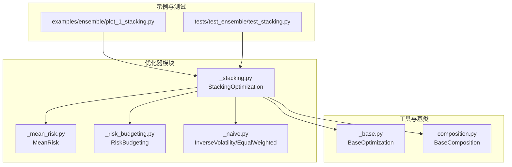
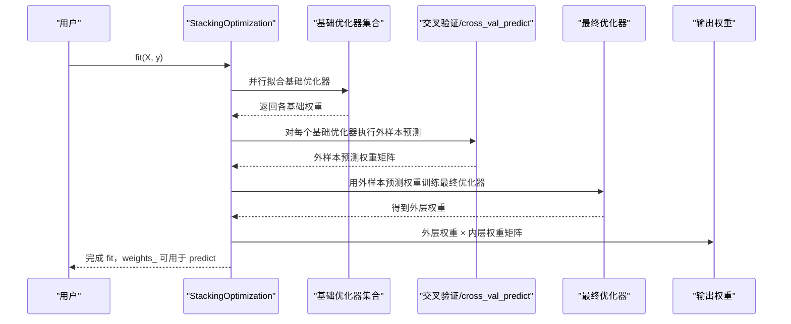
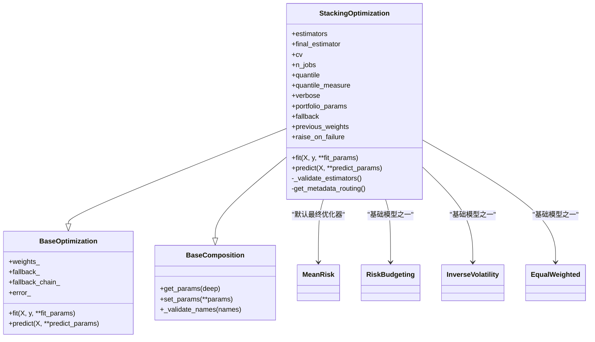
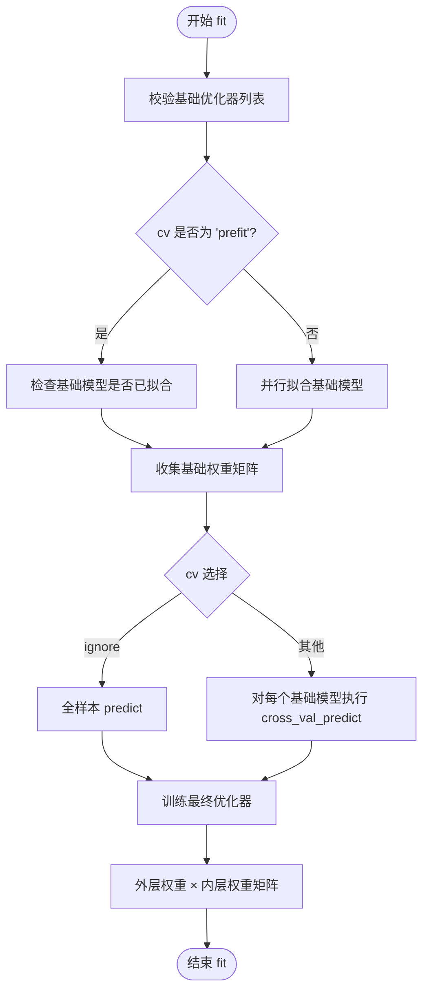
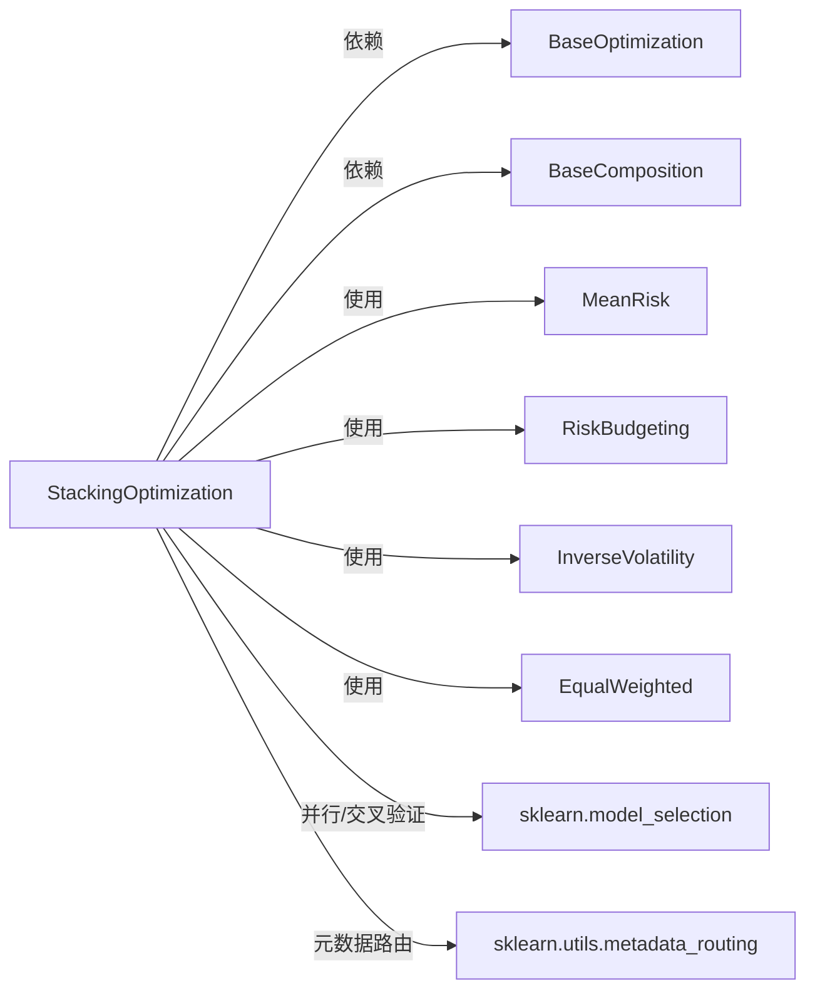

# 集成优化

<cite>
**本文引用的文件**
- [src/skfolio/optimization/ensemble/_stacking.py](file://src/skfolio/optimization/ensemble/_stacking.py)
- [examples/ensemble/plot_1_stacking.py](file://examples/ensemble/plot_1_stacking.py)
- [tests/test_optimization/test_ensemble/test_stacking.py](file://tests/test_optimization/test_ensemble/test_stacking.py)
- [src/skfolio/optimization/_base.py](file://src/skfolio/optimization/_base.py)
- [src/skfolio/utils/composition.py](file://src/skfolio/utils/composition.py)
- [src/skfolio/optimization/convex/_mean_risk.py](file://src/skfolio/optimization/convex/_mean_risk.py)
- [src/skfolio/optimization/convex/_risk_budgeting.py](file://src/skfolio/optimization/convex/_risk_budgeting.py)
- [src/skfolio/optimization/naive/_naive.py](file://src/skfolio/optimization/naive/_naive.py)
</cite>

## 目录
1. [引言](#引言)
2. [项目结构](#项目结构)
3. [核心组件](#核心组件)
4. [架构总览](#架构总览)
5. [详细组件分析](#详细组件分析)
6. [依赖关系分析](#依赖关系分析)
7. [性能考量](#性能考量)
8. [故障排查指南](#故障排查指南)
9. [结论](#结论)
10. [附录](#附录)

## 引言
本文件系统性记录并解释集成优化策略，重点聚焦于 StackingsOptimizer 的实现与使用。StackingOptimizer 是一种“元优化器”，它将多个基础优化器（例如 MeanRisk、RiskBudgeting 等）的输出权重作为输入，通过一个“最终优化器”对这些基础权重进行再组合，从而在稳健性与性能上取得协同增效。本文将从架构、数据流、处理逻辑、集成点、错误处理与性能特征等维度展开，并结合示例脚本与测试用例，帮助读者快速掌握其 fit/predict 流程、参数调优与使用场景建议。

## 项目结构
围绕集成优化的核心文件位于 optimization/ensemble 模块中，StackingOptimizer 继承自通用优化基类与组合基类，具备参数管理、元数据路由、回退机制等通用能力；同时，它依赖其他优化器（如 MeanRisk、RiskBudgeting、InverseVolatility、MaximumDiversification 等）作为基础模型，最终由 MeanRisk 或其他优化器作为“元优化器”对基础权重进行二次学习与组合。

图表来源
- [src/skfolio/optimization/ensemble/_stacking.py](file://src/skfolio/optimization/ensemble/_stacking.py#L32-L177)
- [src/skfolio/optimization/_base.py](file://src/skfolio/optimization/_base.py#L39-L120)
- [src/skfolio/utils/composition.py](file://src/skfolio/utils/composition.py#L18-L90)
- [src/skfolio/optimization/convex/_mean_risk.py](file://src/skfolio/optimization/convex/_mean_risk.py#L31-L120)
- [src/skfolio/optimization/convex/_risk_budgeting.py](file://src/skfolio/optimization/convex/_risk_budgeting.py#L25-L120)
- [src/skfolio/optimization/naive/_naive.py](file://src/skfolio/optimization/naive/_naive.py#L120-L160)
- [examples/ensemble/plot_1_stacking.py](file://examples/ensemble/plot_1_stacking.py#L60-L120)
- [tests/test_optimization/test_ensemble/test_stacking.py](file://tests/test_optimization/test_ensemble/test_stacking.py#L13-L51)

章节来源
- [src/skfolio/optimization/ensemble/_stacking.py](file://src/skfolio/optimization/ensemble/_stacking.py#L32-L177)
- [examples/ensemble/plot_1_stacking.py](file://examples/ensemble/plot_1_stacking.py#L60-L120)

## 核心组件
- StackingOptimization：集成优化器，负责：
  - 校验并管理基础优化器列表（名称唯一、不含非法字符）
  - 并行拟合基础优化器（或接受预拟合）
  - 使用交叉验证生成基础权重的外样本预测，训练最终优化器
  - 将最终优化器的权重与基础权重矩阵相乘，得到最终组合权重
  - 提供参数管理（支持“命名__参数名”的嵌套设置）、元数据路由、回退机制
- BaseOptimization：所有优化器的抽象基类，统一了 fit/predict/fallback/error_ 等行为
- BaseComposition：为集合型估计器提供参数获取/设置与名称校验
- 基础优化器示例：
  - MeanRisk：均值-风险优化，支持多种目标函数与风险度量
  - RiskBudgeting：风险预算优化，支持多种风险度量与权重约束
  - InverseVolatility/EqualWeighted：简单规则权重，作为基础模型常用选择

章节来源
- [src/skfolio/optimization/ensemble/_stacking.py](file://src/skfolio/optimization/ensemble/_stacking.py#L179-L210)
- [src/skfolio/optimization/_base.py](file://src/skfolio/optimization/_base.py#L39-L120)
- [src/skfolio/utils/composition.py](file://src/skfolio/utils/composition.py#L18-L90)
- [src/skfolio/optimization/convex/_mean_risk.py](file://src/skfolio/optimization/convex/_mean_risk.py#L31-L120)
- [src/skfolio/optimization/convex/_risk_budgeting.py](file://src/skfolio/optimization/convex/_risk_budgeting.py#L25-L120)
- [src/skfolio/optimization/naive/_naive.py](file://src/skfolio/optimization/naive/_naive.py#L120-L160)

## 架构总览
StackingOptimizer 的整体工作流如下：
- 输入：训练期观测矩阵 X（n_obs × n_assets），可选 y（因子或基准）
- 步骤：
  1) 校验基础优化器列表，必要时并行拟合（或接受预拟合）
  2) 收集基础优化器的权重，形成内层权重矩阵
  3) 使用 cross_val_predict 获取外样本预测（或直接使用全样本预测，取决于 cv 设置）
  4) 训练最终优化器（默认 MeanRisk），得到外层权重
  5) 最终权重 = 外层权重 × 内层权重矩阵，完成组合
- 输出：最终组合权重 weights_

图表来源
- [src/skfolio/optimization/ensemble/_stacking.py](file://src/skfolio/optimization/ensemble/_stacking.py#L296-L409)

章节来源
- [src/skfolio/optimization/ensemble/_stacking.py](file://src/skfolio/optimization/ensemble/_stacking.py#L296-L409)

## 详细组件分析

### StackingOptimization 类图

图表来源
- [src/skfolio/optimization/ensemble/_stacking.py](file://src/skfolio/optimization/ensemble/_stacking.py#L32-L177)
- [src/skfolio/optimization/_base.py](file://src/skfolio/optimization/_base.py#L39-L120)
- [src/skfolio/utils/composition.py](file://src/skfolio/utils/composition.py#L18-L90)
- [src/skfolio/optimization/convex/_mean_risk.py](file://src/skfolio/optimization/convex/_mean_risk.py#L31-L120)
- [src/skfolio/optimization/convex/_risk_budgeting.py](file://src/skfolio/optimization/convex/_risk_budgeting.py#L25-L120)
- [src/skfolio/optimization/naive/_naive.py](file://src/skfolio/optimization/naive/_naive.py#L120-L160)

章节来源
- [src/skfolio/optimization/ensemble/_stacking.py](file://src/skfolio/optimization/ensemble/_stacking.py#L32-L177)

### fit 流程详解
- 参数校验与默认值：
  - 基础优化器列表必须非空且名称唯一
  - 默认 final_estimator 为 MeanRisk
  - cv 默认 KFold(5)，支持 "prefit"/"ignore"/整数/交叉验证器/组合CV
  - n_jobs 控制并行度，verbose 控制日志级别
- 基础模型拟合：
  - 若 cv="prefit"，要求基础模型已拟合；否则并行拟合所有基础模型
  - 将各基础模型的 weights_ 收集为内层权重矩阵
- 外样本预测与训练最终优化器：
  - 当 cv="ignore"：直接使用全样本 predict 结果
  - 否则：对每个基础模型执行 cross_val_predict，得到外样本预测权重
  - 若使用组合CV：按指定分位数与度量选择路径
  - 用外样本预测权重训练 final_estimator，得到外层权重
- 权重组合：
  - 最终权重 = 外层权重 × 内层权重矩阵（逐资产加权求和）

图表来源
- [src/skfolio/optimization/ensemble/_stacking.py](file://src/skfolio/optimization/ensemble/_stacking.py#L296-L409)

章节来源
- [src/skfolio/optimization/ensemble/_stacking.py](file://src/skfolio/optimization/ensemble/_stacking.py#L296-L409)

### predict 流程与 Portfolio 参数传播
- predict 会将 portfolio_params 传递给底层优化器，用于构造返回的 Portfolio 对象
- 支持 previous_weights、交易成本、管理费、无风险利率等参数的传播
- 在示例中，通过 cross_val_predict 对测试集进行滚动预测，得到 MultiPeriodPortfolio

章节来源
- [src/skfolio/optimization/ensemble/_stacking.py](file://src/skfolio/optimization/ensemble/_stacking.py#L106-L111)
- [examples/ensemble/plot_1_stacking.py](file://examples/ensemble/plot_1_stacking.py#L126-L144)

### 实际应用示例（来自示例脚本）
- 示例展示了如何使用 StackingOptimization 将多个基础优化器（如 InverseVolatility、MaximumDiversification、MeanRisk、HierarchicalEqualRiskContribution）组合，并以 MeanRisk 作为最终优化器
- 使用 GridSearchCV 与 WalkForward 进行参数调优，评估 Calmar Ratio
- 对测试集进行 cross_val_predict，比较 Stacking 与 EqualWeighted 基准的表现，并可视化分布与摘要

章节来源
- [examples/ensemble/plot_1_stacking.py](file://examples/ensemble/plot_1_stacking.py#L60-L120)
- [examples/ensemble/plot_1_stacking.py](file://examples/ensemble/plot_1_stacking.py#L126-L144)
- [examples/ensemble/plot_1_stacking.py](file://examples/ensemble/plot_1_stacking.py#L176-L206)
- [examples/ensemble/plot_1_stacking.py](file://examples/ensemble/plot_1_stacking.py#L226-L246)

### 测试用例要点（来自测试文件）
- 基本功能：验证 StackingOptimizer 在不同基础模型组合下的权重稳定性与一致性
- 因子模型：在存在 y（因子/基准）时，仍能正确拟合并得到稳定权重
- 并行与交叉验证：n_jobs 与 CombinatorialPurgedCV 的使用不影响结果一致性
- 参数网格搜索：支持对基础模型与最终优化器参数进行联合调优

章节来源
- [tests/test_optimization/test_ensemble/test_stacking.py](file://tests/test_optimization/test_ensemble/test_stacking.py#L13-L51)
- [tests/test_optimization/test_ensemble/test_stacking.py](file://tests/test_optimization/test_ensemble/test_stacking.py#L53-L93)
- [tests/test_optimization/test_ensemble/test_stacking.py](file://tests/test_optimization/test_ensemble/test_stacking.py#L95-L135)

## 依赖关系分析
- 组件耦合与内聚：
  - StackingOptimization 与基础优化器之间为弱耦合（仅依赖 weights_ 与 predict 接口）
  - 通过 BaseComposition 提供参数管理与名称校验，增强内聚性
  - 通过 BaseOptimization 统一回退与错误处理，提升鲁棒性
- 外部依赖：
  - sklearn.model_selection 用于交叉验证与并行执行
  - sklearn.utils.metadata_routing 用于元数据路由
  - cvxpy（通过 MeanRisk/RiskBudgeting 等）用于凸优化求解

图表来源
- [src/skfolio/optimization/ensemble/_stacking.py](file://src/skfolio/optimization/ensemble/_stacking.py#L286-L321)
- [src/skfolio/optimization/_base.py](file://src/skfolio/optimization/_base.py#L39-L120)
- [src/skfolio/utils/composition.py](file://src/skfolio/utils/composition.py#L18-L90)
- [src/skfolio/optimization/convex/_mean_risk.py](file://src/skfolio/optimization/convex/_mean_risk.py#L31-L120)
- [src/skfolio/optimization/convex/_risk_budgeting.py](file://src/skfolio/optimization/convex/_risk_budgeting.py#L25-L120)
- [src/skfolio/optimization/naive/_naive.py](file://src/skfolio/optimization/naive/_naive.py#L120-L160)

章节来源
- [src/skfolio/optimization/ensemble/_stacking.py](file://src/skfolio/optimization/ensemble/_stacking.py#L286-L321)

## 性能考量
- 计算复杂度：
  - 基础模型拟合阶段：O(B·T)，其中 B 为基础模型数量，T 为基础模型单次拟合时间
  - 交叉验证阶段：若使用 K 折交叉验证，对每个基础模型需进行 K 次预测，整体约为 O(B·K·T)
  - 最终优化器训练：权重矩阵大小为 (K·B)×B，训练成本取决于最终优化器类型
  - 权重组合：矩阵乘法 O(K·B·A)，A 为资产数
- 并行与缓存：
  - n_jobs 可显著缩短基础模型拟合与交叉验证预测时间
  - 基础模型权重矩阵与最终优化器权重均为向量/矩阵运算，适合向量化
- 资源消耗：
  - 内存占用主要来自外样本预测权重矩阵与最终优化器求解
  - 组合CV可能产生多条测试路径，增加内存与计算负担

[本节为通用性能讨论，不直接分析具体文件]

## 故障排查指南
- 常见问题与定位：
  - 基础模型未拟合（cv="prefit" 但未 fit）：检查基础模型是否已 fit
  - 名称冲突或非法名称：确保 estimators 中名称唯一且不含 "__"
  - 回退链路：fit 失败时可通过 fallback_chain_ 与 error_ 查看失败原因
  - 元数据路由：启用 enable_metadata_routing 时，确保传入的元数据键与底层估计器匹配
- 建议排查步骤：
  - 先单独运行基础模型，确认各自 fit 成功
  - 逐步缩小 estimators 列表，定位导致失败的基础模型
  - 使用 raise_on_failure=False 观察 warning 与 error_，避免中断流程
  - 对最终优化器尝试更宽松的约束或不同风险度量

章节来源
- [src/skfolio/optimization/ensemble/_stacking.py](file://src/skfolio/optimization/ensemble/_stacking.py#L179-L210)
- [src/skfolio/optimization/_base.py](file://src/skfolio/optimization/_base.py#L127-L206)
- [tests/test_optimization/test_ensemble/test_stacking.py](file://tests/test_optimization/test_ensemble/test_stacking.py#L138-L190)

## 结论
StackingOptimizer 通过“基础模型 + 元优化器”的两阶段组合，有效整合多个优化器的优势，降低单一模型的过拟合风险并提升泛化能力。其设计遵循 scikit-learn 风格，具备参数管理、元数据路由、并行与回退等工程特性，便于在生产环境中稳定运行。配合示例脚本与测试用例，用户可以快速上手并进行参数调优与效果评估。

[本节为总结性内容，不直接分析具体文件]

## 附录

### 使用场景建议
- 适用于需要稳健权重组合的场景，如：
  - 多种风险度量/目标函数的对比与融合
  - 不同约束条件下的权重互补（如长仓限制、预算约束等）
  - 需要降低单一模型过拟合风险的投资组合构建
- 建议的基础模型组合示例：
  - InverseVolatility（波动率导向）
  - MaximumDiversification（分散化导向）
  - MeanRisk（均值-风险导向，可配置目标函数与风险度量）
  - RiskBudgeting（风险预算导向，可配置风险度量与预算分配）

章节来源
- [examples/ensemble/plot_1_stacking.py](file://examples/ensemble/plot_1_stacking.py#L60-L87)

### 参数调优指南
- 基础模型参数：
  - 通过“基础模型名__参数名”的形式进行网格搜索（如 model2__prior_estimator__covariance_estimator、model3__l1_coef 等）
- 最终优化器参数：
  - 如 final_estimator__risk_measure、objective_function 等
- 交叉验证策略：
  - 使用 WalkForward/WalkForward 与 CombinatorialPurgedCV 提升滚动与路径多样性
- 评估指标：
  - Calmar Ratio、Sharpe Ratio、CVaR Ratio 等比率指标可用于网格搜索评分

章节来源
- [examples/ensemble/plot_1_stacking.py](file://examples/ensemble/plot_1_stacking.py#L95-L121)
- [tests/test_optimization/test_ensemble/test_stacking.py](file://tests/test_optimization/test_ensemble/test_stacking.py#L126-L135)

### 集成方法优势与挑战
- 优势：
  - 降低过拟合：通过外样本预测与元优化器学习，减少对特定样本的过度拟合
  - 提高泛化能力：聚合多个模型的权重，提升在不同市场环境下的稳定性
  - 灵活性强：可自由组合不同类型的优化器，适配多样化的投资理念
- 潜在挑战：
  - 计算开销：交叉验证与并行拟合带来额外时间与内存成本
  - 模型间相关性：若基础模型高度相似，组合收益有限，甚至可能放大共线性影响
  - 调参复杂度：基础模型与最终优化器的参数空间较大，需谨慎设计搜索网格

[本节为概念性总结，不直接分析具体文件]