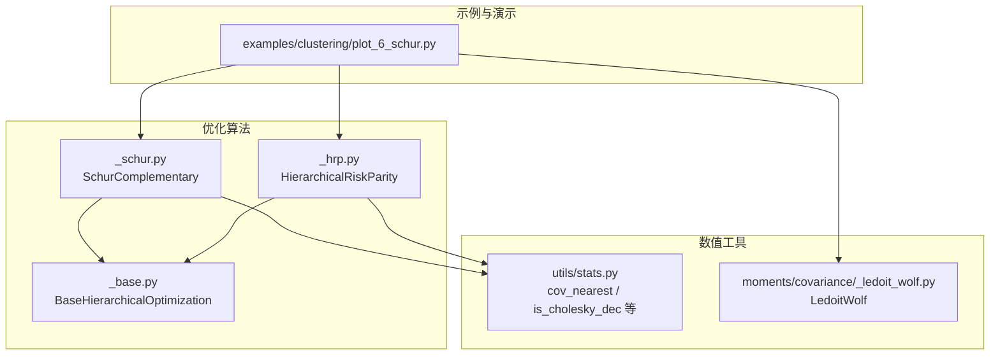
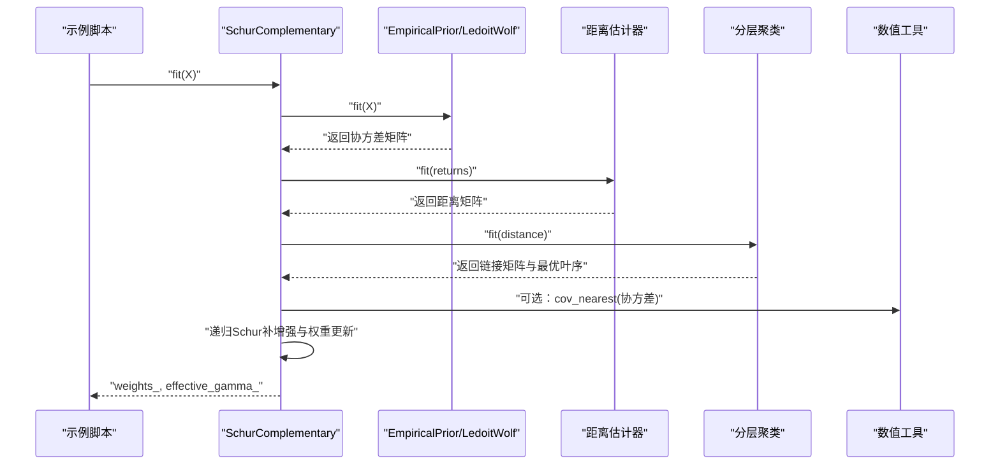
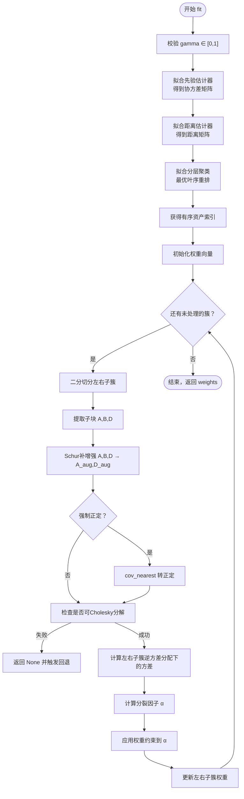
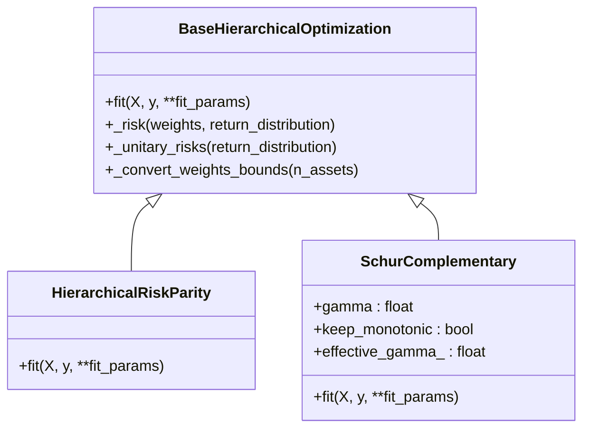
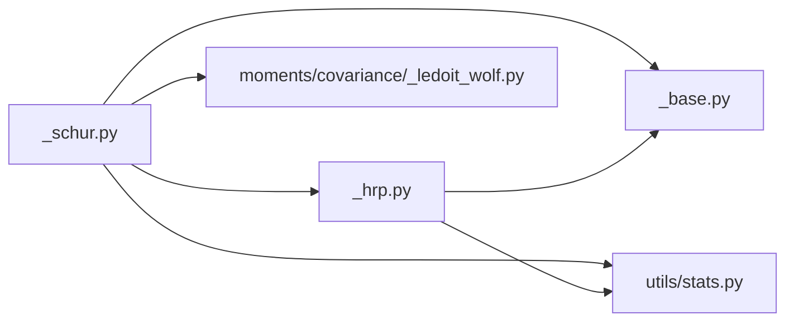

# Schur补矩阵分配

<cite>
**本文引用的文件**
- [examples/clustering/plot_6_schur.py](file://examples/clustering/plot_6_schur.py)
- [src/skfolio/optimization/cluster/hierarchical/_schur.py](file://src/skfolio/optimization/cluster/hierarchical/_schur.py)
- [src/skfolio/optimization/cluster/hierarchical/_hrp.py](file://src/skfolio/optimization/cluster/hierarchical/_hrp.py)
- [src/skfolio/optimization/cluster/hierarchical/_base.py](file://src/skfolio/optimization/cluster/hierarchical/_base.py)
- [src/skfolio/moments/covariance/_ledoit_wolf.py](file://src/skfolio/moments/covariance/_ledoit_wolf.py)
- [src/skfolio/utils/stats.py](file://src/skfolio/utils/stats.py)
</cite>

## 目录
1. [引言](#引言)
2. [项目结构](#项目结构)
3. [核心组件](#核心组件)
4. [架构总览](#架构总览)
5. [详细组件分析](#详细组件分析)
6. [依赖关系分析](#依赖关系分析)
7. [性能考量](#性能考量)
8. [故障排查指南](#故障排查指南)
9. [结论](#结论)
10. [附录](#附录)

## 引言
本教程围绕Schur补矩阵分配（Schur Complementary Allocation）展开，重点解释其如何通过调节正则化因子γ，在分治法的HRP（γ=0）与最小方差投资组合MVP（γ→1）之间进行平滑插值。文档以示例脚本plot_6_schur.py为线索，系统梳理Schur补矩阵分解在算法层面的实现细节，并阐明其如何揭示HRP与MVP之间的内在联系；同时讨论当γ趋近于1时协方差矩阵病态导致的收敛问题、keep_monotonic=True如何确保方差单调递减，以及结合Ledoit–Wolf等先验估计器提升数值稳定性的策略。最后，通过有效前沿对比与回测分析，说明Schur组合在样本外表现优于MVO组合的泛化能力。

## 项目结构
本节聚焦与Schur补矩阵分配相关的模块组织与文件职责：
- 示例脚本：examples/clustering/plot_6_schur.py 提供完整的使用流程与可视化对比，包括训练集与测试集的有效前沿、组合权重分布、超参数调优与多步长回测。
- 核心算法实现：src/skfolio/optimization/cluster/hierarchical/_schur.py 定义SchurComplementary类及其内部递归计算、Schur补增强、单调性保障与约束处理。
- 基类与通用逻辑：src/skfolio/optimization/cluster/hierarchical/_base.py 提供分层优化基类的通用接口、权重边界转换、风险度量封装等。
- 对比基准：src/skfolio/optimization/cluster/hierarchical/_hrp.py 实现HRP算法，作为γ=0时的特例。
- 数值稳定性工具：src/skfolio/utils/stats.py 提供协方差最近正定矩阵（cov_nearest）、Cholesky可分解判断（is_cholesky_dec）等关键工具。
- 先验估计器：src/skfolio/moments/covariance/_ledoit_wolf.py 提供Ledoit–Wolf收缩估计器，用于改善协方差矩阵的条件数与数值稳定性。

图表来源
- [examples/clustering/plot_6_schur.py](file://examples/clustering/plot_6_schur.py#L1-L341)
- [src/skfolio/optimization/cluster/hierarchical/_schur.py](file://src/skfolio/optimization/cluster/hierarchical/_schur.py#L1-L804)
- [src/skfolio/optimization/cluster/hierarchical/_hrp.py](file://src/skfolio/optimization/cluster/hierarchical/_hrp.py#L1-L490)
- [src/skfolio/optimization/cluster/hierarchical/_base.py](file://src/skfolio/optimization/cluster/hierarchical/_base.py#L1-L474)
- [src/skfolio/utils/stats.py](file://src/skfolio/utils/stats.py#L1-L200)
- [src/skfolio/moments/covariance/_ledoit_wolf.py](file://src/skfolio/moments/covariance/_ledoit_wolf.py#L1-L141)

章节来源
- [examples/clustering/plot_6_schur.py](file://examples/clustering/plot_6_schur.py#L1-L341)
- [src/skfolio/optimization/cluster/hierarchical/_schur.py](file://src/skfolio/optimization/cluster/hierarchical/_schur.py#L1-L804)
- [src/skfolio/optimization/cluster/hierarchical/_hrp.py](file://src/skfolio/optimization/cluster/hierarchical/_hrp.py#L1-L490)
- [src/skfolio/optimization/cluster/hierarchical/_base.py](file://src/skfolio/optimization/cluster/hierarchical/_base.py#L1-L474)
- [src/skfolio/utils/stats.py](file://src/skfolio/utils/stats.py#L1-L200)
- [src/skfolio/moments/covariance/_ledoit_wolf.py](file://src/skfolio/moments/covariance/_ledoit_wolf.py#L1-L141)

## 核心组件
- SchurComplementary（Schur补矩阵分配）
  - 参数：gamma（[0,1]），keep_monotonic（默认True），prior_estimator（默认EmpiricalPrior），distance_estimator（默认PearsonDistance），权重上下界、交易成本、管理费、回退策略等。
  - 功能：基于分治树的Schur补增强子协方差块，递归更新权重，使γ从0平滑过渡到接近1时逼近MVP；当keep_monotonic=True时，自动寻找使方差单调下降的最大γ并截断，保证解的稳定性与方差上界。
- HierarchicalRiskParity（HRP）
  - 作为γ=0时的特例，采用逆风险分配与分裂因子更新权重，体现分治思想。
- LedoitWolf（收缩估计器）
  - 通过Ledoit–Wolf公式对协方差进行收缩估计，显著提升条件数与数值稳定性，常与Schur组合配合使用。
- 数值工具
  - cov_nearest：将非正定协方差映射到最近的正定协方差，支持Higham迭代或特征值裁剪两种策略。
  - is_cholesky_dec：快速判断矩阵是否可进行Cholesky分解，是Schur补增强过程中的关键稳定性检查。

章节来源
- [src/skfolio/optimization/cluster/hierarchical/_schur.py](file://src/skfolio/optimization/cluster/hierarchical/_schur.py#L86-L120)
- [src/skfolio/optimization/cluster/hierarchical/_hrp.py](file://src/skfolio/optimization/cluster/hierarchical/_hrp.py#L29-L120)
- [src/skfolio/moments/covariance/_ledoit_wolf.py](file://src/skfolio/moments/covariance/_ledoit_wolf.py#L16-L141)
- [src/skfolio/utils/stats.py](file://src/skfolio/utils/stats.py#L183-L200)
- [src/skfolio/utils/stats.py](file://src/skfolio/utils/stats.py#L322-L415)

## 架构总览
Schur补矩阵分配的高层流程如下：
- 数据准备：加载价格数据，转换为日度收益序列。
- 分层聚类：基于距离矩阵（默认皮尔逊距离）构建层次聚类树，并进行最优叶序重排。
- 协方差估计：使用先验估计器（默认EmpiricalPrior，可选LedoitWolf收缩）估计协方差矩阵。
- Schur补增强与递归分治：对每个子树块构造Schur补增强后的协方差块，计算逆方差分配下的子簇方差，按分裂因子更新权重。
- 单调性保障：当keep_monotonic=True时，搜索使方差单调下降的最大γ并截断，避免病态协方差导致的发散。
- 结果输出：返回最终资产权重向量，并记录effective_gamma_。

图表来源
- [examples/clustering/plot_6_schur.py](file://examples/clustering/plot_6_schur.py#L60-L140)
- [src/skfolio/optimization/cluster/hierarchical/_schur.py](file://src/skfolio/optimization/cluster/hierarchical/_schur.py#L340-L431)
- [src/skfolio/utils/stats.py](file://src/skfolio/utils/stats.py#L322-L415)

章节来源
- [examples/clustering/plot_6_schur.py](file://examples/clustering/plot_6_schur.py#L60-L140)
- [src/skfolio/optimization/cluster/hierarchical/_schur.py](file://src/skfolio/optimization/cluster/hierarchical/_schur.py#L340-L431)

## 详细组件分析

### Schur补矩阵分解与算法流程
Schur补增强的核心在于对分治树上的子协方差块进行“补丁式”增强，从而在不直接求解全局MVP的前提下，逐步引入跨子簇的协方差信息，使解随γ从0平滑逼近MVP。具体流程如下：

图表来源
- [src/skfolio/optimization/cluster/hierarchical/_schur.py](file://src/skfolio/optimization/cluster/hierarchical/_schur.py#L638-L734)
- [src/skfolio/optimization/cluster/hierarchical/_schur.py](file://src/skfolio/optimization/cluster/hierarchical/_schur.py#L756-L803)
- [src/skfolio/utils/stats.py](file://src/skfolio/utils/stats.py#L322-L415)

章节来源
- [src/skfolio/optimization/cluster/hierarchical/_schur.py](file://src/skfolio/optimization/cluster/hierarchical/_schur.py#L638-L803)
- [src/skfolio/utils/stats.py](file://src/skfolio/utils/stats.py#L322-L415)

### Schur补增强公式与数学联系
Schur补增强通过以下步骤将跨子簇协方差信息融入子块协方差：
- 当γ=0或子块维度为1时，保持原块不变；
- 否则，利用Schur补形式对子块进行增强，形成新的子块协方差矩阵；
- 在递归过程中，通过逆方差分配计算子簇方差，再用分裂因子α更新权重，使整体方差随γ单调下降（在keep_monotonic启用时）。

该过程揭示了HRP与MVP之间的联系：γ=0对应HRP（仅用对角块信息），γ→1逼近MVP（引入全部跨块协方差信息）。当协方差矩阵病态时，直接取γ→1可能无法收敛至MVP，因此需要单调性保障机制。

章节来源
- [src/skfolio/optimization/cluster/hierarchical/_schur.py](file://src/skfolio/optimization/cluster/hierarchical/_schur.py#L756-L803)
- [src/skfolio/optimization/cluster/hierarchical/_schur.py](file://src/skfolio/optimization/cluster/hierarchical/_schur.py#L86-L120)

### 单调性保障与有效γ截断
当keep_monotonic=True时，算法会：
- 在[0,max_gamma]范围内扫描若干离散步长，评估各γ对应的组合方差；
- 若发现方差开始上升或趋于稳定，则通过二分搜索定位“方差转折点”，返回使方差单调下降的最大γ；
- 将effective_gamma_设为该转折点对应的γ，确保方差始终不超过HRP的方差上界。

这一机制有效缓解了病态协方差矩阵导致的发散问题，保证解的稳定性与单调性。

章节来源
- [src/skfolio/optimization/cluster/hierarchical/_schur.py](file://src/skfolio/optimization/cluster/hierarchical/_schur.py#L434-L563)
- [src/skfolio/optimization/cluster/hierarchical/_schur.py](file://src/skfolio/optimization/cluster/hierarchical/_schur.py#L565-L636)

### 与HRP的关系与对比
- γ=0时，Schur补增强退化为HRP的逆风险分配思路，即仅使用对角块协方差；
- 随着γ增大，跨子簇协方差信息逐步被纳入，权重更新更接近MVP；
- 示例脚本展示了在训练集上Schur与HRP均被MVO主导，但在测试集上Schur组合表现更稳健，体现了更强的泛化能力。

章节来源
- [examples/clustering/plot_6_schur.py](file://examples/clustering/plot_6_schur.py#L167-L181)
- [src/skfolio/optimization/cluster/hierarchical/_hrp.py](file://src/skfolio/optimization/cluster/hierarchical/_hrp.py#L29-L120)

### 数值稳定性与先验估计器
- 协方差矩阵病态会导致Schur补增强后子块不可正定或无法Cholesky分解，进而引发算法失败；
- 使用Ledoit–Wolf收缩估计器可显著提升协方差矩阵的条件数与正定性，降低发散风险；
- 示例脚本中通过EmpiricalPrior包裹LedoitWolf，为所有模型提供稳定的协方差估计。

章节来源
- [examples/clustering/plot_6_schur.py](file://examples/clustering/plot_6_schur.py#L91-L100)
- [src/skfolio/moments/covariance/_ledoit_wolf.py](file://src/skfolio/moments/covariance/_ledoit_wolf.py#L16-L141)
- [src/skfolio/utils/stats.py](file://src/skfolio/utils/stats.py#L322-L415)

### 类关系图（代码级）

图表来源
- [src/skfolio/optimization/cluster/hierarchical/_base.py](file://src/skfolio/optimization/cluster/hierarchical/_base.py#L252-L474)
- [src/skfolio/optimization/cluster/hierarchical/_hrp.py](file://src/skfolio/optimization/cluster/hierarchical/_hrp.py#L291-L438)
- [src/skfolio/optimization/cluster/hierarchical/_schur.py](file://src/skfolio/optimization/cluster/hierarchical/_schur.py#L308-L431)

## 依赖关系分析
- SchurComplementary依赖：
  - 基类：BaseHierarchicalOptimization（统一的权重边界、风险度量、路由参数等）；
  - 先验估计器：EmpiricalPrior（默认）或LedoitWolf（收缩估计）；
  - 距离估计器：PearsonDistance（默认）；
  - 分层聚类：HierarchicalClustering；
  - 数值工具：cov_nearest、is_cholesky_dec、inverse_multiply、multiply_by_inverse、symmetric_step_up_matrix、bisection等。
- HRP依赖：
  - 基类：BaseHierarchicalOptimization；
  - 距离估计器：PearsonDistance；
  - 分层聚类：HierarchicalClustering；
  - 权重约束应用函数。

图表来源
- [src/skfolio/optimization/cluster/hierarchical/_schur.py](file://src/skfolio/optimization/cluster/hierarchical/_schur.py#L1-L80)
- [src/skfolio/optimization/cluster/hierarchical/_hrp.py](file://src/skfolio/optimization/cluster/hierarchical/_hrp.py#L1-L40)
- [src/skfolio/optimization/cluster/hierarchical/_base.py](file://src/skfolio/optimization/cluster/hierarchical/_base.py#L1-L60)
- [src/skfolio/utils/stats.py](file://src/skfolio/utils/stats.py#L1-L60)
- [src/skfolio/moments/covariance/_ledoit_wolf.py](file://src/skfolio/moments/covariance/_ledoit_wolf.py#L1-L40)

章节来源
- [src/skfolio/optimization/cluster/hierarchical/_schur.py](file://src/skfolio/optimization/cluster/hierarchical/_schur.py#L1-L80)
- [src/skfolio/optimization/cluster/hierarchical/_hrp.py](file://src/skfolio/optimization/cluster/hierarchical/_hrp.py#L1-L40)
- [src/skfolio/optimization/cluster/hierarchical/_base.py](file://src/skfolio/optimization/cluster/hierarchical/_base.py#L1-L60)
- [src/skfolio/utils/stats.py](file://src/skfolio/utils/stats.py#L1-L60)
- [src/skfolio/moments/covariance/_ledoit_wolf.py](file://src/skfolio/moments/covariance/_ledoit_wolf.py#L1-L40)

## 性能考量
- 计算复杂度
  - 分治递归深度与二分切分次数与资产数量呈线性关系；每层Schur补增强涉及子块协方差的矩阵运算，整体复杂度受分治树形状与子块大小影响。
- 数值稳定性
  - 协方差病态易导致子块不可正定或Cholesky分解失败；建议使用Ledoit–Wolf收缩估计器，并在必要时启用force_spd路径（cov_nearest）。
- 收敛与单调性
  - keep_monotonic=True时，通过二分搜索定位方差转折点，避免γ过大导致的发散；这在高维或样本量有限时尤为关键。
- 可扩展性
  - 示例脚本展示了多模型对比、随机搜索超参数调优与多步长回测，便于在实际工程中进行稳健性评估与参数选择。

[本节为一般性指导，无需特定文件分析]

## 故障排查指南
- 症状：Schur补增强失败，返回None或抛出异常
  - 可能原因：子块协方差非正定或不可Cholesky分解；γ过大导致病态协方差发散。
  - 处理建议：
    - 启用keep_monotonic=True，让算法自动截断至最大允许γ；
    - 使用Ledoit–Wolf收缩估计器提升协方差正定性；
    - 在force_spd路径下使用cov_nearest进行最近正定矩阵替换。
- 症状：方差不单调下降
  - 可能原因：权重约束过严导致分裂因子α被过度限制。
  - 处理建议：适当放宽min_weights/max_weights，或启用keep_monotonic自动截断。
- 症状：测试集表现劣于训练集
  - 可能原因：MVO在训练集上过拟合；Schur组合通过分治与Schur补增强具有更好的泛化能力。
  - 处理建议：采用回测与随机搜索选择最优γ与距离度量，关注样本外Sharpe与CDaR比率。

章节来源
- [src/skfolio/optimization/cluster/hierarchical/_schur.py](file://src/skfolio/optimization/cluster/hierarchical/_schur.py#L699-L734)
- [src/skfolio/utils/stats.py](file://src/skfolio/utils/stats.py#L322-L415)
- [examples/clustering/plot_6_schur.py](file://examples/clustering/plot_6_schur.py#L186-L246)

## 结论
Schur补矩阵分配通过Schur补增强与分治递归，实现了从HRP到MVP的平滑插值。在实践中，γ越大越接近MVP，但病态协方差可能导致发散；keep_monotonic=True通过寻找方差转折点并截断γ，确保解的单调性与稳定性。结合Ledoit–Wolf等先验估计器可显著提升协方差估计质量，从而提高算法鲁棒性。示例脚本进一步验证了Schur组合在样本外的有效前沿与回测表现，体现出优于传统MVO的泛化能力。

[本节为总结性内容，无需特定文件分析]

## 附录
- 示例脚本要点回顾
  - 加载S&P 500数据，划分训练/测试集；
  - 拟合Schur组合（γ∈[0,1]），HRP与MVO（含MVP）；
  - 使用Ledoit–Wolf收缩估计器；
  - 绘制训练/测试集有效前沿与组合权重分布；
  - 使用随机搜索与回测评估最优γ与距离度量。

章节来源
- [examples/clustering/plot_6_schur.py](file://examples/clustering/plot_6_schur.py#L60-L341)