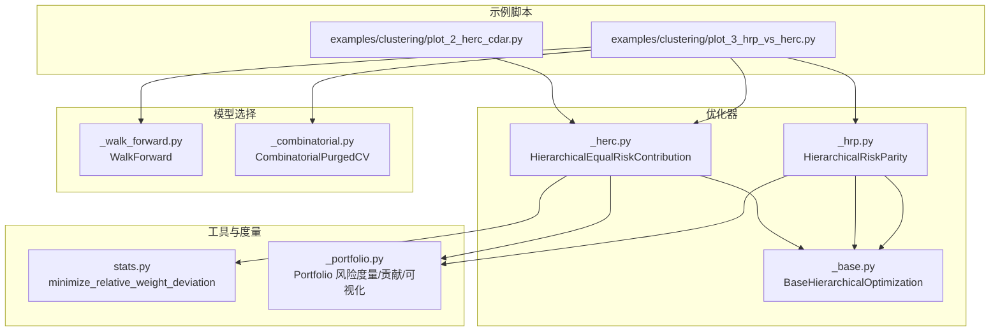
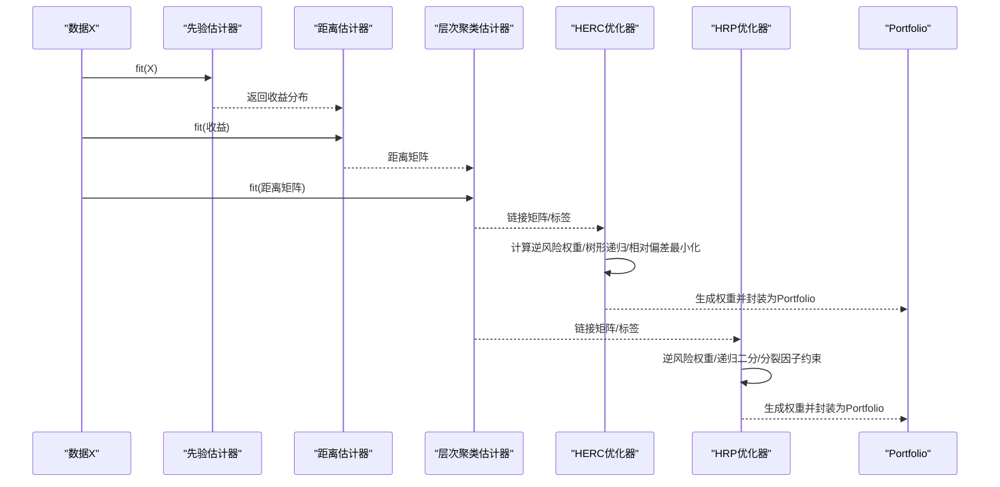
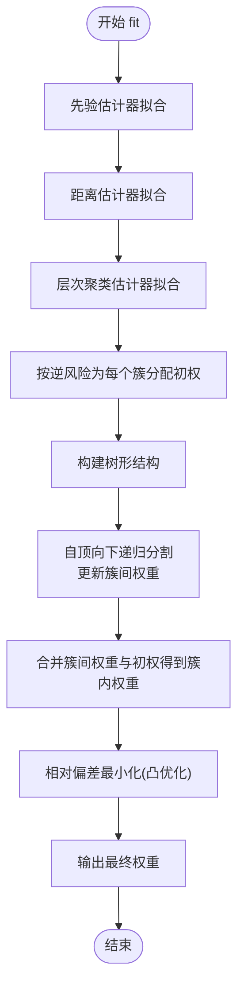
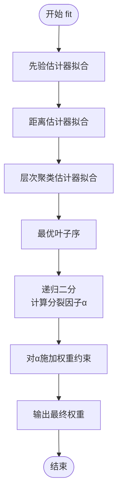
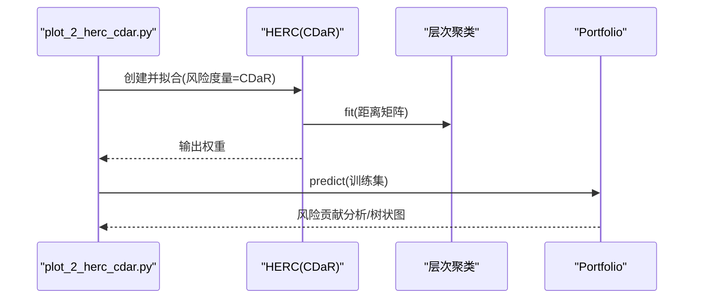
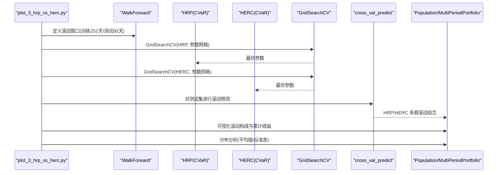
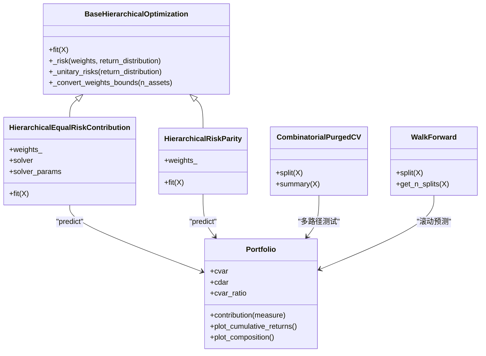

# 分层等风险贡献(HERC)优化

<cite>
**本文引用的文件列表**
- [plot_2_herc_cdar.py](file://examples/clustering/plot_2_herc_cdar.py)
- [plot_3_hrp_vs_herc.py](file://examples/clustering/plot_3_hrp_vs_herc.py)
- [_herc.py](file://src/skfolio/optimization/cluster/hierarchical/_herc.py)
- [_hrp.py](file://src/skfolio/optimization/cluster/hierarchical/_hrp.py)
- [_base.py](file://src/skfolio/optimization/cluster/hierarchical/_base.py)
- [_walk_forward.py](file://src/skfolio/model_selection/_walk_forward.py)
- [_combinatorial.py](file://src/skfolio/model_selection/_combinatorial.py)
- [stats.py](file://src/skfolio/utils/stats.py)
- [_portfolio.py](file://src/skfolio/portfolio/_portfolio.py)
</cite>

## 目录
1. [引言](#引言)
2. [项目结构](#项目结构)
3. [核心组件](#核心组件)
4. [架构总览](#架构总览)
5. [详细组件分析](#详细组件分析)
6. [依赖关系分析](#依赖关系分析)
7. [性能考量](#性能考量)
8. [故障排查指南](#故障排查指南)
9. [结论](#结论)
10. [附录](#附录)

## 引言
本文件围绕分层等风险贡献（Hierarchical Equal Risk Contribution, HERC）优化算法展开，结合示例脚本 plot_2_herc_cdar.py 与 plot_3_hrp_vs_herc.py，系统阐述 HERC 在聚类结构内如何实现“等风险贡献”的均衡化思想；对比 HERC 与 HRP 在 CVaR 最小化与 Mean-CVaR 比率最大化上的性能差异，并讨论两者在不同市场条件下的稳健性；给出使用 GridSearchCV 与 WalkForward 交叉验证进行超参数调优的方法，以选择最优距离度量与链接方法；利用 CombinatorialPurgedCV 进行多路径测试评估模型稳定性，并解释 HERC 虽平均表现更优但波动更大的特性；最后提供滚动投资组合构成与收益曲线的可视化方法。

## 项目结构
本专题涉及的代码主要分布在以下模块：
- 优化器：HERC 与 HRP 的实现位于分层聚类优化子模块
- 交叉验证：WalkForward 与 CombinatorialPurgedCV 提供时间序列与组合式路径验证
- 统计工具：权重约束优化与相对偏差最小化
- 投资组合：Portfolio 类提供风险度量、贡献分析与可视化接口

图表来源
- [plot_2_herc_cdar.py](file://examples/clustering/plot_2_herc_cdar.py#L1-L166)
- [plot_3_hrp_vs_herc.py](file://examples/clustering/plot_3_hrp_vs_herc.py#L1-L227)
- [_herc.py](file://src/skfolio/optimization/cluster/hierarchical/_herc.py#L1-L522)
- [_hrp.py](file://src/skfolio/optimization/cluster/hierarchical/_hrp.py#L1-L490)
- [_base.py](file://src/skfolio/optimization/cluster/hierarchical/_base.py#L1-L474)
- [_walk_forward.py](file://src/skfolio/model_selection/_walk_forward.py#L1-L537)
- [_combinatorial.py](file://src/skfolio/model_selection/_combinatorial.py#L1-L571)
- [stats.py](file://src/skfolio/utils/stats.py#L509-L591)
- [_portfolio.py](file://src/skfolio/portfolio/_portfolio.py#L200-L989)

章节来源
- [plot_2_herc_cdar.py](file://examples/clustering/plot_2_herc_cdar.py#L1-L166)
- [plot_3_hrp_vs_herc.py](file://examples/clustering/plot_3_hrp_vs_herc.py#L1-L227)

## 核心组件
- HERC 优化器：基于距离矩阵构建层次聚类，按“逆风险”分配初权，再沿树形结构自顶向下递归分割，结合簇间权重与簇内风险平价，最终通过凸优化施加权重约束，使最终权重与初始权重的相对偏差最小化。
- HRP 优化器：同样基于距离矩阵与层次聚类，但采用“最优叶子序”与递归二分策略，分裂因子由左右子树的逆风险权重决定，并在每一步对分裂因子施加权重约束。
- 基类接口：统一处理先验估计、距离估计、层次聚类估计、权重上下界、交易成本与管理费、回退机制与错误传播。
- 交叉验证：WalkForward 支持滚动窗口与时间频率控制；CombinatorialPurgedCV 支持多测试路径组合与净化/禁入期。
- 统计工具：minimize_relative_weight_deviation 实现“相对偏差最小化”的凸优化问题，确保权重约束下尽量保持初始权重比例。
- 投资组合：Portfolio 提供多种风险度量（如 CVaR、CDaR）、比率指标（如 Mean-CVaR 比率）以及风险贡献分析与可视化。

章节来源
- [_herc.py](file://src/skfolio/optimization/cluster/hierarchical/_herc.py#L1-L522)
- [_hrp.py](file://src/skfolio/optimization/cluster/hierarchical/_hrp.py#L1-L490)
- [_base.py](file://src/skfolio/optimization/cluster/hierarchical/_base.py#L1-L474)
- [_walk_forward.py](file://src/skfolio/model_selection/_walk_forward.py#L1-L537)
- [_combinatorial.py](file://src/skfolio/model_selection/_combinatorial.py#L1-L571)
- [stats.py](file://src/skfolio/utils/stats.py#L509-L591)
- [_portfolio.py](file://src/skfolio/portfolio/_portfolio.py#L200-L989)

## 架构总览
HERC 与 HRP 共享相同的输入管线：先用先验估计器得到资产收益分布，再用距离估计器计算距离矩阵，随后层次聚类估计器生成链接矩阵与树形结构，最后两类算法分别执行不同的权重分配策略。

图表来源
- [_herc.py](file://src/skfolio/optimization/cluster/hierarchical/_herc.py#L360-L522)
- [_hrp.py](file://src/skfolio/optimization/cluster/hierarchical/_hrp.py#L322-L439)
- [_base.py](file://src/skfolio/optimization/cluster/hierarchical/_base.py#L335-L474)
- [_portfolio.py](file://src/skfolio/portfolio/_portfolio.py#L454-L603)

## 详细组件分析

### HERC 算法流程与“等风险贡献”实现
- 输入与预处理：先验估计器拟合收益分布，距离估计器基于收益计算距离矩阵，层次聚类估计器据此生成链接矩阵与树形结构。
- 初权分配：对每个簇，按“逆风险”均匀分配初权，得到各簇总风险。
- 自顶向下递归：从根节点出发，根据左右子树的总风险比例 α，更新各子树的簇间权重；当到达目标簇时停止递归。
- 簇内风险平价：在每个簇内部，将簇间权重与初权相乘，得到簇内权重；随后通过“相对偏差最小化”凸优化施加权重约束，使最终权重与初始权重的相对偏差最小。
- 输出：得到最终权重向量，封装为 Portfolio 用于后续分析与可视化。

图表来源
- [_herc.py](file://src/skfolio/optimization/cluster/hierarchical/_herc.py#L420-L522)
- [stats.py](file://src/skfolio/utils/stats.py#L509-L591)

章节来源
- [_herc.py](file://src/skfolio/optimization/cluster/hierarchical/_herc.py#L360-L522)
- [stats.py](file://src/skfolio/utils/stats.py#L509-L591)

### HRP 算法流程与“风险平价”实现
- 输入与预处理：同 HERC。
- 逆风险权重：对每个簇，按“逆风险”分配初权，计算左右子树的逆风险权重。
- 递归二分：采用“最优叶子序”，从根到叶逐层二分，计算分裂因子 α，并在每一步对 α 施加权重约束，以满足上下限。
- 输出：得到最终权重向量，封装为 Portfolio。

图表来源
- [_hrp.py](file://src/skfolio/optimization/cluster/hierarchical/_hrp.py#L370-L439)
- [_base.py](file://src/skfolio/optimization/cluster/hierarchical/_base.py#L335-L474)

章节来源
- [_hrp.py](file://src/skfolio/optimization/cluster/hierarchical/_hrp.py#L322-L439)
- [_base.py](file://src/skfolio/optimization/cluster/hierarchical/_base.py#L335-L474)

### HERC 与 HRP 的关键差异
- 分割策略：HERC 沿树形结构自顶向下递归分割，充分利用树形结构形状；HRP 采用递归二分策略，每步将当前簇分为两半。
- 权重约束施加时机：HERC 在中间步骤无法直接施加权重约束，需在最终阶段通过“相对偏差最小化”解决；HRP 在每一步二分中可直接对分裂因子施加约束。
- 对树形结构敏感度：HERC 更依赖树形结构，因此链接方法与距离度量的影响更大；HRP 通过最优叶子序与二分策略具有更强的鲁棒性。

章节来源
- [_herc.py](file://src/skfolio/optimization/cluster/hierarchical/_herc.py#L1-L120)
- [_hrp.py](file://src/skfolio/optimization/cluster/hierarchical/_hrp.py#L1-L120)

### 示例：HERC 在 CDaR 下的等风险贡献均衡化
该示例展示了 HERC 使用 CDaR 风险度量时的权重、风险贡献分析与树状图（Dendrogram）可视化，强调链接方法与距离度量对聚类结构与最终权重分布的影响。

图表来源
- [plot_2_herc_cdar.py](file://examples/clustering/plot_2_herc_cdar.py#L1-L166)
- [_herc.py](file://src/skfolio/optimization/cluster/hierarchical/_herc.py#L360-L522)
- [_portfolio.py](file://src/skfolio/portfolio/_portfolio.py#L847-L906)

章节来源
- [plot_2_herc_cdar.py](file://examples/clustering/plot_2_herc_cdar.py#L1-L166)
- [_portfolio.py](file://src/skfolio/portfolio/_portfolio.py#L847-L906)

### 示例：HERC 与 HRP 的对比（CVaR最小化与 Mean-CVaR 比率最大化）
该示例通过 GridSearchCV 与 WalkForward 在训练集上寻找最优参数组合（距离度量与链接方法），并在测试集上比较 HRP 与 HERC 的 CVaR 最小化与 Mean-CVaR 比率最大化效果；进一步使用 CombinatorialPurgedCV 生成多测试路径，评估分布稳定性，并指出 HERC 平均表现略优但波动更高。

图表来源
- [plot_3_hrp_vs_herc.py](file://examples/clustering/plot_3_hrp_vs_herc.py#L1-L227)
- [_walk_forward.py](file://src/skfolio/model_selection/_walk_forward.py#L1-L537)
- [_combinatorial.py](file://src/skfolio/model_selection/_combinatorial.py#L1-L571)

章节来源
- [plot_3_hrp_vs_herc.py](file://examples/clustering/plot_3_hrp_vs_herc.py#L1-L227)
- [_walk_forward.py](file://src/skfolio/model_selection/_walk_forward.py#L1-L537)
- [_combinatorial.py](file://src/skfolio/model_selection/_combinatorial.py#L1-L571)

### 超参数调优：GridSearchCV 与 WalkForward
- 参数网格：包含距离估计器（Pearson/Kendall）与链接方法（如 Ward/Complete）。
- 评分指标：使用 Mean-CVaR 比率最大化作为评分目标，以提升滚动外样本的稳定性。
- 交叉验证：使用 WalkForward 控制训练/测试长度与频率，模拟滚动再平衡过程。

章节来源
- [plot_3_hrp_vs_herc.py](file://examples/clustering/plot_3_hrp_vs_herc.py#L70-L120)
- [_walk_forward.py](file://src/skfolio/model_selection/_walk_forward.py#L1-L537)

### 模型稳定性评估：CombinatorialPurgedCV
- 多测试路径：通过组合训练/测试折叠，重构多个测试路径，避免单一历史路径的偶然性。
- 净化与禁入期：在训练集中剔除与测试重叠的时间段，减少数据泄露。
- 分布分析：比较 HRP 与 HERC 的 Mean-CVaR 比率分布，量化稳健性差异。

章节来源
- [plot_3_hrp_vs_herc.py](file://examples/clustering/plot_3_hrp_vs_herc.py#L148-L209)
- [_combinatorial.py](file://src/skfolio/model_selection/_combinatorial.py#L1-L571)

### 滚动投资组合构成与收益曲线可视化
- 滚动构成：展示多期滚动组合的权重分布变化，观察集中度与稳定性。
- 累计收益：对比不同模型的累计收益曲线，辅助判断收益与波动特征。

章节来源
- [plot_3_hrp_vs_herc.py](file://examples/clustering/plot_3_hrp_vs_herc.py#L120-L147)
- [_portfolio.py](file://src/skfolio/portfolio/_portfolio.py#L724-L764)

## 依赖关系分析
HERC 与 HRP 共用基类接口，共享先验估计、距离估计与层次聚类估计器；二者在权重约束处理与树形结构利用方式上存在显著差异，导致对链接方法与距离度量的敏感度不同。

图表来源
- [_base.py](file://src/skfolio/optimization/cluster/hierarchical/_base.py#L1-L474)
- [_herc.py](file://src/skfolio/optimization/cluster/hierarchical/_herc.py#L1-L522)
- [_hrp.py](file://src/skfolio/optimization/cluster/hierarchical/_hrp.py#L1-L490)
- [_combinatorial.py](file://src/skfolio/model_selection/_combinatorial.py#L1-L571)
- [_walk_forward.py](file://src/skfolio/model_selection/_walk_forward.py#L1-L537)
- [_portfolio.py](file://src/skfolio/portfolio/_portfolio.py#L200-L989)

章节来源
- [_base.py](file://src/skfolio/optimization/cluster/hierarchical/_base.py#L1-L474)
- [_herc.py](file://src/skfolio/optimization/cluster/hierarchical/_herc.py#L1-L522)
- [_hrp.py](file://src/skfolio/optimization/cluster/hierarchical/_hrp.py#L1-L490)
- [_combinatorial.py](file://src/skfolio/model_selection/_combinatorial.py#L1-L571)
- [_walk_forward.py](file://src/skfolio/model_selection/_walk_forward.py#L1-L537)
- [_portfolio.py](file://src/skfolio/portfolio/_portfolio.py#L200-L989)

## 性能考量
- 计算复杂度：HERC 与 HRP 均受层次聚类与树形遍历影响，复杂度与资产数与树高相关；HERC 在最终阶段引入凸优化，增加额外求解成本。
- 稳健性：HERC 对树形结构更敏感，链接方法与距离度量的选择对结果影响更大；HRP 通过最优叶子序与二分策略具有更强的鲁棒性。
- 再平衡与滚动：使用 WalkForward 与 CombinatorialPurgedCV 可有效降低过拟合风险，提升滚动策略的稳定性与外样本表现。

## 故障排查指南
- 相对偏差最小化失败：若权重约束过于严格导致不可行，将抛出求解器错误；建议放宽约束或更换求解器。
- 链接方法与距离度量：单链接易产生链式效应，导致聚类不稳定；建议优先使用 Ward/Complete 等更稳定的链接方法。
- 数据泄露防护：使用 CombinatorialPurgedCV 的净化与禁入期，避免测试期内包含训练信息。

章节来源
- [stats.py](file://src/skfolio/utils/stats.py#L509-L591)
- [plot_3_hrp_vs_herc.py](file://examples/clustering/plot_3_hrp_vs_herc.py#L90-L120)
- [_combinatorial.py](file://src/skfolio/model_selection/_combinatorial.py#L1-L571)

## 结论
HERC 通过自顶向下递归与“相对偏差最小化”在聚类结构内实现“等风险贡献”的均衡化，相较 HRP 更依赖树形结构与参数设置，在 CVaR 最小化与 Mean-CVaR 比率最大化方面通常表现更优，但波动更大；借助 GridSearchCV 与 WalkForward 可有效选择最优参数组合，而 CombinatorialPurgedCV 则提供了稳健的多路径评估手段。示例脚本展示了从权重、风险贡献到树状图与滚动可视化的一整套分析流程，便于在不同市场条件下进行稳健性评估与策略优化。

## 附录
- 可视化接口：Portfolio 提供风险贡献分析与滚动构成/收益曲线可视化，便于直观理解模型行为。
- 滚动预测：通过 MultiPeriodPortfolio 将滚动预测结果组织为 Population，支持批量统计与可视化。

章节来源
- [_portfolio.py](file://src/skfolio/portfolio/_portfolio.py#L847-L906)
- [plot_3_hrp_vs_herc.py](file://examples/clustering/plot_3_hrp_vs_herc.py#L120-L147)