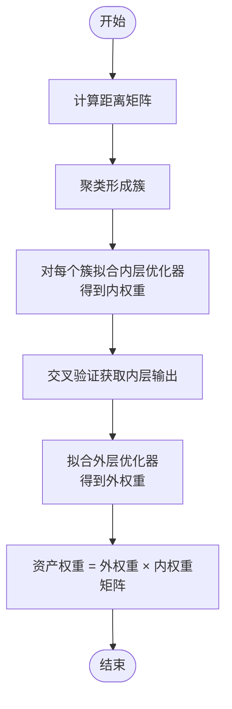

# 分层聚类与组合优化教程

<cite>
**本文引用的文件**
- [plot_1_hrp_cvar.py](file://examples/clustering/plot_1_hrp_cvar.py)
- [plot_3_hrp_vs_herc.py](file://examples/clustering/plot_3_hrp_vs_herc.py)
- [plot_4_nco.py](file://examples/clustering/plot_4_nco.py)
- [plot_6_schur.py](file://examples/clustering/plot_6_schur.py)
- [_hrp.py](file://src/skfolio/optimization/cluster/hierarchical/_hrp.py)
- [_herc.py](file://src/skfolio/optimization/cluster/hierarchical/_herc.py)
- [_nco.py](file://src/skfolio/optimization/cluster/_nco.py)
- [_schur.py](file://src/skfolio/optimization/cluster/hierarchical/_schur.py)
- [_base.py](file://src/skfolio/optimization/cluster/hierarchical/_base.py)
</cite>

## 目录
1. [引言](#引言)
2. [项目结构](#项目结构)
3. [核心组件](#核心组件)
4. [架构总览](#架构总览)
5. [详细组件分析](#详细组件分析)
6. [依赖关系分析](#依赖关系分析)
7. [性能考量](#性能考量)
8. [故障排查指南](#故障排查指南)
9. [结论](#结论)
10. [附录](#附录)

## 引言
本教程围绕分层聚类在投资组合优化中的应用展开，以四个示例脚本为主线：plot_1_hrp_cvar.py 展示基于 CVaR 的 HRP 算法与聚类树可视化；plot_3_hrp_vs_herc.py 对比 HRP 与 HERC 在滚动回测下的稳定性与收益风险表现；plot_4_nco.py 介绍嵌套聚类优化（NCO）如何通过“内-外”两层优化降低估计误差；plot_6_schur.py 说明 Schur 补矩阵分解在聚类优化中的数学基础与实现细节。教程同时提供聚类树可视化、权重分配逻辑与回测比较的深入解析，帮助读者理解这些方法在不同市场条件下的稳健性与适用场景。

## 项目结构
本仓库将“聚类+组合优化”的示例集中在 examples/clustering 目录下，并在 src/skfolio 下实现了对应的优化器与基类。示例脚本与核心实现文件的对应关系如下：
- HRP 示例：examples/clustering/plot_1_hrp_cvar.py → src/skfolio/optimization/cluster/hierarchical/_hrp.py
- HRP vs HERC 对比：examples/clustering/plot_3_hrp_vs_herc.py → src/skfolio/optimization/cluster/hierarchical/_hrp.py 与 _herc.py
- NCO 示例：examples/clustering/plot_4_nco.py → src/skfolio/optimization/cluster/_nco.py
- Schur 示例：examples/clustering/plot_6_schur.py → src/skfolio/optimization/cluster/hierarchical/_schur.py
- 基类：src/skfolio/optimization/cluster/hierarchical/_base.py

图表来源
- [plot_1_hrp_cvar.py](file://examples/clustering/plot_1_hrp_cvar.py#L1-L197)
- [plot_3_hrp_vs_herc.py](file://examples/clustering/plot_3_hrp_vs_herc.py#L1-L227)
- [plot_4_nco.py](file://examples/clustering/plot_4_nco.py#L1-L182)
- [plot_6_schur.py](file://examples/clustering/plot_6_schur.py#L1-L341)
- [_hrp.py](file://src/skfolio/optimization/cluster/hierarchical/_hrp.py#L1-L490)
- [_herc.py](file://src/skfolio/optimization/cluster/hierarchical/_herc.py#L1-L522)
- [_nco.py](file://src/skfolio/optimization/cluster/_nco.py#L1-L447)
- [_schur.py](file://src/skfolio/optimization/cluster/hierarchical/_schur.py#L1-L804)
- [_base.py](file://src/skfolio/optimization/cluster/hierarchical/_base.py#L1-L474)

章节来源
- [plot_1_hrp_cvar.py](file://examples/clustering/plot_1_hrp_cvar.py#L1-L197)
- [plot_3_hrp_vs_herc.py](file://examples/clustering/plot_3_hrp_vs_herc.py#L1-L227)
- [plot_4_nco.py](file://examples/clustering/plot_4_nco.py#L1-L182)
- [plot_6_schur.py](file://examples/clustering/plot_6_schur.py#L1-L341)

## 核心组件
- HierarchicalRiskParity（HRP）
  - 使用距离矩阵进行层次聚类，对树进行重排（seriation），再自顶向下递归二分，按子树逆风险权重计算权重因子，更新簇权重。
  - 支持多种风险度量（如 CVaR）与链接方法（默认 Ward，亦可单链路等）。
  - 可配置先验估计器（Prior）、距离估计器（Distance）、层次聚类估计器（HierarchicalClustering）以及权重边界约束。
- HierarchicalEqualRiskContribution（HERC）
  - 同样基于层次聚类树，但采用自顶向下划分并在每个节点处做“简单风险平价”分配，最终通过凸优化最小化相对偏差来满足权重约束。
- NestedClustersOptimization（NCO）
  - 先用距离矩阵形成聚类，对每个簇拟合内层优化器得到内权重；再用外层优化器基于内层输出的“跨期估计”训练得到外权重；最终资产权重为内外权重的点积。
- SchurComplementary（Schur）
  - 基于 Schur 补的协方差块增强，从 HRP 的启发式分割平滑过渡到最小方差解；通过正则化参数 gamma 控制离对角信息的纳入程度；支持单调性保证（keep_monotonic）以避免病态协方差导致的不收敛。

章节来源
- [_hrp.py](file://src/skfolio/optimization/cluster/hierarchical/_hrp.py#L1-L490)
- [_herc.py](file://src/skfolio/optimization/cluster/hierarchical/_herc.py#L1-L522)
- [_nco.py](file://src/skfolio/optimization/cluster/_nco.py#L1-L447)
- [_schur.py](file://src/skfolio/optimization/cluster/hierarchical/_schur.py#L1-L804)
- [_base.py](file://src/skfolio/optimization/cluster/hierarchical/_base.py#L1-L474)

## 架构总览
下面的类图展示了四个优化器与基类之间的继承与依赖关系，以及它们共同依赖的估计器（Prior、Distance、HierarchicalClustering）。

图表来源
- [_base.py](file://src/skfolio/optimization/cluster/hierarchical/_base.py#L1-L474)
- [_hrp.py](file://src/skfolio/optimization/cluster/hierarchical/_hrp.py#L1-L490)
- [_herc.py](file://src/skfolio/optimization/cluster/hierarchical/_herc.py#L1-L522)
- [_schur.py](file://src/skfolio/optimization/cluster/hierarchical/_schur.py#L1-L804)
- [_nco.py](file://src/skfolio/optimization/cluster/_nco.py#L1-L447)

## 详细组件分析

### HRP（基于 CVaR 的风险平价）
- 数据与建模流程
  - 加载价格数据，转换为日度收益率，划分训练/测试集。
  - 构造 HRP 模型（风险度量为 CVaR），拟合并预测训练集得到组合；分析训练集上的 CVaR 风险贡献。
  - 绘制聚类树（Dendrogram），展示层级结构与重排后的距离矩阵热力图。
  - 对比不同链接方法（Ward vs 单链路）与不同距离度量（Pearson vs Kendall 绝对值）对聚类的影响。
  - 使用因子模型作为先验估计器，进一步观察聚类与权重变化。
  - 在测试集上预测多个模型并绘制累计收益与组合构成，汇总统计指标。
- 关键实现要点
  - 距离估计器与层次聚类估计器在 fit 中被依次调用，随后进行最优叶子重排（optimal leaf ordering）与递归二分。
  - 权重约束通过内部函数对分裂因子进行修正，确保满足上下界。
  - 风险度量统一由基类的 _risk 与 _unitary_risks 计算，支持多种风险测度（含 CVaR）。
- 回测与可视化
  - 使用 Population/Portfolio 工具绘制累计收益、组合构成与风险贡献图。
  - 通过 summary 输出关键指标（如年化夏普比率等）。

图表来源
- [plot_1_hrp_cvar.py](file://examples/clustering/plot_1_hrp_cvar.py#L1-L197)
- [_hrp.py](file://src/skfolio/optimization/cluster/hierarchical/_hrp.py#L322-L439)
- [_base.py](file://src/skfolio/optimization/cluster/hierarchical/_base.py#L335-L394)

章节来源
- [plot_1_hrp_cvar.py](file://examples/clustering/plot_1_hrp_cvar.py#L1-L197)
- [_hrp.py](file://src/skfolio/optimization/cluster/hierarchical/_hrp.py#L1-L490)
- [_base.py](file://src/skfolio/optimization/cluster/hierarchical/_base.py#L1-L474)

### HRP 与 HERC 对比（滚动回测与稳定性）
- 数据与建模流程
  - 加载 FTSE 100 价格数据，转换为日度收益率并划分训练/测试集。
  - 构造 HRP 与 HERC 两个模型，均以 CVaR 为目标。
  - 使用 WalkForward 进行滚动回测（训练期 252 天，测试期 60 天），通过 GridSearchCV 在训练集上选择最佳参数（距离度量与链接方法）。
  - 在测试集上分别预测两个模型，合并为 Population 并绘制滚动组合构成、累计收益曲线。
  - 使用 CombinatorialPurgedCV 生成多条测试路径，绘制 Mean-CVaR Ratio 分布，比较两者均值与标准差。
- 关键实现要点
  - HERC 在完成自顶向下划分后，通过凸优化最小化相对偏差以满足权重约束，这与 HRP 的中间约束处理方式不同。
  - 两种方法均支持多种风险度量与链接方法，便于在不同市场环境下评估稳健性。
- 结果解读
  - HERC 在平均 Mean-CVaR Ratio 上可能更优，但波动更大；HRP 更稳健但收益略低。二者在不同样本路径上表现差异体现了对估计误差与市场状态的敏感性。

图表来源
- [plot_3_hrp_vs_herc.py](file://examples/clustering/plot_3_hrp_vs_herc.py#L1-L227)
- [_hrp.py](file://src/skfolio/optimization/cluster/hierarchical/_hrp.py#L322-L439)
- [_herc.py](file://src/skfolio/optimization/cluster/hierarchical/_herc.py#L360-L522)

章节来源
- [plot_3_hrp_vs_herc.py](file://examples/clustering/plot_3_hrp_vs_herc.py#L1-L227)
- [_herc.py](file://src/skfolio/optimization/cluster/hierarchical/_herc.py#L1-L522)

### NCO（嵌套聚类优化）
- 数据与建模流程
  - 加载 S&P 500 价格数据，转换为日度收益率并划分训练/测试集。
  - 设定内层优化器（如 MeanRisk，最大化夏普比率，Variance 作为风险度量）与外层优化器（如 RiskBudgeting，CVaR 风险平价）。
  - 使用 HierarchicalClustering 或 KMeans 形成聚类；对每个簇拟合内层优化器得到内权重；对外层使用交叉验证得到的内层输出作为特征训练外层优化器；最终资产权重为内外权重的点积。
  - 绘制聚类树，对比不同链接方法与距离度量，以及替换聚类器（如 KMeans）对结果的影响。
  - 在测试集上预测并绘制累计收益与组合构成。
- 关键实现要点
  - 内层优化器在全样本上拟合，外层优化器使用交叉验证输出作为“外样本估计”，避免数据泄露。
  - 支持任意 sklearn 或 skfolio 的聚类器与优化器，具备良好的扩展性。
- 数学与流程
  - 内权重：对每个簇拟合内层优化器，得到该簇内的资产权重向量。
  - 外权重：将各簇内权重按资产维度拼接为矩阵，使用交叉验证得到的内层输出作为外层输入，训练外层优化器得到簇间权重。
  - 总权重：外权重与内权重矩阵相乘得到最终资产权重。

图表来源
- [plot_4_nco.py](file://examples/clustering/plot_4_nco.py#L1-L182)
- [_nco.py](file://src/skfolio/optimization/cluster/_nco.py#L270-L447)

章节来源
- [plot_4_nco.py](file://examples/clustering/plot_4_nco.py#L1-L182)
- [_nco.py](file://src/skfolio/optimization/cluster/_nco.py#L1-L447)

### Schur 补矩阵分解（HRP 到 MVP 的插值）
- 数据与建模流程
  - 加载 S&P 500 价格数据，转换为日度收益率并划分训练/测试集。
  - 使用 LedoitWolf 对协方差进行收缩以提升数值稳定性。
  - 构造 SchurComplementary 模型，设定正则化参数 gamma（0 对应 HRP，接近 1 接近 MVP）；可启用 keep_monotonic 以保证方差单调下降并限制 gamma。
  - 在训练集上生成一系列 gamma（0~1）对应的 Schur 组合，绘制训练/测试集上的均值-标准差前沿与组合构成。
  - 使用 WalkForward 进行季度再平衡回测，随机搜索 gamma 与距离度量，评估 Mean-CDaR Ratio。
  - 使用 MultipleRandomizedCV 在不同资产子集与时间窗口上进行稳健性评估，绘制 Sharpe Ratio 与 CDaR Ratio 的分布。
- 数学与实现要点
  - Schur 补增强：对子协方差矩阵进行增强，引入离对角信息，使分割过程能利用子块间的协方差关系。
  - 递归二分：与 HRP 类似，自顶向下二分，但每步计算增强后的子块方差，得到分裂因子。
  - 单调性保障：当 keep_monotonic=True 时，通过二分搜索找到使方差不再单调下降的最大 gamma，并返回对应的权重。
- 结果解读
  - Schur 在训练集上可能被均值-方差前沿支配，但在测试集上通常优于 MVP；通过 gamma 调参与稳健性评估可获得更稳健的策略。

图表来源
- [plot_6_schur.py](file://examples/clustering/plot_6_schur.py#L1-L341)
- [_schur.py](file://src/skfolio/optimization/cluster/hierarchical/_schur.py#L340-L804)

章节来源
- [plot_6_schur.py](file://examples/clustering/plot_6_schur.py#L1-L341)
- [_schur.py](file://src/skfolio/optimization/cluster/hierarchical/_schur.py#L1-L804)

## 依赖关系分析
- 组件耦合与协作
  - 四个优化器均继承自 BaseHierarchicalOptimization，共享统一的风险度量接口、权重边界转换与风险计算方法。
  - Prior、Distance、HierarchicalClustering 是通用依赖，贯穿所有层级聚类优化器。
  - NCO 与 Schur 还依赖交叉验证与外样本估计，以减少过拟合并提升稳健性。
- 外部依赖与集成点
  - scipy.cluster.hierarchy 提供最优叶子重排与树遍历。
  - sklearn 的元路由（metadata routing）用于将 fit 参数传递给嵌套估计器。
  - Portfolio/Prior/Metrics 工具用于回测、风险度量与可视化。

图表来源
- [_base.py](file://src/skfolio/optimization/cluster/hierarchical/_base.py#L1-L474)
- [_hrp.py](file://src/skfolio/optimization/cluster/hierarchical/_hrp.py#L322-L439)
- [_herc.py](file://src/skfolio/optimization/cluster/hierarchical/_herc.py#L360-L522)
- [_nco.py](file://src/skfolio/optimization/cluster/_nco.py#L270-L447)
- [_schur.py](file://src/skfolio/optimization/cluster/hierarchical/_schur.py#L340-L804)

章节来源
- [_base.py](file://src/skfolio/optimization/cluster/hierarchical/_base.py#L1-L474)
- [_nco.py](file://src/skfolio/optimization/cluster/_nco.py#L1-L447)

## 性能考量
- 计算复杂度
  - HRP/HERC：层次聚类与最优叶子重排的时间复杂度主要取决于链接矩阵构造与树遍历；递归二分的总体复杂度与资产数线性相关。
  - NCO：内层优化在每个簇上独立拟合，外层优化使用交叉验证输出，整体受簇数量与交叉验证折数影响。
  - Schur：每次二分需要对子块协方差进行增强与分解，SPD 检查与最近半正定投影会增加计算成本；keep_monotonic 时的二分搜索带来额外开销。
- 稳健性与估计误差
  - Schur 的 gamma 插值与 keep_monotonic 有助于在病态协方差情况下保持方差单调下降，提高稳健性。
  - NCO 通过外样本估计避免内层过拟合，降低估计误差对权重的影响。
  - HERC 在满足权重约束方面采用凸优化，避免中间步骤约束导致的次优解。
- 实践建议
  - 在高维或病态协方差场景优先考虑 Schur（配合协方差收缩）与 NCO。
  - 若追求稳健性且对收益敏感度较低，HRP 是良好起点；若追求更高夏普比，HERC 需结合稳健性评估与参数搜索。

## 故障排查指南
- 常见问题与定位
  - 权重边界冲突：当 min_weights 之和过大或 max_weights 之和过小，会导致不可行解。检查 _convert_weights_bounds 的报错信息与边界设定。
  - 风险度量不支持：HRP/HERC 不支持偏度、峰度等风险度量，若传入会抛出异常。请改用支持的风险度量（如 CVaR、Variance 等）。
  - Schur 增强失败：当 gamma 较大或协方差病态时，Schur 增强可能导致非半正定块。启用 keep_monotonic 或降低 gamma，或对协方差进行收缩。
  - 数据泄露：NCO 的外层优化必须使用交叉验证输出作为特征，避免直接使用训练集本身，否则会引入数据泄露。
- 建议的调试步骤
  - 逐步打印 fit 流程中的关键对象（Prior、Distance、HierarchicalClustering）的属性，确认输入形状与名称一致。
  - 在示例脚本中保留聚类树可视化，观察链接方法与距离度量对树结构的影响。
  - 使用较小的 gamma 或更保守的参数网格进行快速验证，再扩大搜索范围。

章节来源
- [_hrp.py](file://src/skfolio/optimization/cluster/hierarchical/_hrp.py#L322-L439)
- [_herc.py](file://src/skfolio/optimization/cluster/hierarchical/_herc.py#L360-L522)
- [_nco.py](file://src/skfolio/optimization/cluster/_nco.py#L270-L447)
- [_schur.py](file://src/skfolio/optimization/cluster/hierarchical/_schur.py#L340-L804)

## 结论
- HRP 通过层次聚类与递归二分实现稳健的风险平价分配，适合对估计误差敏感的环境；HERC 在收益风险比上更具潜力，但需注意其权重约束处理与稳健性评估。
- NCO 通过“内-外”两阶段优化有效降低估计误差，适合长期稳健策略；Schur 将 HRP 与 MVP 平滑连接，gamma 调参与单调性保障使其在病态协方差下仍具鲁棒性。
- 在实际应用中，建议结合回测（WalkForward）、多路径 CV（CombinatorialPurgedCV/MultipleRandomizedCV）与稳健性指标（如 Sharpe Ratio、CDaR Ratio 分布）综合评估模型表现。

## 附录
- 示例脚本路径参考
  - HRP（CVaR）：[plot_1_hrp_cvar.py](file://examples/clustering/plot_1_hrp_cvar.py#L1-L197)
  - HRP vs HERC：[plot_3_hrp_vs_herc.py](file://examples/clustering/plot_3_hrp_vs_herc.py#L1-L227)
  - NCO：[plot_4_nco.py](file://examples/clustering/plot_4_nco.py#L1-L182)
  - Schur：[plot_6_schur.py](file://examples/clustering/plot_6_schur.py#L1-L341)
- 核心实现参考
  - HRP：[_hrp.py](file://src/skfolio/optimization/cluster/hierarchical/_hrp.py#L1-L490)
  - HERC：[_herc.py](file://src/skfolio/optimization/cluster/hierarchical/_herc.py#L1-L522)
  - NCO：[_nco.py](file://src/skfolio/optimization/cluster/_nco.py#L1-L447)
  - Schur：[_schur.py](file://src/skfolio/optimization/cluster/hierarchical/_schur.py#L1-L804)
  - 基类：[_base.py](file://src/skfolio/optimization/cluster/hierarchical/_base.py#L1-L474)