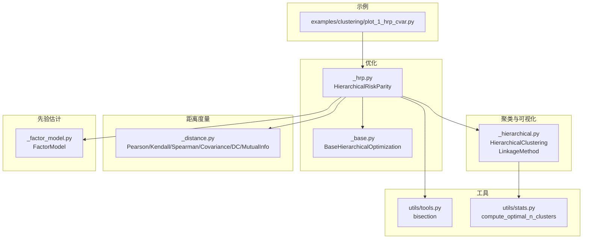
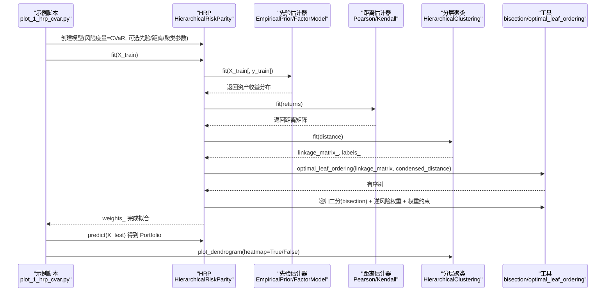
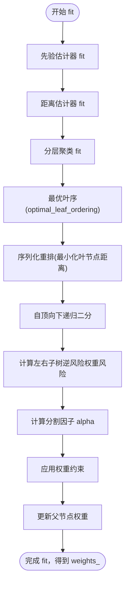
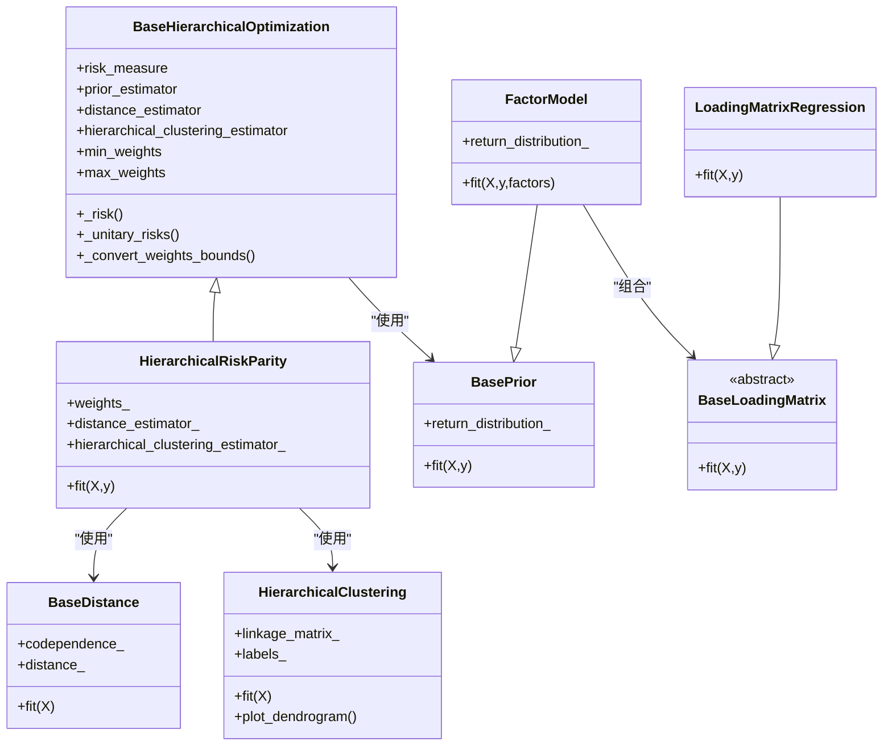

# 分层风险平价(HRP)优化

<cite>
**本文引用的文件列表**
- [plot_1_hrp_cvar.py](file://examples/clustering/plot_1_hrp_cvar.py)
- [_hrp.py](file://src/skfolio/optimization/cluster/hierarchical/_hrp.py)
- [_base.py](file://src/skfolio/optimization/cluster/hierarchical/_base.py)
- [_hierarchical.py](file://src/skfolio/cluster/_hierarchical.py)
- [_distance.py](file://src/skfolio/distance/_distance.py)
- [_factor_model.py](file://src/skfolio/prior/_factor_model.py)
- [tools.py](file://src/skfolio/utils/tools.py)
- [stats.py](file://src/skfolio/utils/stats.py)
- [test_hrp.py](file://tests/test_optimization/test_cluster/test_hierarchical/test_hrp.py)
</cite>

## 目录
1. [简介](#简介)
2. [项目结构与定位](#项目结构与定位)
3. [核心组件](#核心组件)
4. [架构总览](#架构总览)
5. [详细组件分析](#详细组件分析)
6. [依赖关系分析](#依赖关系分析)
7. [性能与稳定性考量](#性能与稳定性考量)
8. [故障排查指南](#故障排查指南)
9. [结论](#结论)
10. [附录](#附录)

## 简介
本篇文档围绕分层风险平价（Hierarchical Risk Parity, HRP）在投资组合优化中的应用展开，以示例脚本 plot_1_hrp_cvar.py 为主线，系统讲解如何使用 CVaR 风险度量构建 HRP 模型。文档覆盖 HRP 的三步流程：基于距离矩阵的分层聚类、序列化重排资产以最小化叶节点距离、以及自顶向下的递归二分法进行权重分配；解释默认采用 Ward 方差最小化链接方法优于单链接的原因；展示如何通过 Kendall 距离等不同距离度量影响聚类结果；介绍先验估计器（如因子模型）的集成使用；并通过回测对比不同配置下的模型表现（风险贡献、组合构成、累计收益），最后给出聚类树（dendrogram）可视化分析方法。

## 项目结构与定位
- 示例位于 examples/clustering/plot_1_hrp_cvar.py，演示了从数据加载、模型训练、风险贡献分析、聚类树可视化到多配置回测对比的完整流程。
- 核心算法实现位于 src/skfolio/optimization/cluster/hierarchical/_hrp.py，继承自通用的分层优化基类。
- 聚类与可视化由 src/skfolio/cluster/_hierarchical.py 提供，包含 LinkageMethod 枚举与 dendrogram 绘图。
- 距离度量由 src/skfolio/distance/_distance.py 提供，支持 Pearson、Kendall、Spearman、Covariance、Distance Correlation、Mutual Information 等。
- 先验估计器（如因子模型）位于 src/skfolio/prior/_factor_model.py，用于提供资产收益分布估计。
- 工具函数（如 bisection、optimal leaf ordering）位于 src/skfolio/utils/tools.py 和 src/skfolio/utils/stats.py。

图表来源
- [plot_1_hrp_cvar.py](file://examples/clustering/plot_1_hrp_cvar.py#L1-L197)
- [_hrp.py](file://src/skfolio/optimization/cluster/hierarchical/_hrp.py#L1-L490)
- [_base.py](file://src/skfolio/optimization/cluster/hierarchical/_base.py#L1-L474)
- [_hierarchical.py](file://src/skfolio/cluster/_hierarchical.py#L1-L390)
- [_distance.py](file://src/skfolio/distance/_distance.py#L1-L587)
- [_factor_model.py](file://src/skfolio/prior/_factor_model.py#L1-L347)
- [tools.py](file://src/skfolio/utils/tools.py#L550-L749)
- [stats.py](file://src/skfolio/utils/stats.py#L438-L506)

章节来源
- [plot_1_hrp_cvar.py](file://examples/clustering/plot_1_hrp_cvar.py#L1-L197)

## 核心组件
- HierarchicalRiskParity：HRP 主体实现，负责：
  - 使用 prior_estimator 获取资产收益分布；
  - 使用 distance_estimator 计算代码相关性/距离矩阵；
  - 使用 HierarchicalClustering 基于距离矩阵进行分层聚类；
  - 对树进行最优叶序（optimal leaf ordering）以最小化叶节点距离；
  - 自顶向下递归二分法，按子树逆风险权重计算权重因子并更新权重；
  - 支持权重上下界约束与交易成本/管理费等线性调整。
- BaseHierarchicalOptimization：通用分层优化基类，定义风险度量、先验估计器、距离估计器、聚类估计器、权重约束、费用参数等接口与通用风险计算逻辑。
- HierarchicalClustering：基于 scipy.cluster.hierarchy 的分层聚类，支持多种 LinkageMethod（SINGLE、COMPLETE、AVERAGE、WEIGHTED、CENTROID、MEDIAN、WARD），并提供 dendrogram 可视化。
- 距离度量：PearsonDistance、KendallDistance、SpearmanDistance、CovarianceDistance、DistanceCorrelation、MutualInformation 等，支持绝对值与幂变换。
- 先验估计器：FactorModel 通过因子模型估计资产收益分布，可加入残差方差与正定化处理。
- 工具函数：bisection（递归二分生成器）、optimal leaf ordering、compute_optimal_n_clusters 等。

章节来源
- [_hrp.py](file://src/skfolio/optimization/cluster/hierarchical/_hrp.py#L1-L490)
- [_base.py](file://src/skfolio/optimization/cluster/hierarchical/_base.py#L1-L474)
- [_hierarchical.py](file://src/skfolio/cluster/_hierarchical.py#L1-L390)
- [_distance.py](file://src/skfolio/distance/_distance.py#L1-L587)
- [_factor_model.py](file://src/skfolio/prior/_factor_model.py#L1-L347)
- [tools.py](file://src/skfolio/utils/tools.py#L550-L749)
- [stats.py](file://src/skfolio/utils/stats.py#L438-L506)

## 架构总览
下图展示了 HRP 在示例脚本中的端到端调用链路与关键对象交互。

图表来源
- [plot_1_hrp_cvar.py](file://examples/clustering/plot_1_hrp_cvar.py#L1-L197)
- [_hrp.py](file://src/skfolio/optimization/cluster/hierarchical/_hrp.py#L322-L439)
- [_base.py](file://src/skfolio/optimization/cluster/hierarchical/_base.py#L335-L394)
- [_hierarchical.py](file://src/skfolio/cluster/_hierarchical.py#L167-L208)
- [tools.py](file://src/skfolio/utils/tools.py#L557-L575)

## 详细组件分析

### HRP 三步流程详解
- 步骤一：基于距离矩阵的分层聚类
  - 先验估计器（默认 EmpiricalPrior）提供资产收益分布；
  - 距离估计器（默认 PearsonDistance）从收益率计算相关性并转换为距离矩阵；
  - HierarchicalClustering 使用 scipy.cluster.hierarchy.linkage 对距离矩阵进行聚类，得到 linkage_matrix_ 与 labels_。
- 步骤二：序列化重排资产以最小化叶节点距离
  - 使用 optimal_leaf_ordering 将树的叶节点顺序重新排列，使相邻叶节点在距离上更接近，提升权重分配的稳定性。
- 步骤三：自顶向下的递归二分法进行权重分配
  - 从根节点开始，对每个节点进行二分（bisection），计算左右子树的“逆风险权重”组合的风险；
  - 依据左右子树风险比计算分割因子 alpha，更新父节点权重；
  - 应用权重上下限约束，确保最终权重满足 min/max_weights 约束。

图表来源
- [_hrp.py](file://src/skfolio/optimization/cluster/hierarchical/_hrp.py#L382-L439)
- [tools.py](file://src/skfolio/utils/tools.py#L557-L575)

章节来源
- [_hrp.py](file://src/skfolio/optimization/cluster/hierarchical/_hrp.py#L322-L439)
- [tools.py](file://src/skfolio/utils/tools.py#L557-L575)

### 默认使用 Ward 方差最小化链接方法的优势
- 示例脚本明确指出：默认链接方法为 Ward，相比单链接（Single）更稳定，具有更好的聚类性质。
- 单链接易产生“链式效应”，导致长链状簇，不利于稳健的权重分配；Ward 通过最小化簇内方差，形成更紧凑、平衡的聚类结构，从而提升 HRP 的稳定性与鲁棒性。

章节来源
- [plot_1_hrp_cvar.py](file://examples/clustering/plot_1_hrp_cvar.py#L97-L126)
- [_hierarchical.py](file://src/skfolio/cluster/_hierarchical.py#L22-L98)

### 不同距离度量对聚类结果的影响
- 示例脚本展示了三种配置：
  - Pearson 距离（默认）；
  - Kendall 距离（绝对值与幂变换可调）；
  - 单链接（用于对比）。
- 不同距离度量会改变相关性度量方式（线性/秩相关/协方差等），进而影响距离矩阵与聚类树结构，最终影响权重分配。
- 示例中通过 dendrogram 可视化对比不同配置下的聚类结构差异。

章节来源
- [plot_1_hrp_cvar.py](file://examples/clustering/plot_1_hrp_cvar.py#L128-L162)
- [_distance.py](file://src/skfolio/distance/_distance.py#L97-L166)

### 先验估计器（因子模型）的集成使用
- 示例脚本展示了使用 FactorModel 作为 prior_estimator 的配置，将因子驱动的收益分布估计纳入 HRP。
- 因子模型通过加载矩阵与因子先验估计，得到资产期望收益、协方差与收益样本，再用于距离估计与风险计算。
- 该集成有助于降低估计噪声、提高权重稳定性。

章节来源
- [plot_1_hrp_cvar.py](file://examples/clustering/plot_1_hrp_cvar.py#L146-L162)
- [_factor_model.py](file://src/skfolio/prior/_factor_model.py#L148-L347)

### 回测与模型比较
- 示例脚本创建多个 HRP 模型（不同链接方法、距离度量、先验估计器）与一个等权基准模型，并在测试集上进行预测与汇总统计。
- 可视化包括：
  - 风险贡献（按 CVaR）；
  - 聚类树（dendrogram）；
  - 累计收益曲线；
  - 组合构成（饼图/条形图）。
- 通过这些指标对比不同配置的稳定性与收益特征。

章节来源
- [plot_1_hrp_cvar.py](file://examples/clustering/plot_1_hrp_cvar.py#L60-L197)

### 聚类树（dendrogram）可视化分析
- HierarchicalClustering 提供 plot_dendrogram 方法，支持：
  - 仅显示树干（heatmap=False）；
  - 显示重排后的距离热力图（heatmap=True），并在图中标注各聚类块。
- 可视化时使用 optimal_leaf_ordering 优化叶序，使得相邻叶节点在距离上更接近，便于观察聚类结构。
- 示例脚本展示了两种模式（heatmap=False 与 heatmap=True）的对比说明。

章节来源
- [_hierarchical.py](file://src/skfolio/cluster/_hierarchical.py#L210-L390)
- [plot_1_hrp_cvar.py](file://examples/clustering/plot_1_hrp_cvar.py#L77-L121)

## 依赖关系分析
- HRP 依赖于：
  - BaseHierarchicalOptimization：统一的风险度量、先验估计器、距离估计器、聚类估计器与权重约束接口；
  - HierarchicalClustering：提供 linkage_matrix_ 与 labels_，并支持 dendrogram 可视化；
  - 距离估计器：提供距离矩阵；
  - 工具函数：bisection 用于递归二分，optimal_leaf_ordering 用于叶序优化；
  - 先验估计器：提供资产收益分布（均值、协方差、收益样本）。
- 测试用例验证了：
  - HRP 在不同风险度量与链接方法下的稳定性；
  - 权重约束与交易成本/管理费的影响；
  - 因子模型集成的有效性。

图表来源
- [_base.py](file://src/skfolio/optimization/cluster/hierarchical/_base.py#L1-L251)
- [_hrp.py](file://src/skfolio/optimization/cluster/hierarchical/_hrp.py#L292-L439)
- [_hierarchical.py](file://src/skfolio/cluster/_hierarchical.py#L109-L208)
- [_distance.py](file://src/skfolio/distance/_distance.py#L1-L200)
- [_factor_model.py](file://src/skfolio/prior/_factor_model.py#L148-L347)

章节来源
- [_base.py](file://src/skfolio/optimization/cluster/hierarchical/_base.py#L1-L251)
- [_hrp.py](file://src/skfolio/optimization/cluster/hierarchical/_hrp.py#L292-L439)
- [_hierarchical.py](file://src/skfolio/cluster/_hierarchical.py#L109-L208)
- [_distance.py](file://src/skfolio/distance/_distance.py#L1-L200)
- [_factor_model.py](file://src/skfolio/prior/_factor_model.py#L148-L347)

## 性能与稳定性考量
- 链接方法选择：Ward 相比 Single 更稳定，减少链式效应带来的不稳定权重分配。
- 距离度量选择：Pearson 适合线性相关性，Kendall/Spearman 更稳健（对异常值不敏感），CovarianceDistance 可结合协方差估计器以捕捉非线性结构。
- 叶序优化：optimal_leaf_ordering 使相邻叶节点在距离上更接近，有助于提升权重分配的稳定性与可解释性。
- 权重约束：在二分过程中对分割因子进行约束，避免极端权重，保证组合的稳健性。
- 先验估计：因子模型可降低估计噪声，提升协方差估计质量，从而改善 HRP 权重稳定性。

[本节为一般性指导，无需特定文件引用]

## 故障排查指南
- 拟合失败与回退：
  - HRP 支持 fallback 机制，当主优化失败时可回退到指定估计器或 previous_weights。
  - 可通过 raise_on_failure 控制错误处理策略。
- 权重边界问题：
  - 若 min_weights 或 max_weights 设置不当，可能导致无可行解或权重越界，需检查边界之和与单调性。
- 数据维度与观测数：
  - 当样本量过小或资产过多时，聚类与权重估计可能不稳定，建议增加样本长度或减少资产数量。
- 因子模型设置：
  - 加载矩阵估计器与因子先验估计器需正确配置，否则可能导致协方差估计异常。

章节来源
- [_base.py](file://src/skfolio/optimization/cluster/hierarchical/_base.py#L1-L251)
- [test_hrp.py](file://tests/test_optimization/test_cluster/test_hierarchical/test_hrp.py#L100-L298)

## 结论
本文以示例脚本 plot_1_hrp_cvar.py 为主线，系统阐述了 HRP 在 CVaR 风险度量下的实现细节与工程实践。通过三步流程（聚类、序列化重排、递归二分）、默认 Ward 链接方法、多种距离度量与先验估计器（因子模型）的集成，HRP 在稳健性与可解释性方面具备显著优势。示例脚本提供了完整的回测与可视化流程，便于对比不同配置下的模型表现与聚类结构。

[本节为总结性内容，无需特定文件引用]

## 附录
- 示例脚本路径：examples/clustering/plot_1_hrp_cvar.py
- 关键实现文件：
  - HRP 实现：src/skfolio/optimization/cluster/hierarchical/_hrp.py
  - 分层优化基类：src/skfolio/optimization/cluster/hierarchical/_base.py
  - 分层聚类与可视化：src/skfolio/cluster/_hierarchical.py
  - 距离度量：src/skfolio/distance/_distance.py
  - 因子模型先验：src/skfolio/prior/_factor_model.py
  - 工具函数：src/skfolio/utils/tools.py、src/skfolio/utils/stats.py
- 测试用例参考：tests/test_optimization/test_cluster/test_hierarchical/test_hrp.py