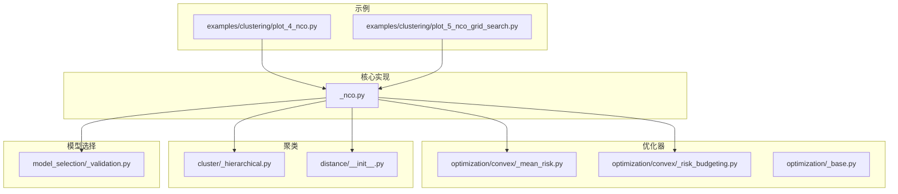
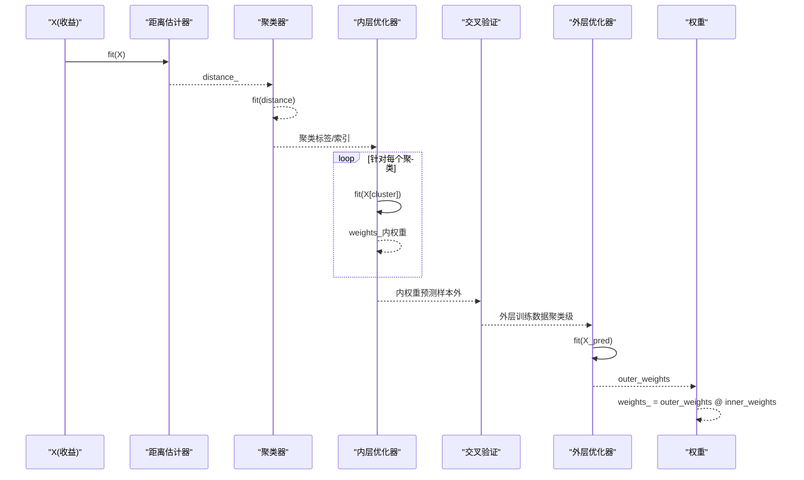
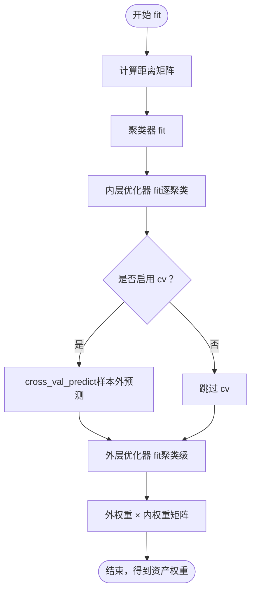
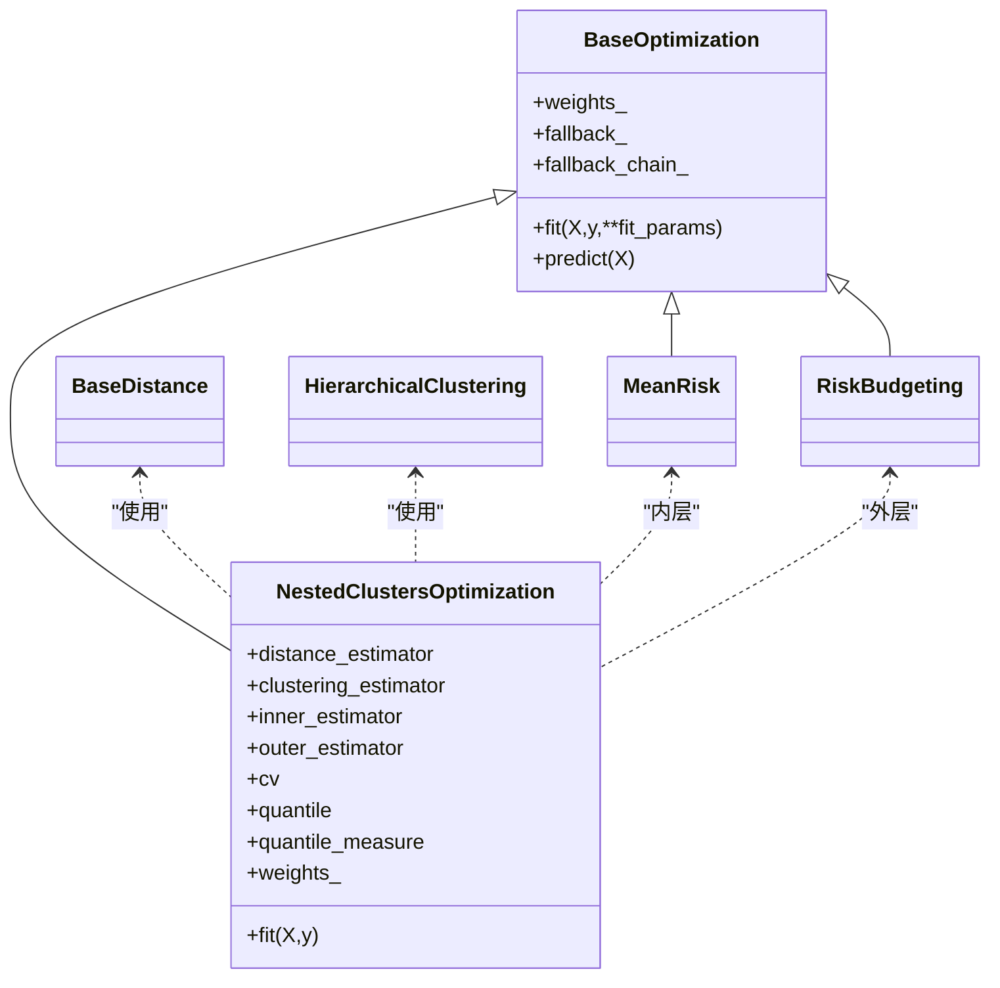

# 嵌套聚类优化(NCO)

<cite>
**本文引用的文件**
- [plot_4_nco.py](file://examples/clustering/plot_4_nco.py)
- [plot_5_nco_grid_search.py](file://examples/clustering/plot_5_nco_grid_search.py)
- [_nco.py](file://src/skfolio/optimization/cluster/_nco.py)
- [_base.py](file://src/skfolio/optimization/_base.py)
- [_mean_risk.py](file://src/skfolio/optimization/convex/_mean_risk.py)
- [_risk_budgeting.py](file://src/skfolio/optimization/convex/_risk_budgeting.py)
- [_hierarchical.py](file://src/skfolio/cluster/_hierarchical.py)
- [__init__.py](file://src/skfolio/distance/__init__.py)
- [_validation.py](file://src/skfolio/model_selection/_validation.py)
- [optimization.rst](file://docs/user_guide/optimization.rst)
- [test_nco.py](file://tests/test_optimization/test_cluster/test_nco.py)
</cite>

## 目录
1. [简介](#简介)
2. [项目结构](#项目结构)
3. [核心组件](#核心组件)
4. [架构总览](#架构总览)
5. [详细组件分析](#详细组件分析)
6. [依赖关系分析](#依赖关系分析)
7. [性能考量](#性能考量)
8. [故障排查指南](#故障排查指南)
9. [结论](#结论)
10. [附录](#附录)

## 简介
本教程围绕嵌套聚类优化（Nested Clusters Optimization, NCO）展开，系统讲解其工作机制与实践应用。NCO由Marcos López de Prado提出，通过“内外两层优化”的思想降低估计误差：内层优化器在每个聚类内部计算资产权重；外层优化器基于内层的样本外估计进行聚类权重估计；最终资产权重为内外权重的点积。该设计有效避免了数据泄露问题。示例代码以plot_4_nco.py为主线，演示如何配置不同的聚类算法（HierarchicalClustering或KMeans）、内层优化器（MeanRisk）与外层优化器（RiskBudgeting），并通过plot_5_nco_grid_search.py展示如何使用网格搜索对NCO参数进行调优，并结合组合表现对比与分布分析完成完整的流程。

## 项目结构
- 示例脚本位于 examples/clustering，包含NCO入门与网格搜索示例。
- 核心实现位于 src/skfolio/optimization/cluster/_nco.py，定义 NestedClustersOptimization。
- 内层/外层优化器分别来自 convex 优化模块（MeanRisk、RiskBudgeting）。
- 聚类算法来自 cluster 模块（HierarchicalClustering、KMeans等）。
- 距离度量来自 distance 模块（PearsonDistance、KendallDistance等）。
- 交叉验证与滚动验证工具来自 model_selection 模块，用于外层训练的样本外估计。

图表来源
- [plot_4_nco.py](file://examples/clustering/plot_4_nco.py#L1-L182)
- [plot_5_nco_grid_search.py](file://examples/clustering/plot_5_nco_grid_search.py#L1-L195)
- [_nco.py](file://src/skfolio/optimization/cluster/_nco.py#L1-L447)
- [_mean_risk.py](file://src/skfolio/optimization/convex/_mean_risk.py#L1-L800)
- [_risk_budgeting.py](file://src/skfolio/optimization/convex/_risk_budgeting.py#L1-L616)
- [_hierarchical.py](file://src/skfolio/cluster/_hierarchical.py#L109-L208)
- [_validation.py](file://src/skfolio/model_selection/_validation.py#L1-L200)

章节来源
- [plot_4_nco.py](file://examples/clustering/plot_4_nco.py#L1-L182)
- [plot_5_nco_grid_search.py](file://examples/clustering/plot_5_nco_grid_search.py#L1-L195)
- [_nco.py](file://src/skfolio/optimization/cluster/_nco.py#L1-L447)

## 核心组件
- NestedClustersOptimization：NCO主类，负责：
  - 使用距离矩阵与聚类算法形成资产分组；
  - 对每个聚类拟合内层优化器，得到内权重；
  - 使用交叉验证对外层优化器进行样本外训练，得到外权重；
  - 最终资产权重为外权重与内权重矩阵乘积。
- 内层优化器（inner_estimator）：如 MeanRisk，用于在聚类内求解资产权重。
- 外层优化器（outer_estimator）：如 RiskBudgeting，用于在聚类间求解聚类权重。
- 聚类器（clustering_estimator）：如 HierarchicalClustering 或 sklearn.cluster.KMeans。
- 距离估计器（distance_estimator）：如 PearsonDistance、KendallDistance。
- 交叉验证（cv）：支持 KFold、WalkForward、CombinatorialPurgedCV 等，用于外层样本外估计。

章节来源
- [_nco.py](file://src/skfolio/optimization/cluster/_nco.py#L35-L212)
- [_mean_risk.py](file://src/skfolio/optimization/convex/_mean_risk.py#L1-L200)
- [_risk_budgeting.py](file://src/skfolio/optimization/convex/_risk_budgeting.py#L1-L120)
- [_hierarchical.py](file://src/skfolio/cluster/_hierarchical.py#L109-L208)
- [optimization.rst](file://docs/user_guide/optimization.rst#L650-L674)

## 架构总览
下图展示了 NCO 的端到端工作流：输入价格收益 → 计算距离矩阵 → 聚类 → 内层优化 → 外层优化（样本外）→ 组合权重。

图表来源
- [_nco.py](file://src/skfolio/optimization/cluster/_nco.py#L270-L447)
- [_validation.py](file://src/skfolio/model_selection/_validation.py#L35-L138)

## 详细组件分析

### NCO 类与工作流程
- 参数与默认值：
  - 内层/外层优化器默认 MeanRisk；
  - 距离估计器默认 PearsonDistance；
  - 聚类器默认 HierarchicalClustering；
  - cv 默认 KFold；
  - 支持 n_jobs、quantile、quantile_measure、portfolio_params、fallback 等。
- fit 流程要点：
  - 计算距离矩阵并拟合聚类器，得到聚类标签；
  - 对每个聚类独立拟合内层优化器，收集内权重；
  - 若 cv 不为 "ignore"，使用 cross_val_predict 获取每个聚类的样本外预测作为外层输入；
  - 将外层输入转换为聚类级特征矩阵后拟合外层优化器；
  - 最终资产权重为外权重与内权重矩阵乘积。
- 避免数据泄露的关键：
  - 外层训练使用的是内层在训练集上的样本外预测，而非直接使用训练集收益；
  - 当使用 CombinatorialPurgedCV 时，从多路径中按指定分位数与度量选择最优路径。

图表来源
- [_nco.py](file://src/skfolio/optimization/cluster/_nco.py#L270-L447)
- [_validation.py](file://src/skfolio/model_selection/_validation.py#L35-L138)

章节来源
- [_nco.py](file://src/skfolio/optimization/cluster/_nco.py#L270-L447)
- [_validation.py](file://src/skfolio/model_selection/_validation.py#L35-L138)

### 内层优化器（MeanRisk）
- 支持多种目标函数与风险度量（方差、半方差、CVaR、最大回撤等）；
- 可设置预算约束、权重上下界、交易成本、管理费用、不确定性集合等；
- 在 NCO 中用于在每个聚类内求解资产权重。

章节来源
- [_mean_risk.py](file://src/skfolio/optimization/convex/_mean_risk.py#L1-L200)

### 外层优化器（RiskBudgeting）
- 通过风险预算约束最小化风险，支持多种风险度量；
- 可设置风险预算向量、权重上下界、最小期望收益等；
- 在 NCO 中用于在聚类间求解聚类权重。

章节来源
- [_risk_budgeting.py](file://src/skfolio/optimization/convex/_risk_budgeting.py#L1-L120)

### 聚类算法（HierarchicalClustering 与 KMeans）
- HierarchicalClustering：
  - 支持多种链接方法（SINGLE、WARD 等）；
  - 自动估计最优聚类数量或由用户指定；
  - 提供树状图可视化接口。
- KMeans：
  - 支持 sklearn.cluster.KMeans，可直接作为聚类器传入。

章节来源
- [_hierarchical.py](file://src/skfolio/cluster/_hierarchical.py#L109-L208)
- [plot_4_nco.py](file://examples/clustering/plot_4_nco.py#L140-L158)

### 距离估计器（Pearson/Kendall）
- 支持多种距离度量（Pearson、Kendall、Spearman、互信息等）；
- 用于构建距离矩阵，驱动聚类效果。

章节来源
- [__init__.py](file://src/skfolio/distance/__init__.py#L1-L27)
- [plot_4_nco.py](file://examples/clustering/plot_4_nco.py#L120-L141)

### 交叉验证与滚动验证
- 支持 KFold、WalkForward、CombinatorialPurgedCV 等；
- cross_val_predict 返回单路径（MultiPeriodPortfolio）或多路径（Population）；
- NCO 在外层使用样本外估计，避免数据泄露。

章节来源
- [_validation.py](file://src/skfolio/model_selection/_validation.py#L35-L138)
- [plot_5_nco_grid_search.py](file://examples/clustering/plot_5_nco_grid_search.py#L1-L195)

### 示例一：NCO 基础用法与聚类结构分析（plot_4_nco.py）
- 配置：
  - 内层：MeanRisk（最大化夏普比率，风险度量为方差）；
  - 外层：RiskBudgeting（风险度量为 CVaR）；
  - 聚类：HierarchicalClustering（默认 Ward）；
  - 距离：Pearson（默认）。
- 功能：
  - 展示不同链接方法（WARD vs SINGLE）对聚类结构的影响；
  - 展示不同距离度量（Pearson vs Kendall）对聚类结构的影响；
  - 展示替换聚类器为 KMeans；
  - 使用 EqualWeighted 作为基准，比较组合表现与持仓构成。

章节来源
- [plot_4_nco.py](file://examples/clustering/plot_4_nco.py#L1-L182)

### 示例二：网格搜索与组合表现对比（plot_5_nco_grid_search.py）
- 目标：通过 GridSearchCV 寻找最优参数组合，最大化历史滚动测试集上的样本外夏普比率；
- 参数空间：
  - 内层风险度量：VARIANCE、CVAR；
  - 外层优化器：EqualWeighted、RiskBudgeting（CVaR）；
  - 聚类链接方法：SINGLE、WARD；
  - 距离估计器：Pearson、Kendall。
- 评估：
  - 使用 WalkForward 进行滚动预测；
  - 使用 CombinatorialPurgedCV 进行多路径再组合分析；
  - 输出组合累计收益、组合构成、样本外夏普比率分布统计。

章节来源
- [plot_5_nco_grid_search.py](file://examples/clustering/plot_5_nco_grid_search.py#L1-L195)

## 依赖关系分析
- NCO 依赖：
  - 距离估计器：提供距离矩阵；
  - 聚类器：根据距离矩阵形成聚类；
  - 内层优化器：在聚类内求解资产权重；
  - 外层优化器：在聚类间求解聚类权重；
  - 交叉验证：提供样本外估计，避免数据泄露。
- 关键耦合点：
  - NCO 与 BaseOptimization 的继承关系保证统一的 fit/predict 接口与回退机制；
  - cross_val_predict 与 NCO 的 cv 参数协同，确保外层训练仅使用样本外输出。

图表来源
- [_base.py](file://src/skfolio/optimization/_base.py#L1-L200)
- [_nco.py](file://src/skfolio/optimization/cluster/_nco.py#L1-L212)
- [_mean_risk.py](file://src/skfolio/optimization/convex/_mean_risk.py#L1-L120)
- [_risk_budgeting.py](file://src/skfolio/optimization/convex/_risk_budgeting.py#L1-L120)
- [_hierarchical.py](file://src/skfolio/cluster/_hierarchical.py#L109-L208)

章节来源
- [_base.py](file://src/skfolio/optimization/_base.py#L1-L200)
- [_nco.py](file://src/skfolio/optimization/cluster/_nco.py#L1-L212)

## 性能考量
- 并行加速：NCO 支持 n_jobs 并行拟合内层优化器与交叉验证预测，显著提升大规模场景下的运行效率。
- 聚类稳定性：选择合适的链接方法（如 Ward）有助于提升聚类稳定性，减少链式效应带来的噪声。
- 距离度量：Pearson 适合线性相关性，Kendall 更稳健于非线性与异常值，可根据数据特性选择。
- 外层样本外估计：使用 KFold/WalkForward/CombinatorialPurgedCV 等策略，避免过拟合并提高泛化能力。

[本节为通用建议，不直接分析具体文件]

## 故障排查指南
- 数据泄露风险：
  - 若将 cv 设置为 "ignore"，外层会直接使用训练集收益，可能造成过拟合与数据泄露；
  - 建议始终使用样本外估计（如 KFold、WalkForward、CombinatorialPurgedCV）。
- 回退机制：
  - NCO 继承自 BaseOptimization，具备统一的回退链路（fallback_chain_）与错误捕获（error_），便于定位失败原因；
  - 可通过 raise_on_failure 控制失败时的行为。
- 聚类标签与资产名：
  - 若输入为 DataFrame，NCO 会保留资产名以便后续可视化与分析。

章节来源
- [_nco.py](file://src/skfolio/optimization/cluster/_nco.py#L270-L447)
- [_base.py](file://src/skfolio/optimization/_base.py#L120-L200)

## 结论
NCO 通过“内外两层优化”与样本外估计有效降低了估计误差并避免数据泄露。借助灵活的距离度量、聚类算法与优化器组合，NCO 能够适配多样化的投资目标与风险偏好。示例脚本提供了从基础配置到网格搜索与组合表现对比的完整流程，便于快速落地与迭代优化。

[本节为总结性内容，不直接分析具体文件]

## 附录

### 实操清单（基于示例）
- 基础配置
  - 内层：MeanRisk（最大化夏普比率，风险度量为方差）
  - 外层：RiskBudgeting（风险度量为 CVaR）
  - 聚类：HierarchicalClustering（默认 Ward）
  - 距离：Pearson（默认）
- 聚类结构分析
  - 切换链接方法（SINGLE vs WARD）
  - 切换距离度量（Pearson vs Kendall）
  - 替换聚类器为 KMeans
- 组合表现对比
  - 与 EqualWeighted 基准对比
  - 可视化累计收益与组合构成
- 网格搜索与再组合分析
  - 使用 GridSearchCV 寻优
  - 使用 WalkForward 与 CombinatorialPurgedCV 进行滚动与多路径评估

章节来源
- [plot_4_nco.py](file://examples/clustering/plot_4_nco.py#L1-L182)
- [plot_5_nco_grid_search.py](file://examples/clustering/plot_5_nco_grid_search.py#L1-L195)

### 单元测试参考
- 测试覆盖：
  - NCO 在不同 cv 策略下的权重一致性；
  - 使用 n_jobs 的并行一致性；
  - 与 HierarchicalClustering 的组合行为。

章节来源
- [test_nco.py](file://tests/test_optimization/test_cluster/test_nco.py#L32-L153)