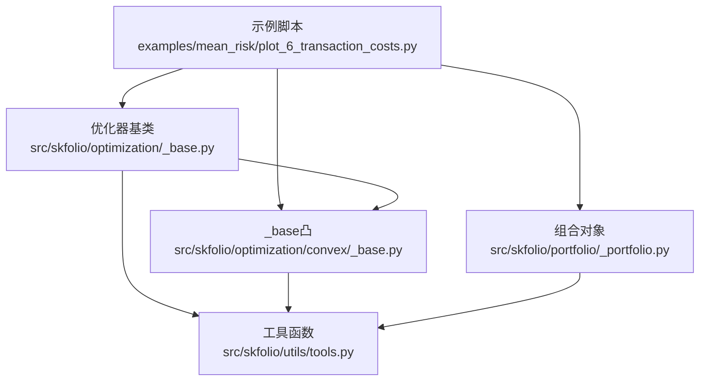
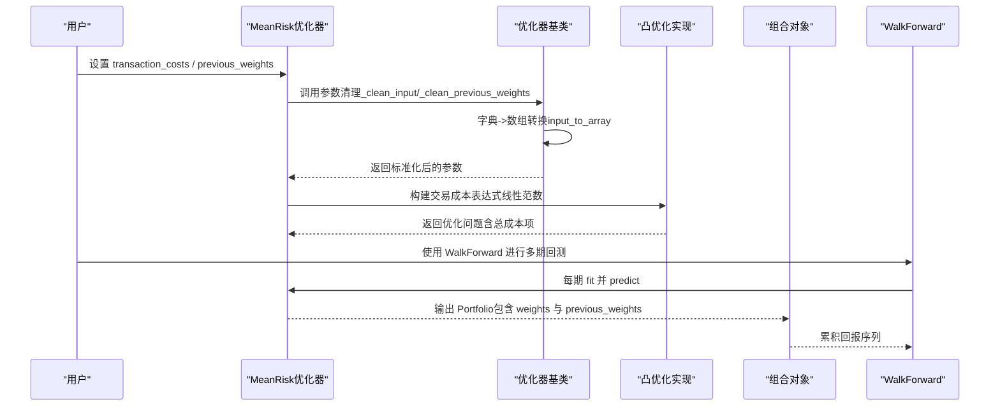
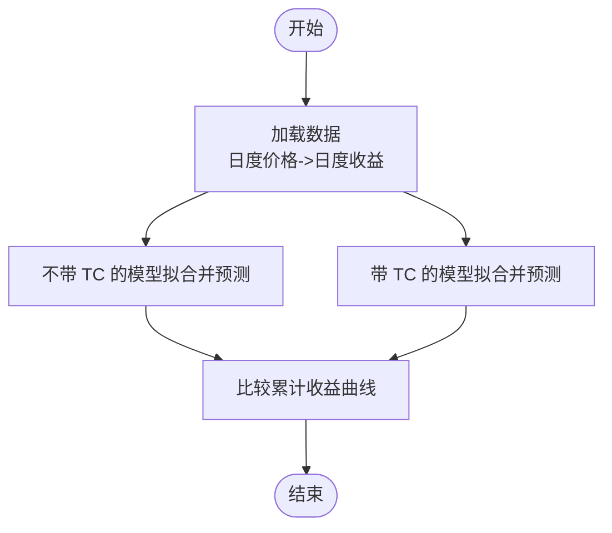
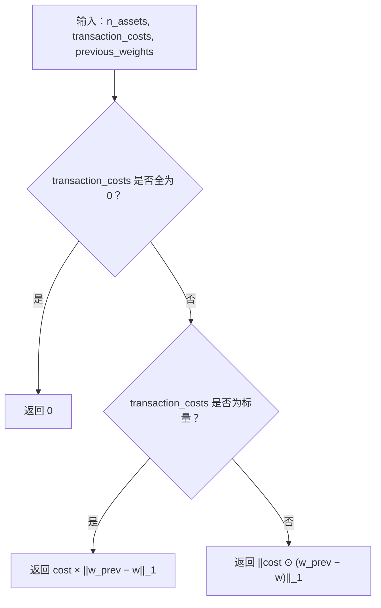
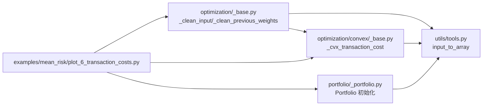

# 交易成本建模与优化

<cite>
**本文引用的文件**
- [examples/mean_risk/plot_6_transaction_costs.py](file://examples/mean_risk/plot_6_transaction_costs.py)
- [src/skfolio/optimization/_base.py](file://src/skfolio/optimization/_base.py)
- [src/skfolio/optimization/convex/_base.py](file://src/skfolio/optimization/convex/_base.py)
- [src/skfolio/portfolio/_portfolio.py](file://src/skfolio/portfolio/_portfolio.py)
- [src/skfolio/utils/tools.py](file://src/skfolio/utils/tools.py)
- [tests/test_optimization/test_convex/test_mean_risk.py](file://tests/test_optimization/test_convex/test_mean_risk.py)
- [tests/test_model_selection/test_validation.py](file://tests/test_model_selection/test_validation.py)
</cite>

## 目录
1. [引言](#引言)
2. [项目结构](#项目结构)
3. [核心组件](#核心组件)
4. [架构总览](#架构总览)
5. [详细组件分析](#详细组件分析)
6. [依赖关系分析](#依赖关系分析)
7. [性能考量](#性能考量)
8. [故障排查指南](#故障排查指南)
9. [结论](#结论)
10. [附录](#附录)

## 引言
本教程围绕示例脚本“交易成本”展开，系统讲解如何在均值-风险模型中集成线性交易成本（Transaction Costs, TC）。重点包括：
- transaction_costs 参数的三种输入格式：标量（统一成本）、字典（资产名到成本映射）、数组（按资产顺序的成本向量）
- 交易成本对预期收益的影响公式推导与周期性一致性要求
- 如何将固定成本转换为周期性成本（以持有期为基准）
- previous_weights 对权重调整的影响
- 使用 WalkForward 交叉验证展示多周期组合中交易成本的累积效应及对策略绩效的影响

## 项目结构
该功能涉及以下模块：
- 示例脚本：examples/mean_risk/plot_6_transaction_costs.py
- 优化器基类与凸优化实现：src/skfolio/optimization/_base.py、src/skfolio/optimization/convex/_base.py
- 组合对象与参数清理：src/skfolio/portfolio/_portfolio.py
- 输入转换工具：src/skfolio/utils/tools.py
- 测试用例：tests/test_optimization/test_convex/test_mean_risk.py、tests/test_model_selection/test_validation.py

图表来源
- [examples/mean_risk/plot_6_transaction_costs.py](file://examples/mean_risk/plot_6_transaction_costs.py#L1-L191)
- [src/skfolio/optimization/_base.py](file://src/skfolio/optimization/_base.py#L451-L583)
- [src/skfolio/optimization/convex/_base.py](file://src/skfolio/optimization/convex/_base.py#L1225-L1270)
- [src/skfolio/portfolio/_portfolio.py](file://src/skfolio/portfolio/_portfolio.py#L491-L528)
- [src/skfolio/utils/tools.py](file://src/skfolio/utils/tools.py#L359-L445)

章节来源
- [examples/mean_risk/plot_6_transaction_costs.py](file://examples/mean_risk/plot_6_transaction_costs.py#L1-L191)

## 核心组件
- 交易成本表达式构建：在凸优化实现中，当存在非零交易成本时，构建线性范数形式的总成本，并将其从期望收益中扣除，从而影响优化目标。
- 参数清理与输入转换：提供统一的参数清理流程，支持标量、字典、数组三种输入；字典模式要求输入为带列名的 DataFrame。
- previous_weights 的传播与校验：确保在需要时正确传递上一期权重，用于计算交易成本与周转率等约束。
- 多周期回测：通过 WalkForward 将交易成本的累积效应可视化，比较“无 TC 训练/有 TC 测试”与“有 TC 训练/测试”的策略表现差异。

章节来源
- [src/skfolio/optimization/convex/_base.py](file://src/skfolio/optimization/convex/_base.py#L1225-L1270)
- [src/skfolio/optimization/_base.py](file://src/skfolio/optimization/_base.py#L451-L583)
- [src/skfolio/portfolio/_portfolio.py](file://src/skfolio/portfolio/_portfolio.py#L491-L528)
- [src/skfolio/utils/tools.py](file://src/skfolio/utils/tools.py#L359-L445)
- [examples/mean_risk/plot_6_transaction_costs.py](file://examples/mean_risk/plot_6_transaction_costs.py#L100-L191)

## 架构总览
交易成本在优化中的集成路径如下：
- 用户在 MeanRisk 中设置 transaction_costs 与 previous_weights
- 优化器基类进行参数清理，将字典或数组转换为长度为 n_assets 的向量
- 凸优化实现根据是否为标量或向量分别构造线性范数形式的交易成本表达式
- 在目标函数中以“期望收益 - 总成本”的形式参与优化
- 多周期回测中，每期预测得到的权重作为下一期的 previous_weights，形成累积成本链路

图表来源
- [src/skfolio/optimization/_base.py](file://src/skfolio/optimization/_base.py#L451-L583)
- [src/skfolio/optimization/convex/_base.py](file://src/skfolio/optimization/convex/_base.py#L1225-L1270)
- [src/skfolio/portfolio/_portfolio.py](file://src/skfolio/portfolio/_portfolio.py#L491-L528)
- [examples/mean_risk/plot_6_transaction_costs.py](file://examples/mean_risk/plot_6_transaction_costs.py#L134-L191)

## 详细组件分析

### 交易成本参数的三种输入格式
- 标量（float）：对所有资产应用相同成本，内部广播为长度 n_assets 的向量
- 字典（dict）：键为资产名，值为对应成本；要求 fit 时输入 X 为带列名的 DataFrame，否则报错
- 数组（ndarray/list）：按资产顺序给出成本向量，形状需为 (n_assets,)

参数清理逻辑要点：
- 标量：直接转为标量
- 字典：使用 input_to_array，按资产名顺序填充，缺失键用填充值（默认 0）
- 数组：检查维度与形状，确保最后一维等于 n_assets

章节来源
- [examples/mean_risk/plot_6_transaction_costs.py](file://examples/mean_risk/plot_6_transaction_costs.py#L26-L31)
- [src/skfolio/optimization/_base.py](file://src/skfolio/optimization/_base.py#L451-L496)
- [src/skfolio/utils/tools.py](file://src/skfolio/utils/tools.py#L359-L445)

### 交易成本对预期收益的影响公式
- 总成本定义为：总成本 = Σ_i c_i × |w_i − w_prev_i|，其中 c_i 为资产 i 的单位成本，w_i 为当前权重，w_prev_i 为上期权重
- 优化目标中以“期望收益 − 总成本”的形式出现，即：E[r] = μ^T · w − total_cost

周期性一致性：
- 交易成本的周期性必须与输入收益率的周期一致。例如输入为日度收益，则交易成本应为日度成本；若输入为月度收益，则交易成本应为月度成本。

章节来源
- [examples/mean_risk/plot_6_transaction_costs.py](file://examples/mean_risk/plot_6_transaction_costs.py#L11-L24)
- [examples/mean_risk/plot_6_transaction_costs.py](file://examples/mean_risk/plot_6_transaction_costs.py#L32-L40)

### 固定成本到周期性成本的转换
- 将固定成本除以预期投资期（如持有期天数）得到周期性成本
- 示例中以持有期 60 天为例，将固定成本除以 60 得到日度成本，再用于多周期回测

章节来源
- [examples/mean_risk/plot_6_transaction_costs.py](file://examples/mean_risk/plot_6_transaction_costs.py#L144-L146)

### previous_weights 对权重调整的影响
- 当 previous_weights 为空（默认）时，交易成本仅反映与零权重的偏离
- 当 previous_weights 为等权或其他历史权重时，交易成本会促使更贴近历史配置的调整，从而改变权重分布
- 测试用例验证了 needs_previous_weights 的行为以及 previous_weights 在多期回测中的自动传播

章节来源
- [examples/mean_risk/plot_6_transaction_costs.py](file://examples/mean_risk/plot_6_transaction_costs.py#L106-L132)
- [tests/test_model_selection/test_validation.py](file://tests/test_model_selection/test_validation.py#L88-L110)
- [tests/test_optimization/test_convex/test_mean_risk.py](file://tests/test_optimization/test_convex/test_mean_risk.py#L133-L155)

### 多周期组合中交易成本的累积效应
- 使用 WalkForward 将训练期与持有期分离，每期重新拟合模型并进行滚动预测
- 通过对比“无 TC 训练/有 TC 测试”与“有 TC 训练/测试”，观察交易成本对累计收益的影响
- 示例展示了在引入交易成本后，策略在多周期回测中的表现变化

图表来源
- [examples/mean_risk/plot_6_transaction_costs.py](file://examples/mean_risk/plot_6_transaction_costs.py#L134-L191)

章节来源
- [examples/mean_risk/plot_6_transaction_costs.py](file://examples/mean_risk/plot_6_transaction_costs.py#L134-L191)

### 交易成本表达式的构建与优化集成
- 标量成本：返回常数乘以 L1 范数（|w_prev − w|）
- 向量成本：返回按元素乘以成本向量后的 L1 范数
- 若成本全为 0，则跳过成本项

图表来源
- [src/skfolio/optimization/convex/_base.py](file://src/skfolio/optimization/convex/_base.py#L1225-L1270)

章节来源
- [src/skfolio/optimization/convex/_base.py](file://src/skfolio/optimization/convex/_base.py#L1225-L1270)

### 参数清理与输入转换（input_to_array）
- 支持字典、数组、列表输入
- 字典模式要求提供资产名数组，否则抛出错误
- 校验维度与形状，确保最后一维为 n_assets
- 缺失键按 fill_value 填充（默认 0）

章节来源
- [src/skfolio/utils/tools.py](file://src/skfolio/utils/tools.py#L359-L445)
- [src/skfolio/optimization/_base.py](file://src/skfolio/optimization/_base.py#L451-L496)

### previous_weights 的传播与校验
- _clean_previous_weights 将标量广播为长度 n_assets 的数组
- 在需要最大周转约束时，必须提供 previous_weights，否则抛出错误
- 测试用例验证了 previous_weights 在多期回测中的自动传播与字典映射

章节来源
- [src/skfolio/optimization/_base.py](file://src/skfolio/optimization/_base.py#L497-L512)
- [src/skfolio/optimization/convex/_base.py](file://src/skfolio/optimization/convex/_base.py#L1328-L1365)
- [tests/test_model_selection/test_validation.py](file://tests/test_model_selection/test_validation.py#L88-L110)

## 依赖关系分析
- 优化器基类依赖工具函数 input_to_array 完成参数标准化
- 凸优化实现依赖基类的参数清理结果，构建交易成本表达式
- 组合对象在 Portfolio 初始化时对 weights、previous_weights、transaction_costs 进行标准化
- 示例脚本串联上述组件，完成端到端的多周期回测

图表来源
- [src/skfolio/optimization/_base.py](file://src/skfolio/optimization/_base.py#L451-L583)
- [src/skfolio/optimization/convex/_base.py](file://src/skfolio/optimization/convex/_base.py#L1225-L1270)
- [src/skfolio/portfolio/_portfolio.py](file://src/skfolio/portfolio/_portfolio.py#L491-L528)
- [src/skfolio/utils/tools.py](file://src/skfolio/utils/tools.py#L359-L445)
- [examples/mean_risk/plot_6_transaction_costs.py](file://examples/mean_risk/plot_6_transaction_costs.py#L1-L191)

章节来源
- [src/skfolio/optimization/_base.py](file://src/skfolio/optimization/_base.py#L451-L583)
- [src/skfolio/optimization/convex/_base.py](file://src/skfolio/optimization/convex/_base.py#L1225-L1270)
- [src/skfolio/portfolio/_portfolio.py](file://src/skfolio/portfolio/_portfolio.py#L491-L528)
- [src/skfolio/utils/tools.py](file://src/skfolio/utils/tools.py#L359-L445)
- [examples/mean_risk/plot_6_transaction_costs.py](file://examples/mean_risk/plot_6_transaction_costs.py#L1-L191)

## 性能考量
- 交易成本表达式采用 L1 范数，属于凸优化可处理的形式，计算稳定且高效
- 参数清理与数组转换在 fit 阶段执行一次，后续缓存复用可减少重复开销
- 多周期回测中，建议合理设置持有期与训练期，避免过短导致样本噪声过大

## 故障排查指南
- 字典输入未提供资产名：当 transaction_costs 为字典时，若 X 不是带列名的 DataFrame，将触发错误
- previous_weights 缺失导致约束失败：若设置了最大周转等约束而未提供 previous_weights，将抛出异常
- 周期性不一致：交易成本与收益率周期不匹配会导致策略表现失真，应按输入收益率周期设定成本

章节来源
- [src/skfolio/utils/tools.py](file://src/skfolio/utils/tools.py#L359-L445)
- [src/skfolio/optimization/convex/_base.py](file://src/skfolio/optimization/convex/_base.py#L1328-L1365)
- [examples/mean_risk/plot_6_transaction_costs.py](file://examples/mean_risk/plot_6_transaction_costs.py#L32-L40)

## 结论
通过将线性交易成本纳入均值-风险优化目标，并在多周期回测中传播 previous_weights，可以有效模拟真实市场的交易摩擦，提升策略在实证研究中的稳健性。实践中需特别注意：
- 成本的周期性与收益率周期保持一致
- 正确选择 transaction_costs 的输入格式并确保资产名对齐
- 在需要周转约束时提供 previous_weights，以保证优化问题的完整性

## 附录
- 示例脚本路径：examples/mean_risk/plot_6_transaction_costs.py
- 关键实现位置：
  - 交易成本表达式：src/skfolio/optimization/convex/_base.py
  - 参数清理与输入转换：src/skfolio/optimization/_base.py、src/skfolio/utils/tools.py
  - 组合对象参数标准化：src/skfolio/portfolio/_portfolio.py
  - 多周期回测与传播验证：tests/test_model_selection/test_validation.py、tests/test_optimization/test_convex/test_mean_risk.py