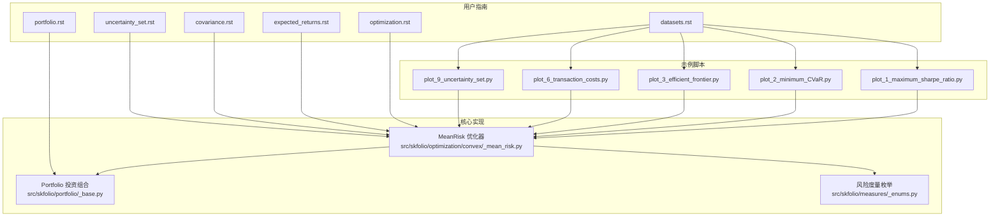
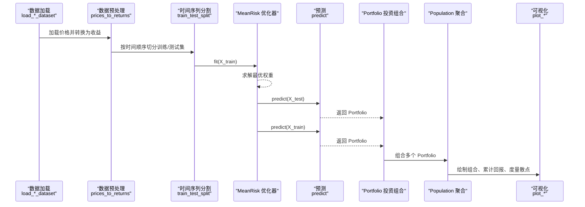
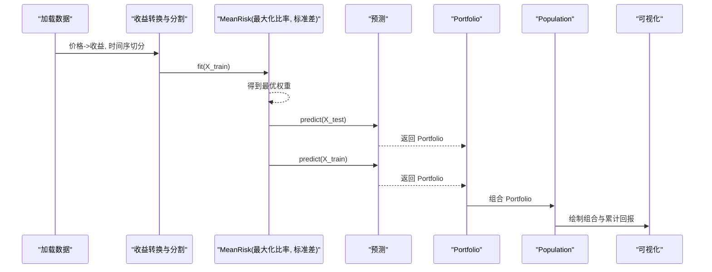
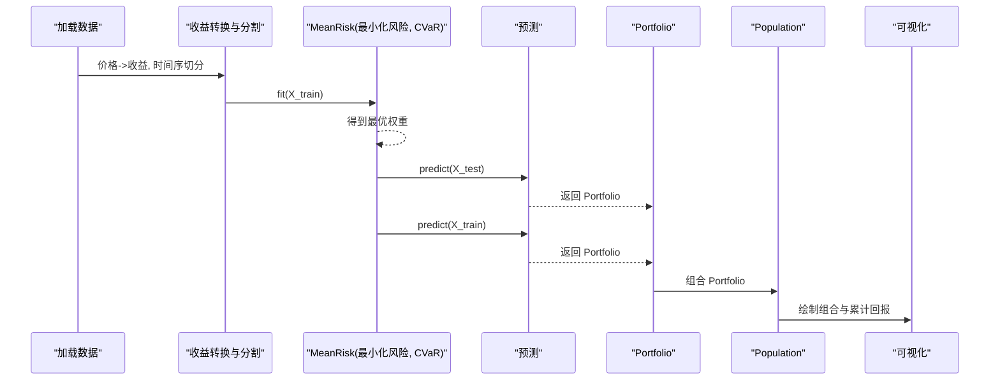
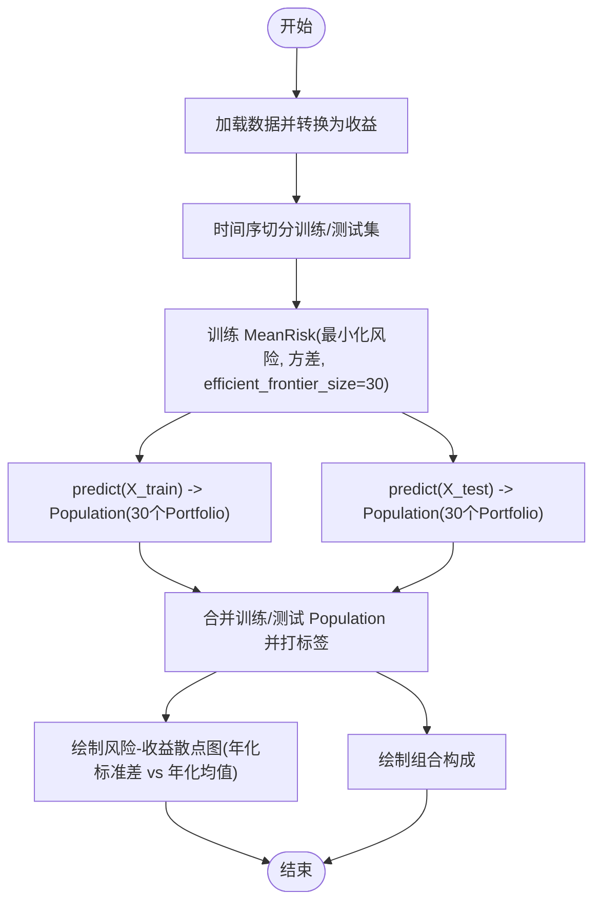
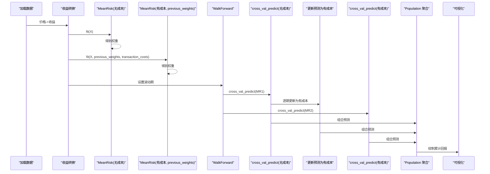
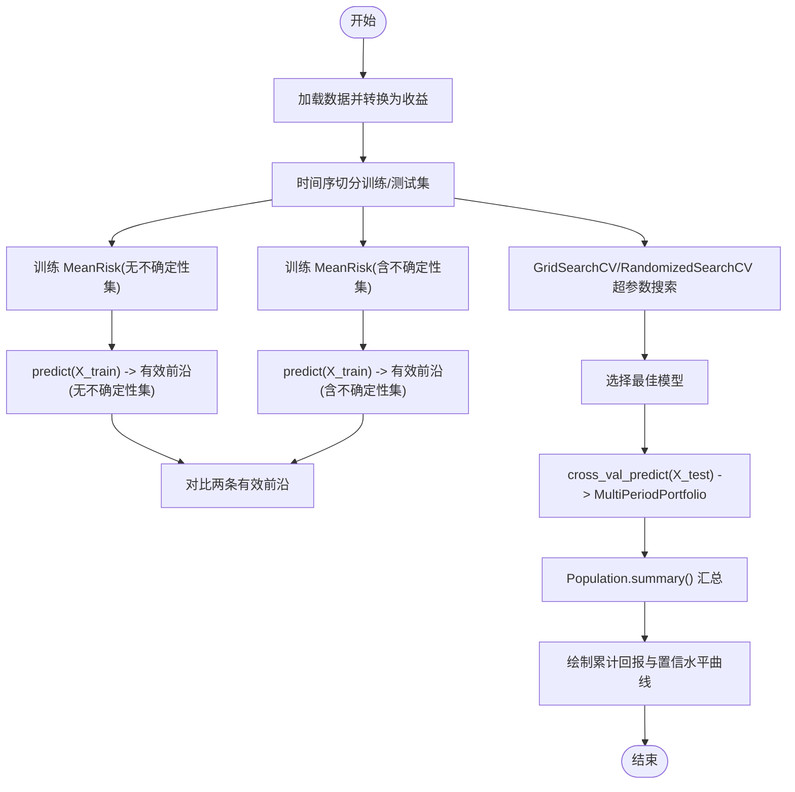
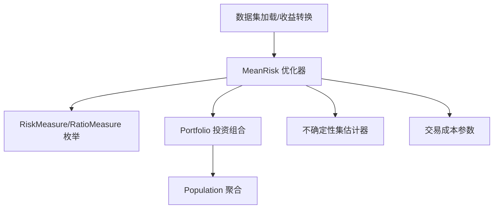

# 均值-风险优化教程

<cite>
**本文引用的文件**
- [examples/mean_risk/plot_1_maximum_sharpe_ratio.py](file://examples/mean_risk/plot_1_maximum_sharpe_ratio.py)
- [examples/mean_risk/plot_2_minimum_CVaR.py](file://examples/mean_risk/plot_2_minimum_CVaR.py)
- [examples/mean_risk/plot_3_efficient_frontier.py](file://examples/mean_risk/plot_3_efficient_frontier.py)
- [examples/mean_risk/plot_6_transaction_costs.py](file://examples/mean_risk/plot_6_transaction_costs.py)
- [examples/mean_risk/plot_9_uncertainty_set.py](file://examples/mean_risk/plot_9_uncertainty_set.py)
- [docs/user_guide/optimization.rst](file://docs/user_guide/optimization.rst)
- [docs/user_guide/expected_returns.rst](file://docs/user_guide/expected_returns.rst)
- [docs/user_guide/covariance.rst](file://docs/user_guide/covariance.rst)
- [docs/user_guide/uncertainty_set.rst](file://docs/user_guide/uncertainty_set.rst)
- [docs/user_guide/portfolio.rst](file://docs/user_guide/portfolio.rst)
- [docs/user_guide/datasets.rst](file://docs/user_guide/datasets.rst)
- [src/skfolio/optimization/convex/_mean_risk.py](file://src/skfolio/optimization/convex/_mean_risk.py)
- [src/skfolio/measures/_enums.py](file://src/skfolio/measures/_enums.py)
- [src/skfolio/portfolio/_base.py](file://src/skfolio/portfolio/_base.py)
</cite>

## 目录
1. [引言](#引言)
2. [项目结构](#项目结构)
3. [核心组件](#核心组件)
4. [架构总览](#架构总览)
5. [详细组件分析](#详细组件分析)
6. [依赖关系分析](#依赖关系分析)
7. [性能考量](#性能考量)
8. [故障排查指南](#故障排查指南)
9. [结论](#结论)
10. [附录](#附录)

## 引言
本教程围绕 examples/mean_risk 中的五个示例脚本，系统讲解均值-风险优化的实践路径：从最大夏普比率投资组合构建，到最小化条件风险价值（CVaR）的投资组合，再到有效前沿的生成；随后深入交易成本与不确定性集在 MeanRisk 优化中的建模与应用。教程同时提供理论背景、参数说明、输出解读与可视化分析，并链接到用户指南中关于期望收益与协方差估计的相关章节，帮助读者建立从数据准备到模型评估的完整知识体系。

## 项目结构
- 示例脚本位于 examples/mean_risk/，涵盖最大夏普比率、最小 CVaR、有效前沿、交易成本、不确定性集等主题。
- 用户指南位于 docs/user_guide/，包含优化器 MeanRisk 的参数与数学公式、期望收益与协方差估计器、不确定性集、投资组合对象等。
- 核心实现位于 src/skfolio/optimization/convex/_mean_risk.py，定义了 MeanRisk 优化器及其支持的目标函数、风险度量与约束；投资组合对象位于 src/skfolio/portfolio/_base.py，提供丰富的度量与可视化能力。

图表来源
- [examples/mean_risk/plot_1_maximum_sharpe_ratio.py](file://examples/mean_risk/plot_1_maximum_sharpe_ratio.py#L1-L127)
- [examples/mean_risk/plot_2_minimum_CVaR.py](file://examples/mean_risk/plot_2_minimum_CVaR.py#L1-L128)
- [examples/mean_risk/plot_3_efficient_frontier.py](file://examples/mean_risk/plot_3_efficient_frontier.py#L1-L104)
- [examples/mean_risk/plot_6_transaction_costs.py](file://examples/mean_risk/plot_6_transaction_costs.py#L1-L191)
- [examples/mean_risk/plot_9_uncertainty_set.py](file://examples/mean_risk/plot_9_uncertainty_set.py#L1-L232)
- [docs/user_guide/optimization.rst](file://docs/user_guide/optimization.rst#L1-L200)
- [docs/user_guide/expected_returns.rst](file://docs/user_guide/expected_returns.rst#L1-L36)
- [docs/user_guide/covariance.rst](file://docs/user_guide/covariance.rst#L1-L44)
- [docs/user_guide/uncertainty_set.rst](file://docs/user_guide/uncertainty_set.rst#L1-L87)
- [docs/user_guide/portfolio.rst](file://docs/user_guide/portfolio.rst#L1-L212)
- [docs/user_guide/datasets.rst](file://docs/user_guide/datasets.rst#L1-L46)
- [src/skfolio/optimization/convex/_mean_risk.py](file://src/skfolio/optimization/convex/_mean_risk.py#L30-L120)
- [src/skfolio/portfolio/_base.py](file://src/skfolio/portfolio/_base.py#L788-L825)
- [src/skfolio/measures/_enums.py](file://src/skfolio/measures/_enums.py#L104-L197)

章节来源
- [examples/mean_risk/plot_1_maximum_sharpe_ratio.py](file://examples/mean_risk/plot_1_maximum_sharpe_ratio.py#L1-L127)
- [examples/mean_risk/plot_2_minimum_CVaR.py](file://examples/mean_risk/plot_2_minimum_CVaR.py#L1-L128)
- [examples/mean_risk/plot_3_efficient_frontier.py](file://examples/mean_risk/plot_3_efficient_frontier.py#L1-L104)
- [examples/mean_risk/plot_6_transaction_costs.py](file://examples/mean_risk/plot_6_transaction_costs.py#L1-L191)
- [examples/mean_risk/plot_9_uncertainty_set.py](file://examples/mean_risk/plot_9_uncertainty_set.py#L1-L232)
- [docs/user_guide/optimization.rst](file://docs/user_guide/optimization.rst#L1-L200)
- [docs/user_guide/expected_returns.rst](file://docs/user_guide/expected_returns.rst#L1-L36)
- [docs/user_guide/covariance.rst](file://docs/user_guide/covariance.rst#L1-L44)
- [docs/user_guide/uncertainty_set.rst](file://docs/user_guide/uncertainty_set.rst#L1-L87)
- [docs/user_guide/portfolio.rst](file://docs/user_guide/portfolio.rst#L1-L212)
- [docs/user_guide/datasets.rst](file://docs/user_guide/datasets.rst#L1-L46)
- [src/skfolio/optimization/convex/_mean_risk.py](file://src/skfolio/optimization/convex/_mean_risk.py#L30-L120)
- [src/skfolio/portfolio/_base.py](file://src/skfolio/portfolio/_base.py#L788-L825)
- [src/skfolio/measures/_enums.py](file://src/skfolio/measures/_enums.py#L104-L197)

## 核心组件
- MeanRisk 优化器：支持最小化风险、最大化收益、最大化效用、最大化比率四种目标函数；可选风险度量包括方差、半方差、标准差、CVaR、EVaR、最大回撤、平均回撤、CDaR、EDaR、溃疡指数、Gini 差异等；支持权重/预算/组约束、交易成本、管理费、L1/L2 正则化、换手率、跟踪误差、不确定性集、预期收益约束、自定义目标与约束等。
- 风险度量枚举：RiskMeasure 与 RatioMeasure 定义了可用的风险与比率指标，用于度量与可视化。
- 投资组合对象：Portfolio 提供年化均值、方差、夏普比率、Sortino 比率、CVaR、CDaR、最大回撤、滚动指标、累计回报、组合贡献、可视化等丰富属性与方法。
- 数据集加载：内置 S&P 500、FTSE 100 等数据集，便于快速复现实例。

章节来源
- [src/skfolio/optimization/convex/_mean_risk.py](file://src/skfolio/optimization/convex/_mean_risk.py#L30-L120)
- [src/skfolio/measures/_enums.py](file://src/skfolio/measures/_enums.py#L104-L197)
- [src/skfolio/portfolio/_base.py](file://src/skfolio/portfolio/_base.py#L788-L825)
- [docs/user_guide/optimization.rst](file://docs/user_guide/optimization.rst#L1-L200)
- [docs/user_guide/portfolio.rst](file://docs/user_guide/portfolio.rst#L1-L212)

## 架构总览
下图展示了从数据准备到优化求解与结果分析的整体流程，以及 MeanRisk 优化器与 Portfolio 对象之间的交互。

图表来源
- [examples/mean_risk/plot_1_maximum_sharpe_ratio.py](file://examples/mean_risk/plot_1_maximum_sharpe_ratio.py#L1-L127)
- [examples/mean_risk/plot_2_minimum_CVaR.py](file://examples/mean_risk/plot_2_minimum_CVaR.py#L1-L128)
- [examples/mean_risk/plot_3_efficient_frontier.py](file://examples/mean_risk/plot_3_efficient_frontier.py#L1-L104)
- [src/skfolio/optimization/convex/_mean_risk.py](file://src/skfolio/optimization/convex/_mean_risk.py#L648-L780)
- [src/skfolio/portfolio/_base.py](file://src/skfolio/portfolio/_base.py#L788-L825)

## 详细组件分析

### 最大夏普比率投资组合（plot_1_maximum_sharpe_ratio.py）
- 目标函数：最大化比率（Maximize Ratio），风险度量选择为标准差（Standard Deviation）。
- 数据与流程：
  - 使用 S&P 500 数据集加载日频价格，转换为线性收益并按时间顺序切分为训练/测试集。
  - 训练阶段拟合 MeanRisk 模型，得到最优权重；同时以逆波动率作为基准模型进行对比。
  - 测试阶段对两个模型分别预测，返回 Portfolio 对象，计算年化夏普比率等指标。
  - 将两个 Portfolio 放入 Population 进行汇总分析，绘制组合构成与累计回报曲线。
- 理论背景与参数要点：
  - 目标函数形式见用户指南优化章节，最大化比率的目标是使期望超额收益与所选风险度量之比最大化。
  - 风险度量选择影响夏普比率的分母，标准差对应经典马科维茨夏普比率。
  - Portfolio 对象提供 annualized_sharpe_ratio 等属性，便于直接比较不同策略。
- 输出解读与可视化：
  - 通过 Population.summary() 输出两策略的综合指标摘要。
  - 可视化组合构成与累计回报，观察策略在样本外的表现差异。

图表来源
- [examples/mean_risk/plot_1_maximum_sharpe_ratio.py](file://examples/mean_risk/plot_1_maximum_sharpe_ratio.py#L1-L127)
- [docs/user_guide/optimization.rst](file://docs/user_guide/optimization.rst#L50-L120)
- [docs/user_guide/portfolio.rst](file://docs/user_guide/portfolio.rst#L1-L212)

章节来源
- [examples/mean_risk/plot_1_maximum_sharpe_ratio.py](file://examples/mean_risk/plot_1_maximum_sharpe_ratio.py#L1-L127)
- [docs/user_guide/optimization.rst](file://docs/user_guide/optimization.rst#L50-L120)
- [docs/user_guide/portfolio.rst](file://docs/user_guide/portfolio.rst#L1-L212)

### 条件风险价值（CVaR）最小化（plot_2_minimum_CVaR.py）
- 目标函数：最小化风险（Minimize Risk），风险度量选择为 CVaR。
- 数据与流程：
  - 同样使用 S&P 500 数据集，转换为收益并切分训练/测试集。
  - 训练阶段拟合 MeanRisk 模型（CVaR 风险度量），并以等权作为基准模型。
  - 测试阶段预测两个模型，返回 Portfolio 并输出 CVaR 指标，进行对比分析。
  - 使用 Population 聚合并可视化组合构成与累计回报。
- 理论背景与参数要点：
  - CVaR 是在给定置信水平下的期望损失，常用于尾部风险控制。
  - 用户指南优化章节列出了多种风险度量，CVaR 属于其中之一。
- 输出解读与可视化：
  - 通过 Population.summary() 查看两策略在样本外的 CVaR 表现。
  - 组合构成与累计回报图有助于理解资产配置差异与回撤特征。

图表来源
- [examples/mean_risk/plot_2_minimum_CVaR.py](file://examples/mean_risk/plot_2_minimum_CVaR.py#L1-L128)
- [docs/user_guide/optimization.rst](file://docs/user_guide/optimization.rst#L100-L120)
- [docs/user_guide/portfolio.rst](file://docs/user_guide/portfolio.rst#L1-L212)

章节来源
- [examples/mean_risk/plot_2_minimum_CVaR.py](file://examples/mean_risk/plot_2_minimum_CVaR.py#L1-L128)
- [docs/user_guide/optimization.rst](file://docs/user_guide/optimization.rst#L100-L120)
- [docs/user_guide/portfolio.rst](file://docs/user_guide/portfolio.rst#L1-L212)

### 有效前沿生成（plot_3_efficient_frontier.py）
- 目标函数：最小化风险（Minimize Risk），并设置 efficient_frontier_size 参数以生成多只帕累托最优组合。
- 数据与流程：
  - 使用 S&P 500 数据集，转换为收益并切分训练/测试集。
  - 训练阶段拟合 MeanRisk 模型（Variance 风险度量，efficient_frontier_size=30），返回 30 只有效前沿组合。
  - 在训练/测试集上分别预测，使用 Population 聚合并绘制风险-收益散点图（横轴为年化标准差，纵轴为年化均值），颜色映射为年化夏普比率，悬停显示最大回撤与年化索提诺比率。
  - 可选地，通过 min_return 数组指定不同最低预期收益约束，生成对应数量的最小方差组合。
- 理论背景与参数要点：
  - 有效前沿由最小化风险目标在不同预期收益约束下生成的一系列帕累托最优组合构成。
  - RiskMeasure 与 RatioMeasure 枚举支持多种风险与比率指标，便于在散点图中进行颜色映射与悬停信息展示。
- 输出解读与可视化：
  - 散点图直观展示不同风险偏好下的收益表现与风险度量分布。
  - 组合构成图有助于理解不同前沿点的资产配置差异。

图表来源
- [examples/mean_risk/plot_3_efficient_frontier.py](file://examples/mean_risk/plot_3_efficient_frontier.py#L1-L104)
- [src/skfolio/measures/_enums.py](file://src/skfolio/measures/_enums.py#L104-L197)
- [src/skfolio/portfolio/_base.py](file://src/skfolio/portfolio/_base.py#L788-L825)

章节来源
- [examples/mean_risk/plot_3_efficient_frontier.py](file://examples/mean_risk/plot_3_efficient_frontier.py#L1-L104)
- [src/skfolio/measures/_enums.py](file://src/skfolio/measures/_enums.py#L104-L197)
- [src/skfolio/portfolio/_base.py](file://src/skfolio/portfolio/_base.py#L788-L825)

### 交易成本建模（plot_6_transaction_costs.py）
- 交易成本建模方式：
  - 通过 transaction_costs 参数在线性规划中加入交易成本项：total_cost = Σ c_i × |w_i − w_prev_i|。
  - 该成本会降低组合的期望收益：expected_return = μ^T · w − total_cost。
  - 支持浮点数、字典或数组三种输入形式；当输入为字典时，X 必须为列名为资产名的 DataFrame。
  - 重要提醒：交易成本的周期性需与 μ 的周期一致（例如日收益对应日成本）。
- 多期回测与对比：
  - 使用 WalkForward 分析不同策略（无成本 vs 有成本）对样本外累计回报的影响。
  - 通过 MultiPeriodPortfolio 与 Population 可视化多期累计回报曲线，观察交易成本对收益的抑制作用。
- 参数说明与注意事项：
  - transaction_costs：单资产交易成本（可按日折算）。
  - previous_weights：上一期权重，用于计算换仓成本。
  - holding_period 与 fitting_period：滚动期长度，用于将固定持有期转换为日成本。
- 输出解读与可视化：
  - 对比“无成本训练/有成本测试”与“有成本训练/有成本测试”的累计回报，通常后者更贴近真实交易成本影响。

图表来源
- [examples/mean_risk/plot_6_transaction_costs.py](file://examples/mean_risk/plot_6_transaction_costs.py#L1-L191)
- [src/skfolio/optimization/convex/_mean_risk.py](file://src/skfolio/optimization/convex/_mean_risk.py#L254-L282)
- [docs/user_guide/optimization.rst](file://docs/user_guide/optimization.rst#L120-L140)

章节来源
- [examples/mean_risk/plot_6_transaction_costs.py](file://examples/mean_risk/plot_6_transaction_costs.py#L1-L191)
- [src/skfolio/optimization/convex/_mean_risk.py](file://src/skfolio/optimization/convex/_mean_risk.py#L254-L282)
- [docs/user_guide/optimization.rst](file://docs/user_guide/optimization.rst#L120-L140)

### 不确定性集集成（plot_9_uncertainty_set.py）
- 不确定性集建模：
  - 通过 mu_uncertainty_set_estimator 对期望收益引入椭球不确定性集，形成最坏情况优化（worst-case optimization），缓解估计误差带来的不稳定。
  - 最坏情况期望收益为 w^T·μ̂ − κ_μ · ||S_μ^(1/2) · w||_2。
  - 支持 EmpiricalMuUncertaintySet、BootstrapMuUncertaintySet 等估计器。
- 有效前沿对比与超参数调优：
  - 先在训练集上估计不含不确定性集的有效前沿，再在同一约束下使用不确定性集估计另一条有效前沿，进行对比。
  - 使用 GridSearchCV 或 RandomizedSearchCV 在 WalkForward 上对 max_cvar、cvar_beta、不确定性集置信水平等参数进行超参数搜索，评分采用 CVaR 比率。
- 输出解读与可视化：
  - 通过 Population.summary() 比较三类模型（无不确定性集、网格搜索最佳、随机搜索最佳）在样本外的表现。
  - 绘制不确定性集置信水平与 CVaR 比率的关系曲线，识别最佳置信水平。

图表来源
- [examples/mean_risk/plot_9_uncertainty_set.py](file://examples/mean_risk/plot_9_uncertainty_set.py#L1-L232)
- [docs/user_guide/uncertainty_set.rst](file://docs/user_guide/uncertainty_set.rst#L1-L87)
- [docs/user_guide/optimization.rst](file://docs/user_guide/optimization.rst#L308-L346)

章节来源
- [examples/mean_risk/plot_9_uncertainty_set.py](file://examples/mean_risk/plot_9_uncertainty_set.py#L1-L232)
- [docs/user_guide/uncertainty_set.rst](file://docs/user_guide/uncertainty_set.rst#L1-L87)
- [docs/user_guide/optimization.rst](file://docs/user_guide/optimization.rst#L308-L346)

## 依赖关系分析
- MeanRisk 优化器依赖：
  - 风险度量枚举 RiskMeasure 与 RatioMeasure，用于目标函数与可视化映射。
  - 投资组合对象 Portfolio，用于封装权重、收益与度量，并提供绘图与汇总功能。
  - 数据集加载与收益转换工具，保证输入数据格式与周期一致性。
- 不确定性集与交易成本：
  - 交易成本与不确定性集均可通过 MeanRisk 的参数传入，二者在目标函数与约束层面共同影响优化结果。
- 可视化与分析：
  - Population 将多个 Portfolio 聚合，统一进行度量散点图、组合构成与累计回报等可视化。

图表来源
- [src/skfolio/optimization/convex/_mean_risk.py](file://src/skfolio/optimization/convex/_mean_risk.py#L648-L780)
- [src/skfolio/measures/_enums.py](file://src/skfolio/measures/_enums.py#L104-L197)
- [src/skfolio/portfolio/_base.py](file://src/skfolio/portfolio/_base.py#L788-L825)
- [docs/user_guide/optimization.rst](file://docs/user_guide/optimization.rst#L1-L200)

章节来源
- [src/skfolio/optimization/convex/_mean_risk.py](file://src/skfolio/optimization/convex/_mean_risk.py#L648-L780)
- [src/skfolio/measures/_enums.py](file://src/skfolio/measures/_enums.py#L104-L197)
- [src/skfolio/portfolio/_base.py](file://src/skfolio/portfolio/_base.py#L788-L825)
- [docs/user_guide/optimization.rst](file://docs/user_guide/optimization.rst#L1-L200)

## 性能考量
- 优化稳定性与求解器：
  - 默认求解器为 CLARABEL，具有更好的数值稳定性和性能；可根据需要调整 solver_params 以提升精度。
- 规模与约束：
  - 当启用混合整数约束（如卡位、组卡位、阈值）时，需使用支持混合整数的求解器（如 SCIP、MOSEK、GUROBI、CPLEX）。
- 交易成本与滚动期：
  - 将固定持有期转换为日成本时，应确保交易成本与 μ 的周期一致，避免因周期不匹配导致的偏差。
- 不确定性集：
  - 不确定性集置信水平与 CVaR 约束相互影响，建议通过网格/随机搜索在 WalkForward 上进行稳健选择。

[本节为通用指导，无需列出具体文件来源]

## 故障排查指南
- 数据泄漏与时间序分割：
  - 训练/测试集必须按时间顺序分割，避免数据泄露；示例脚本已演示 train_test_split(shuffle=False)。
- 交易成本周期不一致：
  - 若输入为日收益，交易成本需按日折算；否则会导致优化结果与实际不符。
- 不确定性集置信水平选择：
  - 建议使用 GridSearchCV 或 RandomizedSearchCV 在 WalkForward 上进行超参数搜索，避免过拟合。
- Portfolio 度量缺失或异常：
  - Portfolio 在计算某些度量时可能抛出异常并返回 NaN，可通过警告提示定位问题。

章节来源
- [examples/mean_risk/plot_6_transaction_costs.py](file://examples/mean_risk/plot_6_transaction_costs.py#L32-L60)
- [examples/mean_risk/plot_9_uncertainty_set.py](file://examples/mean_risk/plot_9_uncertainty_set.py#L120-L170)
- [src/skfolio/portfolio/_base.py](file://src/skfolio/portfolio/_base.py#L788-L825)

## 结论
通过五个示例脚本，我们系统学习了均值-风险优化的四大目标函数、多种风险度量（方差、标准差、CVaR 等）、有效前沿生成、交易成本与不确定性集的建模与应用。结合 Portfolio 与 Population 的度量与可视化能力，能够在样本内与样本外对策略进行全面评估。建议在实际应用中根据市场环境与交易成本特性，合理选择风险度量与约束，并通过滚动验证与超参数搜索提升策略的稳健性。

[本节为总结性内容，无需列出具体文件来源]

## 附录
- 期望收益估计器与协方差估计器：
  - 期望收益估计器：EmpiricalMu、EWMu、EquilibriumMu、ShrunkMu。
  - 协方差估计器：EmpiricalCovariance、EWCovariance、GerberCovariance、DenoiseCovariance、DetoneCovariance、LedoitWolf、OAS、ShrunkCovariance、GraphicalLassoCV。
- 数据集：
  - 内置 S&P 500、FTSE 100 等数据集，便于快速复现实例。

章节来源
- [docs/user_guide/expected_returns.rst](file://docs/user_guide/expected_returns.rst#L1-L36)
- [docs/user_guide/covariance.rst](file://docs/user_guide/covariance.rst#L1-L44)
- [docs/user_guide/datasets.rst](file://docs/user_guide/datasets.rst#L1-L46)