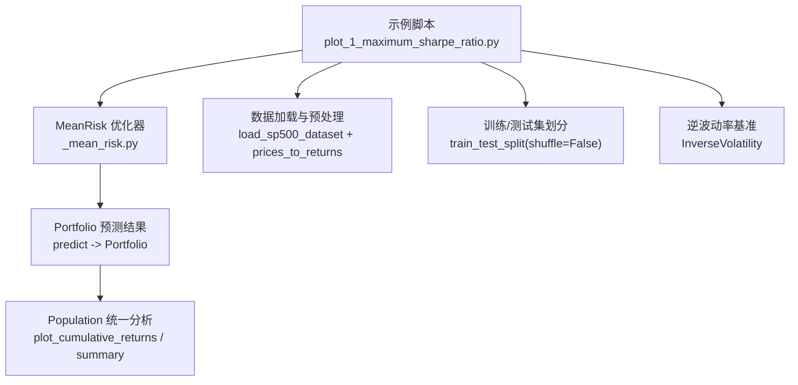
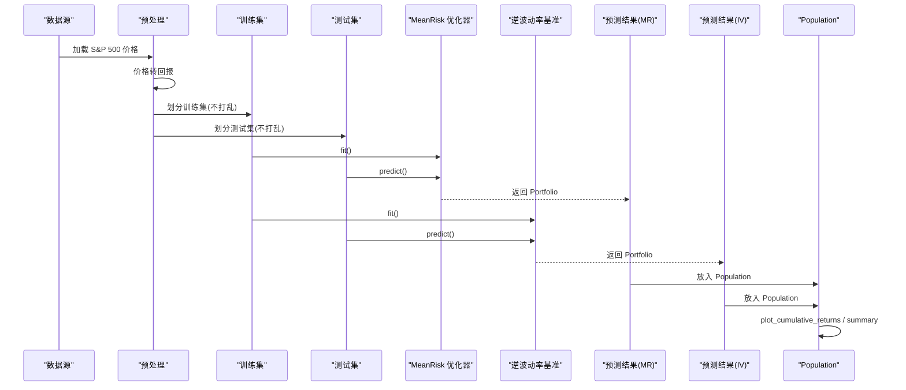
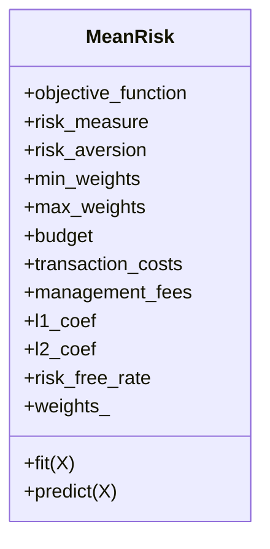
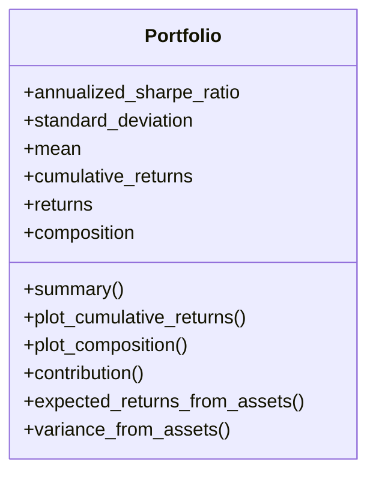
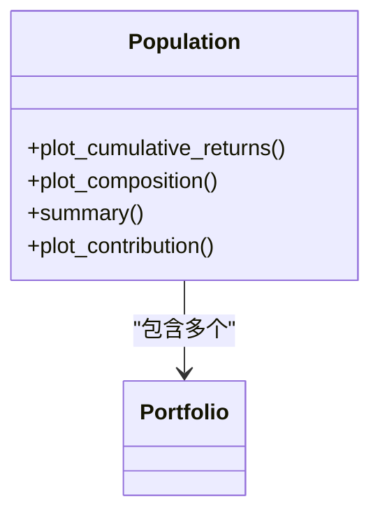
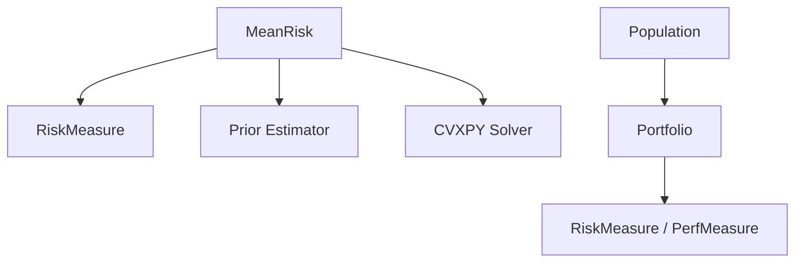

# 最大夏普比率优化

<cite>
**本文引用的文件列表**
- [plot_1_maximum_sharpe_ratio.py](file://examples/mean_risk/plot_1_maximum_sharpe_ratio.py)
- [MeanRisk 类](file://src/skfolio/optimization/convex/_mean_risk.py)
- [Portfolio 类](file://src/skfolio/portfolio/_portfolio.py)
- [Portfolio 基类](file://src/skfolio/portfolio/_base.py)
- [Population 类](file://src/skfolio/population/_population.py)
- [预期收益估计器](file://src/skfolio/moments/expected_returns/__init__.py)
- [协方差估计器](file://src/skfolio/moments/covariance/__init__.py)
- [用户指南：预期收益](file://docs/user_guide/expected_returns.rst)
- [用户指南：协方差](file://docs/user_guide/covariance.rst)
</cite>

## 目录
1. [简介](#简介)
2. [项目结构](#项目结构)
3. [核心组件](#核心组件)
4. [架构总览](#架构总览)
5. [详细组件分析](#详细组件分析)
6. [依赖关系分析](#依赖关系分析)
7. [性能考量](#性能考量)
8. [故障排查指南](#故障排查指南)
9. [结论](#结论)
10. [附录](#附录)

## 简介
本教程基于示例脚本 examples/mean_risk/plot_1_maximum_sharpe_ratio.py，系统讲解如何使用 MeanRisk 优化器构建“最大夏普比率”投资组合，并将其与逆波动率基准进行对比分析。教程覆盖以下关键主题：
- 目标函数设置：ObjectiveFunction.MAXIMIZE_RATIO
- 风险度量选择：标准差（RiskMeasure.STANDARD_DEVIATION）
- 训练集与测试集划分：避免数据泄露
- 模型拟合与预测流程：fit/predict 返回 Portfolio 对象
- Portfolio 对象的属性与方法：annualized_sharpe_ratio、plot_cumulative_returns、summary 等
- 与逆波动率基准的对比：在同一 Population 中统一分析
- 结合用户指南中 expected_returns 与 covariance 的内容，解释预期收益与协方差矩阵在优化中的作用

## 项目结构
该示例位于 examples/mean_risk 目录下，主要涉及以下模块：
- 优化器 MeanRisk：定义目标函数、风险度量、约束与求解
- 数据预处理：价格转为日度回报，划分训练/测试集
- 分析工具：Portfolio、Population 提供可视化与汇总分析
- 用户指南：expected_returns 与 covariance 的估计器说明

图表来源
- [plot_1_maximum_sharpe_ratio.py](file://examples/mean_risk/plot_1_maximum_sharpe_ratio.py#L1-L127)
- [MeanRisk 类](file://src/skfolio/optimization/convex/_mean_risk.py#L1-L1215)
- [Portfolio 类](file://src/skfolio/portfolio/_portfolio.py#L1-L989)
- [Population 类](file://src/skfolio/population/_population.py#L453-L876)

章节来源
- [plot_1_maximum_sharpe_ratio.py](file://examples/mean_risk/plot_1_maximum_sharpe_ratio.py#L1-L127)

## 核心组件
- MeanRisk 优化器：支持多种目标函数（最小化风险、最大化期望收益、最大化效用、最大化比率），可指定风险度量（标准差等），并内置预算、权重上下界、交易成本、管理费用、不确定性集合等高级功能。
- Portfolio：封装单个投资组合的回报序列、权重、统计指标与可视化方法，支持 annualized_sharpe_ratio、plot_cumulative_returns、summary 等。
- Population：对多个 Portfolio 进行批量分析与可视化，便于对比不同策略（如最大夏普比率 vs 逆波动率）。
- 预期收益与协方差估计器：用于提供优化所需的 μ 与 Σ，支持经验估计、收缩估计等多种方法。

章节来源
- [MeanRisk 类](file://src/skfolio/optimization/convex/_mean_risk.py#L1-L1215)
- [Portfolio 类](file://src/skfolio/portfolio/_portfolio.py#L1-L989)
- [Portfolio 基类](file://src/skfolio/portfolio/_base.py#L980-L1258)
- [Population 类](file://src/skfolio/population/_population.py#L453-L876)
- [预期收益估计器](file://src/skfolio/moments/expected_returns/__init__.py#L1-L19)
- [协方差估计器](file://src/skfolio/moments/covariance/__init__.py#L1-L30)

## 架构总览
下面的时序图展示了从数据到分析的完整流程：加载数据 → 转换为回报 → 划分训练/测试集 → 使用 MeanRisk 与逆波动率分别拟合并预测 → 将预测结果放入 Population 进行对比分析。

图表来源
- [plot_1_maximum_sharpe_ratio.py](file://examples/mean_risk/plot_1_maximum_sharpe_ratio.py#L1-L127)
- [MeanRisk 类](file://src/skfolio/optimization/convex/_mean_risk.py#L1-L1215)
- [Portfolio 类](file://src/skfolio/portfolio/_portfolio.py#L1-L989)
- [Population 类](file://src/skfolio/population/_population.py#L453-L876)

## 详细组件分析

### MeanRisk 优化器：目标函数与风险度量
- 目标函数设置：通过 objective_function=MAXIMIZE_RATIO 实现“最大化比率”优化，即最大化（期望超额收益）/（风险度量）。该优化形式直接对应夏普比率最大化（当风险度量为标准差且无无风险利率时）。
- 风险度量选择：risk_measure=STANDARD_DEVIATION 表示以标准差作为风险度量，符合夏普比率的定义。
- 其他能力：支持多种线性约束（预算、权重上下界、组约束等）、交易成本与管理费用、L1/L2 正则化、不确定性集合（worst-case）等，便于工程化落地。

图表来源
- [MeanRisk 类](file://src/skfolio/optimization/convex/_mean_risk.py#L1-L1215)

章节来源
- [MeanRisk 类](file://src/skfolio/optimization/convex/_mean_risk.py#L1-L1215)

### 数据准备与训练/测试划分
- 数据加载：使用内置 S&P 500 数据集，包含 20 只资产的日度价格序列。
- 回报转换：将价格转换为日度回报，确保与优化器的输入格式一致。
- 划分策略：采用时间序列不打乱的方式划分训练/测试集，避免数据泄露，保证回测的合理性。

章节来源
- [plot_1_maximum_sharpe_ratio.py](file://examples/mean_risk/plot_1_maximum_sharpe_ratio.py#L1-L127)

### 模型拟合与预测流程
- 模型初始化：设置 risk_measure=STANDARD_DEVIATION、objective_function=MAXIMIZE_RATIO，并通过 portfolio_params 为输出的 Portfolio 设置名称。
- 拟合：在训练集上调用 fit，内部完成优化问题的构建与求解。
- 预测：在测试集上调用 predict，返回一个 Portfolio 对象，其 returns 即为该策略在测试集上的逐期回报序列。

章节来源
- [plot_1_maximum_sharpe_ratio.py](file://examples/mean_risk/plot_1_maximum_sharpe_ratio.py#L1-L127)
- [MeanRisk 类](file://src/skfolio/optimization/convex/_mean_risk.py#L1-L1215)

### 逆波动率基准
- 使用 InverseVolatility 作为基准策略，其权重与 MeanRisk 不同，但同样通过 predict 返回 Portfolio，便于统一分析。
- 该基准常被用作“简单有效”的对照策略，有助于评估复杂优化策略是否具备显著的超额收益。

章节来源
- [plot_1_maximum_sharpe_ratio.py](file://examples/mean_risk/plot_1_maximum_sharpe_ratio.py#L1-L127)

### Portfolio 对象：属性与方法
Portfolio 是优化器 predict 的标准输出，封装了投资组合的回报、权重与各类统计指标，并提供丰富的可视化与汇总方法：
- 关键属性
  - annualized_sharpe_ratio：年化夏普比率
  - standard_deviation / variance：波动率与方差
  - mean / skew / kurtosis：均值、偏度、峰度
  - cumulative_returns / drawdowns：累计回报与回撤序列
- 关键方法
  - plot_cumulative_returns：绘制累计回报曲线（支持对数缩放，需 compounded=True）
  - plot_composition：绘制持仓权重条形图
  - summary：输出包含多类指标的汇总 Series
  - contribution：计算各资产对某指标的贡献
  - get_weight：按资产名查询权重
  - expected_returns_from_assets / variance_from_assets：从 μ 与 Σ 推导组合期望收益与方差

图表来源
- [Portfolio 类](file://src/skfolio/portfolio/_portfolio.py#L1-L989)
- [Portfolio 基类](file://src/skfolio/portfolio/_base.py#L980-L1258)

章节来源
- [Portfolio 类](file://src/skfolio/portfolio/_portfolio.py#L1-L989)
- [Portfolio 基类](file://src/skfolio/portfolio/_base.py#L980-L1258)

### Population 对象：多策略对比
- 将多个 Portfolio 放入 Population，即可统一进行对比分析：
  - plot_cumulative_returns：多策略累计回报对比
  - plot_composition：多策略权重分布对比
  - summary：多策略指标汇总
  - plot_contribution：多策略对指标的贡献对比

图表来源
- [Population 类](file://src/skfolio/population/_population.py#L453-L876)
- [Portfolio 类](file://src/skfolio/portfolio/_portfolio.py#L1-L989)

章节来源
- [Population 类](file://src/skfolio/population/_population.py#L453-L876)

### 预期收益与协方差在优化中的作用
- 预期收益（μ）与协方差（Σ）是 MeanRisk 优化的核心输入。优化器默认使用经验估计，也可通过 prior_estimator 自定义（例如收缩估计、均衡估计等），以提升稳定性与外样本表现。
- 用户指南提供了可用估计器的概览与示例，便于根据场景选择合适的估计方法。

章节来源
- [用户指南：预期收益](file://docs/user_guide/expected_returns.rst#L1-L36)
- [用户指南：协方差](file://docs/user_guide/covariance.rst#L1-L44)
- [MeanRisk 类](file://src/skfolio/optimization/convex/_mean_risk.py#L1-L1215)

## 依赖关系分析
- MeanRisk 依赖于风险度量枚举、先验估计器（Prior）、不确定性集合估计器（Mu/Covariance Uncertainty Set）与求解器（CVXPY）。
- Portfolio 依赖于度量模块（RiskMeasure、PerfMeasure 等）与工具函数（绘图、统计等）。
- Population 依赖于多个 Portfolio 的汇总与可视化接口。

图表来源
- [MeanRisk 类](file://src/skfolio/optimization/convex/_mean_risk.py#L1-L1215)
- [Portfolio 类](file://src/skfolio/portfolio/_portfolio.py#L1-L989)
- [Population 类](file://src/skfolio/population/_population.py#L453-L876)

章节来源
- [MeanRisk 类](file://src/skfolio/optimization/convex/_mean_risk.py#L1-L1215)
- [Portfolio 类](file://src/skfolio/portfolio/_portfolio.py#L1-L989)
- [Population 类](file://src/skfolio/population/_population.py#L453-L876)

## 性能考量
- 求解稳定性：建议使用 CLARABEL 等现代求解器，并合理设置数值容差参数。
- 数据规模：当资产数量较多或需要滚动窗口分析时，注意优化问题的规模与稀疏性，必要时引入正则化或不确定性集合。
- 可视化开销：Population 的批量绘图在大数据量下可能较慢，可按需选择子区间或关闭某些图层。

## 故障排查指南
- 夏普比率异常或 NaN
  - 检查 risk_free_rate 是否设置，以及 returns 是否存在 NaN。
  - 若波动率为零，会导致比率无定义；可通过增加正则化或使用更稳健的协方差估计缓解。
- 回测期间出现负收益或大幅回撤
  - 使用 Population.plot_drawdowns 或 Portfolio.plot_drawdowns 观察回撤路径，检查是否存在极端权重或杠杆过高。
- 对数尺度绘图报错
  - 当 compounded=False 时，plot_cumulative_returns 不允许 log_scale；请设置 compounded=True 后再启用对数轴。
- 数据泄露
  - 训练/测试划分必须保持时间顺序，避免打乱；否则会引入未来信息，导致过拟合。

章节来源
- [plot_1_maximum_sharpe_ratio.py](file://examples/mean_risk/plot_1_maximum_sharpe_ratio.py#L1-L127)
- [Portfolio 基类](file://src/skfolio/portfolio/_base.py#L980-L1038)
- [Population 类](file://src/skfolio/population/_population.py#L725-L791)

## 结论
通过本教程，我们系统掌握了如何使用 MeanRisk 优化器构建最大夏普比率投资组合，并与逆波动率基准进行对比分析。示例展示了从数据准备、模型拟合与预测，到 Portfolio 与 Population 的可视化与汇总分析的完整流程。结合用户指南中的 expected_returns 与 covariance 内容，可以进一步提升估计的稳健性与外样本表现。

## 附录
- 快速参考
  - 目标函数：MAXIMIZE_RATIO
  - 风险度量：STANDARD_DEVIATION
  - 输出对象：Portfolio（annualized_sharpe_ratio、plot_cumulative_returns、summary）
  - 对比工具：Population（plot_cumulative_returns、plot_composition、summary）