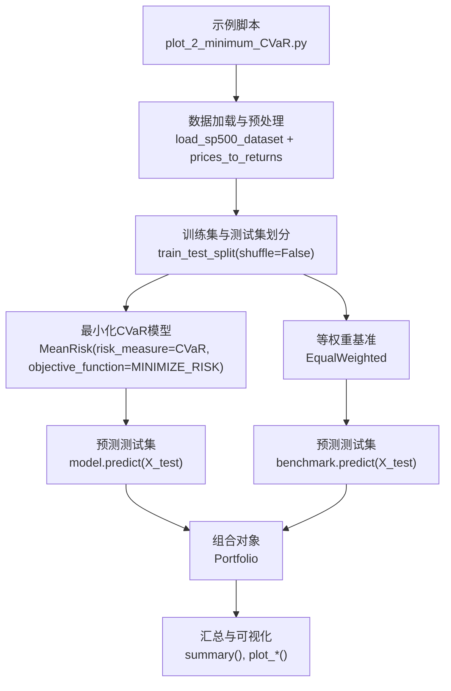
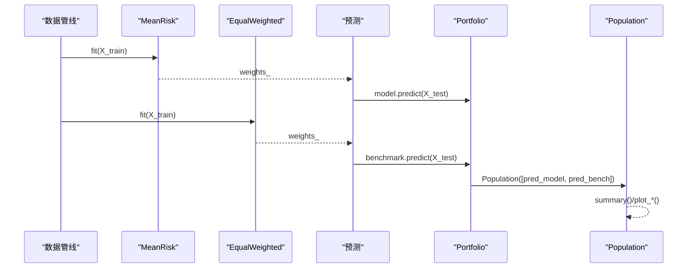
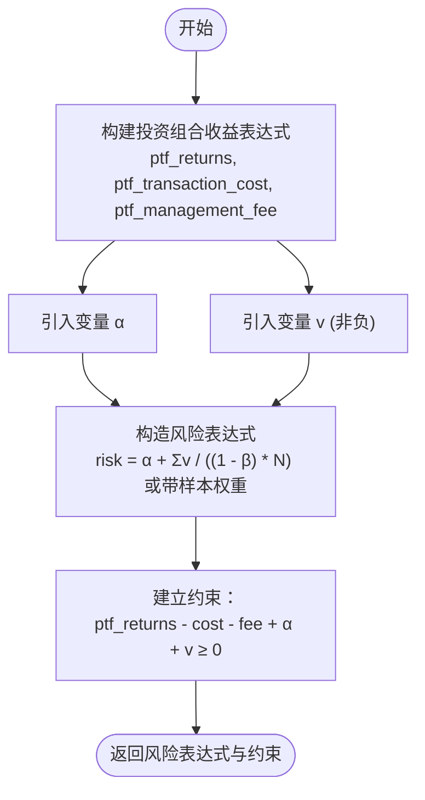
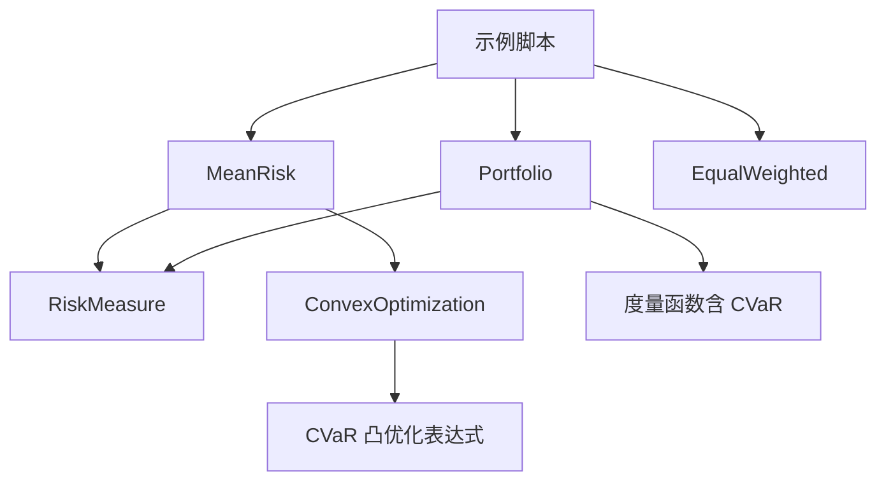

# 最小化条件风险价值（CVaR）

<cite>
**本文引用的文件**
- [examples/mean_risk/plot_2_minimum_CVaR.py](file://examples/mean_risk/plot_2_minimum_CVaR.py)
- [src/skfolio/optimization/convex/_mean_risk.py](file://src/skfolio/optimization/convex/_mean_risk.py)
- [src/skfolio/optimization/convex/_base.py](file://src/skfolio/optimization/convex/_base.py)
- [src/skfolio/measures/_enums.py](file://src/skfolio/measures/_enums.py)
- [src/skfolio/measures/_measures.py](file://src/skfolio/measures/_measures.py)
- [src/skfolio/portfolio/_portfolio.py](file://src/skfolio/portfolio/_portfolio.py)
</cite>

## 目录
1. [引言](#引言)
2. [项目结构](#项目结构)
3. [核心组件](#核心组件)
4. [架构总览](#架构总览)
5. [详细组件分析](#详细组件分析)
6. [依赖关系分析](#依赖关系分析)
7. [性能考量](#性能考量)
8. [故障排查指南](#故障排查指南)
9. [结论](#结论)
10. [附录](#附录)

## 引言
本教程围绕示例脚本“最小化CVaR”展开，系统讲解如何使用 MeanRisk 模型配置为最小化 CVaR 风险，并通过等权重基准进行对比分析。我们将解释 RiskMeasure.CVAR 的数学含义、在极端风险控制中的优势、模型参数设置（如 objective_function=MINIMIZE_RISK）以及在测试集上的绩效差异。同时，讨论 CVaR 在尾部风险管理中的应用场景与与其他风险度量的权衡。

## 项目结构
该示例位于 examples/mean_risk 目录下，核心流程包括：
- 数据准备：加载 S&P 500 价格数据并转换为日度线性收益，按时间顺序划分训练集与测试集。
- 模型构建：使用 MeanRisk 以 CVaR 作为风险度量、目标函数设为最小化风险。
- 基准构建：使用 EqualWeighted 构建等权重基准策略。
- 预测与分析：对测试集进行预测，输出最小 CVaR 组合与等权重组合的回测结果与汇总统计。

图表来源
- [examples/mean_risk/plot_2_minimum_CVaR.py](file://examples/mean_risk/plot_2_minimum_CVaR.py#L1-L128)

章节来源
- [examples/mean_risk/plot_2_minimum_CVaR.py](file://examples/mean_risk/plot_2_minimum_CVaR.py#L1-L128)

## 核心组件
- MeanRisk（均值-风险优化器）：支持多种目标函数与风险度量，本示例中选择 CVaR 与 MINIMIZE_RISK。
- RiskMeasure（风险度量枚举）：包含 CVaR 等多种风险度量，用于在优化器中选择具体度量。
- Portfolio（组合对象）：封装权重、收益序列与各类风险/收益指标，便于分析与可视化。
- EqualWeighted（等权重基准）：提供无参数的等权重策略，用于与最小化 CVaR 策略进行对比。

章节来源
- [src/skfolio/optimization/convex/_mean_risk.py](file://src/skfolio/optimization/convex/_mean_risk.py#L101-L138)
- [src/skfolio/measures/_enums.py](file://src/skfolio/measures/_enums.py#L105-L187)
- [src/skfolio/portfolio/_portfolio.py](file://src/skfolio/portfolio/_portfolio.py#L1-L200)
- [examples/mean_risk/plot_2_minimum_CVaR.py](file://examples/mean_risk/plot_2_minimum_CVaR.py#L38-L65)

## 架构总览
下图展示了从数据到优化再到预测与分析的整体流程，以及关键类之间的交互关系。

图表来源
- [examples/mean_risk/plot_2_minimum_CVaR.py](file://examples/mean_risk/plot_2_minimum_CVaR.py#L38-L116)
- [src/skfolio/optimization/convex/_mean_risk.py](file://src/skfolio/optimization/convex/_mean_risk.py#L649-L760)
- [src/skfolio/portfolio/_portfolio.py](file://src/skfolio/portfolio/_portfolio.py#L1-L200)

## 详细组件分析

### MeanRisk 配置与参数
- 目标函数：MINIMIZE_RISK（最小化所选风险度量）
- 风险度量：CVaR（条件风险价值）
- 其他常用参数（示例中未显式设置）：
  - prior_estimator：先验估计器，默认 EmpiricalPrior
  - cvar_beta：CVaR 置信水平，默认 0.95
  - min_weights/max_weights：权重上下界
  - budget/max_budget：预算约束
  - transaction_costs/management_fees：交易成本与管理费
  - l1_coef/l2_coef：L1/L2 正则化
  - risk_free_rate：无风险利率
  - max_* 约束：对其他风险度量的最大上限约束
  - 线性约束/分组约束/阈值约束：用于投资组合限制
  - solver/solver_params：求解器与参数
  - portfolio_params：传递给 Portfolio 的参数（如名称）

章节来源
- [src/skfolio/optimization/convex/_mean_risk.py](file://src/skfolio/optimization/convex/_mean_risk.py#L101-L138)
- [src/skfolio/optimization/convex/_mean_risk.py](file://src/skfolio/optimization/convex/_mean_risk.py#L509-L525)
- [src/skfolio/optimization/convex/_mean_risk.py](file://src/skfolio/optimization/convex/_mean_risk.py#L649-L760)

### CVaR 数学定义与凸优化实现
- 数学含义：CVaR（Conditional Value at Risk，条件风险价值或期望短差）是在给定置信水平 β 下，超过 VaR 的平均损失。它关注尾部分布的“平均”极端损失，对极值更敏感。
- 凸优化实现要点（来自 ConvexOptimization._cvar_risk）：
  - 新增变量 α 和 v（非负松弛变量），将 CVaR 表达为一个线性目标加上松弛项的加权和。
  - 约束将投资组合收益与交易成本/管理费、α、v 联系起来，确保在置信水平下的尾部损失被正确建模。
  - 支持样本权重（非均匀观测权重）时，松弛项的加权方式相应调整。
  - 置信水平由 cvar_beta 控制，默认 0.95。

图表来源
- [src/skfolio/optimization/convex/_base.py](file://src/skfolio/optimization/convex/_base.py#L1863-L1913)

章节来源
- [src/skfolio/optimization/convex/_base.py](file://src/skfolio/optimization/convex/_base.py#L1863-L1913)

### 风险度量枚举与 CVaR 定义
- RiskMeasure.CVAR 表示条件风险价值；RatioMeasure.CVAR_RATIO 表示以 CVaR 为分母的比率指标。
- CVaR 的“条件”含义体现在对尾部（最坏 (1-β)%）观测的平均损失计算。

章节来源
- [src/skfolio/measures/_enums.py](file://src/skfolio/measures/_enums.py#L105-L187)
- [src/skfolio/measures/_enums.py](file://src/skfolio/measures/_enums.py#L250-L307)

### Portfolio 对象与 CVaR 指标
- Portfolio 在预测后可直接访问 cvar 属性（对应 CVaR 指标），并支持汇总与可视化。
- 示例中通过 Population 将两个策略的预测结果合并，进行组合构成、累计收益等分析。

章节来源
- [examples/mean_risk/plot_2_minimum_CVaR.py](file://examples/mean_risk/plot_2_minimum_CVaR.py#L75-L116)
- [src/skfolio/portfolio/_portfolio.py](file://src/skfolio/portfolio/_portfolio.py#L1-L200)

### 等权重基准构建与比较
- 使用 EqualWeighted 构建等权重基准，fit 仅用于 API 一致性，不改变权重。
- 通过 Population 合并最小 CVaR 与等权重策略，在测试集上进行对比分析。

章节来源
- [examples/mean_risk/plot_2_minimum_CVaR.py](file://examples/mean_risk/plot_2_minimum_CVaR.py#L51-L65)

### 测试集绩效差异分析
- 示例脚本在测试集上分别输出最小 CVaR 与等权重策略的 CVaR 指标，并通过 Population.summary() 输出整体汇总。
- 结论指出：最小 CVaR 在大多数偏离与短缺类风险度量上优于等权重基准，但在某些比率与均值类指标上可能不及基准。

章节来源
- [examples/mean_risk/plot_2_minimum_CVaR.py](file://examples/mean_risk/plot_2_minimum_CVaR.py#L75-L116)

## 依赖关系分析
- MeanRisk 依赖 RiskMeasure 枚举与 ConvexOptimization 基类，后者提供 CVaR 的凸优化表达式。
- Portfolio 依赖 RiskMeasure 与各类度量函数，用于计算与展示 CVaR 等指标。
- 示例脚本串联了数据管线、优化器、基准与分析模块。

图表来源
- [src/skfolio/optimization/convex/_mean_risk.py](file://src/skfolio/optimization/convex/_mean_risk.py#L101-L138)
- [src/skfolio/optimization/convex/_base.py](file://src/skfolio/optimization/convex/_base.py#L1863-L1913)
- [src/skfolio/measures/_enums.py](file://src/skfolio/measures/_enums.py#L105-L187)
- [src/skfolio/measures/_measures.py](file://src/skfolio/measures/_measures.py#L596-L692)
- [examples/mean_risk/plot_2_minimum_CVaR.py](file://examples/mean_risk/plot_2_minimum_CVaR.py#L38-L116)

章节来源
- [src/skfolio/optimization/convex/_mean_risk.py](file://src/skfolio/optimization/convex/_mean_risk.py#L101-L138)
- [src/skfolio/optimization/convex/_base.py](file://src/skfolio/optimization/convex/_base.py#L1863-L1913)
- [src/skfolio/measures/_enums.py](file://src/skfolio/measures/_enums.py#L105-L187)
- [src/skfolio/measures/_measures.py](file://src/skfolio/measures/_measures.py#L596-L692)
- [examples/mean_risk/plot_2_minimum_CVaR.py](file://examples/mean_risk/plot_2_minimum_CVaR.py#L38-L116)

## 性能考量
- 求解稳定性：示例默认使用 CLARABEL 求解器，具备更好的数值稳定性和性能。
- 精度与缩放：可通过 scale_objective/scale_constraints 提升特定问题的精度。
- 复杂度：CVaR 的凸形式引入额外变量与约束，但整体仍保持凸性，适合大规模实证研究。
- 计算开销：Portfolio 的汇总与绘图操作在大数据集上需注意内存与渲染时间。

章节来源
- [src/skfolio/optimization/convex/_mean_risk.py](file://src/skfolio/optimization/convex/_mean_risk.py#L541-L565)

## 故障排查指南
- 求解失败：若 fit 抛错，可检查 solver 是否可用、参数是否合理（如预算/权重约束冲突）。示例提供了 fallback 机制与 raise_on_failure 控制。
- 数据泄漏：示例明确使用不打乱的时间序列划分，避免未来信息泄露。
- 样本权重：当使用带样本权重的 CVaR 时，需确保权重与观测一一对应且非负。

章节来源
- [examples/mean_risk/plot_2_minimum_CVaR.py](file://examples/mean_risk/plot_2_minimum_CVaR.py#L13-L18)
- [src/skfolio/optimization/convex/_mean_risk.py](file://src/skfolio/optimization/convex/_mean_risk.py#L566-L593)

## 结论
- 最小化 CVaR 能够有效降低尾部极端损失，尤其在关注下行风险与极端事件的场景中具有优势。
- 通过与等权重基准的对比，可以直观评估最小化 CVaR 在不同风险度量下的优劣。
- 实践中应结合置信水平（cvar_beta）、交易成本、管理费与各类约束，综合权衡风险与收益。

## 附录
- CVaR 的实现细节与凸优化表达式可参考 ConvexOptimization._cvar_risk。
- Portfolio 的 CVaR 指标与汇总功能可用于快速评估策略表现。

章节来源
- [src/skfolio/optimization/convex/_base.py](file://src/skfolio/optimization/convex/_base.py#L1863-L1913)
- [src/skfolio/portfolio/_portfolio.py](file://src/skfolio/portfolio/_portfolio.py#L1-L200)