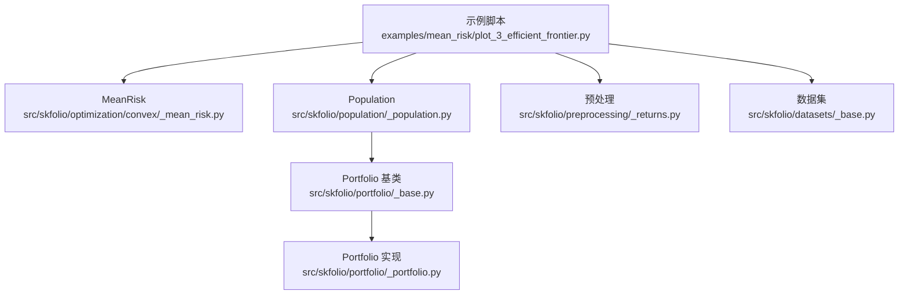
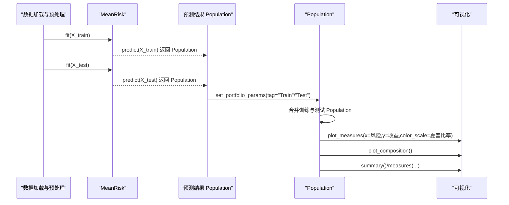
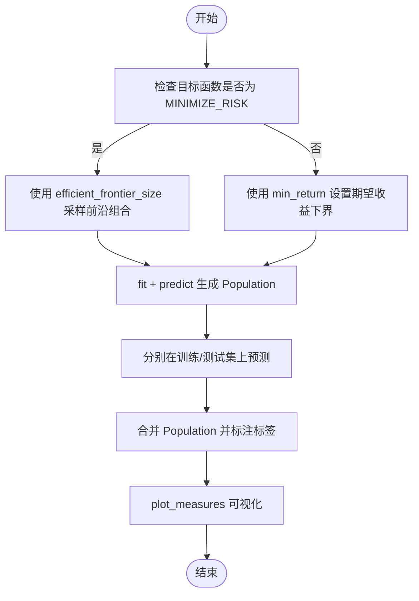
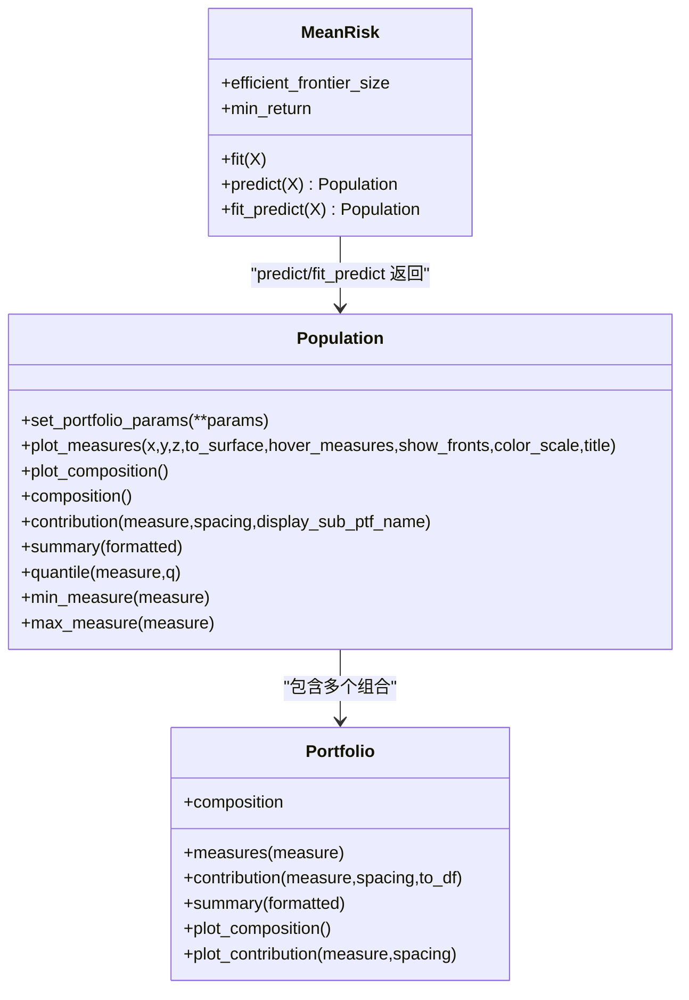
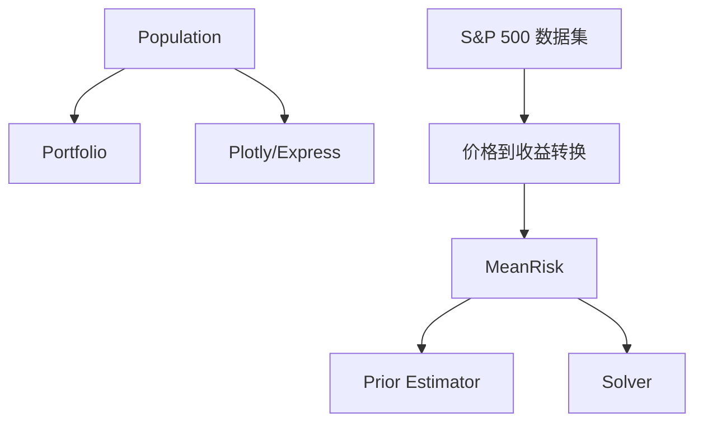

# 有效前沿生成与分析

<cite>
**本文引用的文件**
- [examples/mean_risk/plot_3_efficient_frontier.py](file://examples/mean_risk/plot_3_efficient_frontier.py)
- [src/skfolio/optimization/convex/_mean_risk.py](file://src/skfolio/optimization/convex/_mean_risk.py)
- [src/skfolio/population/_population.py](file://src/skfolio/population/_population.py)
- [src/skfolio/portfolio/_base.py](file://src/skfolio/portfolio/_base.py)
- [src/skfolio/portfolio/_portfolio.py](file://src/skfolio/portfolio/_portfolio.py)
- [src/skfolio/preprocessing/_returns.py](file://src/skfolio/preprocessing/_returns.py)
- [src/skfolio/datasets/_base.py](file://src/skfolio/datasets/_base.py)
- [tests/test_optimization/test_convex/test_mean_risk.py](file://tests/test_optimization/test_convex/test_mean_risk.py)
- [tests/test_population/test_population.py](file://tests/test_population/test_population.py)
</cite>

## 目录
1. [引言](#引言)
2. [项目结构](#项目结构)
3. [核心组件](#核心组件)
4. [架构总览](#架构总览)
5. [详细组件分析](#详细组件分析)
6. [依赖关系分析](#依赖关系分析)
7. [性能考虑](#性能考虑)
8. [故障排查指南](#故障排查指南)
9. [结论](#结论)
10. [附录](#附录)

## 引言
本教程围绕示例脚本 examples/mean_risk/plot_3_efficient_frontier.py，系统讲解如何使用 MeanRisk 生成均值-方差有效前沿，涵盖以下关键主题：
- efficient_frontier_size 参数的作用与适用条件
- 多组合 Population 对象的构建与可视化（plot_measures 方法）
- 通过 min_return 约束在给定收益目标下生成最优组合
- 不同组合在风险、收益与夏普比率上的权衡关系
- 训练集与测试集上的前沿对比及组合权重演化分析

## 项目结构
该示例位于 examples/mean_risk/plot_3_efficient_frontier.py，主要调用如下模块：
- MeanRisk：凸优化求解器，用于在指定目标函数与风险度量下生成组合权重
- Population：组合集合容器，提供统计汇总、可视化与贡献分析等能力
- 预处理与数据加载：价格到收益转换、S&P 500 数据集加载
- Portfolio 基类与具体实现：提供度量计算、贡献分解、滚动度量等

图表来源
- [examples/mean_risk/plot_3_efficient_frontier.py](file://examples/mean_risk/plot_3_efficient_frontier.py#L1-L104)
- [src/skfolio/optimization/convex/_mean_risk.py](file://src/skfolio/optimization/convex/_mean_risk.py#L150-L170)
- [src/skfolio/population/_population.py](file://src/skfolio/population/_population.py#L1-L200)
- [src/skfolio/preprocessing/_returns.py](file://src/skfolio/preprocessing/_returns.py#L1-L200)
- [src/skfolio/datasets/_base.py](file://src/skfolio/datasets/_base.py#L1-L200)
- [src/skfolio/portfolio/_base.py](file://src/skfolio/portfolio/_base.py#L32-L1257)
- [src/skfolio/portfolio/_portfolio.py](file://src/skfolio/portfolio/_portfolio.py#L867-L908)

章节来源
- [examples/mean_risk/plot_3_efficient_frontier.py](file://examples/mean_risk/plot_3_efficient_frontier.py#L1-L104)

## 核心组件
- MeanRisk（有效前沿生成器）
  - 支持多种目标函数与风险度量，其中 efficient_frontier_size 仅在 MINIMIZE_RISK 目标下生效，用于沿有效前沿采样固定数量的帕累托最优组合
  - 支持 min_return 下界约束，直接在给定期望收益阈值下求解最小化风险或最大化效用/比率问题
- Population（组合集合）
  - 提供 plot_measures 可视化二维/三维散点图，支持按标签着色、悬停信息、帕累托前沿高亮
  - 提供 composition、contribution、summary、quantile、min_measure、max_measure 等分析工具
- Portfolio（单组合）
  - 提供 measures 计算、贡献分解、滚动度量、汇总等能力，支撑 Population 的聚合分析

章节来源
- [src/skfolio/optimization/convex/_mean_risk.py](file://src/skfolio/optimization/convex/_mean_risk.py#L150-L170)
- [src/skfolio/population/_population.py](file://src/skfolio/population/_population.py#L911-L1120)
- [src/skfolio/portfolio/_base.py](file://src/skfolio/portfolio/_base.py#L32-L1257)
- [src/skfolio/portfolio/_portfolio.py](file://src/skfolio/portfolio/_portfolio.py#L867-L908)

## 架构总览
下图展示了从数据到有效前沿再到可视化的端到端流程。

图表来源
- [examples/mean_risk/plot_3_efficient_frontier.py](file://examples/mean_risk/plot_3_efficient_frontier.py#L30-L103)
- [src/skfolio/population/_population.py](file://src/skfolio/population/_population.py#L80-L113)
- [src/skfolio/population/_population.py](file://src/skfolio/population/_population.py#L911-L1120)

## 详细组件分析

### MeanRisk 有效前沿与参数详解
- efficient_frontier_size
  - 作用：在 MINIMIZE_RISK 目标下，沿有效前沿均匀采样固定数量的帕累托最优组合，便于后续可视化与对比
  - 限制：仅当 objective_function=MINIMIZE_RISK 时可用；其他目标（如 MAXIMIZE_RETURN、MAXIMIZE_UTILITY、MAXIMIZE_RATIO）不支持此参数
  - 示例路径：[examples/mean_risk/plot_3_efficient_frontier.py](file://examples/mean_risk/plot_3_efficient_frontier.py#L30-L53)
- min_return
  - 作用：为期望收益设置下界约束，使组合在满足最低回报要求的前提下最小化风险（或其他目标），适合“收益目标驱动”的投资策略
  - 输入：可为标量或数组，示例中使用了多个目标收益阈值
  - 示例路径：[examples/mean_risk/plot_3_efficient_frontier.py](file://examples/mean_risk/plot_3_efficient_frontier.py#L86-L103)
- 风险度量与目标函数
  - 示例默认使用方差作为风险度量，目标函数为 MINIMIZE_RISK
  - 其他风险度量与目标函数详见 MeanRisk 类文档与参数说明
  - 示例路径：[src/skfolio/optimization/convex/_mean_risk.py](file://src/skfolio/optimization/convex/_mean_risk.py#L150-L170)

图表来源
- [examples/mean_risk/plot_3_efficient_frontier.py](file://examples/mean_risk/plot_3_efficient_frontier.py#L30-L103)
- [src/skfolio/optimization/convex/_mean_risk.py](file://src/skfolio/optimization/convex/_mean_risk.py#L150-L170)

章节来源
- [src/skfolio/optimization/convex/_mean_risk.py](file://src/skfolio/optimization/convex/_mean_risk.py#L150-L170)
- [examples/mean_risk/plot_3_efficient_frontier.py](file://examples/mean_risk/plot_3_efficient_frontier.py#L30-L103)

### Population 对象的构建与可视化（plot_measures）
- 构建 Population
  - 使用 MeanRisk.fit_predict 或 predict 在训练/测试集上得到 Population
  - 通过 set_portfolio_params 给每个组合添加 tag（如 "Train"/"Test"），便于区分
  - 将训练与测试 Population 合并为一个整体进行统一分析
  - 示例路径：[examples/mean_risk/plot_3_efficient_frontier.py](file://examples/mean_risk/plot_3_efficient_frontier.py#L45-L69)
- plot_measures 可视化
  - 支持二维散点（x/y 轴为度量）、三维散点（z 轴为度量）与表面拟合（to_surface）
  - 支持 color_scale 按度量着色（如夏普比率），hover_measures 展示额外度量
  - show_fronts 可高亮帕累托前沿
  - 示例路径：[examples/mean_risk/plot_3_efficient_frontier.py](file://examples/mean_risk/plot_3_efficient_frontier.py#L60-L69)
- 组合权重演化与贡献分析
  - plot_composition 可展示各组合的资产权重分布
  - contribution/plot_contribution 可分析资产对某度量（如夏普比率）的边际贡献
  - 示例路径：[examples/mean_risk/plot_3_efficient_frontier.py](file://examples/mean_risk/plot_3_efficient_frontier.py#L71-L76)

图表来源
- [src/skfolio/optimization/convex/_mean_risk.py](file://src/skfolio/optimization/convex/_mean_risk.py#L150-L170)
- [src/skfolio/population/_population.py](file://src/skfolio/population/_population.py#L80-L113)
- [src/skfolio/population/_population.py](file://src/skfolio/population/_population.py#L911-L1120)
- [src/skfolio/portfolio/_base.py](file://src/skfolio/portfolio/_base.py#L32-L1257)
- [src/skfolio/portfolio/_portfolio.py](file://src/skfolio/portfolio/_portfolio.py#L867-L908)

章节来源
- [src/skfolio/population/_population.py](file://src/skfolio/population/_population.py#L80-L113)
- [src/skfolio/population/_population.py](file://src/skfolio/population/_population.py#L911-L1120)
- [src/skfolio/portfolio/_base.py](file://src/skfolio/portfolio/_base.py#L32-L1257)
- [src/skfolio/portfolio/_portfolio.py](file://src/skfolio/portfolio/_portfolio.py#L867-L908)

### 通过 min_return 约束生成特定收益目标下的最优组合
- 思路
  - 在 MINIMIZE_RISK 目标下，为每个期望收益阈值求解最小化风险的组合
  - 通过 min_return 传入一组收益下界，即可得到对应数量的组合
- 示例路径
  - [examples/mean_risk/plot_3_efficient_frontier.py](file://examples/mean_risk/plot_3_efficient_frontier.py#L86-L103)
- 验证与对比
  - 可使用 measures(...) 获取各组合的夏普比率，结合 plot_measures 进行对比
  - 参考测试用例中对夏普比率的验证逻辑
  - 示例路径：[tests/test_population/test_population.py](file://tests/test_population/test_population.py#L273-L306)

章节来源
- [examples/mean_risk/plot_3_efficient_frontier.py](file://examples/mean_risk/plot_3_efficient_frontier.py#L86-L103)
- [tests/test_population/test_population.py](file://tests/test_population/test_population.py#L273-L306)

### 风险、收益与夏普比率的权衡关系
- 可视化
  - 使用 plot_measures，以风险（如年化标准差）为 x 轴，收益（如年化均值）为 y 轴，颜色映射为夏普比率，直观呈现三者权衡
  - 示例路径：[examples/mean_risk/plot_3_efficient_frontier.py](file://examples/mean_risk/plot_3_efficient_frontier.py#L60-L69)
- 统计摘要
  - 使用 summary() 输出各组合的完整度量表，包括夏普比率的均值与标准差
  - 使用 measures_mean/measures_std 对整体表现进行聚合
  - 示例路径：[examples/mean_risk/plot_3_efficient_frontier.py](file://examples/mean_risk/plot_3_efficient_frontier.py#L81-L84)
- 测试验证
  - 参考测试用例中对夏普比率的均值、标准差与排序的断言
  - 示例路径：[tests/test_population/test_population.py](file://tests/test_population/test_population.py#L273-L306)

章节来源
- [examples/mean_risk/plot_3_efficient_frontier.py](file://examples/mean_risk/plot_3_efficient_frontier.py#L60-L84)
- [tests/test_population/test_population.py](file://tests/test_population/test_population.py#L273-L306)

### 训练集与测试集上的前沿对比及组合权重演化
- 前沿对比
  - 分别在训练与测试集上 fit + predict，得到两个 Population，分别标注 tag="Train"/"Test"，再合并进行统一可视化
  - 示例路径：[examples/mean_risk/plot_3_efficient_frontier.py](file://examples/mean_risk/plot_3_efficient_frontier.py#L45-L69)
- 权重演化
  - 使用 plot_composition 可观察各组合的资产权重分布差异
  - 使用 contribution/plot_contribution 分析资产对不同度量的贡献变化
  - 示例路径：[examples/mean_risk/plot_3_efficient_frontier.py](file://examples/mean_risk/plot_3_efficient_frontier.py#L71-L76)

章节来源
- [examples/mean_risk/plot_3_efficient_frontier.py](file://examples/mean_risk/plot_3_efficient_frontier.py#L45-L76)

## 依赖关系分析
- MeanRisk 依赖
  - prior_estimator（默认 EmpiricalPrior）估计期望收益与协方差矩阵
  - solver（默认 CLARABEL）求解凸优化问题
  - 可选正则化、交易成本、管理费用、不确定性集合等扩展项
- Population 依赖
  - Portfolio 基类提供度量计算与贡献分解
  - plotly/express 用于可视化
- 数据与预处理
  - S&P 500 数据集加载与价格到收益转换

图表来源
- [src/skfolio/optimization/convex/_mean_risk.py](file://src/skfolio/optimization/convex/_mean_risk.py#L540-L560)
- [src/skfolio/population/_population.py](file://src/skfolio/population/_population.py#L911-L1120)
- [src/skfolio/preprocessing/_returns.py](file://src/skfolio/preprocessing/_returns.py#L1-L200)
- [src/skfolio/datasets/_base.py](file://src/skfolio/datasets/_base.py#L1-L200)

章节来源
- [src/skfolio/optimization/convex/_mean_risk.py](file://src/skfolio/optimization/convex/_mean_risk.py#L540-L560)
- [src/skfolio/population/_population.py](file://src/skfolio/population/_population.py#L911-L1120)
- [src/skfolio/preprocessing/_returns.py](file://src/skfolio/preprocessing/_returns.py#L1-L200)
- [src/skfolio/datasets/_base.py](file://src/skfolio/datasets/_base.py#L1-L200)

## 性能考虑
- efficient_frontier_size 的取值
  - 数量越大，计算时间越长；建议根据实际需求选择合适规模
- min_return 的数量
  - 多个收益阈值会增加优化次数；可通过合理设置阈值范围平衡精度与效率
- 可视化开销
  - plot_measures 的 to_surface 与 3D 散点会增加渲染时间；在大规模 Population 上谨慎使用
- 求解器与数值稳定性
  - 默认 CLARABEL 在稳定性与性能方面表现良好；若遇到收敛问题，可调整 solver_params 或切换 solver

## 故障排查指南
- 未设置 efficient_frontier_size 导致的异常
  - 当 objective_function 非 MINIMIZE_RISK 时，不应传入 efficient_frontier_size
  - 参考测试用例对参数组合的正确性验证
  - 示例路径：[tests/test_optimization/test_convex/test_mean_risk.py](file://tests/test_optimization/test_convex/test_mean_risk.py#L614-L620)
- 夏普比率相关断言失败
  - 若 Population 中存在失败组合，可能影响整体统计；可先过滤失败组合或检查 prior/solver 设置
  - 示例路径：[tests/test_population/test_population.py](file://tests/test_population/test_population.py#L273-L306)
- 可视化报错
  - 确保 Population 非空且各组合具备所需度量；检查 hover_measures 与 color_scale 是否为合法度量
  - 示例路径：[src/skfolio/population/_population.py](file://src/skfolio/population/_population.py#L911-L1120)

章节来源
- [tests/test_optimization/test_convex/test_mean_risk.py](file://tests/test_optimization/test_convex/test_mean_risk.py#L614-L620)
- [tests/test_population/test_population.py](file://tests/test_population/test_population.py#L273-L306)
- [src/skfolio/population/_population.py](file://src/skfolio/population/_population.py#L911-L1120)

## 结论
通过 MeanRisk 与 Population 的协同使用，可以高效地生成并分析均值-方差有效前沿。efficient_frontier_size 适用于 MINIMIZE_RISK 目标下的前沿采样，而 min_return 则能直接在收益目标约束下寻找最优组合。借助 Population 的 plot_measures、composition、contribution 与 summary 等工具，能够全面刻画不同组合在风险、收益与夏普比率之间的权衡关系，并进行训练/测试集对比与权重演化分析。

## 附录
- 关键 API 路径参考
  - MeanRisk.fit / predict / fit_predict：[examples/mean_risk/plot_3_efficient_frontier.py](file://examples/mean_risk/plot_3_efficient_frontier.py#L30-L53)
  - Population.plot_measures：[src/skfolio/population/_population.py](file://src/skfolio/population/_population.py#L911-L1120)
  - Population.plot_composition：[src/skfolio/population/_population.py](file://src/skfolio/population/_population.py#L837-L862)
  - Portfolio.contribution/summary：[src/skfolio/portfolio/_base.py](file://src/skfolio/portfolio/_base.py#L32-L1257), [src/skfolio/portfolio/_portfolio.py](file://src/skfolio/portfolio/_portfolio.py#L867-L908)
  - 数据加载与预处理：[src/skfolio/datasets/_base.py](file://src/skfolio/datasets/_base.py#L1-L200), [src/skfolio/preprocessing/_returns.py](file://src/skfolio/preprocessing/_returns.py#L1-L200)