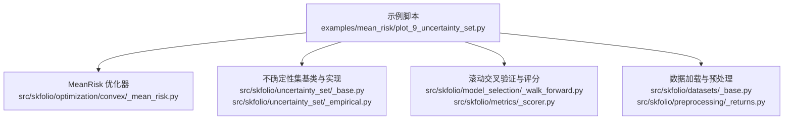
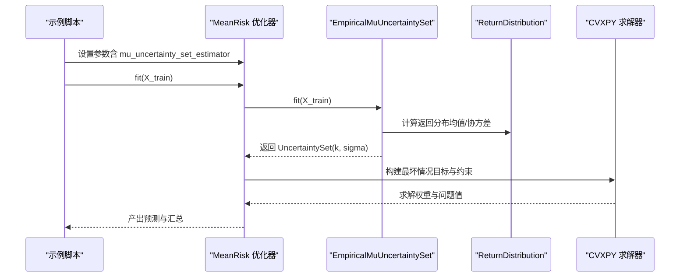
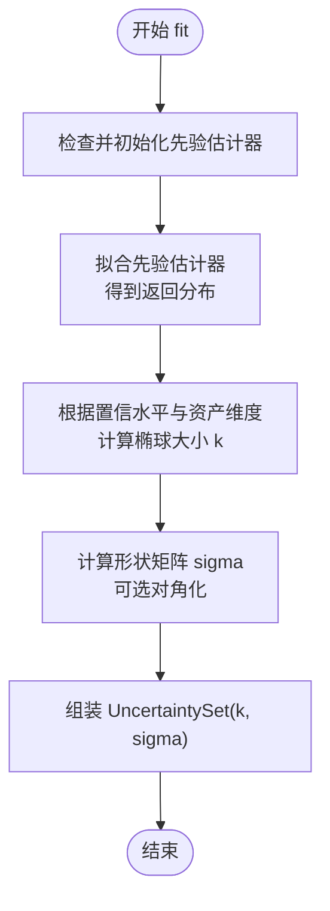
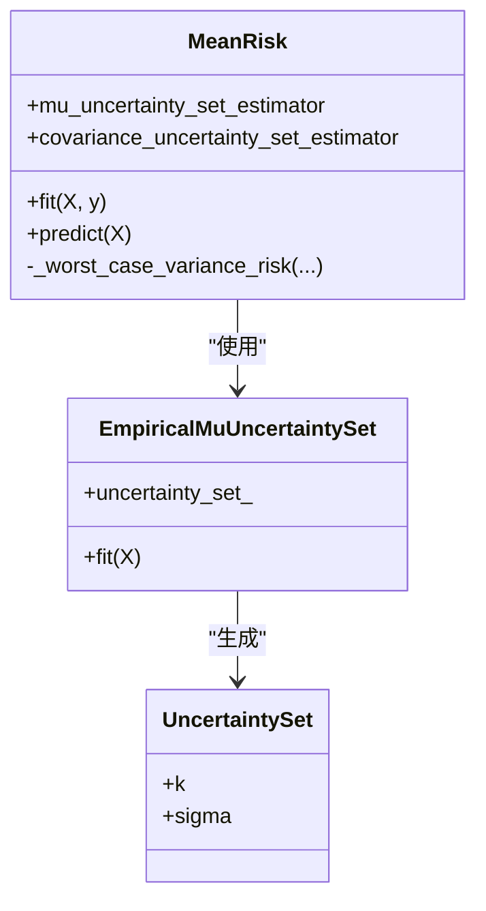
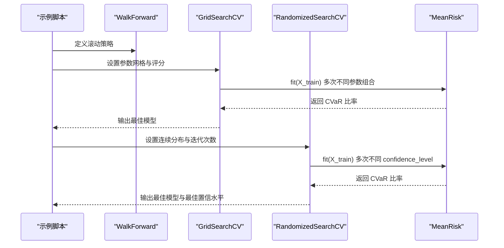
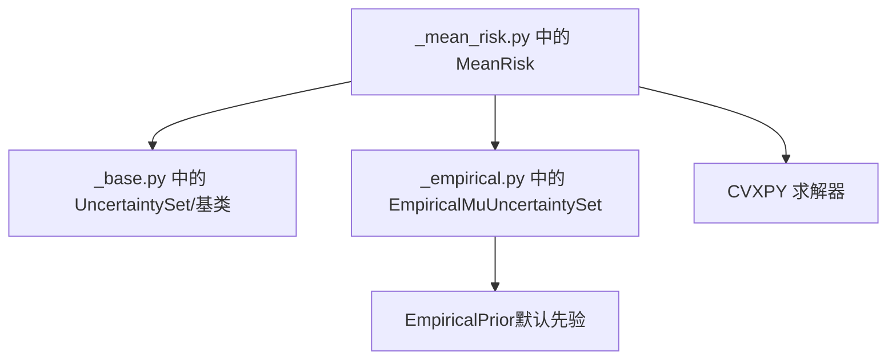

# 预期收益不确定性集集成

<cite>
**本文引用的文件**
- [examples/mean_risk/plot_9_uncertainty_set.py](file://examples/mean_risk/plot_9_uncertainty_set.py)
- [src/skfolio/optimization/convex/_base.py](file://src/skfolio/optimization/convex/_base.py)
- [src/skfolio/optimization/convex/_mean_risk.py](file://src/skfolio/optimization/convex/_mean_risk.py)
- [src/skfolio/uncertainty_set/_empirical.py](file://src/skfolio/uncertainty_set/_empirical.py)
- [src/skfolio/uncertainty_set/_base.py](file://src/skfolio/uncertainty_set/_base.py)
- [src/skfolio/uncertainty_set/_bootstrap.py](file://src/skfolio/uncertainty_set/_bootstrap.py)
- [tests/test_optimization/test_convex/test_mean_risk.py](file://tests/test_optimization/test_convex/test_mean_risk.py)
- [tests/test_uncertainty_set/test_empirical.py](file://tests/test_uncertainty_set/test_empirical.py)
- [docs/user_guide/hyper_parameters_tuning.rst](file://docs/user_guide/hyper_parameters_tuning.rst)
</cite>

## 目录
1. [引言](#引言)
2. [项目结构](#项目结构)
3. [核心组件](#核心组件)
4. [架构总览](#架构总览)
5. [详细组件分析](#详细组件分析)
6. [依赖关系分析](#依赖关系分析)
7. [性能考量](#性能考量)
8. [故障排查指南](#故障排查指南)
9. [结论](#结论)
10. [附录](#附录)

## 引言
本高级教程围绕 MeanRisk 优化中“预期收益不确定性集”的集成展开，系统讲解如何使用 EmpiricalMuUncertaintySet 构建椭球不确定性集，将其纳入最坏情况（worst-case）优化框架，从而降低预期收益估计误差带来的不稳定性和过拟合风险。教程同时演示如何通过 GridSearchCV 与 RandomizedSearchCV 对不确定性集置信水平等超参数进行调优，并可视化搜索结果；最后在测试集上对比“含不确定性集”与“不含不确定性集”的模型表现，突出鲁棒性与稳定性优势。

## 项目结构
该示例位于 examples/mean_risk/plot_9_uncertainty_set.py，结合了 MeanRisk 优化器、不确定性集估计器、滚动交叉验证与评分器等模块，形成从数据准备到超参数搜索再到多期回测评估的完整流程。

图表来源
- [examples/mean_risk/plot_9_uncertainty_set.py](file://examples/mean_risk/plot_9_uncertainty_set.py#L1-L232)
- [src/skfolio/optimization/convex/_mean_risk.py](file://src/skfolio/optimization/convex/_mean_risk.py#L1020-L1215)
- [src/skfolio/uncertainty_set/_base.py](file://src/skfolio/uncertainty_set/_base.py#L1-L133)
- [src/skfolio/uncertainty_set/_empirical.py](file://src/skfolio/uncertainty_set/_empirical.py#L1-L298)

章节来源
- [examples/mean_risk/plot_9_uncertainty_set.py](file://examples/mean_risk/plot_9_uncertainty_set.py#L1-L232)

## 核心组件
- MeanRisk 优化器：支持多种目标函数与风险度量，可选地接入“预期收益不确定性集”与“协方差不确定性集”，实现最坏情况优化。
- EmpiricalMuUncertaintySet：基于样本均值估计的椭球不确定性集，通过卡方分布分位数确定椭球大小，通过经验协方差矩阵或其对角化版本确定形状。
- 不确定性集基类：定义统一的数据结构 UncertaintySet（包含大小 k 与形状 sigma），并提供抽象基类 BaseMuUncertaintySet/BaseCovarianceUncertaintySet。
- 超参数搜索：使用 GridSearchCV 与 RandomizedSearchCV 在滚动时间窗上进行嵌入式参数搜索，评分采用 RatioMeasure.CVAR_RATIO。

章节来源
- [src/skfolio/optimization/convex/_base.py](file://src/skfolio/optimization/convex/_base.py#L290-L330)
- [src/skfolio/optimization/convex/_mean_risk.py](file://src/skfolio/optimization/convex/_mean_risk.py#L1020-L1215)
- [src/skfolio/uncertainty_set/_empirical.py](file://src/skfolio/uncertainty_set/_empirical.py#L1-L298)
- [src/skfolio/uncertainty_set/_base.py](file://src/skfolio/uncertainty_set/_base.py#L1-L133)
- [docs/user_guide/hyper_parameters_tuning.rst](file://docs/user_guide/hyper_parameters_tuning.rst#L1-L139)

## 架构总览
下图展示了 MeanRisk 优化器在启用“预期收益不确定性集”时的整体调用链：优化器在构建目标函数与约束时，注入最坏情况下的预期收益项；不确定性集估计器在 fit 过程中计算椭球大小与形状，并在优化过程中被传递给风险度量函数。

图表来源
- [examples/mean_risk/plot_9_uncertainty_set.py](file://examples/mean_risk/plot_9_uncertainty_set.py#L113-L163)
- [src/skfolio/optimization/convex/_mean_risk.py](file://src/skfolio/optimization/convex/_mean_risk.py#L1020-L1215)
- [src/skfolio/uncertainty_set/_empirical.py](file://src/skfolio/uncertainty_set/_empirical.py#L108-L155)

## 详细组件分析

### 1) 最坏情况下的预期收益计算公式推导
- 原理概述
  - 当引入“预期收益不确定性集”时，优化问题从“期望收益最大化”变为“最坏情况下预期收益最大化”。最坏情况下的预期收益为：
    - w^T·μ − κ_μ · ||S_μ^(1/2) · w||_2
  - 其中：
    - μ 是样本估计的预期收益向量；
    - κ_μ 是由置信水平 β 通过卡方分布分位数确定的椭球大小；
    - S_μ 是椭球形状矩阵（通常由经验协方差或其对角化形式决定）；
    - w 是投资组合权重向量。
- 数学依据
  - EmpiricalMuUncertaintySet 的椭球定义与 k、sigma 的计算方式见实现注释与公式。
  - MeanRisk 文档注释明确给出了最坏情况下的预期收益表达式。

章节来源
- [src/skfolio/optimization/convex/_base.py](file://src/skfolio/optimization/convex/_base.py#L290-L330)
- [src/skfolio/uncertainty_set/_empirical.py](file://src/skfolio/uncertainty_set/_empirical.py#L26-L72)
- [src/skfolio/optimization/convex/_mean_risk.py](file://src/skfolio/optimization/convex/_mean_risk.py#L1020-L1215)

### 2) EmpiricalMuUncertaintySet 的工作原理
- 输入输出
  - 输入：资产日度/周期性收益矩阵 X；
  - 输出：UncertaintySet 实例（包含 k 与 sigma）。
- 计算步骤
  - 使用先验估计器（默认 EmpiricalPrior）得到返回分布（含均值与协方差）；
  - 以置信水平 β 与资产维度 n_assets 计算椭球大小 k（卡方分位数平方根）；
  - 以有效观测数 n_eff 与协方差矩阵构造形状 sigma（可选择仅保留对角元素）；
  - 将 k 与 sigma 组装为 UncertaintySet 并保存。
- 关键点
  - n_eff 可用于模拟不同窗口长度或加权估计的有效样本量；
  - diagonal=True 可简化形状矩阵，提高数值稳定性。

图表来源
- [src/skfolio/uncertainty_set/_empirical.py](file://src/skfolio/uncertainty_set/_empirical.py#L108-L155)

章节来源
- [src/skfolio/uncertainty_set/_empirical.py](file://src/skfolio/uncertainty_set/_empirical.py#L1-L298)

### 3) MeanRisk 优化器中的不确定性集集成
- 参数入口
  - mu_uncertainty_set_estimator：传入 EmpiricalMuUncertaintySet 实例；
  - 可选 covariance_uncertainty_set_estimator：用于协方差不确定性集（本教程聚焦于预期收益）。
- 内部流程
  - 在优化构建阶段，若提供不确定性集，则在目标函数中加入最坏情况下的预期收益惩罚项；
  - 对于特定风险度量（如方差），会切换到对应的“最坏情况风险”函数；
  - 不确定性集在 fit 时被克隆并拟合，然后作为参数传入风险度量函数。
- 行为验证
  - 单元测试表明：启用不确定性集后，优化目标与权重会发生变化，体现鲁棒性提升。

图表来源
- [src/skfolio/optimization/convex/_base.py](file://src/skfolio/optimization/convex/_base.py#L290-L330)
- [src/skfolio/optimization/convex/_mean_risk.py](file://src/skfolio/optimization/convex/_mean_risk.py#L1020-L1215)
- [src/skfolio/uncertainty_set/_empirical.py](file://src/skfolio/uncertainty_set/_empirical.py#L108-L155)
- [src/skfolio/uncertainty_set/_base.py](file://src/skfolio/uncertainty_set/_base.py#L1-L133)

章节来源
- [src/skfolio/optimization/convex/_base.py](file://src/skfolio/optimization/convex/_base.py#L290-L330)
- [src/skfolio/optimization/convex/_mean_risk.py](file://src/skfolio/optimization/convex/_mean_risk.py#L1020-L1215)
- [tests/test_optimization/test_convex/test_mean_risk.py](file://tests/test_optimization/test_convex/test_mean_risk.py#L704-L750)

### 4) 超参数调优：GridSearchCV 与 RandomizedSearchCV
- 目标
  - 在训练集上通过滚动时间窗（WalkForward）对以下参数进行搜索：
    - max_cvar：CVaR 上限约束；
    - cvar_beta：CVaR 置信水平；
    - mu_uncertainty_set_estimator__confidence_level：预期收益不确定性集置信水平。
- 方法
  - GridSearchCV：穷举搜索离散候选组合；
  - RandomizedSearchCV：对连续参数（如 confidence_level）进行随机采样，更充分探索参数空间。
- 评分
  - 使用 RatioMeasure.CVAR_RATIO 作为评分指标，最大化平均 CVaR 比率以提升稳健性。
- 结果可视化
  - 将不同置信水平下的测试平均得分绘制成折线图，并标注最佳阈值。

图表来源
- [examples/mean_risk/plot_9_uncertainty_set.py](file://examples/mean_risk/plot_9_uncertainty_set.py#L113-L202)
- [docs/user_guide/hyper_parameters_tuning.rst](file://docs/user_guide/hyper_parameters_tuning.rst#L1-L139)

章节来源
- [examples/mean_risk/plot_9_uncertainty_set.py](file://examples/mean_risk/plot_9_uncertainty_set.py#L113-L202)
- [docs/user_guide/hyper_parameters_tuning.rst](file://docs/user_guide/hyper_parameters_tuning.rst#L1-L139)

### 5) 测试集对比与过拟合防护
- 流程
  - 使用 cross_val_predict 在测试集上生成多期滚动预测；
  - 对比三组模型：无不确定性集、网格搜索最佳、随机搜索最佳；
  - 可视化累计收益曲线与摘要统计，观察 CVaR、Mean/CVaR 比率等指标。
- 结论
  - 含不确定性集的模型通常在测试集上表现更稳健，避免过度拟合训练集特征，CVaR 更低，比率更高。

章节来源
- [examples/mean_risk/plot_9_uncertainty_set.py](file://examples/mean_risk/plot_9_uncertainty_set.py#L205-L232)

## 依赖关系分析
- 组件耦合
  - MeanRisk 与不确定性集估计器之间通过参数注入与内部 fit/clone 机制耦合；
  - 不确定性集估计器依赖先验估计器（默认 EmpiricalPrior）输出返回分布；
  - 风险度量函数在启用不确定性集时切换至“最坏情况”版本。
- 外部依赖
  - 使用 scipy.stats 进行卡方分位数计算；
  - 使用 CVXPY 构建并求解凸优化问题。

图表来源
- [src/skfolio/optimization/convex/_mean_risk.py](file://src/skfolio/optimization/convex/_mean_risk.py#L1020-L1215)
- [src/skfolio/uncertainty_set/_empirical.py](file://src/skfolio/uncertainty_set/_empirical.py#L108-L155)
- [src/skfolio/uncertainty_set/_base.py](file://src/skfolio/uncertainty_set/_base.py#L1-L133)

章节来源
- [src/skfolio/optimization/convex/_mean_risk.py](file://src/skfolio/optimization/convex/_mean_risk.py#L1020-L1215)
- [src/skfolio/uncertainty_set/_empirical.py](file://src/skfolio/uncertainty_set/_empirical.py#L1-L298)
- [src/skfolio/uncertainty_set/_base.py](file://src/skfolio/uncertainty_set/_base.py#L1-L133)

## 性能考量
- 计算复杂度
  - 不确定性集的引入会增加优化变量与约束数量（例如最坏情况方差风险的半正定扩展），但整体仍保持凸优化框架，求解稳定。
- 数值稳定性
  - diagonal=True 可显著降低形状矩阵维度与病态程度，提升稳定性；
  - n_eff 的合理设置有助于缓解小样本偏差。
- 并行与缓存
  - GridSearchCV/RandomizedSearchCV 支持 n_jobs 并行；
  - 优化器内部对 CVXPY 问题可配置缓存与求解器参数以提升性能。

## 故障排查指南
- 常见问题
  - 未设置置信水平导致椭球大小异常：确保为 EmpiricalMuUncertaintySet 提供合理的 confidence_level；
  - 数据维度与置信水平不匹配：卡方分位数要求资产维度大于等于 1；
  - 求解失败：检查约束是否过严（如 max_cvar 过小）、风险度量是否与目标函数一致。
- 单元测试参考
  - 测试显示启用不确定性集后，权重与目标值发生变化，验证了鲁棒性效果；
  - 对比不同置信水平下的表现，辅助定位参数敏感区域。

章节来源
- [tests/test_optimization/test_convex/test_mean_risk.py](file://tests/test_optimization/test_convex/test_mean_risk.py#L704-L750)
- [tests/test_uncertainty_set/test_empirical.py](file://tests/test_uncertainty_set/test_empirical.py#L1-L245)

## 结论
通过在 MeanRisk 优化中集成 EmpiricalMuUncertaintySet，可以将预期收益估计误差纳入最坏情况优化框架，有效降低过拟合风险并提升外样本稳定性。结合滚动交叉验证与 RatioMeasure.CVAR_RATIO 的超参数搜索，能够自动识别鲁棒的置信水平与风险约束组合。测试集对比进一步证实了不确定性集在实际应用中的价值。

## 附录
- 相关实现与接口
  - MeanRisk 参数说明与最坏情况预期收益公式参见：
    - [src/skfolio/optimization/convex/_base.py](file://src/skfolio/optimization/convex/_base.py#L290-L330)
  - EmpiricalMuUncertaintySet 的实现细节与公式：
    - [src/skfolio/uncertainty_set/_empirical.py](file://src/skfolio/uncertainty_set/_empirical.py#L26-L72)
  - MeanRisk 内部对不确定性集的集成与最坏情况风险函数：
    - [src/skfolio/optimization/convex/_mean_risk.py](file://src/skfolio/optimization/convex/_mean_risk.py#L1020-L1215)
  - 示例脚本中的超参数搜索与可视化：
    - [examples/mean_risk/plot_9_uncertainty_set.py](file://examples/mean_risk/plot_9_uncertainty_set.py#L113-L232)
  - 超参数搜索用户指南：
    - [docs/user_guide/hyper_parameters_tuning.rst](file://docs/user_guide/hyper_parameters_tuning.rst#L1-L139)