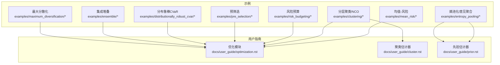
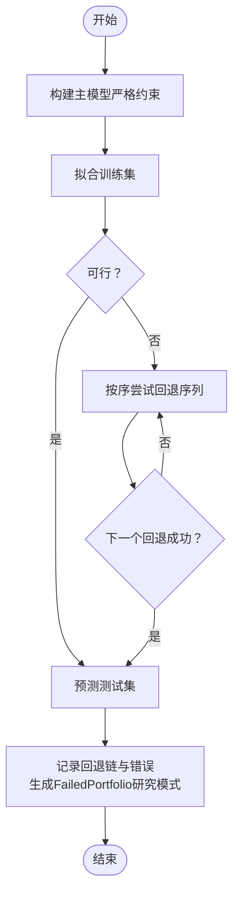
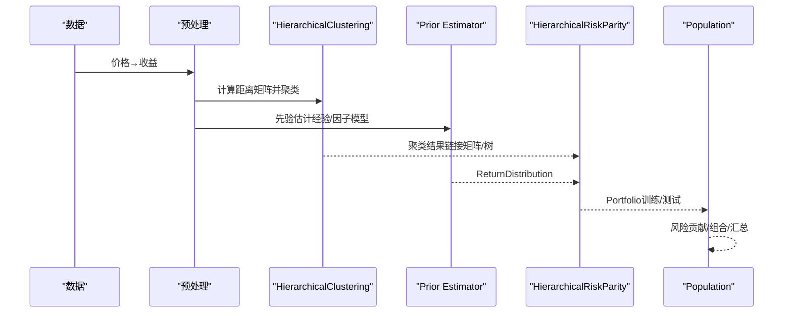
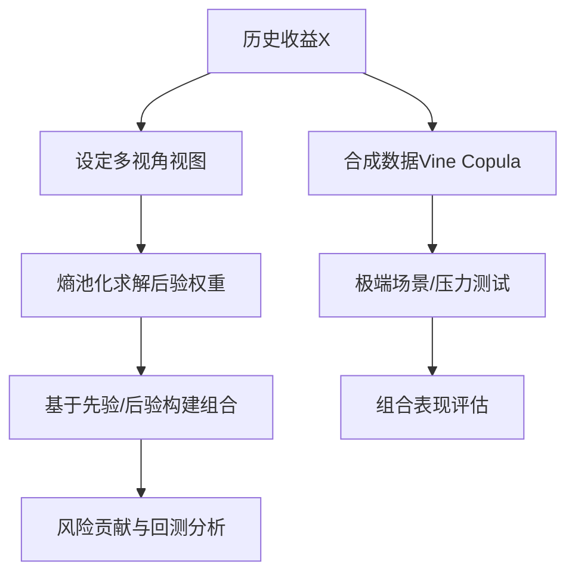
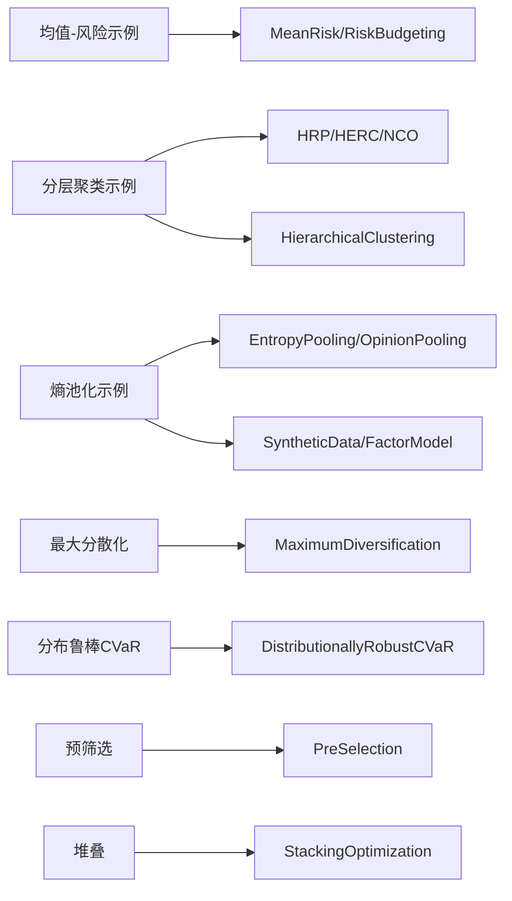

# 教程与示例

<cite>
**本文引用的文件列表**
- [examples/README.txt](file://examples/README.txt)
- [examples/mean_risk/README.txt](file://examples/mean_risk/README.txt)
- [examples/mean_risk/plot_1_maximum_sharpe_ratio.py](file://examples/mean_risk/plot_1_maximum_sharpe_ratio.py)
- [examples/mean_risk/plot_17_failure_and_fallbacks.py](file://examples/mean_risk/plot_17_failure_and_fallbacks.py)
- [examples/clustering/README.txt](file://examples/clustering/README.txt)
- [examples/clustering/plot_1_hrp_cvar.py](file://examples/clustering/plot_1_hrp_cvar.py)
- [examples/risk_budgeting/README.txt](file://examples/risk_budgeting/README.txt)
- [examples/risk_budgeting/plot_1_risk_parity_variance.py](file://examples/risk_budgeting/plot_1_risk_parity_variance.py)
- [examples/entropy_pooling/README.txt](file://examples/entropy_pooling/README.txt)
- [examples/entropy_pooling/plot_1_entropy_pooling.py](file://examples/entropy_pooling/plot_1_entropy_pooling.py)
- [examples/pre_selection/plot_1_drop_correlated.py](file://examples/pre_selection/plot_1_drop_correlated.py)
- [examples/distributionally_robust_cvar/plot_1_distributionally_robust_cvar.py](file://examples/distributionally_robust_cvar/plot_1_distributionally_robust_cvar.py)
- [examples/ensemble/plot_1_stacking.py](file://examples/ensemble/plot_1_stacking.py)
- [examples/maximum_diversification/plot_1_maximum_diversification.py](file://examples/maximum_diversification/plot_1_maximum_diversification.py)
- [docs/user_guide/optimization.rst](file://docs/user_guide/optimization.rst)
- [docs/user_guide/cluster.rst](file://docs/user_guide/cluster.rst)
- [docs/user_guide/prior.rst](file://docs/user_guide/prior.rst)
</cite>

## 目录
1. [引言](#引言)
2. [项目结构](#项目结构)
3. [核心组件](#核心组件)
4. [架构总览](#架构总览)
5. [详细组件分析](#详细组件分析)
6. [依赖关系分析](#依赖关系分析)
7. [性能考虑](#性能考虑)
8. [故障排查指南](#故障排查指南)
9. [结论](#结论)
10. [附录：可下载的Jupyter Notebook说明](#附录可下载的jupyter-notebook说明)

## 引言
本教程以skfolio库的示例脚本为基础，系统化地拆解并讲解五大核心主题：
- 均值-风险优化：从最大夏普比率到跟踪误差、费用与不确定性集等高级主题
- 分层聚类与嵌套聚类：HRP、HERC、NCO等方法的原理与实践
- 风险预算：基于方差与CVaR的风险平价策略
- 观点聚合：熵池化与意见聚合在先验估计中的应用
- 其他专题：最大分散化、分布鲁棒CVaR、集成堆叠等

每个教程均以具体示例为起点，结合用户指南中的概念，解释金融理论、算法流程与实现细节，并提供可直接运行的Jupyter Notebook下载方式指引。

## 项目结构
examples目录按功能域组织，每个子目录包含若干示例脚本；docs/user_guide提供与示例对应的理论背景与API说明。下图给出examples与核心模块的关系概览。



图表来源
- [examples/README.txt](file://examples/README.txt#L1-L16)
- [docs/user_guide/optimization.rst](file://docs/user_guide/optimization.rst#L1-L120)
- [docs/user_guide/cluster.rst](file://docs/user_guide/cluster.rst#L1-L39)
- [docs/user_guide/prior.rst](file://docs/user_guide/prior.rst#L1-L120)

章节来源
- [examples/README.txt](file://examples/README.txt#L1-L16)
- [examples/mean_risk/README.txt](file://examples/mean_risk/README.txt#L1-L8)
- [examples/clustering/README.txt](file://examples/clustering/README.txt#L1-L7)
- [examples/risk_budgeting/README.txt](file://examples/risk_budgeting/README.txt#L1-L8)
- [examples/entropy_pooling/README.txt](file://examples/entropy_pooling/README.txt#L1-L9)

## 核心组件
- 优化器（MeanRisk、RiskBudgeting、HierarchicalRiskParity、HierarchicalEqualRiskContribution、NestedClustersOptimization、DistributionallyRobustCVaR、MaximumDiversification、StackingOptimization）
- 先验估计器（EmpiricalPrior、BlackLitterman、FactorModel、EntropyPooling、OpinionPooling、SyntheticData）
- 聚类与距离（HierarchicalClustering、Pearson/Kendall/Spearman/MutualInformation等距离度量）
- 预处理与数据准备（价格转收益、时间序列分割、滚动/组合交叉验证）

章节来源
- [docs/user_guide/optimization.rst](file://docs/user_guide/optimization.rst#L1-L200)
- [docs/user_guide/prior.rst](file://docs/user_guide/prior.rst#L1-L120)
- [docs/user_guide/cluster.rst](file://docs/user_guide/cluster.rst#L1-L39)

## 架构总览
下图展示了“数据 → 预处理 → 先验估计 → 优化 → 组合分析”的端到端流程，对应多个示例脚本的典型路径。

```mermaid
sequenceDiagram
participant D as "数据加载"
participant P as "预处理<br/>价格→收益"
participant PRI as "先验估计器"
participant OPT as "优化器"
participant POP as "组合分析<br/>Population"
D->>P : 加载价格数据并转换为收益
P->>PRI : 提供资产收益作为输入
PRI-->>OPT : 返回ReturnDistribution含μ,Σ等
OPT-->>POP : 返回Portfolio对象权重、指标
POP-->>POP : 可视化与汇总统计
```

图表来源
- [examples/mean_risk/plot_1_maximum_sharpe_ratio.py](file://examples/mean_risk/plot_1_maximum_sharpe_ratio.py#L1-L127)
- [examples/clustering/plot_1_hrp_cvar.py](file://examples/clustering/plot_1_hrp_cvar.py#L1-L197)
- [examples/risk_budgeting/plot_1_risk_parity_variance.py](file://examples/risk_budgeting/plot_1_risk_parity_variance.py#L1-L93)
- [examples/entropy_pooling/plot_1_entropy_pooling.py](file://examples/entropy_pooling/plot_1_entropy_pooling.py#L1-L120)

## 详细组件分析

### 均值-风险优化：最大夏普比率与失败回退
- 教学目标
  - 理解最大夏普比率的数学形式与求解思路
  - 掌握MeanRisk的参数配置（风险度量、目标函数、约束）
  - 学会使用Portfolio与Population进行回测与可视化
  - 理解失败回退机制与研究/生产场景下的不同处理策略
- 示例路径
  - [plot_1_maximum_sharpe_ratio.py](file://examples/mean_risk/plot_1_maximum_sharpe_ratio.py#L1-L127)
  - [plot_17_failure_and_fallbacks.py](file://examples/mean_risk/plot_17_failure_and_fallbacks.py#L1-L282)
- 关键概念映射
  - 用户指南：[优化模块](file://docs/user_guide/optimization.rst#L50-L165)
- 实现要点
  - 数据准备：加载S&P 500数据，转换为日度收益，按时间顺序划分训练/测试集
  - 模型构建：MeanRisk + 标准差风险度量 + 最大化比率目标
  - 基准对比：逆波动率基准
  - 预测与分析：返回Portfolio对象，支持累计收益、组合饼图、摘要统计
  - 失败与回退：fallback链记录、失败时的FailedPortfolio传播、研究模式下继续运行
- 步骤化分解（失败与回退）
  1) 设定严格最小权重约束导致不可行问题
  2) 定义回退序列：从更宽松的最小权重到等权再回到上期权重
  3) 在交叉验证中记录每个重平衡的回退链与错误信息
  4) 研究模式下允许失败继续，生产模式下快速失败
  5) 对失败的组合进行诊断与可视化（缺口式累计收益图）



图表来源
- [examples/mean_risk/plot_17_failure_and_fallbacks.py](file://examples/mean_risk/plot_17_failure_and_fallbacks.py#L70-L172)

章节来源
- [examples/mean_risk/plot_1_maximum_sharpe_ratio.py](file://examples/mean_risk/plot_1_maximum_sharpe_ratio.py#L1-L127)
- [examples/mean_risk/plot_17_failure_and_fallbacks.py](file://examples/mean_risk/plot_17_failure_and_fallbacks.py#L1-L282)
- [docs/user_guide/optimization.rst](file://docs/user_guide/optimization.rst#L50-L165)

### 分层聚类与嵌套聚类：HRP、HERC、NCO
- 教学目标
  - 理解HRP/HERC/NCO的树状层次聚类思想与递归二分/等风险贡献过程
  - 掌握距离度量（Pearson/Kendall/互信息等）与链接方法（Ward/Single）对聚类的影响
  - 使用HierarchicalClustering与不同Prior估计器（经验/因子模型）提升稳健性
- 示例路径
  - [plot_1_hrp_cvar.py](file://examples/clustering/plot_1_hrp_cvar.py#L1-L197)
- 关键概念映射
  - 用户指南：[聚类估计器](file://docs/user_guide/cluster.rst#L1-L39)，[优化模块-HRP/HERC/NCO](file://docs/user_guide/optimization.rst#L504-L711)
- 实现要点
  - 数据准备：S&P 500与因子数据，时间截取，收益转换
  - HRP建模：CVaR风险度量，Ward单链接对比，Kendall距离，因子模型先验
  - 可视化：树状图（dendrogram）、热力图、风险贡献、组合饼图、汇总统计
  - 基准对比：等权基准



图表来源
- [examples/clustering/plot_1_hrp_cvar.py](file://examples/clustering/plot_1_hrp_cvar.py#L30-L162)
- [docs/user_guide/cluster.rst](file://docs/user_guide/cluster.rst#L1-L39)
- [docs/user_guide/optimization.rst](file://docs/user_guide/optimization.rst#L504-L575)

章节来源
- [examples/clustering/plot_1_hrp_cvar.py](file://examples/clustering/plot_1_hrp_cvar.py#L1-L197)
- [docs/user_guide/cluster.rst](file://docs/user_guide/cluster.rst#L1-L39)
- [docs/user_guide/optimization.rst](file://docs/user_guide/optimization.rst#L504-L711)

### 风险预算：方差与CVaR风险平价
- 教学目标
  - 理解风险平价的目标函数与凸优化特性
  - 掌握不同风险度量（方差/CVaR）对权重分配的影响
  - 对比风险平价与逆波动率的组合与风险贡献差异
- 示例路径
  - [plot_1_risk_parity_variance.py](file://examples/risk_budgeting/plot_1_risk_parity_variance.py#L1-L93)
- 关键概念映射
  - 用户指南：[优化模块-RiskBudgeting](file://docs/user_guide/optimization.rst#L355-L435)
- 实现要点
  - 数据准备：S&P 500收益，训练/测试划分
  - 模型构建：RiskBudgeting（方差/CVaR），逆波动率基准
  - 风险贡献分析：训练集上的方差贡献对比
  - 回测与可视化：组合饼图、累计收益、汇总统计

章节来源
- [examples/risk_budgeting/plot_1_risk_parity_variance.py](file://examples/risk_budgeting/plot_1_risk_parity_variance.py#L1-L93)
- [docs/user_guide/optimization.rst](file://docs/user_guide/optimization.rst#L355-L435)

### 观点聚合：熵池化与意见聚合
- 教学目标
  - 理解熵池化（非参数贝叶斯推广）与意见聚合（专家观点合并）的理论基础
  - 掌握多视角（均值/方差/相关/偏度/CVaR）与多度量（均值/方差/偏度/峰度/相关/尾风险）的表达与实现
  - 结合合成数据（Vine Copula）进行极端压力测试
- 示例路径
  - [plot_1_entropy_pooling.py](file://examples/entropy_pooling/plot_1_entropy_pooling.py#L1-L474)
- 关键概念映射
  - 用户指南：[先验估计器-EntropyPooling/OpinionPooling](file://docs/user_guide/prior.rst#L215-L380)
- 实现要点
  - 数据准备：选择7只股票与因子数据，计算统计量与相关性
  - 视图设定：均值/方差/相关/偏度/CVaR等多类型视图，分组（行业/风格）
  - 熵池化：最小KL散度更新先验，得到后验样本权重
  - 组合构建：基于先验/后验分别构建风险预算组合，对比风险贡献
  - 因子与合成数据增强：通过Vine Copula生成极端场景，进行压力测试
  - 意见聚合：多专家先验概率合并，形成共识分布



图表来源
- [examples/entropy_pooling/plot_1_entropy_pooling.py](file://examples/entropy_pooling/plot_1_entropy_pooling.py#L120-L360)
- [docs/user_guide/prior.rst](file://docs/user_guide/prior.rst#L215-L380)

章节来源
- [examples/entropy_pooling/plot_1_entropy_pooling.py](file://examples/entropy_pooling/plot_1_entropy_pooling.py#L1-L474)
- [docs/user_guide/prior.rst](file://docs/user_guide/prior.rst#L1-L526)

### 其他专题：最大分散化、分布鲁棒CVaR、预筛选、集成堆叠
- 最大分散化
  - 教学目标：理解分散化比率的定义与最大化动机，对比等权策略
  - 示例路径：[plot_1_maximum_diversification.py](file://examples/maximum_diversification/plot_1_maximum_diversification.py#L1-L85)
  - 用户指南：[优化模块-MaximumDiversification](file://docs/user_guide/optimization.rst#L437-L465)
- 分布鲁棒CVaR
  - 教学目标：理解Wasserstein球内的最坏分布优化，半径参数对权重集中度的影响
  - 示例路径：[plot_1_distributionally_robust_cvar.py](file://examples/distributionally_robust_cvar/plot_1_distributionally_robust_cvar.py#L1-L111)
  - 用户指南：[优化模块-DistributionallyRobustCVaR](file://docs/user_guide/optimization.rst#L467-L503)
- 预筛选：去除高度相关的资产
  - 教学目标：理解高相关性对均值-方差优化稳定性的影响，使用DropCorrelated与Pipeline
  - 示例路径：[plot_1_drop_correlated.py](file://examples/pre_selection/plot_1_drop_correlated.py#L1-L163)
- 集成堆叠：StackingOptimization
  - 教学目标：理解基学习器输出作为元学习器输入的思路，避免数据泄露
  - 示例路径：[plot_1_stacking.py](file://examples/ensemble/plot_1_stacking.py#L1-L253)

章节来源
- [examples/maximum_diversification/plot_1_maximum_diversification.py](file://examples/maximum_diversification/plot_1_maximum_diversification.py#L1-L85)
- [examples/distributionally_robust_cvar/plot_1_distributionally_robust_cvar.py](file://examples/distributionally_robust_cvar/plot_1_distributionally_robust_cvar.py#L1-L111)
- [examples/pre_selection/plot_1_drop_correlated.py](file://examples/pre_selection/plot_1_drop_correlated.py#L1-L163)
- [examples/ensemble/plot_1_stacking.py](file://examples/ensemble/plot_1_stacking.py#L1-L253)
- [docs/user_guide/optimization.rst](file://docs/user_guide/optimization.rst#L437-L711)

## 依赖关系分析
- 示例与用户指南的映射
  - 均值-风险示例 → 优化模块（MeanRisk、RiskBudgeting、DistributionallyRobustCVaR等）
  - 分层聚类示例 → 优化模块（HRP/HERC/NCO）+ 聚类估计器
  - 熵池化示例 → 先验估计器（EntropyPooling/OpinionPooling/SyntheticData/FactorModel）
  - 其他示例 → 对应优化或先验模块
- 交叉验证与滚动回测
  - 示例中广泛使用WalkForward、CombinatorialPurgedCV等，用于稳健评估



图表来源
- [examples/mean_risk/plot_1_maximum_sharpe_ratio.py](file://examples/mean_risk/plot_1_maximum_sharpe_ratio.py#L1-L127)
- [examples/clustering/plot_1_hrp_cvar.py](file://examples/clustering/plot_1_hrp_cvar.py#L1-L197)
- [examples/entropy_pooling/plot_1_entropy_pooling.py](file://examples/entropy_pooling/plot_1_entropy_pooling.py#L1-L120)
- [examples/maximum_diversification/plot_1_maximum_diversification.py](file://examples/maximum_diversification/plot_1_maximum_diversification.py#L1-L85)
- [examples/distributionally_robust_cvar/plot_1_distributionally_robust_cvar.py](file://examples/distributionally_robust_cvar/plot_1_distributionally_robust_cvar.py#L1-L111)
- [examples/pre_selection/plot_1_drop_correlated.py](file://examples/pre_selection/plot_1_drop_correlated.py#L1-L163)
- [examples/ensemble/plot_1_stacking.py](file://examples/ensemble/plot_1_stacking.py#L1-L253)

章节来源
- [docs/user_guide/optimization.rst](file://docs/user_guide/optimization.rst#L1-L200)
- [docs/user_guide/cluster.rst](file://docs/user_guide/cluster.rst#L1-L39)
- [docs/user_guide/prior.rst](file://docs/user_guide/prior.rst#L1-L120)

## 性能考虑
- 计算复杂度
  - 均值-风险优化：通常为二次规划/线性规划，受资产数与约束数量影响
  - 分层聚类：距离矩阵计算O(N^2)，树构建O(N^3)，受N与距离度量复杂度影响
  - 熵池化：后验求解为凸优化，视视图数量与场景数而定
- 并行化与加速
  - 交叉验证与滚动回测可并行化（n_jobs）
  - 合成数据（Vine Copula）采样规模与并行度需权衡
- 数值稳定性
  - 协方差估计（经验/收缩/去噪）与先验估计（因子模型）对结果稳健性至关重要
  - 分布鲁棒CVaR对求解器能力要求较高，建议使用高性能求解器

## 故障排查指南
- 常见问题
  - 约束过严导致不可行（最小权重/组约束/预算约束）
  - 数据泄漏（时间序列shuffle为False）
  - 视图与历史分布不兼容（熵池化极端视图需合成数据外推）
- 处理策略
  - 使用fallback链逐步放宽约束，保留完整审计轨迹
  - 研究模式下设置raise_on_failure=False，收集失败诊断信息
  - 对失败组合使用FailedPortfolio进行可视化与汇总，避免中断工作流
- 参考示例
  - [plot_17_failure_and_fallbacks.py](file://examples/mean_risk/plot_17_failure_and_fallbacks.py#L1-L282)

章节来源
- [examples/mean_risk/plot_17_failure_and_fallbacks.py](file://examples/mean_risk/plot_17_failure_and_fallbacks.py#L1-L282)

## 结论
本教程以examples中的脚本为载体，系统梳理了skfolio在均值-风险优化、分层聚类、风险预算、观点聚合等领域的核心方法与实现路径，并与用户指南的理论背景相互印证。通过Portfolio与Population的统一分析接口，读者可以快速完成从数据准备到回测分析的全流程实践。同时，失败回退与研究/生产双模式的设计，使得在真实工程环境中具备更强的鲁棒性与可维护性。

## 附录：可下载的Jupyter Notebook说明
- 下载方式
  - 将examples目录中的Python脚本复制为.ipynb文件，即可在本地Jupyter/Lab中打开
  - 若使用Binder在线环境，可参考docs/binder/requirements.txt安装依赖后运行
- 文件清单（按主题）
  - 均值-风险优化：plot_1_maximum_sharpe_ratio.py、plot_17_failure_and_fallbacks.py
  - 分层聚类与嵌套聚类：plot_1_hrp_cvar.py
  - 风险预算：plot_1_risk_parity_variance.py
  - 观点聚合：plot_1_entropy_pooling.py
  - 其他专题：plot_1_drop_correlated.py、plot_1_distributionally_robust_cvar.py、plot_1_stacking.py、plot_1_maximum_diversification.py

章节来源
- [examples/README.txt](file://examples/README.txt#L1-L16)
- [docs/binder/requirements.txt](file://docs/binder/requirements.txt)