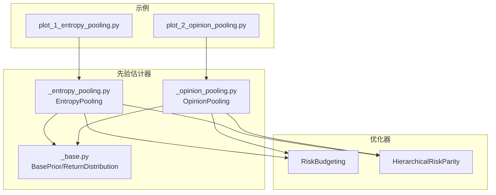
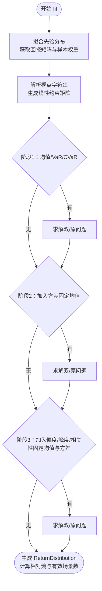
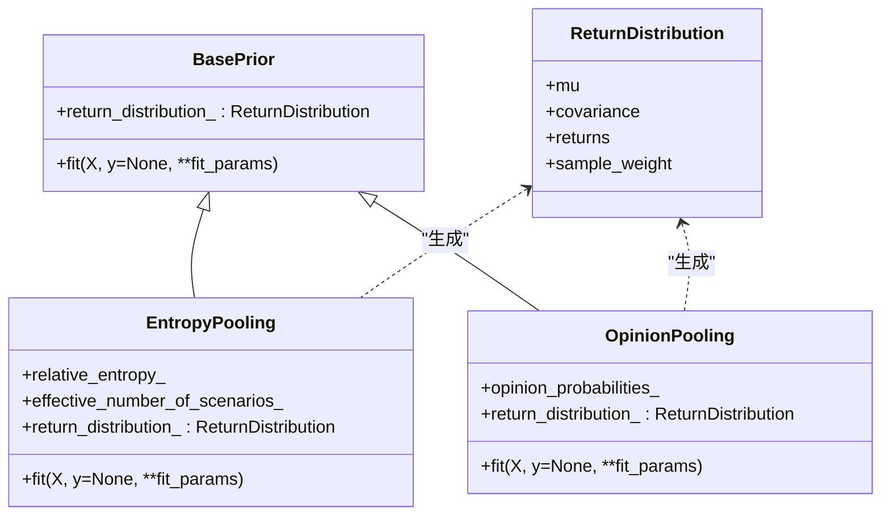
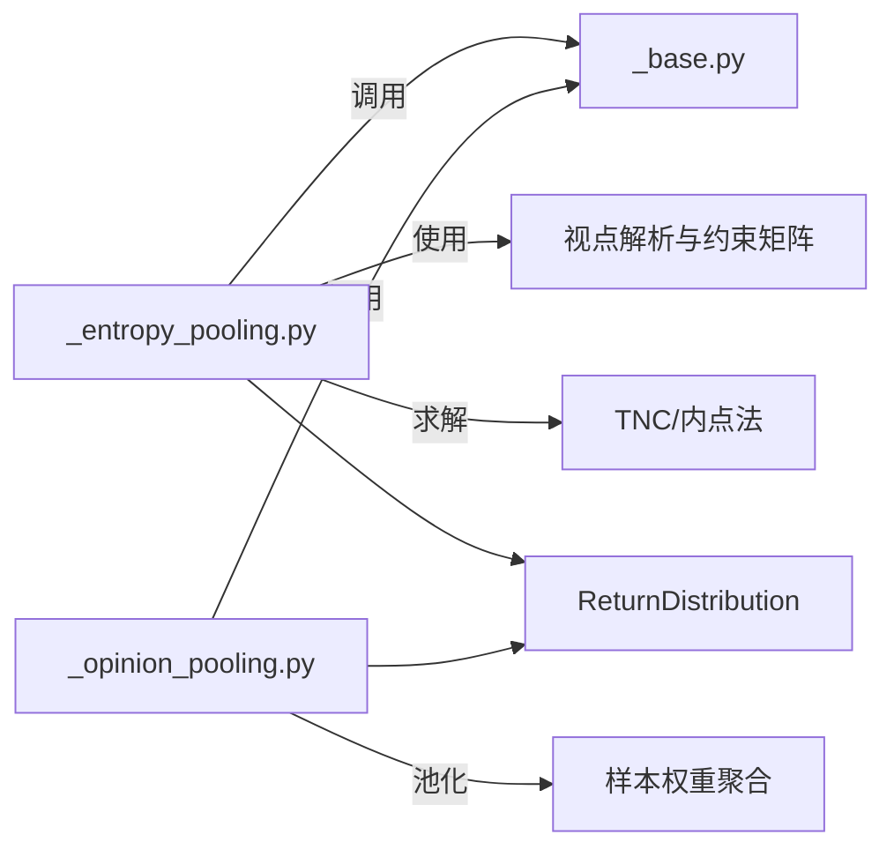

# 熵池化与观点整合教程

<cite>
**本文引用的文件**
- [plot_1_entropy_pooling.py](file://examples/entropy_pooling/plot_1_entropy_pooling.py)
- [plot_2_opinion_pooling.py](file://examples/entropy_pooling/plot_2_opinion_pooling.py)
- [_entropy_pooling.py](file://src/skfolio/prior/_entropy_pooling.py)
- [_opinion_pooling.py](file://src/skfolio/prior/_opinion_pooling.py)
- [_base.py](file://src/skfolio/prior/_base.py)
- [test_entropy_pooling.py](file://tests/test_prior/test_entropy_pooling.py)
- [test_opinion_pooling.py](file://tests/test_prior/test_opinion_pooling.py)
</cite>

## 目录
1. [引言](#引言)
2. [项目结构](#项目结构)
3. [核心组件](#核心组件)
4. [架构总览](#架构总览)
5. [详细组件分析](#详细组件分析)
6. [依赖关系分析](#依赖关系分析)
7. [性能考量](#性能考量)
8. [故障排查指南](#故障排查指南)
9. [结论](#结论)
10. [附录](#附录)

## 引言
本教程围绕熵池化（Entropy Pooling）与观点整合（Opinion Pooling）两大主题展开，基于 skfolio 的示例脚本与源码实现，系统讲解如何将主观市场观点融入先验分布，并通过最小化相对熵（KL 散度）调整概率测度；同时展示多专家观点的聚合方法，包括线性池化与对数池化、鲁棒池化以及不等式约束与分布矩调整的应用场景。教程覆盖：
- 观点矩阵构建与约束线性化
- 拉格朗日乘子求解（双/原问题）
- 后验分布生成与样本权重
- 投资组合优化联动（风险预算、分层风险平价等）
- 实战金融应用：因子视角、合成数据增强、压力测试

## 项目结构
本教程聚焦于以下与熵池化和观点整合直接相关的模块与示例：
- 示例脚本：examples/entropy_pooling/plot_1_entropy_pooling.py、examples/entropy_pooling/plot_2_opinion_pooling.py
- 核心实现：src/skfolio/prior/_entropy_pooling.py、src/skfolio/prior/_opinion_pooling.py
- 基类与返回分布：src/skfolio/prior/_base.py
- 单元测试：tests/test_prior/test_entropy_pooling.py、tests/test_prior/test_opinion_pooling.py



图表来源
- [plot_1_entropy_pooling.py](file://examples/entropy_pooling/plot_1_entropy_pooling.py#L1-L120)
- [plot_2_opinion_pooling.py](file://examples/entropy_pooling/plot_2_opinion_pooling.py#L1-L120)
- [_entropy_pooling.py](file://src/skfolio/prior/_entropy_pooling.py#L1-L120)
- [_opinion_pooling.py](file://src/skfolio/prior/_opinion_pooling.py#L1-L120)
- [_base.py](file://src/skfolio/prior/_base.py#L1-L70)

章节来源
- [plot_1_entropy_pooling.py](file://examples/entropy_pooling/plot_1_entropy_pooling.py#L1-L120)
- [plot_2_opinion_pooling.py](file://examples/entropy_pooling/plot_2_opinion_pooling.py#L1-L120)
- [_entropy_pooling.py](file://src/skfolio/prior/_entropy_pooling.py#L1-L120)
- [_opinion_pooling.py](file://src/skfolio/prior/_opinion_pooling.py#L1-L120)
- [_base.py](file://src/skfolio/prior/_base.py#L1-L70)

## 核心组件
- EntropyPooling：基于信息论的非参数方法，通过最小化 KL 散度在满足用户观点约束的前提下更新先验分布，输出样本权重（posterior probabilities）供后续优化使用。
- OpinionPooling：将多个专家意见（每个由先验估计器给出样本权重）进行线性或对数池化，可选鲁棒池化（基于 KL 散度惩罚），得到共识分布。
- ReturnDistribution：封装资产期望收益、协方差、回报矩阵与样本权重，作为优化器的数据输入。

章节来源
- [_entropy_pooling.py](file://src/skfolio/prior/_entropy_pooling.py#L1-L120)
- [_opinion_pooling.py](file://src/skfolio/prior/_opinion_pooling.py#L1-L120)
- [_base.py](file://src/skfolio/prior/_base.py#L1-L70)

## 架构总览
下图展示了从“观点定义”到“后验分布”再到“投资组合优化”的端到端流程。

```mermaid
sequenceDiagram
participant U as "用户"
participant EP as "EntropyPooling"
participant OP as "OpinionPooling"
participant PRIOR as "先验估计器"
participant DIST as "ReturnDistribution"
participant OPT as "优化器"
U->>EP : 定义均值/方差/偏度/峰度/相关性/VaR/CVaR 视点
EP->>PRIOR : fit 先验分布可为 EmpiricalPrior 或合成数据
PRIOR-->>EP : 返回分布含样本权重
EP->>EP : 解析视点字符串为约束矩阵
EP->>EP : 双/原问题求解TNC/内点法
EP->>DIST : 生成 ReturnDistribution含样本权重
U->>OPT : 使用 PRIOR=EP 或 PRIOR=OP 初始化优化器
OPT->>DIST : 读取样本权重与统计量
OPT-->>U : 输出最优权重
```

图表来源
- [plot_1_entropy_pooling.py](file://examples/entropy_pooling/plot_1_entropy_pooling.py#L150-L220)
- [plot_2_opinion_pooling.py](file://examples/entropy_pooling/plot_2_opinion_pooling.py#L110-L170)
- [_entropy_pooling.py](file://src/skfolio/prior/_entropy_pooling.py#L470-L588)
- [_opinion_pooling.py](file://src/skfolio/prior/_opinion_pooling.py#L334-L434)
- [_base.py](file://src/skfolio/prior/_base.py#L1-L70)

## 详细组件分析

### 组件A：熵池化（EntropyPooling）
- 数学目标与约束
  - 最小化 KL 散度：$\min_q D_{\text{KL}}(q \| p)$，其中 $p$ 为先验，$q$ 为后验。
  - 约束包括归一化、视点约束（等式/不等式/排名/线性组合/分组）、矩固定（嵌套投影）。
- 视点类型与解析
  - 支持均值、方差、偏度、峰度、相关性、VaR、CVaR 视点；支持相对视点（如 prior(...)）与分组视点。
  - 视点字符串解析为线性约束矩阵 $(A, b)$，并按规模重缩放以提升数值稳定性。
- 求解策略
  - 双问题（Fenchel 对偶）：Truncated Newton Constrained（TNC），在约束维数上优化，速度更快。
  - 原问题（概率空间内点法）：CVXPY 内置求解器，精度更高但较慢。
  - 非线性 CVaR 视点通过递归凸程序逼近；必要时引入 L1 松弛变量缓解不可行。
- 后验分布与统计量
  - 输出 ReturnDistribution，包含样本权重、均值、协方差、回报矩阵等，供优化器使用。
  - 提供相对熵与有效场景数（后验熵的指数）两个诊断指标。



图表来源
- [_entropy_pooling.py](file://src/skfolio/prior/_entropy_pooling.py#L539-L588)
- [_entropy_pooling.py](file://src/skfolio/prior/_entropy_pooling.py#L1098-L1187)

章节来源
- [_entropy_pooling.py](file://src/skfolio/prior/_entropy_pooling.py#L1-L120)
- [_entropy_pooling.py](file://src/skfolio/prior/_entropy_pooling.py#L470-L588)
- [_entropy_pooling.py](file://src/skfolio/prior/_entropy_pooling.py#L1098-L1187)
- [test_entropy_pooling.py](file://tests/test_prior/test_entropy_pooling.py#L104-L171)
- [test_entropy_pooling.py](file://tests/test_prior/test_entropy_pooling.py#L454-L541)
- [test_entropy_pooling.py](file://tests/test_prior/test_entropy_pooling.py#L581-L600)
- [test_entropy_pooling.py](file://tests/test_prior/test_entropy_pooling.py#L715-L726)
- [test_entropy_pooling.py](file://tests/test_prior/test_entropy_pooling.py#L822-L845)

### 组件B：观点整合（OpinionPooling）
- 聚合策略
  - 线性池化：各专家样本权重的加权平均，保留所有非零支持。
  - 对数池化：几何平均，零概率保持为零，信息论最优且对极端观点更稳健。
  - 鲁棒池化：引入 KL 散度惩罚项，降低偏离共识的专家权重，提高稳健性。
- 输入与输出
  - 输入：一组先验估计器（每个需能产出样本权重），可共享同一先验。
  - 输出：统一的 ReturnDistribution，包含共识样本权重与统计量。
- 参数与验证
  - opinion_probabilities：专家初始权重，自动补足至 1；若不足则补充均匀先验。
  - divergence_penalty：非负系数，越大越抑制离群专家。



图表来源
- [_base.py](file://src/skfolio/prior/_base.py#L1-L70)
- [_entropy_pooling.py](file://src/skfolio/prior/_entropy_pooling.py#L1-L120)
- [_opinion_pooling.py](file://src/skfolio/prior/_opinion_pooling.py#L1-L120)

章节来源
- [_opinion_pooling.py](file://src/skfolio/prior/_opinion_pooling.py#L1-L120)
- [_opinion_pooling.py](file://src/skfolio/prior/_opinion_pooling.py#L334-L434)
- [test_opinion_pooling.py](file://tests/test_prior/test_opinion_pooling.py#L50-L152)

### 组件C：示例脚本与实战应用
- plot_1_entropy_pooling.py
  - 展示如何在历史收益上施加均值、方差、相关性、偏度、CVaR 等视点，生成后验分布并用于风险预算与分层风险平价优化。
  - 演示因子视角与合成数据增强（VineCopula）以支持极端视点。
  - 提供压力测试：对现有组合施加 EP 后验或因子合成数据后的分布，评估尾部风险变化。
- plot_2_opinion_pooling.py
  - 将多个专家意见（由 EntropyPooling 生成）进行线性/对数池化，可选鲁棒池化，再用于优化。
  - 因子视角与合成数据增强，支持多专家 CVaR 视点的共识分布构建与压力测试。

章节来源
- [plot_1_entropy_pooling.py](file://examples/entropy_pooling/plot_1_entropy_pooling.py#L150-L220)
- [plot_1_entropy_pooling.py](file://examples/entropy_pooling/plot_1_entropy_pooling.py#L260-L315)
- [plot_1_entropy_pooling.py](file://examples/entropy_pooling/plot_1_entropy_pooling.py#L317-L434)
- [plot_2_opinion_pooling.py](file://examples/entropy_pooling/plot_2_opinion_pooling.py#L117-L170)
- [plot_2_opinion_pooling.py](file://examples/entropy_pooling/plot_2_opinion_pooling.py#L170-L222)
- [plot_2_opinion_pooling.py](file://examples/entropy_pooling/plot_2_opinion_pooling.py#L229-L321)

## 依赖关系分析
- 组件耦合
  - EntropyPooling 依赖先验估计器（默认 EmpiricalPrior，也可用合成数据）与视点解析工具，最终输出 ReturnDistribution。
  - OpinionPooling 依赖一组先验估计器，要求每个估计器能产出样本权重；可共享同一先验以保证场景一致性。
- 外部依赖
  - 求解器：SciPy TNC（双问题）、CVXPY 内点法（原问题）。
  - 分布建模：VineCopula 用于合成极端尾部依赖场景。
  - 度量函数：均值、方差、偏度、峰度、相关性、VaR、CVaR 等。



图表来源
- [_entropy_pooling.py](file://src/skfolio/prior/_entropy_pooling.py#L1-L120)
- [_opinion_pooling.py](file://src/skfolio/prior/_opinion_pooling.py#L1-L120)
- [_base.py](file://src/skfolio/prior/_base.py#L1-L70)

章节来源
- [_entropy_pooling.py](file://src/skfolio/prior/_entropy_pooling.py#L1-L120)
- [_opinion_pooling.py](file://src/skfolio/prior/_opinion_pooling.py#L1-L120)
- [_base.py](file://src/skfolio/prior/_base.py#L1-L70)

## 性能考量
- 求解器选择
  - 双问题（TNC）通常更快，适合大规模场景；原问题（CVXPY 内点法）精度更高，适合对数值稳定性要求高的场景。
- 视点规模与条件数
  - 视点解析会按列向量范数进行重缩放，避免尺度差异导致的病态条件数。
- 稳健性与松弛
  - 在固定均值/方差等强约束时引入 L1 松弛变量，缓解过于紧约束导致的不可行。
- 合成数据与极端视点
  - 对于稀疏历史分布的极端 CVaR 视点，建议使用 VineCopula 生成足够多的合成场景以提升可靠性。

[本节为通用指导，无需列出具体文件来源]

## 故障排查指南
- 视点冲突或过极端
  - 双问题（TNC）失败：检查视点是否相互矛盾或超出先验支持范围；考虑使用更多合成数据或调整 solver_params。
  - 原问题（CVXPY）失败：尝试更换求解器或提高数值容差；设置 verbose 获取更多信息。
- VaR 视点非法
  - 不允许混合多资产的 VaR 视点；VaR 阈值必须严格为正；极端阈值可能无历史样本覆盖，需放宽或增加合成数据。
- 样本权重异常
  - 确保样本权重非负且归一；若出现极小数值，注意数值截断与归一化处理。
- 专家权重与鲁棒池化
  - divergence_penalty 必须非负；过大可能导致某些专家权重被抑制至接近零。

章节来源
- [_entropy_pooling.py](file://src/skfolio/prior/_entropy_pooling.py#L741-L781)
- [_entropy_pooling.py](file://src/skfolio/prior/_entropy_pooling.py#L1098-L1187)
- [_opinion_pooling.py](file://src/skfolio/prior/_opinion_pooling.py#L436-L476)

## 结论
熵池化与观点整合为将主观判断与客观数据有机结合提供了严谨的信息论框架。通过最小化 KL 散度在满足视点约束的前提下更新概率测度，既保留了先验的完整性，又灵活地纳入专家意见。结合合成数据与因子视角，可有效应对极端视点与多专家分歧，进而驱动稳健的投资组合优化与压力测试。skfolio 的实现提供了从视点表达、约束解析、求解到优化的完整链路，便于在实践中快速落地。

[本节为总结性内容，无需列出具体文件来源]

## 附录
- 实操清单
  - 明确视点类型与表达：均值/方差/相关性/偏度/峰度/VaR/CVaR，支持相对视点与分组视点。
  - 选择合适的先验：历史 EmpiricalPrior 或合成数据（VineCopula）。
  - 选择求解器：优先 TNC（速度快），必要时切换 CVXPY 内点法（精度高）。
  - 多专家整合：线性池化（保留非零支持）或对数池化（零保持、稳健）；可选鲁棒池化。
  - 诊断指标：相对熵与有效场景数，评估后验分布的偏离程度与多样性。
- 推荐阅读
  - Meucci 关于全灵活极端视点与有效场景数的相关文献（见示例脚本参考）。

[本节为补充说明，无需列出具体文件来源]