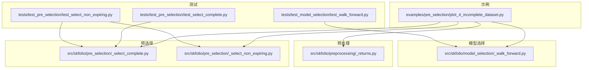
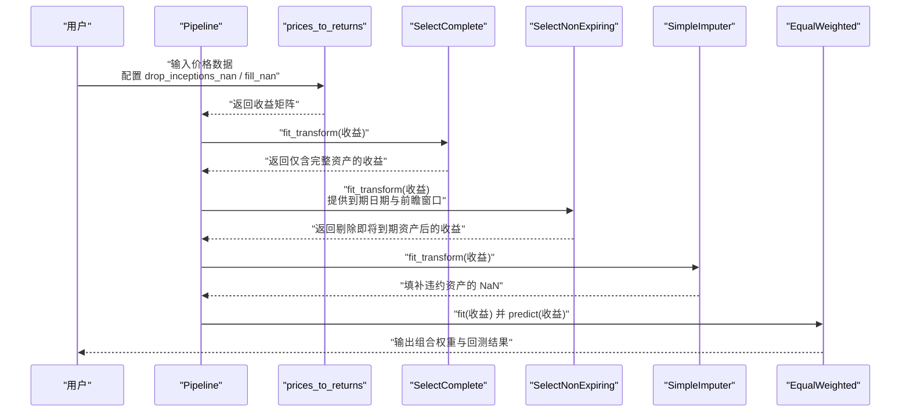
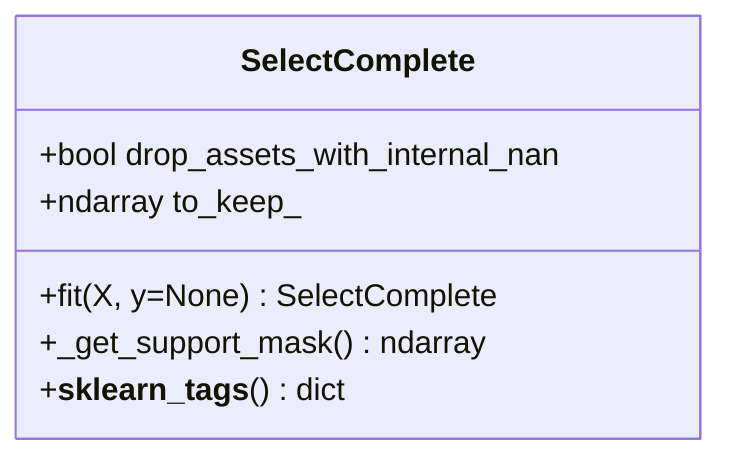
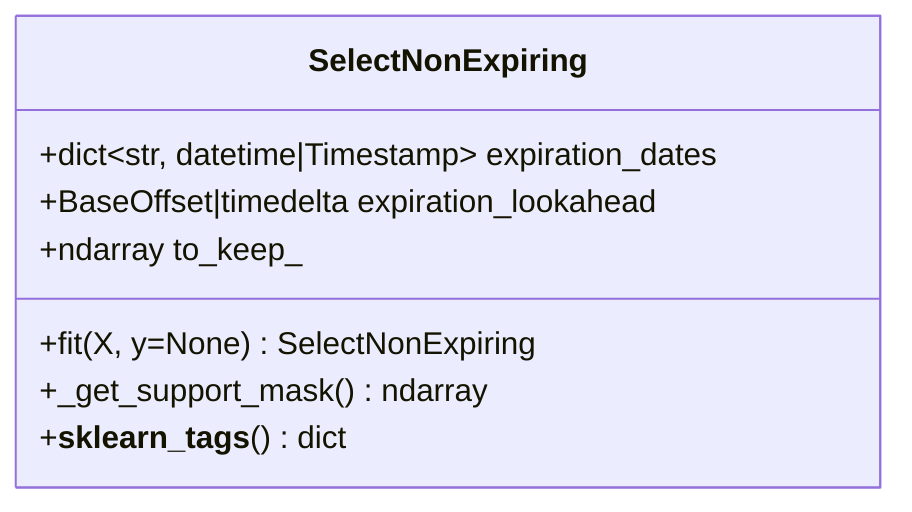
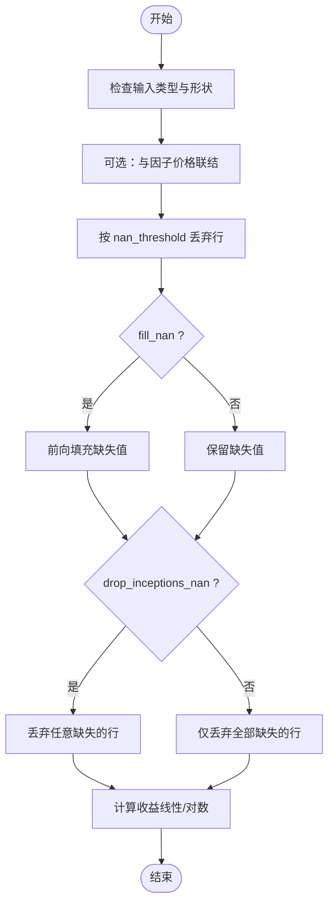
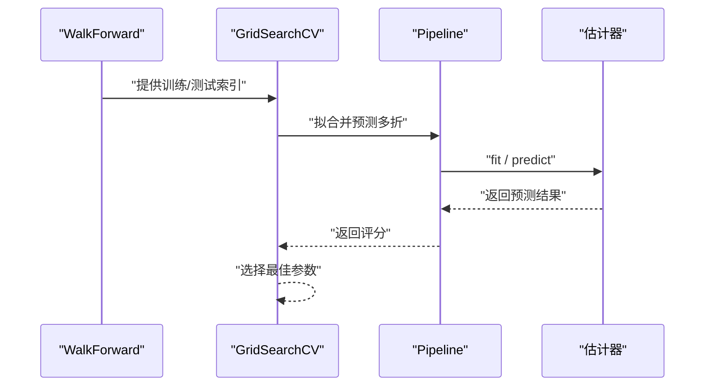
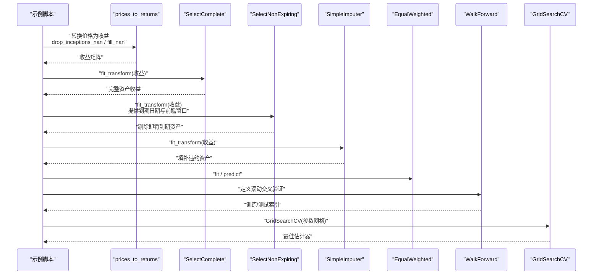
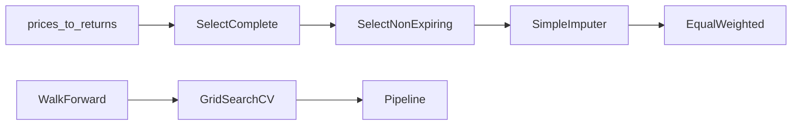

# 处理不完整数据集

<cite>
**本文引用的文件列表**
- [plot_4_incomplete_dataset.py](file://examples/pre_selection/plot_4_incomplete_dataset.py)
- [_select_complete.py](file://src/skfolio/pre_selection/_select_complete.py)
- [_select_non_expiring.py](file://src/skfolio/pre_selection/_select_non_expiring.py)
- [_returns.py](file://src/skfolio/preprocessing/_returns.py)
- [_walk_forward.py](file://src/skfolio/model_selection/_walk_forward.py)
- [test_select_complete.py](file://tests/test_pre_selection/test_select_complete.py)
- [test_select_non_expiring.py](file://tests/test_pre_selection/test_select_non_expiring.py)
- [test_walk_forward.py](file://tests/test_model_selection/test_walk_forward.py)
</cite>

## 目录
1. [引言](#引言)
2. [项目结构](#项目结构)
3. [核心组件](#核心组件)
4. [架构总览](#架构总览)
5. [详细组件分析](#详细组件分析)
6. [依赖关系分析](#依赖关系分析)
7. [性能考量](#性能考量)
8. [故障排查指南](#故障排查指南)
9. [结论](#结论)
10. [附录](#附录)

## 引言
本篇文档围绕金融数据中常见的“不完整”问题展开，重点讲解三类典型情形：
- 延迟上市（inception）：资产在观测期后才开始交易
- 提前到期（expiry）：债券、期权、期货等已知到期
- 违约（default）：资产价格归零或断层

为应对这些问题，本文系统介绍两个预处理变换器的协同使用：SelectComplete 与 SelectNonExpiring，并结合示例展示如何将其融入 Pipeline，与 WalkForward 交叉验证和 GridSearchCV 超参数调优无缝衔接。同时解释 drop_assets_with_internal_nan 等关键参数的作用，并给出在回测中避免生存者偏差（survivorship bias）的策略建议。

## 项目结构
本仓库采用按功能域划分的模块化组织方式，与本文主题直接相关的目录与文件如下：
- 预处理：将价格转换为收益，控制缺失值与起始观测的丢弃策略
- 预选择：提供 SelectComplete 与 SelectNonExpiring 两类过滤器
- 模型选择：WalkForward 交叉验证器
- 示例：plot_4_incomplete_dataset.py 展示了完整的 Pipeline 使用流程
- 测试：覆盖 SelectComplete、SelectNonExpiring 以及与 WalkForward 的组合使用

图表来源
- [plot_4_incomplete_dataset.py](file://examples/pre_selection/plot_4_incomplete_dataset.py#L1-L176)
- [_returns.py](file://src/skfolio/preprocessing/_returns.py#L1-L133)
- [_select_complete.py](file://src/skfolio/pre_selection/_select_complete.py#L1-L118)
- [_select_non_expiring.py](file://src/skfolio/pre_selection/_select_non_expiring.py#L1-L151)
- [_walk_forward.py](file://src/skfolio/model_selection/_walk_forward.py#L1-L537)
- [test_select_complete.py](file://tests/test_pre_selection/test_select_complete.py#L1-L79)
- [test_select_non_expiring.py](file://tests/test_pre_selection/test_select_non_expiring.py#L1-L115)
- [test_walk_forward.py](file://tests/test_model_selection/test_walk_forward.py#L308-L713)

章节来源
- [plot_4_incomplete_dataset.py](file://examples/pre_selection/plot_4_incomplete_dataset.py#L1-L176)
- [_returns.py](file://src/skfolio/preprocessing/_returns.py#L1-L133)
- [_select_complete.py](file://src/skfolio/pre_selection/_select_complete.py#L1-L118)
- [_select_non_expiring.py](file://src/skfolio/pre_selection/_select_non_expiring.py#L1-L151)
- [_walk_forward.py](file://src/skfolio/model_selection/_walk_forward.py#L1-L537)
- [test_select_complete.py](file://tests/test_pre_selection/test_select_complete.py#L1-L79)
- [test_select_non_expiring.py](file://tests/test_pre_selection/test_select_non_expiring.py#L1-L115)
- [test_walk_forward.py](file://tests/test_model_selection/test_walk_forward.py#L308-L713)

## 核心组件
- SelectComplete：按“首尾是否含缺失值”筛选资产，支持可选地移除“中间缺失”的资产
- SelectNonExpiring：基于资产到期日期与前瞻窗口，剔除即将到期的资产
- prices_to_returns：将价格转换为线性/对数收益，控制缺失值处理与起始观测丢弃
- WalkForward：面向时间序列的滚动交叉验证器
- GridSearchCV：与 Pipeline 和 WalkForward 结合进行超参数搜索

章节来源
- [_select_complete.py](file://src/skfolio/pre_selection/_select_complete.py#L1-L118)
- [_select_non_expiring.py](file://src/skfolio/pre_selection/_select_non_expiring.py#L1-L151)
- [_returns.py](file://src/skfolio/preprocessing/_returns.py#L1-L133)
- [_walk_forward.py](file://src/skfolio/model_selection/_walk_forward.py#L1-L537)

## 架构总览
下图展示了示例脚本中 Pipeline 的整体流程：先用 prices_to_returns 将价格转换为收益并控制缺失值策略，再通过 SelectComplete 去除首尾缺失或内部缺失的资产，随后用 SelectNonExpiring 剔除即将到期的资产，最后以 SimpleImputer 填补违约资产的 NaN，交由优化器生成组合权重。

图表来源
- [plot_4_incomplete_dataset.py](file://examples/pre_selection/plot_4_incomplete_dataset.py#L97-L175)
- [_returns.py](file://src/skfolio/preprocessing/_returns.py#L1-L133)
- [_select_complete.py](file://src/skfolio/pre_selection/_select_complete.py#L1-L118)
- [_select_non_expiring.py](file://src/skfolio/pre_selection/_select_non_expiring.py#L1-L151)

## 详细组件分析

### SelectComplete 组件
- 功能要点
  - 默认仅保留“首尾无缺失”的资产；若开启 drop_assets_with_internal_nan，则连“中间缺失”的资产也会被剔除
  - 支持 DataFrame 与数组输入，fit 后生成布尔掩码 to_keep_，供后续选择器使用
- 关键参数
  - drop_assets_with_internal_nan：是否移除中间缺失的资产
- 典型应用场景
  - 处理“延迟上市”（首部缺失）与“违约”（末尾缺失）资产
  - 在需要严格完整性的场景下，进一步收紧到“全段无缺失”

图表来源
- [_select_complete.py](file://src/skfolio/pre_selection/_select_complete.py#L1-L118)

章节来源
- [_select_complete.py](file://src/skfolio/pre_selection/_select_complete.py#L1-L118)
- [test_select_complete.py](file://tests/test_pre_selection/test_select_complete.py#L1-L79)

### SelectNonExpiring 组件
- 功能要点
  - 依据资产到期日期与前瞻窗口（expiration_lookahead）判断是否剔除资产
  - 仅支持带 DatetimeIndex 的 DataFrame
  - fit 时计算截止日期 end_date + lookahead，若某资产到期日在截止日期之后则保留
- 关键参数
  - expiration_dates：资产名到到期日的映射
  - expiration_lookahead：前瞻窗口（如 BusinessDay、DateOffset）
- 典型应用场景
  - 处理“提前到期”（期权、债券、期货等）资产
  - 与 WalkForward 协作，确保训练/测试期间均只保留有效资产

图表来源
- [_select_non_expiring.py](file://src/skfolio/pre_selection/_select_non_expiring.py#L1-L151)

章节来源
- [_select_non_expiring.py](file://src/skfolio/pre_selection/_select_non_expiring.py#L1-L151)
- [test_select_non_expiring.py](file://tests/test_pre_selection/test_select_non_expiring.py#L1-L115)

### prices_to_returns 预处理
- 功能要点
  - 将价格转换为线性或对数收益
  - 控制缺失值处理：nan_threshold、drop_inceptions_nan、fill_nan
  - 可选地与因子价格联结，保证观测一致
- 关键参数
  - drop_inceptions_nan：是否丢弃包含任一资产缺失的起始观测
  - fill_nan：是否前向填充缺失值
  - nan_threshold：按行丢弃缺失比例超过阈值的观测
- 与不完整数据的关系
  - 通过 drop_inceptions_nan 与 fill_nan，可在收益层面减少因延迟上市导致的首部缺失影响
  - 与 SelectComplete 协同，先做收益转换，再做资产维度筛选

图表来源
- [_returns.py](file://src/skfolio/preprocessing/_returns.py#L1-L133)

章节来源
- [_returns.py](file://src/skfolio/preprocessing/_returns.py#L1-L133)

### WalkForward 交叉验证
- 功能要点
  - 以“滚动训练/测试”方式分割时间序列数据
  - 支持整数步长或基于频率（freq）与偏移（freq_offset）的时间窗口
  - 提供 purged_size、reduce_test、expend_train 等参数控制执行时序与看样控制
- 与 Pipeline 的集成
  - 可直接作为 GridSearchCV 的 cv 参数，实现跨期稳健的超参数搜索
  - 与 cross_val_predict 结合，输出多期组合权重与收益序列

图表来源
- [_walk_forward.py](file://src/skfolio/model_selection/_walk_forward.py#L1-L537)
- [plot_4_incomplete_dataset.py](file://examples/pre_selection/plot_4_incomplete_dataset.py#L120-L175)
- [test_walk_forward.py](file://tests/test_model_selection/test_walk_forward.py#L308-L713)

章节来源
- [_walk_forward.py](file://src/skfolio/model_selection/_walk_forward.py#L1-L537)
- [plot_4_incomplete_dataset.py](file://examples/pre_selection/plot_4_incomplete_dataset.py#L120-L175)
- [test_walk_forward.py](file://tests/test_model_selection/test_walk_forward.py#L308-L713)

### 示例：构建完整 Pipeline 处理不完整数据
- 数据准备
  - 生成四支资产的价格序列：inception（延迟上市）、defaulted（违约）、expired（到期）、complete（完整）
  - 使用 prices_to_returns 转换收益，控制 drop_inceptions_nan 与 fill_nan
- Pipeline 组成
  - SelectComplete：剔除首尾缺失或内部缺失资产
  - SelectNonExpiring：基于到期日期与前瞻窗口剔除即将到期资产
  - SimpleImputer：将违约资产的 NaN 替换为 0，避免后续优化失败
  - EqualWeighted：示例优化器
- 交叉验证与超参搜索
  - 使用 WalkForward 对 Pipeline 进行 cross_val_predict
  - 使用 GridSearchCV 以 expiration_lookahead 为超参进行搜索

图表来源
- [plot_4_incomplete_dataset.py](file://examples/pre_selection/plot_4_incomplete_dataset.py#L64-L175)

章节来源
- [plot_4_incomplete_dataset.py](file://examples/pre_selection/plot_4_incomplete_dataset.py#L1-L176)
- [test_select_non_expiring.py](file://tests/test_pre_selection/test_select_non_expiring.py#L76-L115)

## 依赖关系分析
- 组件耦合
  - SelectComplete 与 SelectNonExpiring 均继承自 sklearn.feature_selection.SelectorMixin，统一了 fit/transform 接口
  - Pipeline 中的顺序至关重要：先做 SelectComplete 再做 SelectNonExpiring，能最大化保留有效资产
- 外部依赖
  - WalkForward 依赖 pandas DatetimeIndex，要求输入为 DataFrame
  - GridSearchCV 与 Pipeline 的参数命名空间遵循 sklearn 规范（如 select_non_expiring_assets__expiration_lookahead）

图表来源
- [_select_complete.py](file://src/skfolio/pre_selection/_select_complete.py#L1-L118)
- [_select_non_expiring.py](file://src/skfolio/pre_selection/_select_non_expiring.py#L1-L151)
- [_returns.py](file://src/skfolio/preprocessing/_returns.py#L1-L133)
- [_walk_forward.py](file://src/skfolio/model_selection/_walk_forward.py#L1-L537)
- [plot_4_incomplete_dataset.py](file://examples/pre_selection/plot_4_incomplete_dataset.py#L97-L175)

章节来源
- [_select_complete.py](file://src/skfolio/pre_selection/_select_complete.py#L1-L118)
- [_select_non_expiring.py](file://src/skfolio/pre_selection/_select_non_expiring.py#L1-L151)
- [_returns.py](file://src/skfolio/preprocessing/_returns.py#L1-L133)
- [_walk_forward.py](file://src/skfolio/model_selection/_walk_forward.py#L1-L537)
- [plot_4_incomplete_dataset.py](file://examples/pre_selection/plot_4_incomplete_dataset.py#L97-L175)

## 性能考量
- 计算复杂度
  - SelectComplete 与 SelectNonExpiring 的 fit 主要为 O(T×A)（T 为观测数，A 为资产数），属于线性扫描
  - Pipeline 中的 imputation 与优化器会引入额外成本，但通常远小于数据规模
- 内存与数据流
  - 建议在 Pipeline 中尽早剔除无效资产，降低后续步骤的计算与内存压力
  - 对于大规模资产池，优先使用 SelectComplete 去除明显不完整资产，再用 SelectNonExpiring 精准剔除即将到期资产

## 故障排查指南
- 常见错误与修复
  - SelectNonExpiring 报错“必须提供到期日期/前瞻窗口”：在构造时传入 expiration_dates 与 expiration_lookahead
  - SelectNonExpiring 报错“必须是带 DatetimeIndex 的 DataFrame”：确保 X 的索引为 DatetimeIndex
  - WalkForward 报错“X 必须是带 DatetimeIndex 的 DataFrame”：当使用基于频率的分组时，需保证索引类型正确
  - GridSearchCV 无法识别参数：确认参数命名空间为“变换器名__参数名”，例如 select_non_expiring_assets__expiration_lookahead
- 数据完整性验证
  - 使用测试用例中的断言模式，核对 Pipeline 输出的组合权重与收益序列是否符合预期
  - 对于违约资产，SimpleImputer 填充后应确保后续优化不再报 NaN 错误

章节来源
- [_select_non_expiring.py](file://src/skfolio/pre_selection/_select_non_expiring.py#L117-L151)
- [_walk_forward.py](file://src/skfolio/model_selection/_walk_forward.py#L298-L302)
- [test_select_non_expiring.py](file://tests/test_pre_selection/test_select_non_expiring.py#L66-L115)
- [test_walk_forward.py](file://tests/test_model_selection/test_walk_forward.py#L308-L360)

## 结论
通过 SelectComplete 与 SelectNonExpiring 的协同，可以系统性地处理金融数据中的延迟上市、提前到期与违约问题。配合 prices_to_returns 的缺失值控制、WalkForward 的滚动交叉验证以及 GridSearchCV 的超参数搜索，能够构建稳健且可复现的回测流水线。在实际应用中，合理设置 drop_assets_with_internal_nan、expiration_dates 与 expiration_lookahead，有助于在保持样本代表性的同时避免生存者偏差的影响。

## 附录
- 关键参数速查
  - drop_assets_with_internal_nan（SelectComplete）：是否移除中间缺失资产
  - expiration_dates（SelectNonExpiring）：资产到期日期映射
  - expiration_lookahead（SelectNonExpiring）：前瞻窗口（如 BusinessDay、DateOffset）
  - drop_inceptions_nan / fill_nan（prices_to_returns）：收益转换阶段的缺失值策略
- 回测与生存者偏差
  - 仅保留完整历史的资产会缩短样本长度或减少资产数量，可能引入生存者偏差
  - 建议：在 Pipeline 中尽量保留尽可能多的有效资产；对即将到期资产采用前瞻窗口剔除策略；在交叉验证中使用 WalkForward，避免未来信息泄露