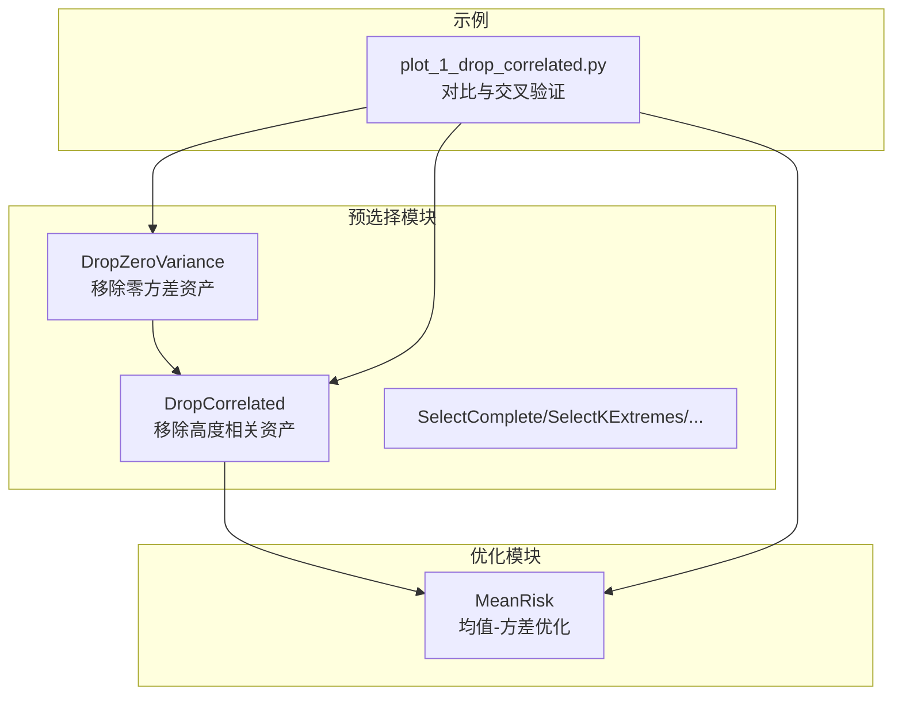
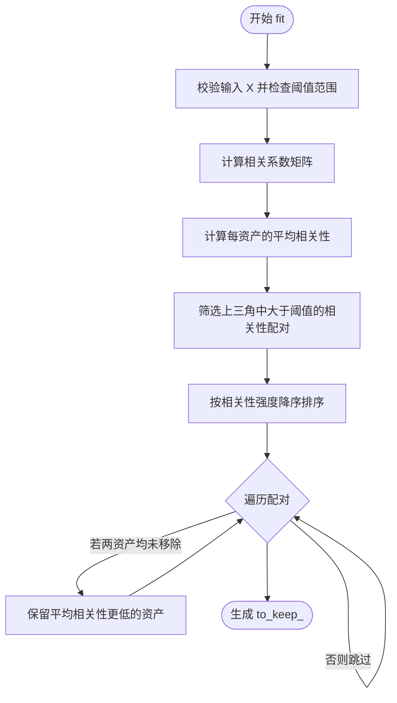
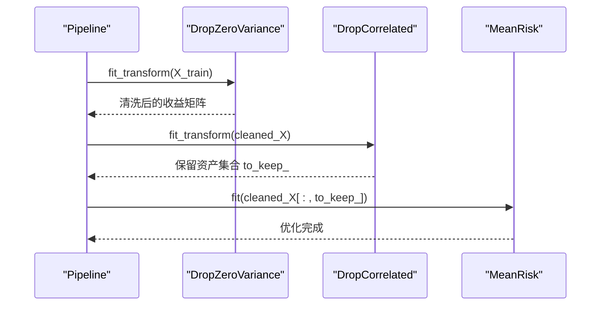
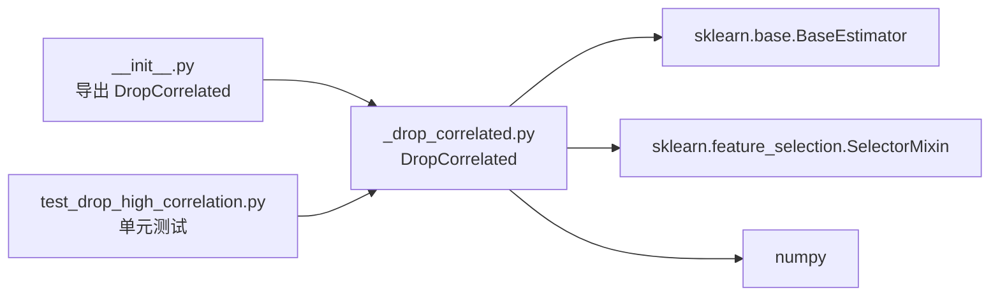

# 移除高度相关资产

<cite>
**本文引用的文件**
- [src/skfolio/pre_selection/_drop_correlated.py](file://src/skfolio/pre_selection/_drop_correlated.py)
- [src/skfolio/pre_selection/__init__.py](file://src/skfolio/pre_selection/__init__.py)
- [examples/pre_selection/plot_1_drop_correlated.py](file://examples/pre_selection/plot_1_drop_correlated.py)
- [docs/user_guide/pre_selection.rst](file://docs/user_guide/pre_selection.rst)
- [tests/test_pre_selection/test_drop_high_correlation.py](file://tests/test_pre_selection/test_drop_high_correlation.py)
</cite>

## 目录
1. [简介](#简介)
2. [项目结构](#项目结构)
3. [核心组件](#核心组件)
4. [架构总览](#架构总览)
5. [详细组件分析](#详细组件分析)
6. [依赖关系分析](#依赖关系分析)
7. [性能考量](#性能考量)
8. [故障排查指南](#故障排查指南)
9. [结论](#结论)
10. [附录](#附录)

## 简介
本篇文档围绕 DropCorrelated 预处理变换器展开，系统讲解其如何通过识别并移除高度相关的资产，降低投资组合冗余与优化不稳定性。文档覆盖以下要点：
- 内部算法流程：先筛选高于阈值的相关性配对，按强度降序排列，再逐对保留平均相关性更低的资产，避免次优顺序移除。
- 关键参数：threshold（阈值）、absolute（是否取绝对值）。
- 与 Pipeline 的集成方式：在优化前进行预处理，提升模型稳定性并降低过拟合风险。
- 基于示例脚本 plot_1_drop_correlated.py 的均值-方差优化前后性能对比与交叉验证分析。

## 项目结构
DropCorrelated 位于预处理阶段的“预选择”子模块，遵循 scikit-learn 的估计器接口，可直接接入 Pipeline。示例脚本展示了在均值-方差优化前后的对比与稳健性评估。



图表来源
- [src/skfolio/pre_selection/_drop_correlated.py](file://src/skfolio/pre_selection/_drop_correlated.py#L1-L109)
- [examples/pre_selection/plot_1_drop_correlated.py](file://examples/pre_selection/plot_1_drop_correlated.py#L1-L163)

章节来源
- [src/skfolio/pre_selection/__init__.py](file://src/skfolio/pre_selection/__init__.py#L1-L18)
- [docs/user_guide/pre_selection.rst](file://docs/user_guide/pre_selection.rst#L1-L76)

## 核心组件
- DropCorrelated：基于相关性的预选择变换器，支持阈值与绝对值两种策略，输出布尔掩码 to_keep_ 指示保留的资产索引。
- Pipeline 集成：可与 DropZeroVariance、MeanRisk 等组件串联，形成“去冗余 → 优化”的流水线。
- 示例脚本：演示了预处理前后的资产数量变化、预测表现差异以及交叉验证下的稳定性评估。

章节来源
- [src/skfolio/pre_selection/_drop_correlated.py](file://src/skfolio/pre_selection/_drop_correlated.py#L1-L109)
- [examples/pre_selection/plot_1_drop_correlated.py](file://examples/pre_selection/plot_1_drop_correlated.py#L1-L163)
- [tests/test_pre_selection/test_drop_high_correlation.py](file://tests/test_pre_selection/test_drop_high_correlation.py#L1-L29)

## 架构总览
下图展示从数据到优化的整体流程，以及 DropCorrelated 在 Pipeline 中的位置与作用。

```mermaid
sequenceDiagram
participant Data as "数据源"
participant Pre as "预处理"
participant DC as "DropCorrelated"
participant ZV as "DropZeroVariance"
participant Opt as "MeanRisk 优化"
participant Eval as "评估"
Data->>Pre : 加载价格/收益序列
Pre->>ZV : 去除零方差资产
ZV-->>DC : 返回清洗后的收益矩阵
DC-->>Opt : 保留资产集合 to_keep_
Opt-->>Eval : 输出投资组合权重与绩效
```

图表来源
- [examples/pre_selection/plot_1_drop_correlated.py](file://examples/pre_selection/plot_1_drop_correlated.py#L52-L75)
- [src/skfolio/pre_selection/_drop_correlated.py](file://src/skfolio/pre_selection/_drop_correlated.py#L61-L109)

## 详细组件分析

### DropCorrelated 类与算法
- 继承关系：继承自 SelectorMixin 与 BaseEstimator，具备 scikit-learn 兼容的 fit/transform 接口。
- 参数
  - threshold：相关性阈值，默认 0.95；取值范围 [-1, 1]。
  - absolute：是否对相关系数取绝对值，用于同时考虑负相关配对。
- 核心流程
  1) 计算资产间的相关系数矩阵，并求每列的平均相关性。
  2) 选取上三角中大于阈值的相关性配对。
  3) 将这些配对按相关性强度降序排序。
  4) 对每个配对，若两个资产均未被移除，则保留平均相关性更低的那个，从而避免顺序敏感的次优结果。
- 输出属性
  - to_keep_：布尔数组，指示保留的资产索引。
  - n_features_in_：训练时观测到的资产数。
  - feature_names_in_：当输入资产名为字符串时，记录资产名。



图表来源
- [src/skfolio/pre_selection/_drop_correlated.py](file://src/skfolio/pre_selection/_drop_correlated.py#L61-L109)

章节来源
- [src/skfolio/pre_selection/_drop_correlated.py](file://src/skfolio/pre_selection/_drop_correlated.py#L1-L109)

### Pipeline 集成与使用
- 可与 DropZeroVariance、MeanRisk 等组件组合为 Pipeline，在训练集上先去零方差资产，再移除高度相关资产，最后进行优化。
- 示例脚本展示了两种模式：仅优化 vs. 预处理后优化，并通过交叉验证与分布可视化比较两者稳定性与收益。



图表来源
- [examples/pre_selection/plot_1_drop_correlated.py](file://examples/pre_selection/plot_1_drop_correlated.py#L52-L75)

章节来源
- [examples/pre_selection/plot_1_drop_correlated.py](file://examples/pre_selection/plot_1_drop_correlated.py#L1-L163)
- [docs/user_guide/pre_selection.rst](file://docs/user_guide/pre_selection.rst#L48-L76)

### 性能对比与交叉验证
- 示例脚本对比了“无预处理”与“含 DropCorrelated 预处理”的最大夏普比率模型在测试集上的表现。
- 使用 CombinatorialPurgedCV 进行多测试路径的稳健评估，通过 Sharpe 分布与统计量（均值、标准差）衡量稳定性。
- 结果通常显示预处理后资产数量下降、权重更稳定、Sharpe 分布更集中，从而降低过拟合风险。

章节来源
- [examples/pre_selection/plot_1_drop_correlated.py](file://examples/pre_selection/plot_1_drop_correlated.py#L90-L163)

## 依赖关系分析
- DropCorrelated 依赖 numpy 进行相关性计算与索引操作，依赖 sklearn.base 与 sklearn.feature_selection 提供估计器与选择器接口。
- 预选择模块导出 DropCorrelated，便于外部直接导入使用。
- 测试用例验证了变换器的形状、列名一致性与相关性阈值约束。



图表来源
- [src/skfolio/pre_selection/_drop_correlated.py](file://src/skfolio/pre_selection/_drop_correlated.py#L1-L109)
- [src/skfolio/pre_selection/__init__.py](file://src/skfolio/pre_selection/__init__.py#L1-L18)
- [tests/test_pre_selection/test_drop_high_correlation.py](file://tests/test_pre_selection/test_drop_high_correlation.py#L1-L29)

章节来源
- [src/skfolio/pre_selection/_drop_correlated.py](file://src/skfolio/pre_selection/_drop_correlated.py#L1-L109)
- [src/skfolio/pre_selection/__init__.py](file://src/skfolio/pre_selection/__init__.py#L1-L18)
- [tests/test_pre_selection/test_drop_high_correlation.py](file://tests/test_pre_selection/test_drop_high_correlation.py#L1-L29)

## 性能考量
- 时间复杂度
  - 相关系数矩阵计算：O(n_assets^2 × n_obs)，其中 n_obs 为观测数。
  - 上三角配对筛选与排序：O(n_pairs log n_pairs)，n_pairs ≈ O(n_assets^2)。
  - 逐对决策与集合更新：O(n_pairs)。
  - 总体近似 O(n_assets^2 × n_obs + n_assets^2 log n_assets)。
- 空间复杂度
  - 相关系数矩阵与平均相关性向量：O(n_assets^2)。
- 实践建议
  - 合理设置 threshold：过高会过度删减，过低则效果有限；absolute=True 可纳入负相关冗余。
  - 数据规模较大时，优先进行 DropZeroVariance 预处理以减少资产维度。
  - 与交叉验证结合评估稳定性，避免单一样本导致的过拟合。

## 故障排查指南
- 阈值越界
  - 现象：fit 时抛出异常，提示阈值必须在 [-1, 1]。
  - 处理：调整 threshold 至合法范围。
- 输入格式
  - 现象：列名一致性或 transform 输出不符合预期。
  - 处理：确保 transform_output 设置为 pandas，并检查 feature_names_in_ 与 get_feature_names_out 的一致性。
- 相关性矩阵奇异
  - 现象：高维或共线性强时相关系数不稳定。
  - 处理：先做 DropZeroVariance 或特征降维，再应用 DropCorrelated。

章节来源
- [src/skfolio/pre_selection/_drop_correlated.py](file://src/skfolio/pre_selection/_drop_correlated.py#L77-L83)
- [tests/test_pre_selection/test_drop_high_correlation.py](file://tests/test_pre_selection/test_drop_high_correlation.py#L1-L29)

## 结论
DropCorrelated 通过系统化的配对筛选与排序决策，有效避免了传统贪心移除的次优性与顺序敏感问题。配合 Pipeline 的预处理链路与交叉验证评估，能够在均值-方差优化前显著降低冗余、提升权重稳定性并减少过拟合风险。实践中应根据市场结构与数据规模合理设置 threshold 与 absolute 参数，并与零方差剔除等预处理手段协同使用。

## 附录
- 参数速查
  - threshold：相关性阈值，默认 0.95，范围 [-1, 1]。
  - absolute：是否对相关系数取绝对值，用于同时考虑负相关冗余。
- 常见用法
  - 单独使用：fit_transform 返回去冗余后的收益矩阵。
  - 与 Pipeline 集成：串联 DropZeroVariance → DropCorrelated → MeanRisk。
- 参考示例
  - 均值-方差优化前后对比与交叉验证分析：参见示例脚本。

章节来源
- [docs/user_guide/pre_selection.rst](file://docs/user_guide/pre_selection.rst#L1-L76)
- [examples/pre_selection/plot_1_drop_correlated.py](file://examples/pre_selection/plot_1_drop_correlated.py#L1-L163)