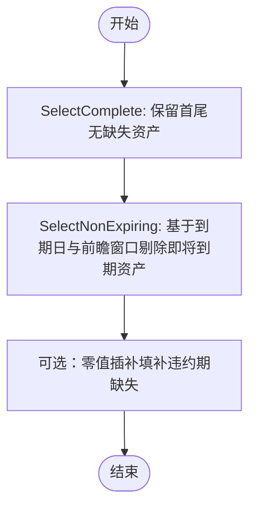

# 资产预筛选教程

<cite>
**本文引用的文件列表**
- [examples/pre_selection/plot_1_drop_correlated.py](file://examples/pre_selection/plot_1_drop_correlated.py)
- [examples/pre_selection/plot_2_select_best_performers.py](file://examples/pre_selection/plot_2_select_best_performers.py)
- [examples/pre_selection/plot_4_incomplete_dataset.py](file://examples/pre_selection/plot_4_incomplete_dataset.py)
- [src/skfolio/pre_selection/__init__.py](file://src/skfolio/pre_selection/__init__.py)
- [src/skfolio/pre_selection/_drop_correlated.py](file://src/skfolio/pre_selection/_drop_correlated.py)
- [src/skfolio/pre_selection/_select_k_extremes.py](file://src/skfolio/pre_selection/_select_k_extremes.py)
- [src/skfolio/pre_selection/_select_complete.py](file://src/skfolio/pre_selection/_select_complete.py)
- [src/skfolio/pre_selection/_select_non_expiring.py](file://src/skfolio/pre_selection/_select_non_expiring.py)
- [src/skfolio/pre_selection/_select_non_dominated.py](file://src/skfolio/pre_selection/_select_non_dominated.py)
- [src/skfolio/pre_selection/_drop_zero_variance.py](file://src/skfolio/pre_selection/_drop_zero_variance.py)
- [docs/user_guide/pre_selection.rst](file://docs/user_guide/pre_selection.rst)
</cite>

## 目录
1. [引言](#引言)
2. [项目结构](#项目结构)
3. [核心组件](#核心组件)
4. [架构总览](#架构总览)
5. [详细组件分析](#详细组件分析)
6. [依赖关系分析](#依赖关系分析)
7. [性能考量](#性能考量)
8. [故障排查指南](#故障排查指南)
9. [结论](#结论)
10. [附录](#附录)

## 引言
本教程围绕资产预筛选技术展开，目标是帮助读者理解并实践以下三类关键能力：
- 基于相关性的资产去冗余：识别并移除高度相关的资产，降低组合冗余与优化不稳定性。
- 基于历史表现的资产优选：从历史收益与风险表现中挑选最优资产子集，提升后续优化效果。
- 在存在缺失数据时的稳健筛选：处理“上市（inception）、到期（expiry）、违约（default）、主动退市”等情形，确保回测与交叉验证的稳健性。

教程以三个示例脚本为载体，分别对应上述主题，并与 pre_selection 模块的 API 文档保持一致，便于读者对照学习与复用。

## 项目结构
本教程涉及的文件主要分布在 examples/pre_selection 示例目录与 src/skfolio/pre_selection 预筛选模块中。下图给出与本教程直接相关的文件组织关系与职责划分。

图表来源
- [examples/pre_selection/plot_1_drop_correlated.py](file://examples/pre_selection/plot_1_drop_correlated.py#L1-L163)
- [examples/pre_selection/plot_2_select_best_performers.py](file://examples/pre_selection/plot_2_select_best_performers.py#L1-L202)
- [examples/pre_selection/plot_4_incomplete_dataset.py](file://examples/pre_selection/plot_4_incomplete_dataset.py#L1-L176)
- [src/skfolio/pre_selection/__init__.py](file://src/skfolio/pre_selection/__init__.py#L1-L18)

章节来源
- [examples/pre_selection/plot_1_drop_correlated.py](file://examples/pre_selection/plot_1_drop_correlated.py#L1-L163)
- [examples/pre_selection/plot_2_select_best_performers.py](file://examples/pre_selection/plot_2_select_best_performers.py#L1-L202)
- [examples/pre_selection/plot_4_incomplete_dataset.py](file://examples/pre_selection/plot_4_incomplete_dataset.py#L1-L176)
- [src/skfolio/pre_selection/__init__.py](file://src/skfolio/pre_selection/__init__.py#L1-L18)

## 核心组件
本节聚焦三个预筛选器及其在示例中的使用方式，帮助读者快速掌握 API 与最佳实践。

- 去冗余相关性筛选（DropCorrelated）
  - 功能要点：基于相关系数矩阵，对高于阈值的相关对进行排序，按“平均相关度最低”的策略逐个剔除冗余资产，避免简单阈值或顺序剔除带来的次优结果。
  - 关键参数：阈值 threshold、是否使用绝对值 absolute。
  - 典型用法：与 DropZeroVariance 组合，先剔除零方差资产，再进行相关性去冗余，最后进入优化器。

- 基于表现的K极值筛选（SelectKExtremes）
  - 功能要点：根据指定度量（默认夏普比率）对单资产进行排序，选取前 k 个最优或最差资产；支持 highest 参数控制方向。
  - 关键参数：k、measure、highest。
  - 典型用法：与优化器（如最小方差）组合，通过网格搜索确定最优 k，提升回测稳定性与收益风险比。

- 缺失数据与到期资产处理（SelectComplete、SelectNonExpiring）
  - 功能要点：SelectComplete 仅保留首尾无缺失的资产；SelectNonExpiring 基于已知到期日与前瞻窗口，剔除即将到期的资产，避免测试期出现异常波动。
  - 关键参数：SelectComplete 的内部缺失开关；SelectNonExpiring 的到期日期映射与前瞻偏移。
  - 典型用法：配合零值插补器（如 SimpleImputer），在回测期间稳健地处理违约与到期事件。

章节来源
- [src/skfolio/pre_selection/_drop_correlated.py](file://src/skfolio/pre_selection/_drop_correlated.py#L1-L109)
- [src/skfolio/pre_selection/_select_k_extremes.py](file://src/skfolio/pre_selection/_select_k_extremes.py#L1-L101)
- [src/skfolio/pre_selection/_select_complete.py](file://src/skfolio/pre_selection/_select_complete.py#L1-L118)
- [src/skfolio/pre_selection/_select_non_expiring.py](file://src/skfolio/pre_selection/_select_non_expiring.py#L1-L151)
- [examples/pre_selection/plot_1_drop_correlated.py](file://examples/pre_selection/plot_1_drop_correlated.py#L1-L163)
- [examples/pre_selection/plot_2_select_best_performers.py](file://examples/pre_selection/plot_2_select_best_performers.py#L1-L202)
- [examples/pre_selection/plot_4_incomplete_dataset.py](file://examples/pre_selection/plot_4_incomplete_dataset.py#L1-L176)

## 架构总览
下图展示了三个示例脚本如何串联数据准备、预筛选与优化器，并通过交叉验证评估模型稳健性。

图表来源
- [examples/pre_selection/plot_1_drop_correlated.py](file://examples/pre_selection/plot_1_drop_correlated.py#L1-L163)
- [examples/pre_selection/plot_2_select_best_performers.py](file://examples/pre_selection/plot_2_select_best_performers.py#L1-L202)
- [examples/pre_selection/plot_4_incomplete_dataset.py](file://examples/pre_selection/plot_4_incomplete_dataset.py#L1-L176)

## 详细组件分析

### 组件A：去冗余相关性筛选（DropCorrelated）
- 算法流程
  - 计算资产收益的相关系数矩阵。
  - 选出高于阈值的相关对，并按相关系数降序排列。
  - 对每一对，若两个资产均未被剔除，则保留平均相关度较低的那个，剔除另一个。
  - 输出布尔掩码 to_keep_，指示最终保留的资产索引。

图表来源
- [src/skfolio/pre_selection/_drop_correlated.py](file://src/skfolio/pre_selection/_drop_correlated.py#L61-L109)

- 示例用法与对比
  - 示例脚本演示了在 MeanRisk（最大夏普）优化前后，加入 DropZeroVariance 与 DropCorrelated 的 Pipeline 前后的资产数量变化与回测分布差异，强调去冗余对稳定性的提升。

章节来源
- [examples/pre_selection/plot_1_drop_correlated.py](file://examples/pre_selection/plot_1_drop_correlated.py#L1-L163)
- [src/skfolio/pre_selection/_drop_correlated.py](file://src/skfolio/pre_selection/_drop_correlated.py#L1-L109)

### 组件B：基于历史表现的K极值筛选（SelectKExtremes）
- 策略思路
  - 将每个资产视为单一资产组合，计算其在指定度量（默认夏普比率）下的得分。
  - 对所有资产按得分排序，取前 k 个（或后 k 个，取决于 highest）作为候选集合。
  - 支持 measure 与 highest 参数灵活切换不同表现维度（如收益、波动、夏普等）。

图表来源
- [src/skfolio/pre_selection/_select_k_extremes.py](file://src/skfolio/pre_selection/_select_k_extremes.py#L63-L101)

- 示例用法与参数调优
  - 示例脚本通过 GridSearchCV 与 WalkForward 交叉验证，在训练集上搜索最优 k，使测试期年化夏普比率最大化，随后在测试集上比较基准模型与预筛选模型的滚动组合累计收益与组合构成。

章节来源
- [examples/pre_selection/plot_2_select_best_performers.py](file://examples/pre_selection/plot_2_select_best_performers.py#L1-L202)
- [src/skfolio/pre_selection/_select_k_extremes.py](file://src/skfolio/pre_selection/_select_k_extremes.py#L1-L101)

### 组件C：缺失数据与到期资产处理（SelectComplete、SelectNonExpiring）
- 处理策略
  - SelectComplete：仅保留首尾无缺失的资产；可选是否同时剔除中间缺失的资产。
  - SelectNonExpiring：基于资产到期日期与前瞻窗口，剔除在测试期即将到期的资产，避免异常波动影响回测。

图表来源
- [src/skfolio/pre_selection/_select_complete.py](file://src/skfolio/pre_selection/_select_complete.py#L82-L113)
- [src/skfolio/pre_selection/_select_non_expiring.py](file://src/skfolio/pre_selection/_select_non_expiring.py#L101-L146)

- 示例用法与稳健性
  - 示例脚本构造了包含“上市晚、违约、到期、完整”四类资产的合成数据，演示在不同回测周期内如何正确应用上述规则，并通过 GridSearchCV 寻找最优到期退出提前量，提升回测稳健性。

章节来源
- [examples/pre_selection/plot_4_incomplete_dataset.py](file://examples/pre_selection/plot_4_incomplete_dataset.py#L1-L176)
- [src/skfolio/pre_selection/_select_complete.py](file://src/skfolio/pre_selection/_select_complete.py#L1-L118)
- [src/skfolio/pre_selection/_select_non_expiring.py](file://src/skfolio/pre_selection/_select_non_expiring.py#L1-L151)

## 依赖关系分析
- 预筛选器导出
  - __init__.py 将 DropCorrelated、DropZeroVariance、SelectComplete、SelectKExtremes、SelectNonDominated、SelectNonExpiring 统一导出，便于用户直接从 skfolio.pre_selection 引入。

- 示例脚本与预筛选器的关系
  - plot_1_drop_correlated.py：引入 DropCorrelated 与 DropZeroVariance，并与 MeanRisk 组成 Pipeline。
  - plot_2_select_best_performers.py：引入 SelectKExtremes，并与 MeanRisk（最小方差）组成 Pipeline，结合 GridSearchCV 进行参数搜索。
  - plot_4_incomplete_dataset.py：引入 SelectComplete、SelectNonExpiring，并与 SimpleImputer、EqualWeighted 组成 Pipeline，演示在存在缺失与到期事件时的稳健筛选。

图表来源
- [src/skfolio/pre_selection/__init__.py](file://src/skfolio/pre_selection/__init__.py#L1-L18)
- [examples/pre_selection/plot_1_drop_correlated.py](file://examples/pre_selection/plot_1_drop_correlated.py#L1-L163)
- [examples/pre_selection/plot_2_select_best_performers.py](file://examples/pre_selection/plot_2_select_best_performers.py#L1-L202)
- [examples/pre_selection/plot_4_incomplete_dataset.py](file://examples/pre_selection/plot_4_incomplete_dataset.py#L1-L176)

章节来源
- [src/skfolio/pre_selection/__init__.py](file://src/skfolio/pre_selection/__init__.py#L1-L18)

## 性能考量
- 相关性去冗余
  - 计算相关系数矩阵的时间复杂度约为 O(n^2)，当资产数较大时，建议先做资产规模控制（如按流动性或波动率初筛），再进行相关性去冗余。
  - 阈值设置需结合业务目标：过高会过度剔除导致信息损失，过低则无法有效去冗余。

- K极值筛选
  - k 值越大，组合多样性越高但可能稀释超额收益；k 值过小可能导致过拟合。建议通过交叉验证网格搜索确定最优 k。

- 缺失数据与到期处理
  - SelectComplete 的内部缺失开关会影响资产保留比例，需根据回测长度与数据质量权衡。
  - SelectNonExpiring 的前瞻窗口直接影响测试期稳定性，应结合资产类别与交易频率进行调参。

[本节提供通用指导，无需特定文件引用]

## 故障排查指南
- DropCorrelated
  - 阈值越界：阈值必须在 [-1, 1] 区间，否则抛出异常。请检查输入参数范围。
  - 相关系数矩阵奇异：若资产间存在完全线性相关，可能导致矩阵病态。建议先进行 DropZeroVariance 或初筛。

- SelectKExtremes
  - k 必须为正整数，否则抛出异常。请确保参数 grid 中的 k 值满足约束。

- SelectComplete
  - 若开启内部缺失剔除，将剔除任何包含缺失的资产，可能导致资产池大幅缩小。请根据数据质量决定是否启用。

- SelectNonExpiring
  - 需要提供到期日期映射与前瞻偏移，且输入必须为带日期索引的 DataFrame。请核对索引类型与参数配置。

章节来源
- [src/skfolio/pre_selection/_drop_correlated.py](file://src/skfolio/pre_selection/_drop_correlated.py#L77-L83)
- [src/skfolio/pre_selection/_select_k_extremes.py](file://src/skfolio/pre_selection/_select_k_extremes.py#L80-L83)
- [src/skfolio/pre_selection/_select_complete.py](file://src/skfolio/pre_selection/_select_complete.py#L98-L107)
- [src/skfolio/pre_selection/_select_non_expiring.py](file://src/skfolio/pre_selection/_select_non_expiring.py#L117-L141)

## 结论
通过本教程，读者可以系统掌握三类资产预筛选方法：
- 使用 DropCorrelated 降低组合冗余，提升优化稳定性；
- 使用 SelectKExtremes 基于历史表现挑选最优资产子集，并通过交叉验证确定最优参数；
- 使用 SelectComplete 与 SelectNonExpiring 处理缺失与到期问题，确保回测稳健性。

这些方法均可无缝集成到 Pipeline 中，配合优化器与交叉验证工具，形成可复用、可扩展的资产筛选流水线。

[本节为总结性内容，无需特定文件引用]

## 附录
- API 文档参考
  - 预筛选器统一导出与使用示例可参考用户指南文档。
  - 示例脚本展示了与 MeanRisk、EqualWeighted 等优化器的组合方式，以及与 GridSearchCV、WalkForward 等工具的协同。

章节来源
- [docs/user_guide/pre_selection.rst](file://docs/user_guide/pre_selection.rst#L1-L76)
- [examples/pre_selection/plot_1_drop_correlated.py](file://examples/pre_selection/plot_1_drop_correlated.py#L1-L163)
- [examples/pre_selection/plot_2_select_best_performers.py](file://examples/pre_selection/plot_2_select_best_performers.py#L1-L202)
- [examples/pre_selection/plot_4_incomplete_dataset.py](file://examples/pre_selection/plot_4_incomplete_dataset.py#L1-L176)