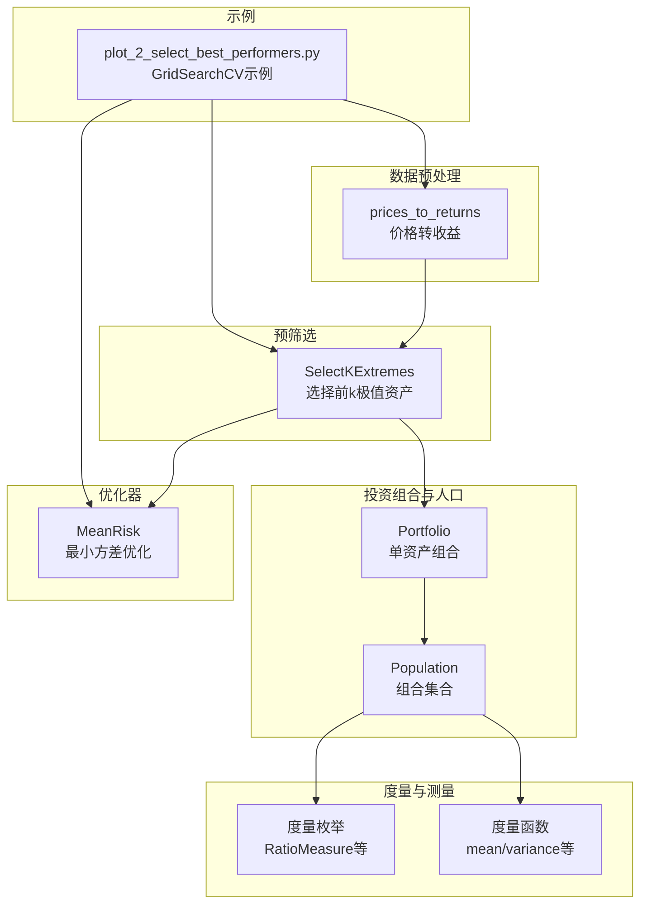
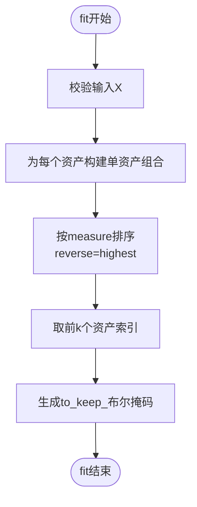
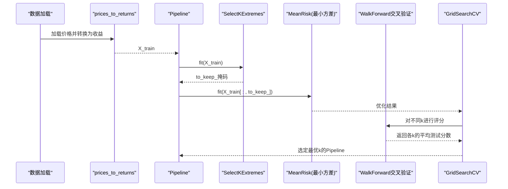
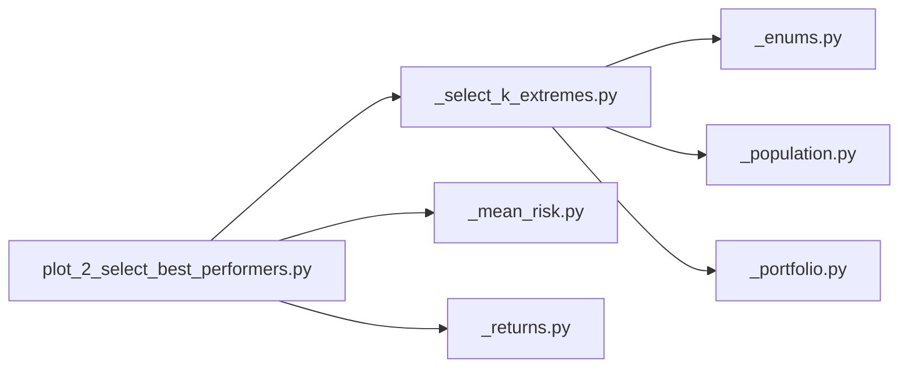

# 选择最优表现资产

<cite>
**本文引用的文件**
- [src/skfolio/pre_selection/_select_k_extremes.py](file://src/skfolio/pre_selection/_select_k_extremes.py)
- [examples/pre_selection/plot_2_select_best_performers.py](file://examples/pre_selection/plot_2_select_best_performers.py)
- [src/skfolio/measures/_enums.py](file://src/skfolio/measures/_enums.py)
- [src/skfolio/measures/_measures.py](file://src/skfolio/measures/_measures.py)
- [src/skfolio/portfolio/_base.py](file://src/skfolio/portfolio/_base.py)
- [src/skfolio/population/_population.py](file://src/skfolio/population/_population.py)
- [src/skfolio/preprocessing/_returns.py](file://src/skfolio/preprocessing/_returns.py)
- [src/skfolio/optimization/convex/_mean_risk.py](file://src/skfolio/optimization/convex/_mean_risk.py)
- [tests/test_pre_selection/test_select_k_extremes.py](file://tests/test_pre_selection/test_select_k_extremes.py)
</cite>

## 目录
1. [简介](#简介)
2. [项目结构](#项目结构)
3. [核心组件](#核心组件)
4. [架构总览](#架构总览)
5. [详细组件分析](#详细组件分析)
6. [依赖关系分析](#依赖关系分析)
7. [性能考量](#性能考量)
8. [故障排查指南](#故障排查指南)
9. [结论](#结论)
10. [附录](#附录)

## 简介
本篇文档围绕预筛选变换器 SelectKExtremes 展开，系统阐述其如何基于指定度量（如夏普比率）从历史收益中为每个资产构建单资产投资组合，按度量排序后保留前 k 个资产。文档覆盖参数 k、measure 和 highest 的配置与影响；说明如何将其与最小方差优化器结合到 Pipeline 中；并通过示例脚本展示如何使用 GridSearchCV 配合滚动时间窗交叉验证（WalkForward）在训练集上寻找使样本外年化夏普比率最大化的最优预筛选资产数量 k；最后给出性能评估与组合构成分析的实践建议。

## 项目结构
SelectKExtremes 位于预筛选模块，配合度量枚举、人口（Population）与投资组合（Portfolio）类完成“单资产组合构建—度量排序—子集选择”的流程；示例脚本展示了在 Pipeline 中与 MeanRisk 最小方差优化器联用，并通过 WalkForward 交叉验证进行超参数搜索。



图表来源
- [src/skfolio/pre_selection/_select_k_extremes.py](file://src/skfolio/pre_selection/_select_k_extremes.py#L1-L101)
- [src/skfolio/measures/_enums.py](file://src/skfolio/measures/_enums.py#L278-L358)
- [src/skfolio/measures/_measures.py](file://src/skfolio/measures/_measures.py#L1-L200)
- [src/skfolio/portfolio/_base.py](file://src/skfolio/portfolio/_base.py#L288-L484)
- [src/skfolio/population/_population.py](file://src/skfolio/population/_population.py#L1-L200)
- [src/skfolio/optimization/convex/_mean_risk.py](file://src/skfolio/optimization/convex/_mean_risk.py#L1-L200)
- [src/skfolio/preprocessing/_returns.py](file://src/skfolio/preprocessing/_returns.py#L1-L133)
- [examples/pre_selection/plot_2_select_best_performers.py](file://examples/pre_selection/plot_2_select_best_performers.py#L1-L202)

章节来源
- [src/skfolio/pre_selection/_select_k_extremes.py](file://src/skfolio/pre_selection/_select_k_extremes.py#L1-L101)
- [examples/pre_selection/plot_2_select_best_performers.py](file://examples/pre_selection/plot_2_select_best_performers.py#L1-L202)

## 核心组件
- SelectKExtremes：实现特征选择逻辑，基于历史收益对单资产组合进行度量排序，返回保留资产的布尔掩码。
- 度量体系：RatioMeasure 提供夏普比率及其年化版本等比率型度量；PerfMeasure/RiskMeasure 提供均值、方差等性能与风险度量。
- 投资组合与人口：Portfolio 表示单资产组合；Population 支持对多个组合进行批量度量与可视化。
- 优化器：MeanRisk 支持多种目标函数（最小化风险、最大化收益、最大化效用、最大化比率），可与预筛选结合。
- 数据预处理：prices_to_returns 将价格转换为线性或对数收益，确保后续计算一致性。

章节来源
- [src/skfolio/pre_selection/_select_k_extremes.py](file://src/skfolio/pre_selection/_select_k_extremes.py#L1-L101)
- [src/skfolio/measures/_enums.py](file://src/skfolio/measures/_enums.py#L278-L358)
- [src/skfolio/portfolio/_base.py](file://src/skfolio/portfolio/_base.py#L288-L484)
- [src/skfolio/population/_population.py](file://src/skfolio/population/_population.py#L1-L200)
- [src/skfolio/optimization/convex/_mean_risk.py](file://src/skfolio/optimization/convex/_mean_risk.py#L1-L200)
- [src/skfolio/preprocessing/_returns.py](file://src/skfolio/preprocessing/_returns.py#L1-L133)

## 架构总览
SelectKExtremes 在 fit 阶段：
- 输入为 (n_obs, n_assets) 的资产收益矩阵；
- 为每个资产构建权重为单位向量的单资产组合；
- 使用 Population.sort_measure 按指定度量排序；
- 取前 k 个资产索引，生成 to_keep_ 布尔掩码；
- transform 时仅保留 to_keep_ 为 True 的列。

随后在 Pipeline 中与 MeanRisk 结合：先预筛选，再进行最小方差优化；示例脚本通过 GridSearchCV 在 WalkForward 交叉验证下搜索最优 k，以最大化样本外年化夏普比率。

```mermaid
sequenceDiagram
participant Data as "收益数据X"
participant Pre as "SelectKExtremes"
participant Pop as "Population"
participant Opt as "MeanRisk(最小方差)"
participant Pipe as "Pipeline"
Data->>Pre : fit(X)
Pre->>Pop : 为每个资产构建单资产组合
Pop-->>Pre : 计算各资产度量并排序
Pre-->>Pipe : 生成to_keep_掩码
Pipe->>Opt : fit(X[ : , to_keep_])
Opt-->>Pipe : 输出优化权重
Pipe-->>Data : predict得到多期组合
```

图表来源
- [src/skfolio/pre_selection/_select_k_extremes.py](file://src/skfolio/pre_selection/_select_k_extremes.py#L63-L101)
- [src/skfolio/population/_population.py](file://src/skfolio/population/_population.py#L1-L200)
- [src/skfolio/optimization/convex/_mean_risk.py](file://src/skfolio/optimization/convex/_mean_risk.py#L1-L200)
- [examples/pre_selection/plot_2_select_best_performers.py](file://examples/pre_selection/plot_2_select_best_performers.py#L62-L89)

## 详细组件分析

### SelectKExtremes 工作原理与参数
- 参数
  - k：要保留的资产数量；若超过资产总数则全部保留。
  - measure：用于排序的度量，默认为 RatioMeasure.SHARPE_RATIO（夏普比率）。
  - highest：True 时选择度量最高的前 k 个，False 时选择最低的 k 个。
- 处理流程
  - 校验输入；
  - 为每个资产构建单资产组合（权重为单位向量）；
  - 使用 Population.sort_measure(measure, reverse=highest) 排序；
  - 取前 k 个资产索引，生成 to_keep_ 布尔数组；
  - transform 返回仅包含 to_keep_=True 的列。
- 错误处理
  - k 必须严格为正数，否则抛出异常。



图表来源
- [src/skfolio/pre_selection/_select_k_extremes.py](file://src/skfolio/pre_selection/_select_k_extremes.py#L63-L101)

章节来源
- [src/skfolio/pre_selection/_select_k_extremes.py](file://src/skfolio/pre_selection/_select_k_extremes.py#L1-L101)
- [tests/test_pre_selection/test_select_k_extremes.py](file://tests/test_pre_selection/test_select_k_extremes.py#L1-L31)

### 与度量体系的关系
- RatioMeasure.SHARPE_RATIO 与 ANNUALIZED_SHARPE_RATIO：分别对应标准差与年化标准差的风险分母，适合衡量单位风险的超额收益。
- 其他可用度量（如 MEAN、VARIANCE、SORTINO_RATIO 等）可通过 measure 参数切换，以适配不同策略偏好。
- Portfolio 与 Population 提供统一的度量访问接口，便于排序与评估。

章节来源
- [src/skfolio/measures/_enums.py](file://src/skfolio/measures/_enums.py#L278-L358)
- [src/skfolio/portfolio/_base.py](file://src/skfolio/portfolio/_base.py#L288-L484)
- [src/skfolio/population/_population.py](file://src/skfolio/population/_population.py#L1-L200)

### 在 Pipeline 中与最小方差优化器结合
- 示例脚本创建了包含 SelectKExtremes 与 MeanRisk 的 Pipeline；
- 使用 WalkForward 交叉验证在训练集上进行网格搜索，参数为 pre_selection__k；
- 评分指标使用 make_scorer(RatioMeasure.ANNUALIZED_SHARPE_RATIO)，以最大化样本外年化夏普比率为目标；
- 最终比较基准模型（无预筛选）与带预筛选模型的滚动累计收益与组合构成。



图表来源
- [examples/pre_selection/plot_2_select_best_performers.py](file://examples/pre_selection/plot_2_select_best_performers.py#L1-L202)
- [src/skfolio/preprocessing/_returns.py](file://src/skfolio/preprocessing/_returns.py#L1-L133)
- [src/skfolio/optimization/convex/_mean_risk.py](file://src/skfolio/optimization/convex/_mean_risk.py#L1-L200)

章节来源
- [examples/pre_selection/plot_2_select_best_performers.py](file://examples/pre_selection/plot_2_select_best_performers.py#L62-L89)

### 参数配置与影响
- k
  - 较小的 k 会降低维度，减少优化器求解难度，但可能遗漏优质资产；
  - 较大的 k 更接近全市场，提升捕捉机会的概率，但可能引入噪声与多重共线性。
- measure
  - 若目标是追求稳健收益，可考虑 SORTINO_RATIO（仅惩罚下行风险）；
  - 若追求绝对收益，可考虑 MEAN 或 ANNUALIZED_MEAN；
  - 若关注风险调整收益，SHARPE_RATIO 或 ANNUALIZED_SHARPE_RATIO 是常用选择。
- highest
  - True 选择表现最好（高比率/高收益）的资产；
  - False 选择表现最差的资产（可用于剔除劣质资产或做空策略）。

章节来源
- [src/skfolio/pre_selection/_select_k_extremes.py](file://src/skfolio/pre_selection/_select_k_extremes.py#L24-L37)
- [src/skfolio/measures/_enums.py](file://src/skfolio/measures/_enums.py#L278-L358)

### 性能评估与组合构成分析
- 示例脚本展示了如何使用 cross_val_predict 在测试集上评估两个模型（基准与预筛选+优化）的滚动累计收益与组合构成；
- 通过 Population 可汇总多个预测结果，便于对比与可视化；
- 建议关注指标包括：年化夏普比率、波动率、最大回撤、组合集中度与换手率等。

章节来源
- [examples/pre_selection/plot_2_select_best_performers.py](file://examples/pre_selection/plot_2_select_best_performers.py#L168-L202)
- [src/skfolio/population/_population.py](file://src/skfolio/population/_population.py#L1-L200)

## 依赖关系分析
- SelectKExtremes 依赖度量枚举（RatioMeasure）与 Population/Portfolio；
- 示例脚本依赖 Pipeline、GridSearchCV、WalkForward、make_scorer 以及 MeanRisk；
- 数据预处理依赖 prices_to_returns，确保收益数据格式一致。



图表来源
- [src/skfolio/pre_selection/_select_k_extremes.py](file://src/skfolio/pre_selection/_select_k_extremes.py#L1-L101)
- [src/skfolio/measures/_enums.py](file://src/skfolio/measures/_enums.py#L278-L358)
- [src/skfolio/population/_population.py](file://src/skfolio/population/_population.py#L1-L200)
- [examples/pre_selection/plot_2_select_best_performers.py](file://examples/pre_selection/plot_2_select_best_performers.py#L1-L202)
- [src/skfolio/optimization/convex/_mean_risk.py](file://src/skfolio/optimization/convex/_mean_risk.py#L1-L200)
- [src/skfolio/preprocessing/_returns.py](file://src/skfolio/preprocessing/_returns.py#L1-L133)

章节来源
- [src/skfolio/pre_selection/_select_k_extremes.py](file://src/skfolio/pre_selection/_select_k_extremes.py#L1-L101)
- [examples/pre_selection/plot_2_select_best_performers.py](file://examples/pre_selection/plot_2_select_best_performers.py#L1-L202)

## 性能考量
- 计算复杂度
  - 单资产组合数量等于资产数 n，Population.sort_measure 的排序成本约为 O(n log n)；
  - 整体复杂度近似 O(n)（忽略排序常数项），在 n 较大时仍具可扩展性。
- 数值稳定性
  - 夏普比率涉及收益与波动估计，建议在高维场景下谨慎使用；
  - 若协方差非正定，优化器通常具备鲁棒处理机制（例如最近正定矩阵替换）。
- 维度灾难与多重共线性
  - 过大 k 可能导致协方差矩阵病态，建议结合降维或稀疏估计方法；
  - 可在预筛选前加入去相关或零方差剔除步骤以改善条件数。

## 故障排查指南
- k 必须为正整数
  - 若传入非正数，fit 将抛出异常；请检查参数范围。
- 输入数据格式
  - 确保 X 为二维数组且列名可识别（以便 feature_names_in_ 与 get_feature_names_out 对齐）。
- 度量不可用
  - 若 measure 未在度量枚举中定义，需确认名称是否正确或是否属于额外度量类别。
- 交叉验证评分
  - 使用 make_scorer 包装 RatioMeasure 时，确保预测对象支持相应度量属性（如 sharpe_ratio/annualized_sharpe_ratio）。

章节来源
- [src/skfolio/pre_selection/_select_k_extremes.py](file://src/skfolio/pre_selection/_select_k_extremes.py#L79-L83)
- [tests/test_pre_selection/test_select_k_extremes.py](file://tests/test_pre_selection/test_select_k_extremes.py#L1-L31)
- [src/skfolio/portfolio/_base.py](file://src/skfolio/portfolio/_base.py#L288-L484)

## 结论
SelectKExtremes 通过“单资产组合构建—度量排序—子集选择”的简洁流程，为后续优化提供高质量候选资产池。结合示例脚本的 GridSearchCV 与 WalkForward 交叉验证，可在训练集上自动搜索最优预筛选规模 k，以最大化样本外年化夏普比率。实践中应综合考虑 k 的大小、度量的选择与 highest 的方向，并结合组合构成与风险指标进行整体评估。

## 附录
- 实践建议
  - 优先尝试 SHARPE_RATIO 或 ANNUALIZED_SHARPE_RATIO 作为度量；
  - 从较小 k 开始逐步扩大，观察测试分数变化趋势；
  - 在预筛选前后分别记录组合集中度与换手率，避免过度交易；
  - 如遇协方差非正定问题，可启用优化器的鲁棒设置或采用稀疏估计方法。