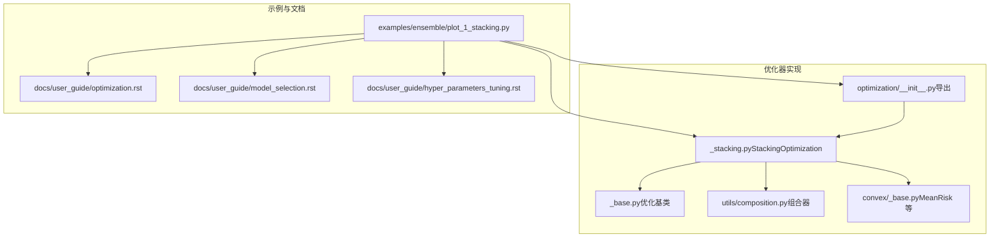
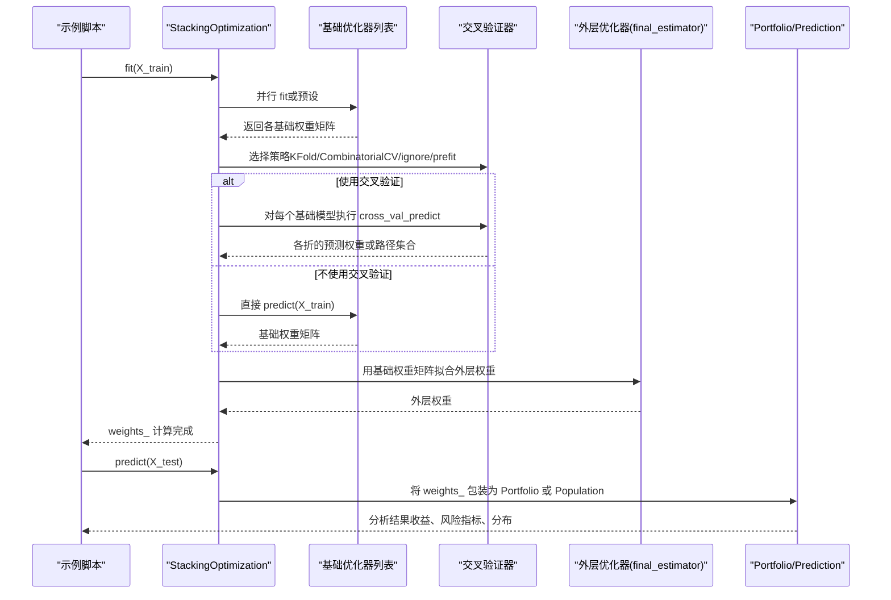
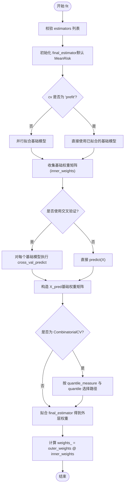
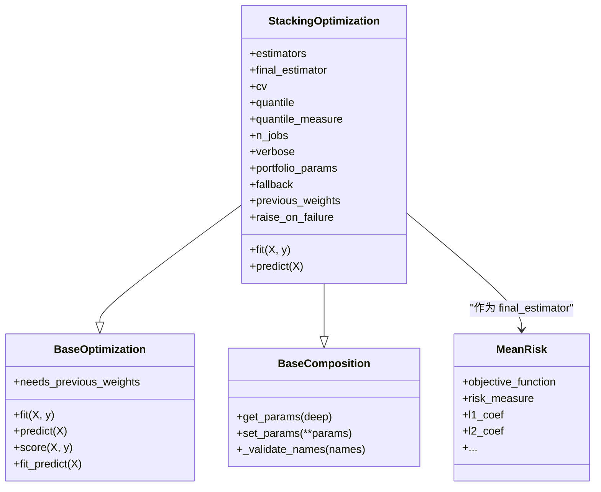

# 集成优化与模型堆叠教程

<cite>
**本文引用的文件**
- [plot_1_stacking.py](file://examples/ensemble/plot_1_stacking.py)
- [_stacking.py](file://src/skfolio/optimization/ensemble/_stacking.py)
- [_base.py（优化基类）](file://src/skfolio/optimization/_base.py)
- [optimization/__init__.py](file://src/skfolio/optimization/__init__.py)
- [convex/_base.py](file://src/skfolio/optimization/convex/_base.py)
- [composition.py](file://src/skfolio/utils/composition.py)
- [optimization.rst](file://docs/user_guide/optimization.rst)
- [model_selection.rst](file://docs/user_guide/model_selection.rst)
- [hyper_parameters_tuning.rst](file://docs/user_guide/hyper_parameters_tuning.rst)
</cite>

## 目录
1. [引言](#引言)
2. [项目结构](#项目结构)
3. [核心组件](#核心组件)
4. [架构总览](#架构总览)
5. [详细组件分析](#详细组件分析)
6. [依赖关系分析](#依赖关系分析)
7. [性能考量](#性能考量)
8. [故障排查指南](#故障排查指南)
9. [结论](#结论)
10. [附录](#附录)

## 引言
本教程围绕示例脚本 plot_1_stacking.py，系统讲解如何使用模型堆叠（Stacking）方法组合多个基础优化器（如逆波动率、最大分散化、均值-风险最大化、分层等风险贡献等），通过“外层优化器”对各基础模型输出权重进行再加权，从而提升投资组合的稳健性与跨样本稳定性。教程将深入解析 StackingOptimization 的 fit 和 predict 调用逻辑，说明元学习器（final_estimator）的设计、基础模型输出的加权机制、交叉验证在权重学习中的应用，以及最终投资组合权重的生成流程。同时提供参数调优与性能对比实验的方法指引，并链接至用户指南中关于优化、模型选择与超参调优的相关章节。

## 项目结构
- 示例脚本位于 examples/ensemble/plot_1_stacking.py，演示了如何构建 StackingOptimization 模型、参数调优、预测与可视化分析。
- 核心实现位于 src/skfolio/optimization/ensemble/_stacking.py，定义了 StackingOptimization 类及其 fit/predict 行为。
- 基类与通用行为位于 src/skfolio/optimization/_base.py，包含统一的 fit/fallback/predict 接口。
- 组合器工具位于 src/skfolio/utils/composition.py，负责复合估计器的参数管理。
- MeanRisk 等具体优化器位于 src/skfolio/optimization/convex/_base.py 及其子模块，作为基础/元优化器使用。
- 用户指南文档位于 docs/user_guide，包含优化、模型选择与超参调优的完整说明。

图表来源
- [plot_1_stacking.py](file://examples/ensemble/plot_1_stacking.py#L1-L253)
- [_stacking.py](file://src/skfolio/optimization/ensemble/_stacking.py#L1-L409)
- [_base.py（优化基类）](file://src/skfolio/optimization/_base.py#L1-L583)
- [composition.py](file://src/skfolio/utils/composition.py#L1-L90)
- [convex/_base.py](file://src/skfolio/optimization/convex/_base.py#L1-L800)
- [optimization/__init__.py](file://src/skfolio/optimization/__init__.py#L1-L43)

章节来源
- [plot_1_stacking.py](file://examples/ensemble/plot_1_stacking.py#L1-L253)
- [_stacking.py](file://src/skfolio/optimization/ensemble/_stacking.py#L1-L409)
- [_base.py（优化基类）](file://src/skfolio/optimization/_base.py#L1-L583)
- [composition.py](file://src/skfolio/utils/composition.py#L1-L90)
- [convex/_base.py](file://src/skfolio/optimization/convex/_base.py#L1-L800)
- [optimization/__init__.py](file://src/skfolio/optimization/__init__.py#L1-L43)

## 核心组件
- StackingOptimization：集成多个基础优化器并以“外层优化器”对基础权重进行再加权，避免数据泄露，支持多种交叉验证策略。
- BaseOptimization：所有优化器的抽象基类，提供统一的 fit/predict/fallback 接口与 Portfolio/Population 输出。
- BaseComposition：复合估计器参数管理工具，支持嵌套参数设置与替换。
- MeanRisk：典型元学习器，可作为 final_estimator 使用，支持多种目标函数与风险度量。

章节来源
- [_stacking.py](file://src/skfolio/optimization/ensemble/_stacking.py#L1-L409)
- [_base.py（优化基类）](file://src/skfolio/optimization/_base.py#L1-L583)
- [composition.py](file://src/skfolio/utils/composition.py#L1-L90)
- [convex/_base.py](file://src/skfolio/optimization/convex/_base.py#L1-L800)

## 架构总览
下图展示了 StackingOptimization 在 fit/predict 阶段的关键交互：基础优化器在训练集上拟合并产出权重；根据 cv 设置，使用 cross_val_predict 或直接使用全样本预测得到基础权重矩阵；随后以这些权重作为输入，训练 final_estimator 得到外层权重；最终资产权重为外层权重与基础权重矩阵的矩阵乘积。

图表来源
- [plot_1_stacking.py](file://examples/ensemble/plot_1_stacking.py#L80-L144)
- [_stacking.py](file://src/skfolio/optimization/ensemble/_stacking.py#L296-L409)
- [_base.py（优化基类）](file://src/skfolio/optimization/_base.py#L288-L375)

## 详细组件分析

### StackingOptimization 类与工作流
- 参数与属性
  - estimators：基础优化器列表，每个元素为 (name, estimator) 元组。
  - final_estimator：外层优化器，默认使用 MeanRisk。
  - cv：交叉验证策略，支持 KFold、CombinatorialPurgedCV、"prefit"、"ignore" 等。
  - quantile/quantile_measure：当使用 CombinatorialCV 时，用于从多路径中选择特定分位路径。
  - n_jobs/verbose/portfolio_params/fallback/previous_weights/raise_on_failure：控制并行、日志、回测参数与失败处理。
- fit 流程要点
  - 校验 estimators 列表合法性与名称唯一性。
  - 初始化 final_estimator（默认 MeanRisk）。
  - 若 cv="prefit"，直接使用已拟合的基础模型；否则并行拟合所有基础模型，保存 estimators_ 与 named_estimators_。
  - 收集基础权重矩阵（inner_weights）：
    - 当 cv 为 "ignore"/"prefit" 时，直接使用 predict(X) 得到基础权重矩阵；
    - 否则对每个基础模型执行 cross_val_predict，得到每折预测权重，组合为矩阵。
  - 若使用 CombinatorialCV，则按 quantile_measure 与 quantile 选择一条代表性路径。
  - 以基础权重矩阵为 X_pred 拟合 final_estimator，得到外层权重 outer_weights。
  - 最终资产权重 weights_ = outer_weights @ inner_weights。
- predict 流程
  - 基于 weights_ 生成 Portfolio 或 Population，自动注入 portfolio_params（如交易成本、管理费、前一时刻权重、无风险利率等）。
  - 若 raise_on_failure=False 且 weights_=None，返回 FailedPortfolio。

图表来源
- [_stacking.py](file://src/skfolio/optimization/ensemble/_stacking.py#L296-L409)

章节来源
- [_stacking.py](file://src/skfolio/optimization/ensemble/_stacking.py#L1-L409)

### 基础优化器与元学习器设计
- MeanRisk 作为元学习器
  - 支持多种目标函数（最小化风险、最大化期望回报、最大化效用、最大化比率）与风险度量（方差、半方差、CVaR、CDaR、最大回撤等）。
  - 支持预算约束、权重上下界、交易成本、管理费用、L1/L2 正则、不确定性集等高级特性。
  - 适合作为 Stacking 的 final_estimator，对基础权重进行再优化。
- 基类 BaseOptimization
  - 提供统一的 fit/predict/fallback 接口，支持失败链路记录与回退策略。
  - predict 自动将 weights_ 封装为 Portfolio 或 Population，并注入 portfolio_params。

章节来源
- [convex/_base.py](file://src/skfolio/optimization/convex/_base.py#L1-L800)
- [_base.py（优化基类）](file://src/skfolio/optimization/_base.py#L1-L583)

### 组合器参数管理（BaseComposition）
- 支持对复合估计器（如 StackingOptimization）的嵌套参数进行统一管理，允许通过 "estimator__param" 的形式访问与设置内部参数。
- 在 Stacking 中，可通过 set_params 对每个基础模型的参数进行细粒度配置。

章节来源
- [composition.py](file://src/skfolio/utils/composition.py#L1-L90)
- [_stacking.py](file://src/skfolio/optimization/ensemble/_stacking.py#L242-L285)

### 示例脚本逐行解析（fit/predict 调用链）
- 数据准备与拆分
  - 加载 FTSE 100 价格数据，转换为日度收益序列，按时间顺序划分训练/测试集。
- 基础模型与堆叠配置
  - 定义四个基础优化器（逆波动率、最大分散化、带 L1 正则的最大均值-风险效用最大化、分层等风险贡献）。
  - 创建 StackingOptimization，指定 final_estimator 为 MeanRisk（最大化效用，风险度量为 CDaR）。
- 基准与参数调优
  - EqualWeighted 作为基准模型。
  - 使用 GridSearchCV + WalkForward 进行参数搜索，优化 Calmar 比率，搜索空间包括：
    - model2（最大分散化）的先验协方差估计器（经验协方差 vs Ledoit-Wolf）；
    - model3（均值-风险）的 L1 正则系数；
    - model4（分层等风险贡献）的风险度量（方差 vs Gini 平均差）。
- 预测与评估
  - 使用 cross_val_predict 在测试集上对基准与堆叠模型进行滚动预测，得到 MultiPeriodPortfolio。
  - 将两个预测结果放入 Population，绘制累计收益与成分分布。
  - 通过 RatioMeasure 指标（夏普比率、CVaR 比率、Calmar 比率）进行对比分析。
  - 使用 CombinatorialPurgedCV 生成多条测试路径，绘制堆叠模型的夏普比率分布并统计均值与标准差。
  - 对各基础模型分别进行 cross_val_predict，与堆叠模型一起绘制分布对比，观察集成优势。

章节来源
- [plot_1_stacking.py](file://examples/ensemble/plot_1_stacking.py#L1-L253)

## 依赖关系分析
- StackingOptimization 继承自 BaseOptimization 与 BaseComposition，复用统一的 fit/predict/fallback 与参数管理能力。
- 基础模型与 final_estimator 均为 BaseOptimization 子类，确保一致的接口与行为。
- 交叉验证策略由 model_selection 模块提供，支持 KFold、WalkForward、CombinatorialPurgedCV 等，避免时间序列数据的泄露问题。
- 导出入口位于 optimization/__init__.py，便于用户直接从 skfolio.optimization 导入 StackingOptimization。

图表来源
- [_stacking.py](file://src/skfolio/optimization/ensemble/_stacking.py#L1-L409)
- [_base.py（优化基类）](file://src/skfolio/optimization/_base.py#L1-L583)
- [composition.py](file://src/skfolio/utils/composition.py#L1-L90)
- [convex/_base.py](file://src/skfolio/optimization/convex/_base.py#L1-L800)

章节来源
- [_stacking.py](file://src/skfolio/optimization/ensemble/_stacking.py#L1-L409)
- [_base.py（优化基类）](file://src/skfolio/optimization/_base.py#L1-L583)
- [composition.py](file://src/skfolio/utils/composition.py#L1-L90)
- [convex/_base.py](file://src/skfolio/optimization/convex/_base.py#L1-L800)

## 性能考量
- 交叉验证策略
  - 使用时间序列专用的 WalkForward 或 CombinatorialPurgedCV，避免数据泄露，提高评估稳健性。
  - CombinatorialCV 可生成多条测试路径，通过 quantile 与 quantile_measure 选择代表性路径，提升评估的鲁棒性。
- 并行化
  - StackingOptimization 支持 n_jobs 控制基础模型并行拟合与 cross_val_predict 的并行度，加速大规模实验。
- 失败处理与回退
  - BaseOptimization 的 fallback 机制可在主优化失败时尝试备选优化器或使用 previous_weights，提升稳定性。
- 复杂度与内存
  - 基础权重矩阵形状为 (n_folds, n_models, n_assets)，当基础模型较多或交叉验证折数较大时需关注内存占用。

章节来源
- [_stacking.py](file://src/skfolio/optimization/ensemble/_stacking.py#L296-L409)
- [_base.py（优化基类）](file://src/skfolio/optimization/_base.py#L131-L256)

## 故障排查指南
- 常见问题
  - 未拟合错误：调用 predict 前必须先 fit；若 raise_on_failure=False 且 weights_=None，predict 将返回 FailedPortfolio。
  - 参数命名冲突：基础模型名称不能与构造函数参数名相同，也不能包含 "__"。
  - 数据泄露：使用 KFold/train_test_split 时请保持 shuffle=False，避免时间序列特征的前后信息泄漏。
  - 失败回退：检查 fallback_chain_ 了解回退链路与失败原因；必要时启用 previous_weights 回退。
- 建议
  - 在参数搜索中使用 make_scorer 指定更贴合业务目标的评分指标（如 Calmar 比率）。
  - 对基础模型与 final_estimator 的关键参数进行网格搜索，结合 CombinatorialPurgedCV 的分布分析验证稳定性。

章节来源
- [_base.py（优化基类）](file://src/skfolio/optimization/_base.py#L131-L256)
- [model_selection.rst](file://docs/user_guide/model_selection.rst#L1-L201)
- [hyper_parameters_tuning.rst](file://docs/user_guide/hyper_parameters_tuning.rst#L1-L336)

## 结论
通过 StackingOptimization，我们能够将多个基础优化器的优势整合到一个统一的外层优化框架中，利用交叉验证避免数据泄露，借助 MeanRisk 等元学习器对基础权重进行再优化，最终得到更稳健的投资组合权重。示例脚本提供了完整的参数调优、预测与可视化流程，配合用户指南中的优化、模型选择与超参调优章节，可帮助读者快速掌握集成优化的最佳实践。

## 附录
- 用户指南链接
  - 优化模块与 StackingOptimization 使用示例：[optimization.rst](file://docs/user_guide/optimization.rst#L719-L776)
  - 模型选择与 cross_val_predict 的时间序列注意事项：[model_selection.rst](file://docs/user_guide/model_selection.rst#L1-L95)
  - 超参调优与 GridSearchCV/RandomizedSearchCV 使用：[hyper_parameters_tuning.rst](file://docs/user_guide/hyper_parameters_tuning.rst#L1-L336)