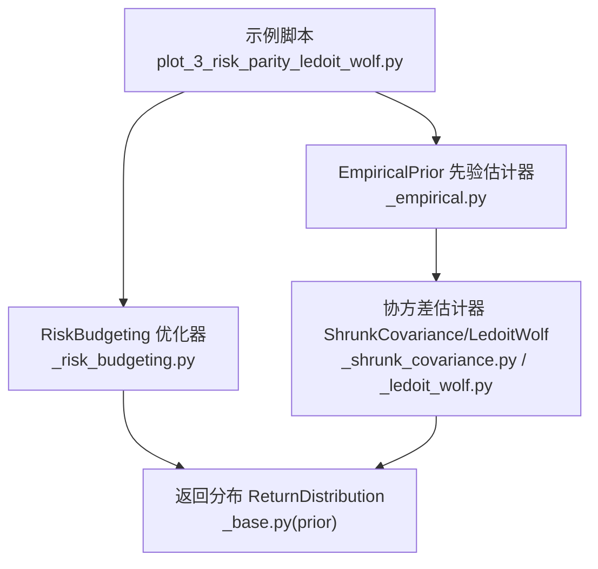
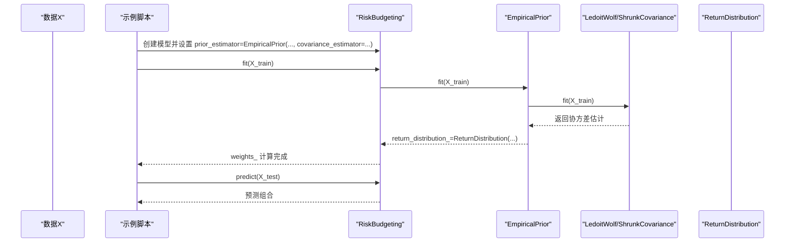
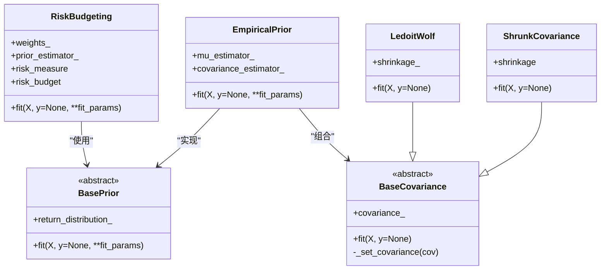
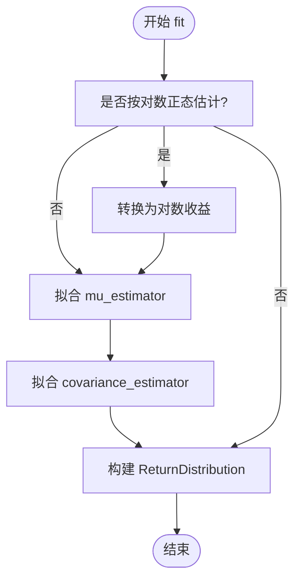
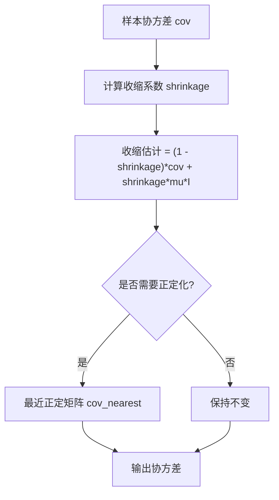
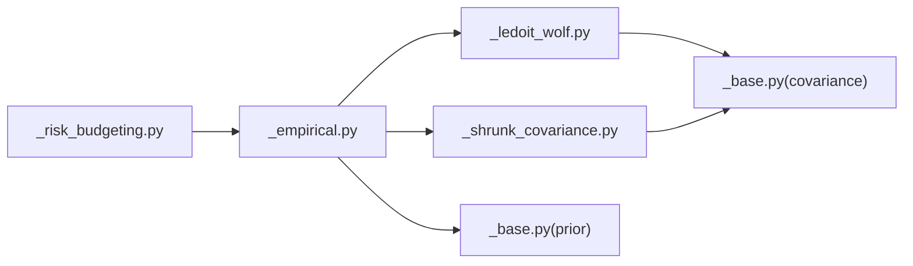

# 使用Ledoit-Wolf协方差收缩的风险平价

<cite>
**本文引用的文件**
- [plot_3_risk_parity_ledoit_wolf.py](file://examples/risk_budgeting/plot_3_risk_parity_ledoit_wolf.py)
- [_risk_budgeting.py](file://src/skfolio/optimization/convex/_risk_budgeting.py)
- [_empirical.py](file://src/skfolio/prior/_empirical.py)
- [_base.py](file://src/skfolio/prior/_base.py)
- [_ledoit_wolf.py](file://src/skfolio/moments/covariance/_ledoit_wolf.py)
- [_shrunk_covariance.py](file://src/skfolio/moments/covariance/_shrunk_covariance.py)
- [_base.py](file://src/skfolio/moments/covariance/_base.py)
- [covariance.rst](file://docs/user_guide/covariance.rst)
- [plot_1_risk_parity_variance.py](file://examples/risk_budgeting/plot_1_risk_parity_variance.py)
- [stats.py](file://src/skfolio/utils/stats.py)
</cite>

## 目录
1. [引言](#引言)
2. [项目结构](#项目结构)
3. [核心组件](#核心组件)
4. [架构总览](#架构总览)
5. [详细组件分析](#详细组件分析)
6. [依赖关系分析](#依赖关系分析)
7. [性能考量](#性能考量)
8. [故障排查指南](#故障排查指南)
9. [结论](#结论)
10. [附录](#附录)

## 引言
本教程围绕“提升风险平价模型稳定性”的主题，以示例脚本 plot_3_risk_parity_ledoit_wolf.py 为主线，演示如何将 Ledoit-Wolf 协方差收缩估计器集成到 RiskBudgeting 流程中，作为 prior_estimator 的一部分，从而改善高维小样本场景下的协方差估计稳定性与鲁棒性。我们将解释：
- 传统样本协方差在高维小样本下的不稳定性问题；
- Ledoit-Wolf 方法如何通过向目标矩阵（如等方差矩阵）收缩来提高估计质量；
- 在代码中如何配置 EmpiricalPrior 或直接使用 LedoitWolf 类；
- 对比使用普通协方差与收缩协方差时投资组合权重的差异；
- 突出收缩协方差在降低组合波动与提高样本外表现方面的优势。

## 项目结构
该示例位于 examples/risk_budgeting 目录下，展示了风险平价优化与协方差收缩估计的结合使用。核心调用链如下：
- 示例脚本加载数据并构造两个模型：一个使用收缩协方差，另一个使用默认的 EmpiricalPrior（即样本协方差）；
- 两者均通过 RiskBudgeting 进行优化；
- 最终在测试集上进行预测与回测对比。

图表来源
- [plot_3_risk_parity_ledoit_wolf.py](file://examples/risk_budgeting/plot_3_risk_parity_ledoit_wolf.py#L1-L81)
- [_risk_budgeting.py](file://src/skfolio/optimization/convex/_risk_budgeting.py#L481-L616)
- [_empirical.py](file://src/skfolio/prior/_empirical.py#L109-L205)
- [_shrunk_covariance.py](file://src/skfolio/moments/covariance/_shrunk_covariance.py#L86-L105)
- [_ledoit_wolf.py](file://src/skfolio/moments/covariance/_ledoit_wolf.py#L101-L140)
- [_base.py](file://src/skfolio/prior/_base.py#L15-L70)

章节来源
- [plot_3_risk_parity_ledoit_wolf.py](file://examples/risk_budgeting/plot_3_risk_parity_ledoit_wolf.py#L1-L81)

## 核心组件
- RiskBudgeting：风险预算优化器，支持多种风险度量（方差、半方差、CVaR 等），通过 prior_estimator 提供期望收益与协方差等先验信息。
- EmpiricalPrior：将 mu_estimator 与 covariance_estimator 分别拟合并封装为 ReturnDistribution，供优化器使用。
- LedoitWolf/ShrunkCovariance：收缩协方差估计器，前者自动计算收缩系数，后者允许手动指定收缩系数；二者均继承自 BaseCovariance 并提供正定化处理能力。
- BaseCovariance：协方差估计器基类，统一了 PSD 正定化、Higham 算法等通用逻辑。
- ReturnDistribution：优化器使用的标准化输入数据结构，包含 mu、covariance、returns 等。

章节来源
- [_risk_budgeting.py](file://src/skfolio/optimization/convex/_risk_budgeting.py#L481-L616)
- [_empirical.py](file://src/skfolio/prior/_empirical.py#L109-L205)
- [_ledoit_wolf.py](file://src/skfolio/moments/covariance/_ledoit_wolf.py#L101-L140)
- [_shrunk_covariance.py](file://src/skfolio/moments/covariance/_shrunk_covariance.py#L86-L105)
- [_base.py](file://src/skfolio/moments/covariance/_base.py#L20-L110)
- [_base.py](file://src/skfolio/prior/_base.py#L15-L70)

## 架构总览
下面的序列图展示了从数据到优化再到预测的关键流程，重点在于 prior_estimator 如何将协方差估计结果注入到 RiskBudgeting 中。

图表来源
- [plot_3_risk_parity_ledoit_wolf.py](file://examples/risk_budgeting/plot_3_risk_parity_ledoit_wolf.py#L31-L62)
- [_risk_budgeting.py](file://src/skfolio/optimization/convex/_risk_budgeting.py#L481-L616)
- [_empirical.py](file://src/skfolio/prior/_empirical.py#L109-L205)
- [_ledoit_wolf.py](file://src/skfolio/moments/covariance/_ledoit_wolf.py#L101-L140)
- [_shrunk_covariance.py](file://src/skfolio/moments/covariance/_shrunk_covariance.py#L86-L105)

## 详细组件分析

### 组件A：RiskBudgeting 优化器
- 负责构建并求解凸优化问题，目标是最小化指定风险度量，同时满足预算约束与权重约束；
- 通过 prior_estimator 获取 mu 与协方差矩阵，进而计算各资产对整体风险的贡献；
- 默认 prior_estimator 为 EmpiricalPrior，可替换为自定义先验估计器；
- 支持多种风险度量（方差、半方差、CVaR、最大回撤等）。

图表来源
- [_risk_budgeting.py](file://src/skfolio/optimization/convex/_risk_budgeting.py#L481-L616)
- [_empirical.py](file://src/skfolio/prior/_empirical.py#L109-L205)
- [_base.py](file://src/skfolio/moments/covariance/_base.py#L20-L110)
- [_ledoit_wolf.py](file://src/skfolio/moments/covariance/_ledoit_wolf.py#L101-L140)
- [_shrunk_covariance.py](file://src/skfolio/moments/covariance/_shrunk_covariance.py#L86-L105)

章节来源
- [_risk_budgeting.py](file://src/skfolio/optimization/convex/_risk_budgeting.py#L481-L616)

### 组件B：EmpiricalPrior 与协方差估计器
- EmpiricalPrior 将 mu_estimator 与 covariance_estimator 分别拟合，并封装为 ReturnDistribution；
- 当 covariance_estimator 为 LedoitWolf 或 ShrunkCovariance 时，优化器获得的是经过收缩的协方差矩阵，从而提升数值稳定性；
- BaseCovariance 提供统一的正定化处理（nearest），必要时使用 Higham 算法或特征值裁剪保证 Cholesky 可分解。

图表来源
- [_empirical.py](file://src/skfolio/prior/_empirical.py#L109-L205)
- [_base.py](file://src/skfolio/moments/covariance/_base.py#L20-L110)
- [stats.py](file://src/skfolio/utils/stats.py#L322-L415)

章节来源
- [_empirical.py](file://src/skfolio/prior/_empirical.py#L109-L205)
- [_base.py](file://src/skfolio/moments/covariance/_base.py#L20-L110)
- [stats.py](file://src/skfolio/utils/stats.py#L322-L415)

### 组件C：Ledoit-Wolf 与 ShrunkCovariance
- LedoitWolf 自动计算收缩系数，将样本协方差收缩至等方差目标矩阵，显著提升稳定性；
- ShrunkCovariance 允许手动指定收缩系数，适合需要精细控制的场景；
- 二者均继承自 BaseCovariance，具备正定化与 Cholesky 可分解保障。

图表来源
- [_ledoit_wolf.py](file://src/skfolio/moments/covariance/_ledoit_wolf.py#L101-L140)
- [_shrunk_covariance.py](file://src/skfolio/moments/covariance/_shrunk_covariance.py#L86-L105)
- [_base.py](file://src/skfolio/moments/covariance/_base.py#L20-L110)
- [stats.py](file://src/skfolio/utils/stats.py#L322-L415)

章节来源
- [_ledoit_wolf.py](file://src/skfolio/moments/covariance/_ledoit_wolf.py#L101-L140)
- [_shrunk_covariance.py](file://src/skfolio/moments/covariance/_shrunk_covariance.py#L86-L105)
- [_base.py](file://src/skfolio/moments/covariance/_base.py#L20-L110)
- [stats.py](file://src/skfolio/utils/stats.py#L322-L415)

### 组件D：高维小样本下的协方差不稳定性与收缩策略
- 传统样本协方差在高维（资产数接近或超过样本数）时可能出现非正定、条件数过大、权重极端不稳定等问题；
- Ledoit-Wolf 通过将样本协方差向等方差矩阵收缩，有效缓解上述问题，提升优化器的数值稳定性与样本外表现；
- 文档中也列出了可用的协方差估计器，包括 LedoitWolf 与 ShrunkCovariance。

章节来源
- [covariance.rst](file://docs/user_guide/covariance.rst#L1-L44)

## 依赖关系分析
- RiskBudgeting 依赖于 prior_estimator（默认 EmpiricalPrior），后者再依赖具体的协方差估计器（LedoitWolf/ShrunkCovariance）；
- LedoitWolf/ShrunkCovariance 继承自 BaseCovariance，统一了正定化与 Cholesky 可分解保障；
- EmpiricalPrior 将 mu 与协方差估计结果封装为 ReturnDistribution，供优化器消费。

图表来源
- [_risk_budgeting.py](file://src/skfolio/optimization/convex/_risk_budgeting.py#L481-L616)
- [_empirical.py](file://src/skfolio/prior/_empirical.py#L109-L205)
- [_ledoit_wolf.py](file://src/skfolio/moments/covariance/_ledoit_wolf.py#L101-L140)
- [_shrunk_covariance.py](file://src/skfolio/moments/covariance/_shrunk_covariance.py#L86-L105)
- [_base.py](file://src/skfolio/moments/covariance/_base.py#L20-L110)
- [_base.py](file://src/skfolio/prior/_base.py#L15-L70)

章节来源
- [_risk_budgeting.py](file://src/skfolio/optimization/convex/_risk_budgeting.py#L481-L616)
- [_empirical.py](file://src/skfolio/prior/_empirical.py#L109-L205)
- [_ledoit_wolf.py](file://src/skfolio/moments/covariance/_ledoit_wolf.py#L101-L140)
- [_shrunk_covariance.py](file://src/skfolio/moments/covariance/_shrunk_covariance.py#L86-L105)
- [_base.py](file://src/skfolio/moments/covariance/_base.py#L20-L110)
- [_base.py](file://src/skfolio/prior/_base.py#L15-L70)

## 性能考量
- 收缩协方差通常能提升优化稳定性，减少权重极端波动，从而在样本外测试集上获得更稳健的收益路径；
- LedoitWolf 自动选择收缩系数，适合大多数高维小样本场景；若需精细控制，可使用 ShrunkCovariance 手动指定收缩系数；
- 正定化（nearest）与 Higham 算法会带来额外计算成本，但在高维问题中通常值得牺牲少量性能换取数值稳定；
- 建议在训练阶段使用收缩协方差，在预测阶段保持一致的协方差估计策略，避免样本内/样本外估计不一致导致的回测偏差。

## 故障排查指南
- 若出现协方差非正定或 Cholesky 分解失败：
  - 检查是否启用了 nearest 正定化（默认开启）；
  - 必要时启用 Higham 算法（可能较慢）；
  - 确认输入数据无零方差资产或缺失值。
- 若优化失败或权重异常：
  - 检查 prior_estimator 是否正确设置；
  - 确认协方差估计器输出的协方差矩阵为对称且近似正定；
  - 调整 solver 参数或 scale_objective/scale_constraints 以改善数值稳定性。

章节来源
- [_base.py](file://src/skfolio/moments/covariance/_base.py#L20-L110)
- [stats.py](file://src/skfolio/utils/stats.py#L322-L415)
- [_risk_budgeting.py](file://src/skfolio/optimization/convex/_risk_budgeting.py#L481-L616)

## 结论
通过在 RiskBudgeting 中引入 Ledoit-Wolf 或 ShrunkCovariance，可以显著提升高维小样本场景下的协方差估计稳定性，从而得到更稳健的风险平价权重与更好的样本外表现。建议在实际应用中优先考虑 LedoitWolf 的自动收缩系数，或根据具体需求使用 ShrunkCovariance 进行手动控制，并配合正定化与合适的求解器参数，确保优化过程的数值稳定性。

## 附录
- 示例脚本路径：examples/risk_budgeting/plot_3_risk_parity_ledoit_wolf.py
- 基准风险平价示例（未使用收缩协方差）：examples/risk_budgeting/plot_1_risk_parity_variance.py
- 协方差估计器文档：docs/user_guide/covariance.rst