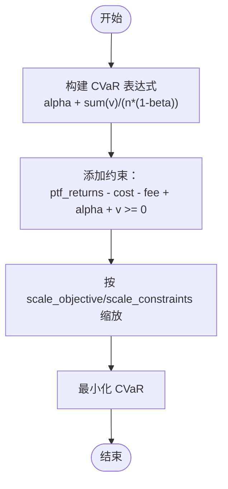

# 基于CVaR的风险预算优化

<cite>
**本文引用的文件**
- [plot_2_risk_budgeting_CVaR.py](file://examples/risk_budgeting/plot_2_risk_budgeting_CVaR.py)
- [RiskBudgeting 类](file://src/skfolio/optimization/convex/_risk_budgeting.py)
- [凸优化基类（含CVaR约束）](file://src/skfolio/optimization/convex/_base.py)
- [风险度量枚举（包含CVaR）](file://src/skfolio/measures/_enums.py)
- [用户指南：优化章节（RiskBudgeting说明）](file://docs/user_guide/optimization.rst)
- [测试：风险预算优化（含CVaR）](file://tests/test_optimization/test_convex/test_risk_budgeting.py)
</cite>

## 目录
1. [引言](#引言)
2. [项目结构](#项目结构)
3. [核心组件](#核心组件)
4. [架构总览](#架构总览)
5. [详细组件分析](#详细组件分析)
6. [依赖关系分析](#依赖关系分析)
7. [性能考量](#性能考量)
8. [故障排查指南](#故障排查指南)
9. [结论](#结论)
10. [附录](#附录)

## 引言
本教程围绕在CVaR（条件风险价值，Conditional Value at Risk）框架下的“风险预算优化”，以示例脚本 plot_2_risk_budgeting_CVaR.py 为蓝本，系统讲解如何：
- 将 RiskBudgeting 优化器的 risk_measure 参数设置为 CVaR；
- 通过 risk_budget 参数设定个性化风险贡献目标（例如，使股票资产（如苹果）的风险贡献高于债券资产）；
- 解释 CVaR 作为尾部风险度量的优势；
- 展示 CVaR 在凸优化问题中的实现方式；
- 演示 β 置信水平的设置、优化问题构建、求解器选择（如 CLARABEL）；
- 分析并验证优化后的投资组合是否满足预设的风险预算。

## 项目结构
与本教程直接相关的核心文件与示例如下：
- 示例脚本：examples/risk_budgeting/plot_2_risk_budgeting_CVaR.py
- 风险预算优化器：src/skfolio/optimization/convex/_risk_budgeting.py
- 凸优化基类（包含 CVaR 的约束表达式）：src/skfolio/optimization/convex/_base.py
- 风险度量枚举（包含 CVaR）：src/skfolio/measures/_enums.py
- 用户指南（RiskBudgeting 说明）：docs/user_guide/optimization.rst
- 测试用例（覆盖 CVaR 的风险预算优化）：tests/test_optimization/test_convex/test_risk_budgeting.py

图表来源
- [plot_2_risk_budgeting_CVaR.py](file://examples/risk_budgeting/plot_2_risk_budgeting_CVaR.py#L1-L104)
- [RiskBudgeting 类](file://src/skfolio/optimization/convex/_risk_budgeting.py#L24-L616)
- [凸优化基类（含CVaR约束）](file://src/skfolio/optimization/convex/_base.py#L1880-L1913)
- [风险度量枚举（包含CVaR）](file://src/skfolio/measures/_enums.py#L105-L186)
- [用户指南：优化章节（RiskBudgeting说明）](file://docs/user_guide/optimization.rst#L354-L408)
- [测试：风险预算优化（含CVaR）](file://tests/test_optimization/test_convex/test_risk_budgeting.py#L86-L97)

章节来源
- [plot_2_risk_budgeting_CVaR.py](file://examples/risk_budgeting/plot_2_risk_budgeting_CVaR.py#L1-L104)
- [RiskBudgeting 类](file://src/skfolio/optimization/convex/_risk_budgeting.py#L24-L616)
- [凸优化基类（含CVaR约束）](file://src/skfolio/optimization/convex/_base.py#L1880-L1913)
- [风险度量枚举（包含CVaR）](file://src/skfolio/measures/_enums.py#L105-L186)
- [用户指南：优化章节（RiskBudgeting说明）](file://docs/user_guide/optimization.rst#L354-L408)
- [测试：风险预算优化（含CVaR）](file://tests/test_optimization/test_convex/test_risk_budgeting.py#L86-L97)

## 核心组件
- RiskBudgeting 优化器：支持多种风险度量（含 CVaR），通过 risk_budget 控制每只资产对总风险的贡献权重；默认使用 CLARABEL 求解器，具备良好的数值稳定性。
- CVaR 约束表达：凸优化基类中实现了 CVaR 的线性化约束形式，引入辅助变量与松弛项，确保问题保持凸性。
- 风险度量枚举：RiskMeasure 枚举中包含 CVAR，用于在优化器中选择 CVaR 作为风险度量。
- 示例脚本：演示了如何设置 risk_measure=CVAR、risk_budget、训练模型、预测与对比分析。

章节来源
- [RiskBudgeting 类](file://src/skfolio/optimization/convex/_risk_budgeting.py#L24-L616)
- [凸优化基类（含CVaR约束）](file://src/skfolio/optimization/convex/_base.py#L1880-L1913)
- [风险度量枚举（包含CVaR）](file://src/skfolio/measures/_enums.py#L105-L186)
- [plot_2_risk_budgeting_CVaR.py](file://examples/risk_budgeting/plot_2_risk_budgeting_CVaR.py#L1-L104)

## 架构总览
下图展示了从示例脚本到优化器再到 CVaR 约束表达的整体流程。

图表来源
- [plot_2_risk_budgeting_CVaR.py](file://examples/risk_budgeting/plot_2_risk_budgeting_CVaR.py#L30-L51)
- [RiskBudgeting 类](file://src/skfolio/optimization/convex/_risk_budgeting.py#L481-L616)
- [凸优化基类（含CVaR约束）](file://src/skfolio/optimization/convex/_base.py#L1880-L1913)
- [风险度量枚举（包含CVaR）](file://src/skfolio/measures/_enums.py#L105-L186)

## 详细组件分析

### 组件一：RiskBudgeting 优化器（CVaR 风险预算）
- 功能要点
  - 支持多类风险度量，其中包含 CVaR；
  - 通过 risk_budget 对每只资产的风险贡献进行预算控制；
  - 默认使用 CLARABEL 求解器，具备高数值稳定性；
  - 可配置最小/最大权重、交易成本、管理费用、预期收益下限等约束；
  - 内置风险预算约束：预算向量与权重对数的内积非负，保证风险预算方向一致。
- 关键参数
  - risk_measure：选择 CVaR；
  - risk_budget：每只资产的风险预算权重；
  - cvar_beta：CVaR 置信水平，默认 0.95；
  - solver：默认 CLARABEL；
  - 其他约束：min_weights、max_weights、transaction_costs、management_fees、min_return 等。
- 优化流程
  - 拟合阶段：估计收益与协方差，构建目标函数与约束；
  - 求解阶段：调用 CVXPY 问题并使用 CLARABEL 求解；
  - 预测阶段：返回优化后的权重与预测组合。

图表来源
- [RiskBudgeting 类](file://src/skfolio/optimization/convex/_risk_budgeting.py#L24-L616)

章节来源
- [RiskBudgeting 类](file://src/skfolio/optimization/convex/_risk_budgeting.py#L24-L616)
- [用户指南：优化章节（RiskBudgeting说明）](file://docs/user_guide/optimization.rst#L354-L408)

### 组件二：CVaR 风险度量的凸优化实现
- 实现位置
  - 凸优化基类中提供了 CVaR 的约束表达式，采用标准的线性化形式，引入辅助变量与松弛项，确保问题为凸。
- 数学要点
  - 引入辅助变量 alpha 和 v，将尾部平均损失（最坏 (1-β)% 观测值的均值）转化为线性约束；
  - 通过样本权重或等权重处理，得到 CVaR 的期望表达式；
  - 约束保证了投资组合收益与成本、费用之间的线性关系。
- 与 RiskBudgeting 的集成
  - RiskBudgeting 在 fit 中根据 risk_measure 动态选择对应的风险函数（如 _cvar_risk），并将 CVaR 约束加入整体优化问题。

图表来源
- [凸优化基类（含CVaR约束）](file://src/skfolio/optimization/convex/_base.py#L1880-L1913)

章节来源
- [凸优化基类（含CVaR约束）](file://src/skfolio/optimization/convex/_base.py#L1880-L1913)
- [RiskBudgeting 类](file://src/skfolio/optimization/convex/_risk_budgeting.py#L572-L588)

### 组件三：风险预算约束与风险贡献分析
- 风险预算约束
  - 通过预算向量与权重对数的内积非负，引导优化朝向预设的风险贡献方向；
  - 该约束与风险度量（此处为 CVaR）共同构成目标函数。
- 风险贡献分析
  - 示例脚本展示了如何在训练集上分析各资产对 CVaR 的风险贡献，并与基准（如逆波动率）进行对比；
  - 可通过预测后的组合对象计算并可视化风险贡献。

图表来源
- [plot_2_risk_budgeting_CVaR.py](file://examples/risk_budgeting/plot_2_risk_budgeting_CVaR.py#L60-L104)

章节来源
- [plot_2_risk_budgeting_CVaR.py](file://examples/risk_budgeting/plot_2_risk_budgeting_CVaR.py#L60-L104)

### 组件四：CVaR 置信水平与求解器选择
- 置信水平 cvar_beta
  - 默认 0.95，表示对最坏 5% 观测值的平均损失进行优化；
  - 可通过构造函数参数进行调整，以适配不同的风险偏好或市场环境。
- 求解器 CLARABEL
  - 默认 solver 为 CLARABEL，具备更好的数值稳定性和性能；
  - 可通过 solver_params 进一步微调收敛精度（如容差）。

章节来源
- [RiskBudgeting 类](file://src/skfolio/optimization/convex/_risk_budgeting.py#L278-L322)
- [RiskBudgeting 类](file://src/skfolio/optimization/convex/_risk_budgeting.py#L517-L521)

## 依赖关系分析
- RiskBudgeting 依赖
  - 风险度量枚举 RiskMeasure（选择 CVaR）；
  - 凸优化基类（提供 CVaR 约束表达式）；
  - prior 估计器（用于估计收益与协方差，影响预期收益约束与目标函数）。
- 示例脚本依赖
  - 数据加载与预处理（价格转收益、训练/测试划分）；
  - Portfolio 与 Population（用于组合分析与汇总）。

图表来源
- [RiskBudgeting 类](file://src/skfolio/optimization/convex/_risk_budgeting.py#L24-L616)
- [凸优化基类（含CVaR约束）](file://src/skfolio/optimization/convex/_base.py#L1880-L1913)
- [风险度量枚举（包含CVaR）](file://src/skfolio/measures/_enums.py#L105-L186)
- [plot_2_risk_budgeting_CVaR.py](file://examples/risk_budgeting/plot_2_risk_budgeting_CVaR.py#L1-L104)

章节来源
- [RiskBudgeting 类](file://src/skfolio/optimization/convex/_risk_budgeting.py#L24-L616)
- [凸优化基类（含CVaR约束）](file://src/skfolio/optimization/convex/_base.py#L1880-L1913)
- [风险度量枚举（包含CVaR）](file://src/skfolio/measures/_enums.py#L105-L186)
- [plot_2_risk_budgeting_CVaR.py](file://examples/risk_budgeting/plot_2_risk_budgeting_CVaR.py#L1-L104)

## 性能考量
- 求解器选择
  - 默认 CLARABEL 具备更优的数值稳定性与性能，适合大规模或高维问题；
  - 可通过 solver_params 调整容差与迭代次数，平衡精度与速度。
- 问题规模与缩放
  - 通过 scale_objective 与 scale_constraints 对目标与约束进行缩放，有助于提升数值稳定性；
  - 合理设置权重上下界与交易成本/管理费，可减少不必要波动带来的求解难度。
- 置信水平的影响
  - 较高的 β（如 0.99）会放大尾部风险，导致更保守的权重分配；
  - 较低的 β（如 0.90）可能低估尾部风险，需结合历史数据与回测验证。

[本节为通用指导，无需特定文件来源]

## 故障排查指南
- 非凸约束
  - 若设置了允许做空的最小权重（负值），可能导致问题非凸而求解失败；
  - 建议保持非负权重约束以维持凸性。
- 求解失败
  - 可尝试调整 solver_params（如提高容差）或切换求解器；
  - 检查输入数据质量与约束边界是否过于严苛。
- 风险预算未达预期
  - 检查 risk_budget 是否与资产名称匹配（DataFrame 列名）；
  - 确认 CVaR 置信水平 cvar_beta 设置是否合理；
  - 对比基准策略（如逆波动率）以确认优化方向符合预期。

章节来源
- [测试：风险预算优化（含CVaR）](file://tests/test_optimization/test_convex/test_risk_budgeting.py#L183-L215)

## 结论
通过将 RiskBudgeting 的 risk_measure 设为 CVaR，并结合自定义的风险预算向量，可以在 CVaR 框架下实现面向尾部风险的个性化风险预算优化。示例脚本展示了从数据准备、模型拟合、预测到分析对比的完整流程。CVaR 作为尾部风险度量，能够有效捕捉极端损失的平均值，配合 CLARABEL 求解器与合理的置信水平设置，可在实践中获得稳健且可解释的投资组合权重。

[本节为总结性内容，无需特定文件来源]

## 附录

### 实践步骤清单（基于示例脚本）
- 数据准备
  - 加载 S&P 500 数据，转换为日度收益，划分训练/测试集。
- 定义风险预算
  - 为不同资产设置风险预算权重（例如提高股票资产的预算权重）。
- 构建与拟合模型
  - 创建 RiskBudgeting，设置 risk_measure=CVAR、risk_budget、cvar_beta、solver=CLARABEL；
  - 在训练集上调用 fit。
- 预测与对比
  - 在训练/测试集上调用 predict，生成组合对象；
  - 与基准策略（如逆波动率）进行对比分析（组合构成、累计收益、摘要统计）。
- 风险贡献分析
  - 使用预测组合对象计算并可视化各资产对 CVaR 的风险贡献。

章节来源
- [plot_2_risk_budgeting_CVaR.py](file://examples/risk_budgeting/plot_2_risk_budgeting_CVaR.py#L1-L104)