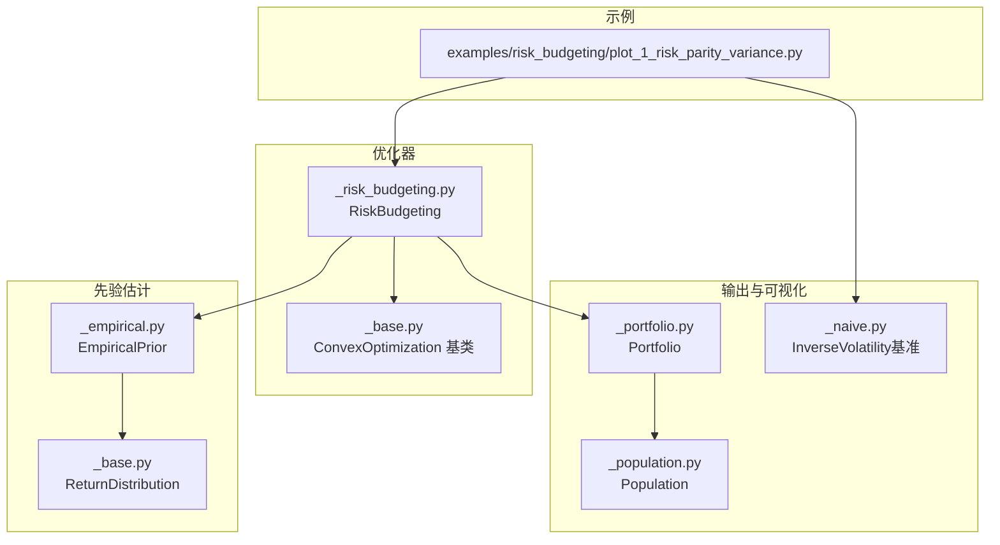
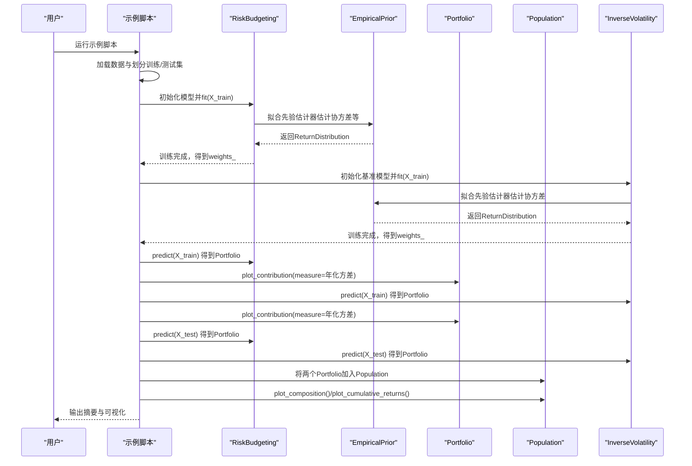
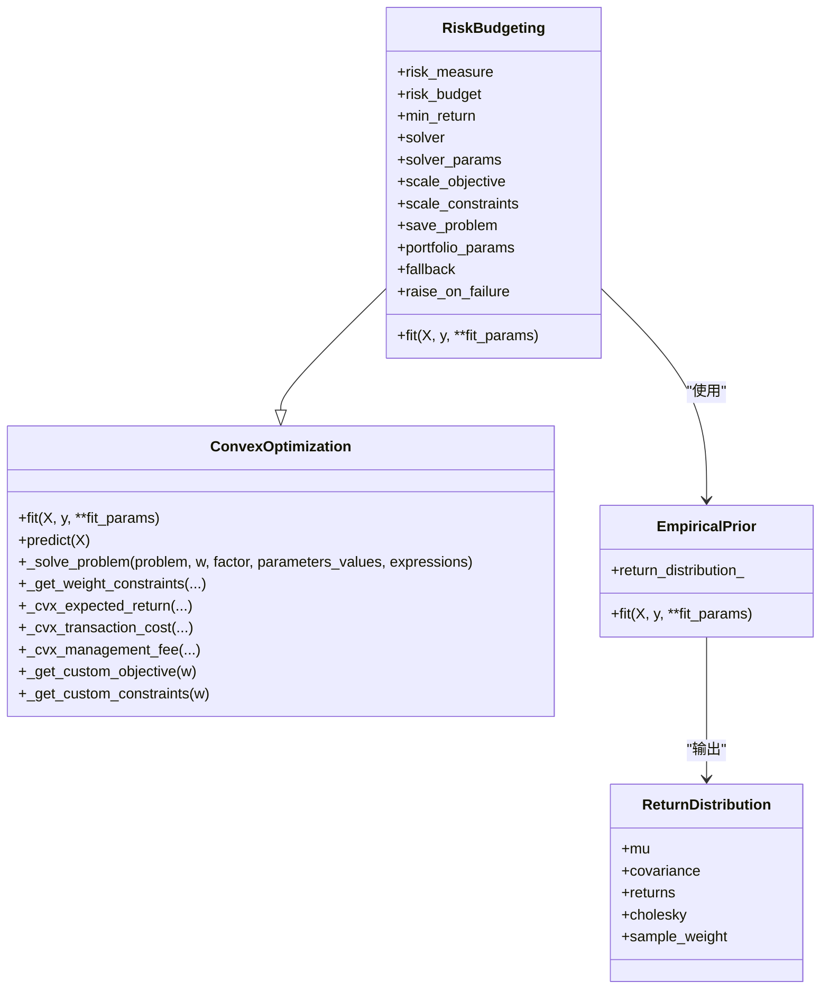
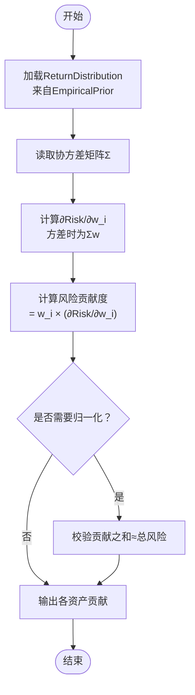
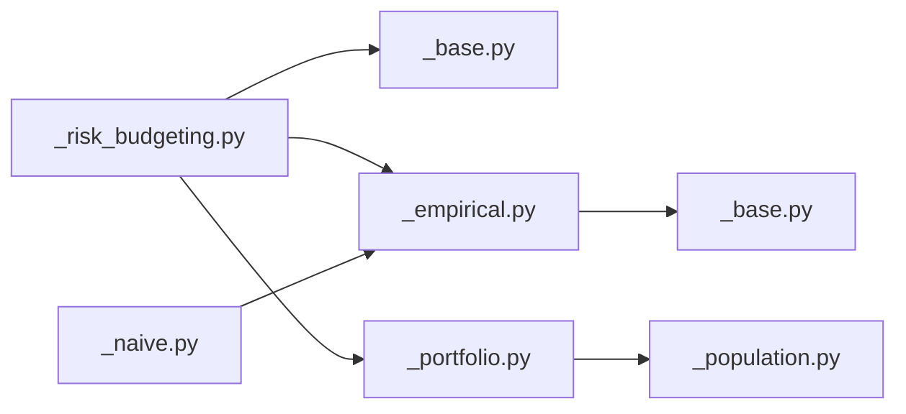

# 基于方差的风险平价策略

<cite>
**本文引用的文件**
- [plot_1_risk_parity_variance.py](file://examples/risk_budgeting/plot_1_risk_parity_variance.py)
- [_risk_budgeting.py](file://src/skfolio/optimization/convex/_risk_budgeting.py)
- [_base.py](file://src/skfolio/optimization/convex/_base.py)
- [_empirical.py](file://src/skfolio/prior/_empirical.py)
- [_base.py](file://src/skfolio/prior/_base.py)
- [_portfolio.py](file://src/skfolio/portfolio/_portfolio.py)
- [_population.py](file://src/skfolio/population/_population.py)
- [_naive.py](file://src/skfolio/optimization/naive/_naive.py)
- [optimization.rst](file://docs/user_guide/optimization.rst)
- [test_risk_budgeting.py](file://tests/test_optimization/test_convex/test_risk_budgeting.py)
- [test_portfolio.py](file://tests/test_portfolio/test_portfolio.py)
</cite>

## 目录
1. [引言](#引言)
2. [项目结构](#项目结构)
3. [核心组件](#核心组件)
4. [架构总览](#架构总览)
5. [详细组件分析](#详细组件分析)
6. [依赖关系分析](#依赖关系分析)
7. [性能考量](#性能考量)
8. [故障排查指南](#故障排查指南)
9. [结论](#结论)
10. [附录](#附录)

## 引言
本教程围绕“基于方差的风险平价投资组合”展开，以示例脚本 plot_1_risk_parity_variance.py 为主线，系统讲解如何使用 RiskBudgeting 类在方差作为风险测度时实现风险平价（每个资产对总风险的贡献相等）。教程涵盖以下关键点：
- 协方差矩阵的估计流程（由先验估计器提供）
- 风险贡献度的数学定义与实现思路（Risk Contribution = w_i × (∂Risk/∂w_i)）
- 优化器如何通过凸优化问题均衡各资产的风险贡献
- 数据预处理、模型初始化、fit 和 predict 的调用链路
- 使用 plotly 可视化投资组合权重与风险贡献

同时，教程内容与用户指南中的 optimization.rst 保持一致，并提供相关 API 文档的链接指引。

## 项目结构
该示例位于 examples/risk_budgeting 目录下，核心逻辑由 RiskBudgeting 优化器驱动，配合先验估计器（默认 EmpiricalPrior）进行协方差矩阵估计，最终通过 Portfolio/Porulation 对象生成可视化与汇总分析。

图表来源
- [plot_1_risk_parity_variance.py](file://examples/risk_budgeting/plot_1_risk_parity_variance.py#L1-L93)
- [_risk_budgeting.py](file://src/skfolio/optimization/convex/_risk_budgeting.py#L1-L120)
- [_base.py](file://src/skfolio/optimization/convex/_base.py#L1-L120)
- [_empirical.py](file://src/skfolio/prior/_empirical.py#L90-L140)
- [_base.py](file://src/skfolio/prior/_base.py#L1-L70)
- [_portfolio.py](file://src/skfolio/portfolio/_portfolio.py#L1-L120)
- [_population.py](file://src/skfolio/population/_population.py#L837-L909)
- [_naive.py](file://src/skfolio/optimization/naive/_naive.py#L120-L158)

章节来源
- [plot_1_risk_parity_variance.py](file://examples/risk_budgeting/plot_1_risk_parity_variance.py#L1-L93)

## 核心组件
- RiskBudgeting：在方差风险测度下求解风险平价问题，目标是最小化风险并在预算约束下均衡各资产的风险贡献。
- EmpiricalPrior：从样本返回估计期望收益与协方差矩阵，作为优化器的输入。
- Portfolio：封装预测得到的投资组合，支持风险贡献度计算与可视化。
- Population：对多个投资组合进行统一分析与可视化。
- InverseVolatility：作为风险平价的简单对比基准（仅基于波动率倒数）。

章节来源
- [_risk_budgeting.py](file://src/skfolio/optimization/convex/_risk_budgeting.py#L25-L120)
- [_empirical.py](file://src/skfolio/prior/_empirical.py#L90-L140)
- [_portfolio.py](file://src/skfolio/portfolio/_portfolio.py#L1-L120)
- [_population.py](file://src/skfolio/population/_population.py#L837-L909)
- [_naive.py](file://src/skfolio/optimization/naive/_naive.py#L120-L158)

## 架构总览
下面的序列图展示了从数据到可视化的主要流程，包括风险平价模型训练、基准模型训练、风险贡献分析与可视化。

图表来源
- [plot_1_risk_parity_variance.py](file://examples/risk_budgeting/plot_1_risk_parity_variance.py#L1-L93)
- [_risk_budgeting.py](file://src/skfolio/optimization/convex/_risk_budgeting.py#L481-L616)
- [_empirical.py](file://src/skfolio/prior/_empirical.py#L109-L140)
- [_portfolio.py](file://src/skfolio/portfolio/_portfolio.py#L1190-L1232)
- [_population.py](file://src/skfolio/population/_population.py#L837-L909)
- [_naive.py](file://src/skfolio/optimization/naive/_naive.py#L120-L158)

## 详细组件分析

### RiskBudgeting 类与凸优化
- 风险测度选择：当 risk_measure 设置为方差时，优化目标是最小化方差。
- 预算约束：默认 risk_budget 为 None，内部会填充为单位向量，从而实现“风险平价”，即每个资产对总风险的贡献相等。
- 先验估计：通过 prior_estimator（默认 EmpiricalPrior）估计 ReturnDistribution，包含期望收益、协方差矩阵等。
- 优化求解：使用 CVXPY 构建并求解凸优化问题，返回最优权重与问题值。

图表来源
- [_risk_budgeting.py](file://src/skfolio/optimization/convex/_risk_budgeting.py#L25-L120)
- [_risk_budgeting.py](file://src/skfolio/optimization/convex/_risk_budgeting.py#L481-L616)
- [_base.py](file://src/skfolio/optimization/convex/_base.py#L1-L120)
- [_empirical.py](file://src/skfolio/prior/_empirical.py#L90-L140)
- [_base.py](file://src/skfolio/prior/_base.py#L1-L70)

章节来源
- [_risk_budgeting.py](file://src/skfolio/optimization/convex/_risk_budgeting.py#L25-L120)
- [_risk_budgeting.py](file://src/skfolio/optimization/convex/_risk_budgeting.py#L481-L616)
- [_base.py](file://src/skfolio/optimization/convex/_base.py#L1-L120)
- [_empirical.py](file://src/skfolio/prior/_empirical.py#L90-L140)
- [_base.py](file://src/skfolio/prior/_base.py#L1-L70)

### 协方差矩阵估计与先验估计器
- EmpiricalPrior 默认使用样本均值与样本协方差估计，返回 ReturnDistribution，供优化器直接使用。
- ReturnDistribution 包含 mu、covariance、returns 等字段，必要时可提供 Cholesky 分解以提升数值稳定性。

章节来源
- [_empirical.py](file://src/skfolio/prior/_empirical.py#L90-L140)
- [_base.py](file://src/skfolio/prior/_base.py#L1-L70)

### 风险贡献度的数学定义与实现
- 数学定义：风险贡献度 = w_i × (∂Risk/∂w_i)。当 Risk 为方差时，∂Risk/∂w_i = 2 × Σ_j cov(i,j) × w_j，因此风险贡献度与权重和协方差矩阵的乘积有关。
- 实现方式：Portfolio.contribution 使用有限差分法近似 ∂Risk/∂w_i，再按公式计算每只资产的风险贡献。
- 示例验证：测试用例表明，在风险平价下，各资产的风险贡献应相等（等于总风险除以资产数量）。

图表来源
- [_portfolio.py](file://src/skfolio/portfolio/_portfolio.py#L950-L988)
- [test_risk_budgeting.py](file://tests/test_optimization/test_convex/test_risk_budgeting.py#L49-L84)

章节来源
- [_portfolio.py](file://src/skfolio/portfolio/_portfolio.py#L950-L988)
- [test_risk_budgeting.py](file://tests/test_optimization/test_convex/test_risk_budgeting.py#L49-L84)

### 优化器如何均衡各资产的风险贡献
- 风险平价约束：当 risk_budget 为单位向量时，预算约束 log(w) 的线性组合为非负，且在凸优化框架下，这促使各资产对风险的边际贡献趋于相等。
- 优化目标：最小化所选风险测度（此处为方差），在预算约束与权重约束下求解。
- 用户指南参考：用户指南 optimization.rst 中给出了风险预算问题的标准形式与支持的参数。

章节来源
- [_risk_budgeting.py](file://src/skfolio/optimization/convex/_risk_budgeting.py#L25-L120)
- [optimization.rst](file://docs/user_guide/optimization.rst#L354-L408)

### 数据预处理、模型初始化、fit 与 predict 调用
- 数据预处理：使用 load_sp500_dataset 获取价格数据，通过 prices_to_returns 转换为日度收益；随后按时间顺序划分训练/测试集。
- 模型初始化：RiskBudgeting(risk_measure=VARIANCE, portfolio_params=...)；InverseVolatility 作为基准。
- fit：RiskBudgeting.fit(X_train) 内部拟合 EmpiricalPrior 并构建 CVXPY 问题求解。
- predict：model.predict(X_train/test) 返回 Portfolio 对象，用于后续分析与可视化。

章节来源
- [plot_1_risk_parity_variance.py](file://examples/risk_budgeting/plot_1_risk_parity_variance.py#L1-L93)
- [_risk_budgeting.py](file://src/skfolio/optimization/convex/_risk_budgeting.py#L481-L616)
- [_naive.py](file://src/skfolio/optimization/naive/_naive.py#L120-L158)

### 可视化：权重与风险贡献
- 权重可视化：Population.plot_composition 展示两个策略的组合权重。
- 风险贡献可视化：Portfolio.plot_contribution(measure=Annualized Variance) 展示各资产对年化方差的贡献。
- 累计收益：Population.plot_cumulative_returns 显示回测期间的累计收益曲线。

章节来源
- [plot_1_risk_parity_variance.py](file://examples/risk_budgeting/plot_1_risk_parity_variance.py#L1-L93)
- [_portfolio.py](file://src/skfolio/portfolio/_portfolio.py#L1190-L1232)
- [_population.py](file://src/skfolio/population/_population.py#L837-L909)

## 依赖关系分析
- RiskBudgeting 依赖 ConvexOptimization 基类提供的通用优化框架与工具函数。
- EmpiricalPrior 依赖底层协方差与期望收益估计器，返回 ReturnDistribution。
- Portfolio 依赖 RiskMeasure 枚举与内部有限差分机制计算风险贡献。
- Population 聚合多个 Portfolio，提供统一的可视化与汇总分析接口。
- InverseVolatility 作为简单基准，其权重仅依赖协方差矩阵的对角元素（波动率倒数）。

图表来源
- [_risk_budgeting.py](file://src/skfolio/optimization/convex/_risk_budgeting.py#L1-L120)
- [_base.py](file://src/skfolio/optimization/convex/_base.py#L1-L120)
- [_empirical.py](file://src/skfolio/prior/_empirical.py#L90-L140)
- [_base.py](file://src/skfolio/prior/_base.py#L1-L70)
- [_portfolio.py](file://src/skfolio/portfolio/_portfolio.py#L1-L120)
- [_population.py](file://src/skfolio/population/_population.py#L837-L909)
- [_naive.py](file://src/skfolio/optimization/naive/_naive.py#L120-L158)

章节来源
- [_risk_budgeting.py](file://src/skfolio/optimization/convex/_risk_budgeting.py#L1-L120)
- [_empirical.py](file://src/skfolio/prior/_empirical.py#L90-L140)
- [_portfolio.py](file://src/skfolio/portfolio/_portfolio.py#L1-L120)
- [_population.py](file://src/skfolio/population/_population.py#L837-L909)
- [_naive.py](file://src/skfolio/optimization/naive/_naive.py#L120-L158)

## 性能考量
- 求解器选择：默认 CLARABEL，具备更好的数值稳定性和性能；可通过 solver 与 solver_params 调整。
- 规模缩放：scale_objective 与 scale_constraints 可在特定情况下提高精度。
- 先验估计：EmpiricalPrior 使用样本协方差，对于高维或噪声较大的场景，可考虑其他协方差估计器（如 Ledoit-Wolf、Graphical Lasso 等）以改善稳定性。
- 可视化与批量分析：Population 提供批量组合与收益可视化，适合大规模回测与对比分析。

## 故障排查指南
- 模型未拟合：若在 fit 失败后仍调用 predict，可能抛出 NotFittedError 或返回 FailedPortfolio。可通过 raise_on_failure 控制行为，或配置 fallback 机制。
- 预算约束与权重约束：当 risk_budget 为 None 时自动设为单位向量；若自定义预算向量，需确保非零项不被截断为极小值。
- 收敛与精度：若出现数值不稳定，可尝试调整 solver、solver_params、scale_objective/scale_constraints，或更换 prior_estimator。

章节来源
- [_risk_budgeting.py](file://src/skfolio/optimization/convex/_risk_budgeting.py#L481-L616)
- [_naive.py](file://src/skfolio/optimization/naive/_naive.py#L120-L158)

## 结论
本教程通过 plot_1_risk_parity_variance.py 的完整示例，展示了如何在方差风险测度下使用 RiskBudgeting 实现风险平价。通过 EmpiricalPrior 提供稳健的协方差估计，借助 CVXPY 凸优化求解，最终得到各资产风险贡献均衡的投资组合。示例还提供了与 InverseVolatility 基准的对比，以及 Portfolio 与 Population 的可视化与汇总分析能力，便于进一步研究与部署。

## 附录
- 用户指南参考：risk budgeting 问题的数学形式与参数说明见 optimization.rst。
- API 文档导航：可在 docs/api.rst 中查阅 measures、portfolio、population、optimization 等模块的 API。

章节来源
- [optimization.rst](file://docs/user_guide/optimization.rst#L354-L408)
- [api.rst](file://docs/api.rst#L1-L200)