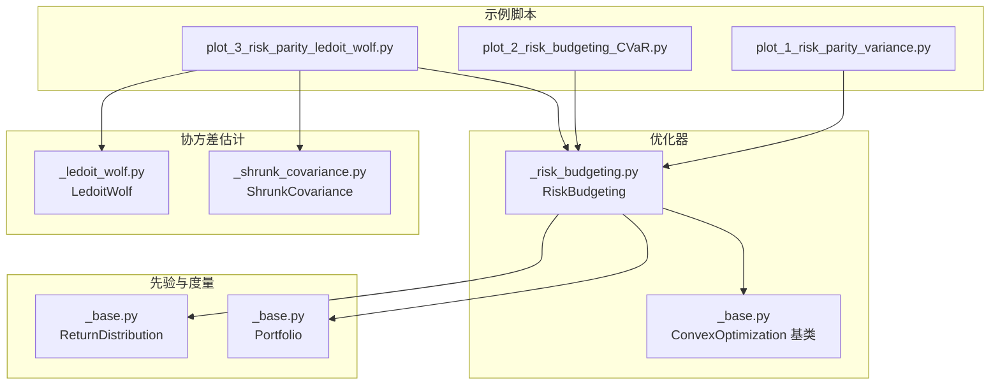
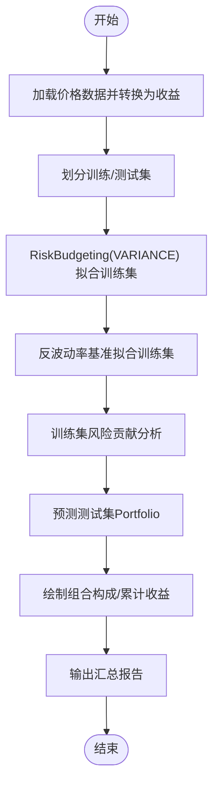
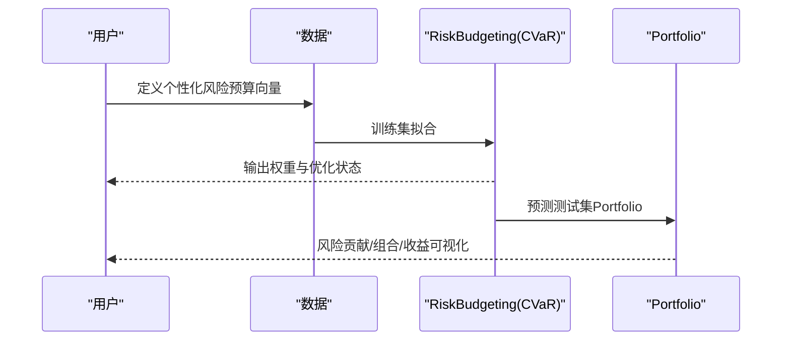
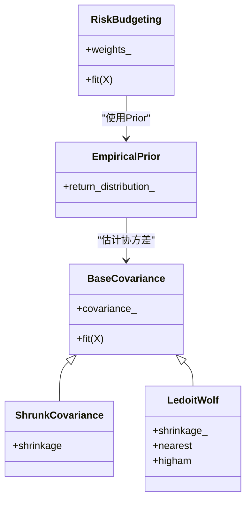
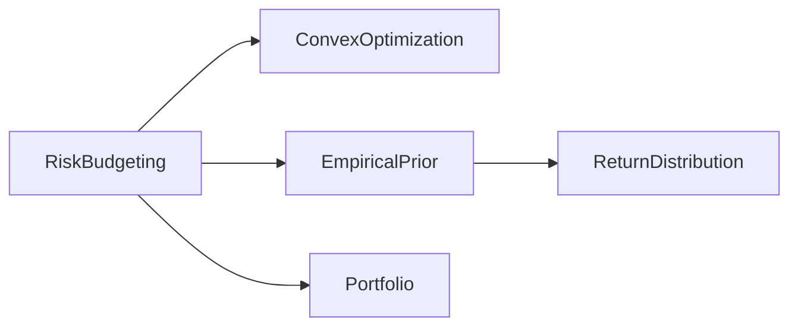

# 风险预算与风险平价教程

<cite>
**本文引用的文件**
- [examples/risk_budgeting/plot_1_risk_parity_variance.py](file://examples/risk_budgeting/plot_1_risk_parity_variance.py)
- [examples/risk_budgeting/plot_2_risk_budgeting_CVaR.py](file://examples/risk_budgeting/plot_2_risk_budgeting_CVaR.py)
- [examples/risk_budgeting/plot_3_risk_parity_ledoit_wolf.py](file://examples/risk_budgeting/plot_3_risk_parity_ledoit_wolf.py)
- [src/skfolio/optimization/convex/_risk_budgeting.py](file://src/skfolio/optimization/convex/_risk_budgeting.py)
- [src/skfolio/optimization/convex/_base.py](file://src/skfolio/optimization/convex/_base.py)
- [src/skfolio/moments/covariance/_ledoit_wolf.py](file://src/skfolio/moments/covariance/_ledoit_wolf.py)
- [src/skfolio/moments/covariance/_shrunk_covariance.py](file://src/skfolio/moments/covariance/_shrunk_covariance.py)
- [src/skfolio/prior/_base.py](file://src/skfolio/prior/_base.py)
- [src/skfolio/portfolio/_base.py](file://src/skfolio/portfolio/_base.py)
- [docs/user_guide/optimization.rst](file://docs/user_guide/optimization.rst)
</cite>

## 目录
1. [引言](#引言)
2. [项目结构](#项目结构)
3. [核心组件](#核心组件)
4. [架构总览](#架构总览)
5. [详细组件分析](#详细组件分析)
6. [依赖关系分析](#依赖关系分析)
7. [性能考量](#性能考量)
8. [故障排查指南](#故障排查指南)
9. [结论](#结论)
10. [附录](#附录)

## 引言
本教程围绕“风险预算与风险平价”策略展开，从基于方差的风险平价投资组合入手，逐步扩展到CVaR风险度量下的风险预算优化，并引入协方差收缩估计（Ledoit–Wolf）以提升模型稳定性。教程将结合示例脚本与核心模块源码，系统讲解：
- 数学原理：风险预算约束与凸优化问题形式
- 权重计算流程：从数据预处理到优化求解再到结果可视化
- 协方差矩阵处理：经验协方差、收缩估计与正定性保障
- 风险贡献分解：资产对总风险的边际贡献与可视化
- 求解器选择与参数调优：求解器稳定性与数值精度
- 结果评估与对比：基准模型（如反波动率）与回测分析

## 项目结构
本教程聚焦于以下路径与模块：
- 示例脚本：examples/risk_budgeting 下的三个脚本，分别演示方差风险平价、CVaR风险预算与协方差收缩
- 核心优化器：src/skfolio/optimization/convex/_risk_budgeting.py 与 _base.py 中的凸优化基类
- 协方差估计：src/skfolio/moments/covariance/_ledoit_wolf.py 与 _shrunk_covariance.py
- 先验估计：src/skfolio/prior/_base.py 中的 ReturnDistribution 数据结构
- 投资组合与度量：src/skfolio/portfolio/_base.py 中的 Portfolio 类与风险度量



图表来源
- [examples/risk_budgeting/plot_1_risk_parity_variance.py](file://examples/risk_budgeting/plot_1_risk_parity_variance.py#L1-L93)
- [examples/risk_budgeting/plot_2_risk_budgeting_CVaR.py](file://examples/risk_budgeting/plot_2_risk_budgeting_CVaR.py#L1-L104)
- [examples/risk_budgeting/plot_3_risk_parity_ledoit_wolf.py](file://examples/risk_budgeting/plot_3_risk_parity_ledoit_wolf.py#L1-L81)
- [src/skfolio/optimization/convex/_risk_budgeting.py](file://src/skfolio/optimization/convex/_risk_budgeting.py#L1-L616)
- [src/skfolio/optimization/convex/_base.py](file://src/skfolio/optimization/convex/_base.py#L1660-L1913)
- [src/skfolio/moments/covariance/_ledoit_wolf.py](file://src/skfolio/moments/covariance/_ledoit_wolf.py#L1-L141)
- [src/skfolio/moments/covariance/_shrunk_covariance.py](file://src/skfolio/moments/covariance/_shrunk_covariance.py#L1-L105)
- [src/skfolio/prior/_base.py](file://src/skfolio/prior/_base.py#L1-L70)
- [src/skfolio/portfolio/_base.py](file://src/skfolio/portfolio/_base.py#L1-L800)

章节来源
- [examples/risk_budgeting/plot_1_risk_parity_variance.py](file://examples/risk_budgeting/plot_1_risk_parity_variance.py#L1-L93)
- [examples/risk_budgeting/plot_2_risk_budgeting_CVaR.py](file://examples/risk_budgeting/plot_2_risk_budgeting_CVaR.py#L1-L104)
- [examples/risk_budgeting/plot_3_risk_parity_ledoit_wolf.py](file://examples/risk_budgeting/plot_3_risk_parity_ledoit_wolf.py#L1-L81)

## 核心组件
- RiskBudgeting 优化器：支持多种风险度量（方差、半方差、CVaR 等），内置风险预算约束与权重上下界等约束，采用 CVXPY 构建并求解凸优化问题。
- 先验估计 Prior：提供 ReturnDistribution，包含期望收益、协方差矩阵、观测收益与可选的 Cholesky 分解，作为优化器输入。
- 协方差估计器：支持 Ledoit–Wolf 收缩估计与通用 ShrunkCovariance 收缩估计，增强协方差矩阵的正定性与稳定性。
- Portfolio 与度量：提供风险贡献分析、组合可视化、累计收益与汇总统计等能力。

章节来源
- [src/skfolio/optimization/convex/_risk_budgeting.py](file://src/skfolio/optimization/convex/_risk_budgeting.py#L1-L616)
- [src/skfolio/prior/_base.py](file://src/skfolio/prior/_base.py#L1-L70)
- [src/skfolio/moments/covariance/_ledoit_wolf.py](file://src/skfolio/moments/covariance/_ledoit_wolf.py#L1-L141)
- [src/skfolio/moments/covariance/_shrunk_covariance.py](file://src/skfolio/moments/covariance/_shrunk_covariance.py#L1-L105)
- [src/skfolio/portfolio/_base.py](file://src/skfolio/portfolio/_base.py#L1-L800)

## 架构总览
下图展示了从数据到优化再到结果可视化的端到端流程，以及各模块之间的交互关系。

```mermaid
sequenceDiagram
participant Data as "数据集"
participant Pre as "价格转收益"
participant Train as "训练集"
participant Test as "测试集"
participant Prior as "Prior(期望收益/协方差)"
participant Opt as "RiskBudgeting(优化)"
participant Port as "Portfolio(预测/度量)"
Data->>Pre : 加载价格数据并转换为日度收益
Pre->>Train : 划分训练集
Pre->>Test : 划分测试集
Train->>Prior : 拟合先验(估计μ与Σ)
Prior->>Opt : 提供ReturnDistribution
Opt->>Opt : 构建并求解凸优化问题
Opt-->>Port : 返回权重并生成Portfolio
Port-->>Port : 计算风险贡献/绘制组合/累计收益
Test->>Prior : 使用相同先验估计测试集
Prior->>Opt : 用训练集拟合的Prior进行预测
Opt-->>Port : 测试集Portfolio
```

图表来源
- [examples/risk_budgeting/plot_1_risk_parity_variance.py](file://examples/risk_budgeting/plot_1_risk_parity_variance.py#L1-L93)
- [examples/risk_budgeting/plot_2_risk_budgeting_CVaR.py](file://examples/risk_budgeting/plot_2_risk_budgeting_CVaR.py#L1-L104)
- [examples/risk_budgeting/plot_3_risk_parity_ledoit_wolf.py](file://examples/risk_budgeting/plot_3_risk_parity_ledoit_wolf.py#L1-L81)
- [src/skfolio/optimization/convex/_risk_budgeting.py](file://src/skfolio/optimization/convex/_risk_budgeting.py#L481-L616)
- [src/skfolio/prior/_base.py](file://src/skfolio/prior/_base.py#L1-L70)
- [src/skfolio/portfolio/_base.py](file://src/skfolio/portfolio/_base.py#L1-L800)

## 详细组件分析

### 组件A：基于方差的风险平价（Variance Risk Parity）
- 数学原理与约束
  - 风险预算约束：要求每个资产对总风险的贡献相等，即 log(w) 的线性组合非负，形成等权风险贡献的平价配置。
  - 优化目标：最小化所选风险度量（此处为方差），在权重非负与预算约束下求解。
- 关键实现要点
  - 风险预算向量默认为单位向量，实现等权风险贡献；也可自定义风险预算向量实现差异化风险分配。
  - 优化变量包含权重 w 与辅助变量 factor，约束包括预算约束、权重上下界与预期收益约束等。
  - 求解器默认使用 CLARABEL，具备更好的数值稳定性和性能。
- 实践步骤
  - 数据准备：加载 S&P 500 价格数据，转换为日度收益并划分训练/测试集。
  - 模型拟合：RiskBudgeting(risk_measure=VARIANCE) 在训练集上拟合。
  - 基准对比：使用反波动率（InverseVolatility）作为基准，比较权重分布与风险贡献。
  - 风险贡献分析：对训练集与测试集分别计算并可视化风险贡献，验证等权风险贡献特性。
  - 可视化与汇总：绘制组合构成、累计收益曲线，并输出汇总报告。



图表来源
- [examples/risk_budgeting/plot_1_risk_parity_variance.py](file://examples/risk_budgeting/plot_1_risk_parity_variance.py#L1-L93)
- [src/skfolio/optimization/convex/_risk_budgeting.py](file://src/skfolio/optimization/convex/_risk_budgeting.py#L481-L616)
- [src/skfolio/portfolio/_base.py](file://src/skfolio/portfolio/_base.py#L1-L800)

章节来源
- [examples/risk_budgeting/plot_1_risk_parity_variance.py](file://examples/risk_budgeting/plot_1_risk_parity_variance.py#L1-L93)
- [src/skfolio/optimization/convex/_risk_budgeting.py](file://src/skfolio/optimization/convex/_risk_budgeting.py#L1-L616)
- [src/skfolio/portfolio/_base.py](file://src/skfolio/portfolio/_base.py#L1-L800)

### 组件B：CVaR 风险预算（个性化风险贡献目标）
- 数学原理与约束
  - 在风险预算约束基础上，引入 CVaR 风险度量，目标是最小化 CVaR，同时满足预算约束与权重约束。
  - 风险预算向量可按资产设置不同权重，从而实现对特定资产赋予更高或更低的风险贡献目标。
- 关键实现要点
  - CVaR 风险度量通过引入辅助变量 alpha 与松弛变量 v，构建线性约束表达式，保证凸性。
  - 支持自定义风险预算向量（字典或数组），资产名需与输入 DataFrame 列名一致。
  - 可叠加交易成本、管理费、预期收益下限等约束。
- 实践步骤
  - 定义个性化风险预算：例如对苹果（AAPL）提高其风险预算，对通用电气（GE）与摩根大通（JPM）降低其预算。
  - 模型拟合：RiskBudgeting(risk_measure=CVaR, risk_budget=...) 在训练集上拟合。
  - 基准对比：同样使用反波动率基准进行对比。
  - 风险贡献分析：可视化训练集与测试集的 CVaR 贡献，验证个性化目标是否达成。
  - 可视化与汇总：绘制组合构成与累计收益曲线，并输出汇总报告。



图表来源
- [examples/risk_budgeting/plot_2_risk_budgeting_CVaR.py](file://examples/risk_budgeting/plot_2_risk_budgeting_CVaR.py#L1-L104)
- [src/skfolio/optimization/convex/_risk_budgeting.py](file://src/skfolio/optimization/convex/_risk_budgeting.py#L481-L616)
- [src/skfolio/optimization/convex/_base.py](file://src/skfolio/optimization/convex/_base.py#L1863-L1913)

章节来源
- [examples/risk_budgeting/plot_2_risk_budgeting_CVaR.py](file://examples/risk_budgeting/plot_2_risk_budgeting_CVaR.py#L1-L104)
- [src/skfolio/optimization/convex/_risk_budgeting.py](file://src/skfolio/optimization/convex/_risk_budgeting.py#L1-L616)
- [src/skfolio/optimization/convex/_base.py](file://src/skfolio/optimization/convex/_base.py#L1863-L1913)

### 组件C：协方差收缩估计（Ledoit–Wolf）提升稳定性
- 动机与方法
  - 当资产数量较多或样本较少时，经验协方差可能非正定或不稳定，导致优化失败或权重震荡。
  - Ledoit–Wolf 收缩估计通过将经验协方差与标量矩阵（常数对角）进行凸组合，得到更稳定的正定估计。
- 实现与集成
  - 使用 ShrunkCovariance 或 LedoitWolf 作为协方差估计器，配合 EmpiricalPrior 构成完整的先验估计链路。
  - 可通过 nearest/higham 参数确保正定性与 Cholesky 分解可行性。
- 实践步骤
  - 使用收缩协方差估计器构建 Prior，并在 RiskBudgeting 中直接使用该 Prior 进行拟合。
  - 对比“基础风险平价”与“协方差收缩风险平价”的测试集表现，观察权重稳定性与回撤控制。
  - 可视化累计收益并输出汇总报告进行对比分析。



图表来源
- [src/skfolio/moments/covariance/_shrunk_covariance.py](file://src/skfolio/moments/covariance/_shrunk_covariance.py#L1-L105)
- [src/skfolio/moments/covariance/_ledoit_wolf.py](file://src/skfolio/moments/covariance/_ledoit_wolf.py#L1-L141)
- [src/skfolio/prior/_base.py](file://src/skfolio/prior/_base.py#L1-L70)
- [src/skfolio/optimization/convex/_risk_budgeting.py](file://src/skfolio/optimization/convex/_risk_budgeting.py#L1-L616)

章节来源
- [examples/risk_budgeting/plot_3_risk_parity_ledoit_wolf.py](file://examples/risk_budgeting/plot_3_risk_parity_ledoit_wolf.py#L1-L81)
- [src/skfolio/moments/covariance/_ledoit_wolf.py](file://src/skfolio/moments/covariance/_ledoit_wolf.py#L1-L141)
- [src/skfolio/moments/covariance/_shrunk_covariance.py](file://src/skfolio/moments/covariance/_shrunk_covariance.py#L1-L105)
- [src/skfolio/optimization/convex/_risk_budgeting.py](file://src/skfolio/optimization/convex/_risk_budgeting.py#L1-L616)

## 依赖关系分析
- 模块耦合
  - RiskBudgeting 依赖 ConvexOptimization 基类提供的统一建模框架与求解流程。
  - Prior Estimator（如 EmpiricalPrior）负责提供 ReturnDistribution，RiskBudgeting 直接消费该数据结构。
  - Portfolio 在 predict 阶段接收优化器输出的权重，生成可分析与可视化的投资组合对象。
- 外部依赖
  - CVXPY 用于构建与求解凸优化问题；默认求解器为 CLARABEL，具备更高的数值稳定性。
  - scikit-learn 的协方差估计器（如 LedoitWolf、ShrunkCovariance）提供协方差收缩能力。
- 潜在循环依赖
  - 代码组织清晰，未发现循环导入；优化器与 Prior、Portfolio 之间为单向依赖。



图表来源
- [src/skfolio/optimization/convex/_risk_budgeting.py](file://src/skfolio/optimization/convex/_risk_budgeting.py#L1-L616)
- [src/skfolio/optimization/convex/_base.py](file://src/skfolio/optimization/convex/_base.py#L1660-L1913)
- [src/skfolio/prior/_base.py](file://src/skfolio/prior/_base.py#L1-L70)
- [src/skfolio/portfolio/_base.py](file://src/skfolio/portfolio/_base.py#L1-L800)

章节来源
- [src/skfolio/optimization/convex/_risk_budgeting.py](file://src/skfolio/optimization/convex/_risk_budgeting.py#L1-L616)
- [src/skfolio/optimization/convex/_base.py](file://src/skfolio/optimization/convex/_base.py#L1660-L1913)
- [src/skfolio/prior/_base.py](file://src/skfolio/prior/_base.py#L1-L70)
- [src/skfolio/portfolio/_base.py](file://src/skfolio/portfolio/_base.py#L1-L800)

## 性能考量
- 求解器选择
  - 默认使用 CLARABEL，具备更好的数值稳定性和性能；若需要更细粒度控制，可通过 solver_params 调整容差与迭代上限。
- 协方差估计
  - 在高维或样本不足场景，建议使用 Ledoit–Wolf 或 ShrunkCovariance，以提升协方差矩阵的正定性与稳定性。
  - 可开启 nearest 或 higham 选项，确保 Cholesky 分解可行。
- 计算复杂度
  - 优化问题规模主要受资产数量影响；CVaR 风险度量引入额外变量与约束，计算开销略增，但保持凸性。
- 可视化与度量
  - Portfolio 的度量计算采用延迟加载与缓存机制，避免重复计算；批量分析时建议复用 Population 对象以减少重复度量。

## 故障排查指南
- 优化失败或权重异常
  - 检查协方差矩阵是否正定：必要时启用 nearest/higham；或改用 Ledoit–Wolf 收缩估计。
  - 调整预算约束与权重边界，确保可行域非空；适当放宽最小/最大权重或预算值。
  - 更换求解器或调整 solver_params，尝试不同的容差设置。
- 风险贡献不等于预期
  - 确认风险预算向量与资产名称匹配；当使用字典时，列名需一致。
  - 检查是否正确传入 risk_measure 与相关置信水平（如 cvar_beta）。
- 数据与时间序列
  - 确保训练/测试集划分不打乱时间顺序；收益序列中无全 NaN 列；样本权重合法。

章节来源
- [src/skfolio/optimization/convex/_risk_budgeting.py](file://src/skfolio/optimization/convex/_risk_budgeting.py#L1-L616)
- [src/skfolio/moments/covariance/_ledoit_wolf.py](file://src/skfolio/moments/covariance/_ledoit_wolf.py#L1-L141)
- [src/skfolio/moments/covariance/_shrunk_covariance.py](file://src/skfolio/moments/covariance/_shrunk_covariance.py#L1-L105)

## 结论
本教程通过三个示例脚本与核心模块源码，系统展示了风险预算与风险平价策略的完整实践路径：
- 方差风险平价：强调等权风险贡献与基准对比
- CVaR 风险预算：支持个性化风险贡献目标，适合尾部风险控制
- 协方差收缩：提升协方差估计稳定性，改善优化鲁棒性
结合 Portfolio 的风险贡献分析与可视化工具，能够有效评估策略在训练与测试阶段的表现，并为实际投资组合构建提供可靠参考。

## 附录
- 用户指南参考：风险预算优化问题形式与支持的风险度量详见用户指南优化章节。
- 相关文件路径与行号可参考本文“章节来源”与“图表来源”。