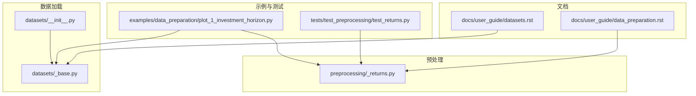
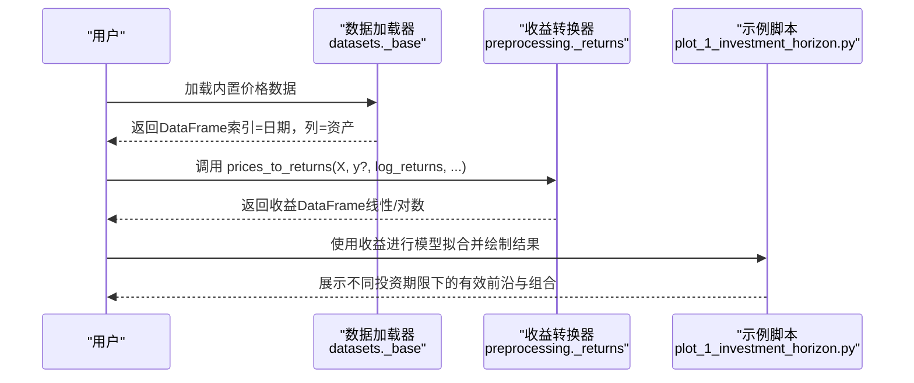
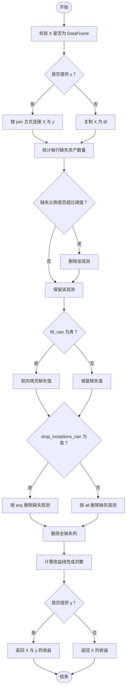
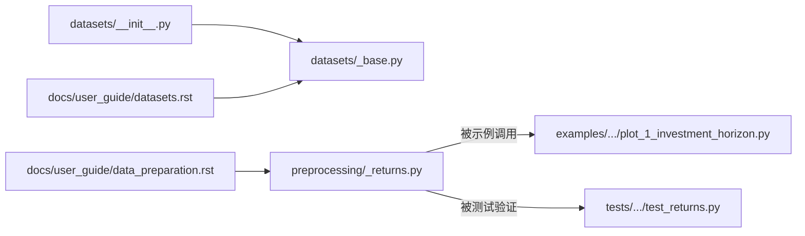

# 数据准备与预处理

<cite>
**本文引用的文件**
- [src/skfolio/preprocessing/_returns.py](file://src/skfolio/preprocessing/_returns.py)
- [src/skfolio/datasets/__init__.py](file://src/skfolio/datasets/__init__.py)
- [src/skfolio/datasets/_base.py](file://src/skfolio/datasets/_base.py)
- [docs/user_guide/data_preparation.rst](file://docs/user_guide/data_preparation.rst)
- [docs/user_guide/datasets.rst](file://docs/user_guide/datasets.rst)
- [examples/data_preparation/plot_1_investment_horizon.py](file://examples/data_preparation/plot_1_investment_horizon.py)
- [tests/test_preprocessing/test_returns.py](file://tests/test_preprocessing/test_returns.py)
- [src/skfolio/pre_selection/_select_complete.py](file://src/skfolio/pre_selection/_select_complete.py)
</cite>

## 目录
1. [引言](#引言)
2. [项目结构](#项目结构)
3. [核心组件](#核心组件)
4. [架构总览](#架构总览)
5. [详细组件分析](#详细组件分析)
6. [依赖关系分析](#依赖关系分析)
7. [性能考量](#性能考量)
8. [故障排查指南](#故障排查指南)
9. [结论](#结论)
10. [附录](#附录)

## 引言
本指南聚焦于 skfolio 的数据准备与预处理流程，帮助用户正确地从价格数据转换为适合优化与估计的收益序列，并理解不同投资期限下的收益建模差异。重点覆盖以下方面：
- 使用内置数据集（datasets 模块）加载与探索价格数据
- 使用 preprocessing 模块的核心函数 prices_to_returns 进行收益转换（简单收益率与对数收益率）
- 缺失值处理策略（前向填充、观测行过滤、资产列过滤）
- 将自定义数据适配为 skfolio 输入格式（pandas DataFrame 要求）
- 面对不完整数据集与不同投资期限的实践建议
- 数据质量对优化结果的影响与最佳实践

## 项目结构
围绕“数据准备与预处理”的相关模块与文件组织如下：
- 数据加载：datasets 模块提供多种内置数据集的加载接口，支持本地缓存与远程下载
- 收益转换：preprocessing 模块提供 prices_to_returns 函数，将价格转换为线性或对数收益
- 示例与验证：examples 中包含投资期限差异的演示；tests 提供收益转换的单元测试
- 文档：user_guide 中有数据准备与数据集的官方说明

图表来源
- [src/skfolio/datasets/__init__.py](file://src/skfolio/datasets/__init__.py#L1-L23)
- [src/skfolio/datasets/_base.py](file://src/skfolio/datasets/_base.py#L1-L454)
- [src/skfolio/preprocessing/_returns.py](file://src/skfolio/preprocessing/_returns.py#L1-L133)
- [examples/data_preparation/plot_1_investment_horizon.py](file://examples/data_preparation/plot_1_investment_horizon.py#L1-L79)
- [tests/test_preprocessing/test_returns.py](file://tests/test_preprocessing/test_returns.py#L1-L51)
- [docs/user_guide/data_preparation.rst](file://docs/user_guide/data_preparation.rst#L1-L145)
- [docs/user_guide/datasets.rst](file://docs/user_guide/datasets.rst#L1-L46)

章节来源
- [src/skfolio/datasets/__init__.py](file://src/skfolio/datasets/__init__.py#L1-L23)
- [src/skfolio/datasets/_base.py](file://src/skfolio/datasets/_base.py#L1-L454)
- [src/skfolio/preprocessing/_returns.py](file://src/skfolio/preprocessing/_returns.py#L1-L133)
- [examples/data_preparation/plot_1_investment_horizon.py](file://examples/data_preparation/plot_1_investment_horizon.py#L1-L79)
- [tests/test_preprocessing/test_returns.py](file://tests/test_preprocessing/test_returns.py#L1-L51)
- [docs/user_guide/data_preparation.rst](file://docs/user_guide/data_preparation.rst#L1-L145)
- [docs/user_guide/datasets.rst](file://docs/user_guide/datasets.rst#L1-L46)

## 核心组件
- 内置数据集加载器：提供 S&P 500、FTSE 100、NASDAQ、因子等数据集的加载与缓存机制，返回 pandas DataFrame（索引为日期）
- 收益转换器：prices_to_returns 将价格序列转换为线性或对数收益，内置缺失值处理与观测/资产维度清理逻辑
- 投资期限示例：展示在不同投资期限下，简化流程与通用流程的差异
- 预处理测试：验证收益转换、缺失值处理、观测/资产维度一致性等行为

章节来源
- [src/skfolio/datasets/_base.py](file://src/skfolio/datasets/_base.py#L168-L205)
- [src/skfolio/datasets/_base.py](file://src/skfolio/datasets/_base.py#L247-L294)
- [src/skfolio/datasets/_base.py](file://src/skfolio/datasets/_base.py#L296-L346)
- [src/skfolio/datasets/_base.py](file://src/skfolio/datasets/_base.py#L349-L398)
- [src/skfolio/datasets/_base.py](file://src/skfolio/datasets/_base.py#L401-L454)
- [src/skfolio/preprocessing/_returns.py](file://src/skfolio/preprocessing/_returns.py#L13-L133)
- [examples/data_preparation/plot_1_investment_horizon.py](file://examples/data_preparation/plot_1_investment_horizon.py#L1-L79)
- [tests/test_preprocessing/test_returns.py](file://tests/test_preprocessing/test_returns.py#L1-L51)

## 架构总览
下面的时序图展示了从加载价格到生成收益序列的关键步骤，以及与投资期限的关系。

图表来源
- [src/skfolio/datasets/_base.py](file://src/skfolio/datasets/_base.py#L168-L205)
- [src/skfolio/preprocessing/_returns.py](file://src/skfolio/preprocessing/_returns.py#L13-L133)
- [examples/data_preparation/plot_1_investment_horizon.py](file://examples/data_preparation/plot_1_investment_horizon.py#L1-L79)

## 详细组件分析

### 组件A：内置数据集（datasets 模块）
- 功能概述
  - 提供多类金融数据集的加载入口，包括标普500成分股、标普500指数、5因子ETF、富时100、纳斯达克成分等
  - 支持本地缓存与远程下载，自动管理数据目录与缓存文件
  - 返回 pandas DataFrame，索引为日期，列名为资产名称
- 关键接口
  - load_sp500_dataset、load_sp500_index、load_factors_dataset
  - load_ftse100_dataset、load_nasdaq_dataset、load_sp500_implied_vol_dataset
- 使用建议
  - 优先使用这些内置数据进行快速验证与示例演示
  - 对于大型数据集，注意首次下载与本地缓存路径（默认用户主目录下的 skfolio_data）

章节来源
- [src/skfolio/datasets/__init__.py](file://src/skfolio/datasets/__init__.py#L1-L23)
- [src/skfolio/datasets/_base.py](file://src/skfolio/datasets/_base.py#L168-L205)
- [src/skfolio/datasets/_base.py](file://src/skfolio/datasets/_base.py#L247-L294)
- [src/skfolio/datasets/_base.py](file://src/skfolio/datasets/_base.py#L296-L346)
- [src/skfolio/datasets/_base.py](file://src/skfolio/datasets/_base.py#L349-L398)
- [src/skfolio/datasets/_base.py](file://src/skfolio/datasets/_base.py#L401-L454)
- [docs/user_guide/datasets.rst](file://docs/user_guide/datasets.rst#L1-L46)

### 组件B：收益转换器（prices_to_returns）
- 功能概述
  - 将资产价格序列转换为线性或对数收益
  - 内置缺失值处理与观测/资产维度清理
  - 可选地与目标或因子价格联合转换，保持观测一致
- 收益类型
  - 线性收益（简单收益）：适合用于组合回报与风险的加权聚合
  - 对数收益（连续复利收益）：适合时间维度上的可加性投影
- 关键参数与行为
  - log_returns：选择线性或对数收益
  - nan_threshold：按缺失比例丢弃观测行
  - drop_inceptions_nan：是否丢弃起始端存在缺失的观测
  - fill_nan：是否对缺失值进行前向填充
  - join：当提供 y 时，控制与 X 的联结方式
- 处理流程（算法流程图）

图表来源
- [src/skfolio/preprocessing/_returns.py](file://src/skfolio/preprocessing/_returns.py#L13-L133)

- 行为验证（来自测试）
  - 支持线性与对数收益转换
  - 支持缺失值前向填充与观测行过滤
  - 当提供 y 时，返回与 X/y 同索引、同列名的收益
  - 起始缺失观测的处理可通过 drop_inceptions_nan 控制

章节来源
- [src/skfolio/preprocessing/_returns.py](file://src/skfolio/preprocessing/_returns.py#L13-L133)
- [tests/test_preprocessing/test_returns.py](file://tests/test_preprocessing/test_returns.py#L1-L51)

### 组件C：投资期限与收益建模（示例）
- 示例要点
  - 使用内置 S&P 500 价格数据，转换为日度线性收益
  - 比较“简化流程”（直接用日度线性收益估计）与“通用流程”（先对数收益再投影至投资期限）
  - 在不同投资期限（3个月、1年、10年）下观察有效前沿差异
- 结论提示
  - 对于频繁再平衡（投资期限小于一年）的组合，两种流程结果接近
  - 对于长期投资期限，通用流程更符合市场不变量与定价映射

章节来源
- [examples/data_preparation/plot_1_investment_horizon.py](file://examples/data_preparation/plot_1_investment_horizon.py#L1-L79)
- [docs/user_guide/data_preparation.rst](file://docs/user_guide/data_preparation.rst#L1-L145)

### 组件D：不完整数据集与缺失值处理
- 不完整数据的常见形态
  - 资产早期/晚期缺失（inception/expiry），中间无缺失
  - 资产内部出现缺失（internal NaN）
- 处理策略
  - 使用 prices_to_returns 的 nan_threshold、drop_inceptions_nan、fill_nan 参数进行清洗
  - 使用预筛选器 SelectComplete 基于“完整观测期”移除早期/晚期缺失的资产
- 实践建议
  - 在收益转换之前，先评估缺失模式，决定是否移除内部缺失资产
  - 对于大规模资产池，结合预筛选与收益转换的阈值策略，提升稳定性

章节来源
- [src/skfolio/preprocessing/_returns.py](file://src/skfolio/preprocessing/_returns.py#L13-L133)
- [src/skfolio/pre_selection/_select_complete.py](file://src/skfolio/pre_selection/_select_complete.py#L1-L118)

## 依赖关系分析
- 数据加载依赖
  - datasets._base 提供统一的数据目录管理与远程下载缓存机制
  - datasets.__init__ 汇聚导出常用加载函数
- 预处理依赖
  - preprocessing._returns 仅依赖 pandas/numpy，面向 DataFrame 接口
  - 与示例脚本、测试脚本形成闭环验证
- 文档与示例
  - user_guide 明确收益类型与投资期限建模原则
  - examples 展示实际工作流与可视化

图表来源
- [src/skfolio/datasets/__init__.py](file://src/skfolio/datasets/__init__.py#L1-L23)
- [src/skfolio/datasets/_base.py](file://src/skfolio/datasets/_base.py#L1-L454)
- [src/skfolio/preprocessing/_returns.py](file://src/skfolio/preprocessing/_returns.py#L1-L133)
- [examples/data_preparation/plot_1_investment_horizon.py](file://examples/data_preparation/plot_1_investment_horizon.py#L1-L79)
- [tests/test_preprocessing/test_returns.py](file://tests/test_preprocessing/test_returns.py#L1-L51)
- [docs/user_guide/data_preparation.rst](file://docs/user_guide/data_preparation.rst#L1-L145)
- [docs/user_guide/datasets.rst](file://docs/user_guide/datasets.rst#L1-L46)

## 性能考量
- 计算复杂度
  - 收益转换主要为 O(T×N) 的矩阵操作（T 为观测数，N 为资产数）
  - 缺失值处理（前向填充、行/列过滤）通常线性或近似线性
- 内存与存储
  - 大型数据集（如 NASDAQ）建议使用本地缓存，避免重复下载
  - 在收益转换后，尽量只保留必要的资产列，减少后续估计的协方差矩阵规模
- 并行与批处理
  - 对于超大规模资产池，可在收益转换前通过预筛选减少列维数
  - 在模型估计阶段，优先采用数值稳定的协方差估计器

## 故障排查指南
- 常见问题与定位
  - 输入非 DataFrame：prices_to_returns 会抛出类型错误，请确保传入 pandas DataFrame
  - 缺失值导致收益不稳定：检查 nan_threshold、drop_inceptions_nan、fill_nan 设置
  - 观测/资产维度不一致：当提供 y 时，确认 join 方式与索引重叠情况
  - 投资期限建模差异：参考示例脚本，对比简化流程与通用流程的结果差异
- 单元测试参考
  - 测试覆盖了线性/对数收益转换、缺失值处理、观测/资产维度一致性等关键行为

章节来源
- [src/skfolio/preprocessing/_returns.py](file://src/skfolio/preprocessing/_returns.py#L13-L133)
- [tests/test_preprocessing/test_returns.py](file://tests/test_preprocessing/test_returns.py#L1-L51)

## 结论
- 数据质量是优化结果的基石：缺失值、资产起始/到期差异、异常波动都会显著影响估计与优化
- 收益类型选择应与建模流程匹配：组合优化通常使用线性收益；对数收益更适合时间维度投影
- 投资期限越长，通用流程（先对数收益再投影）越重要；短期频繁再平衡场景下简化流程已足够
- 利用内置数据集与示例脚本快速验证流程，再迁移到自定义数据

## 附录

### 自定义数据适配指南（pandas DataFrame 要求）
- 数据结构
  - 索引：日期（datetime），表示观测时间点
  - 列：资产名称（字符串），表示资产标识
  - 值：价格序列（数值，允许缺失）
- 建议步骤
  - 清洗：移除全缺失列，前向填充缺失值，按 nan_threshold 过滤观测
  - 转换：使用 prices_to_returns 将价格转换为线性或对数收益
  - 验证：确保收益 DataFrame 的索引与列名与后续估计器兼容
- 注意事项
  - 若后续使用基于对数收益的估计器（如某些先验估计器），请在估计器内部完成对数收益转换，而非外部直接使用对数收益作为输入

章节来源
- [src/skfolio/preprocessing/_returns.py](file://src/skfolio/preprocessing/_returns.py#L13-L133)
- [docs/user_guide/data_preparation.rst](file://docs/user_guide/data_preparation.rst#L1-L145)