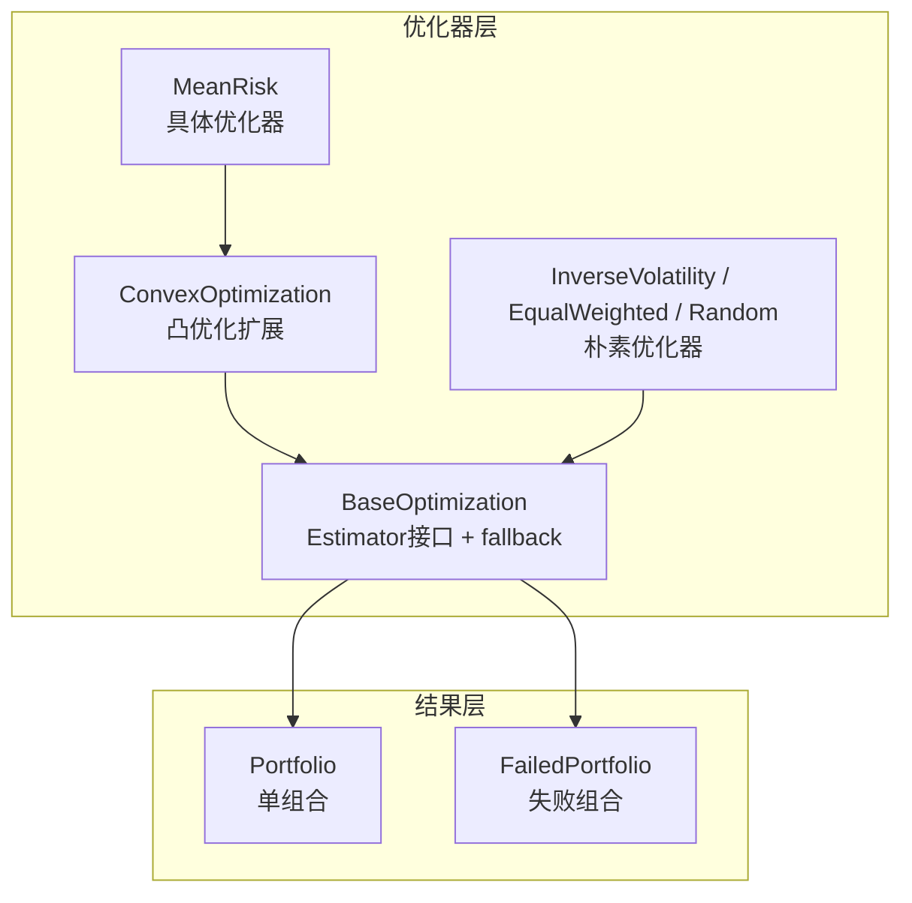
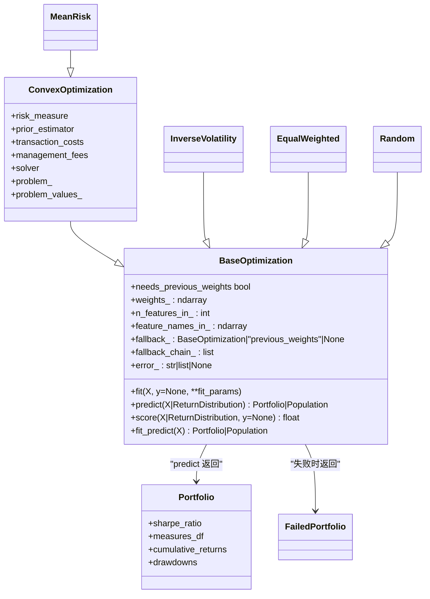
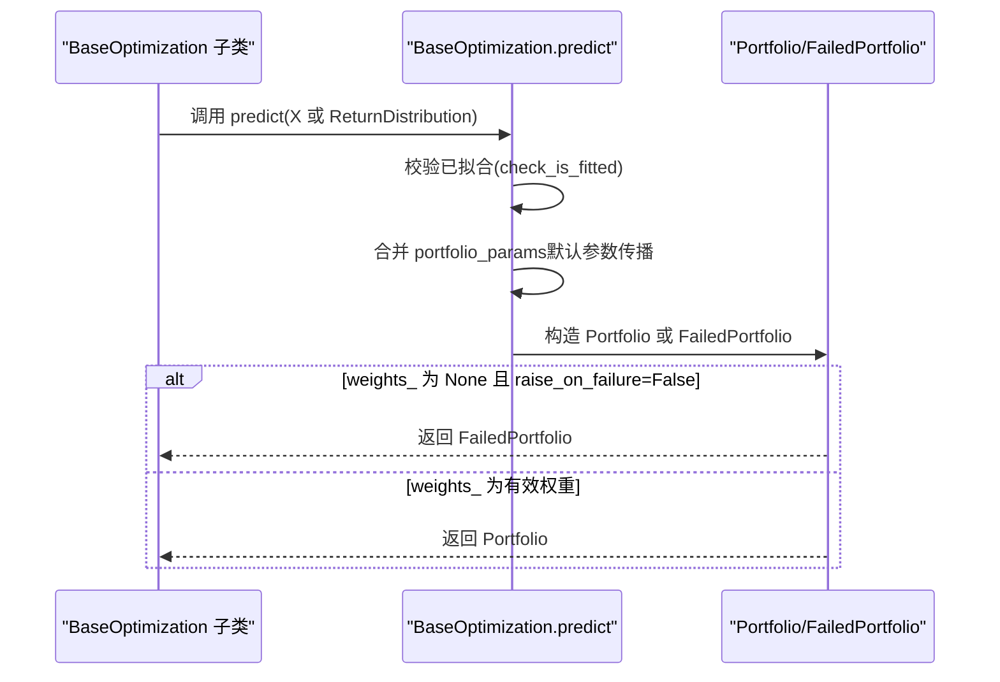
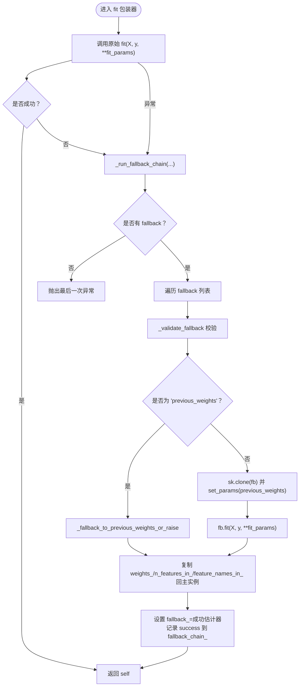
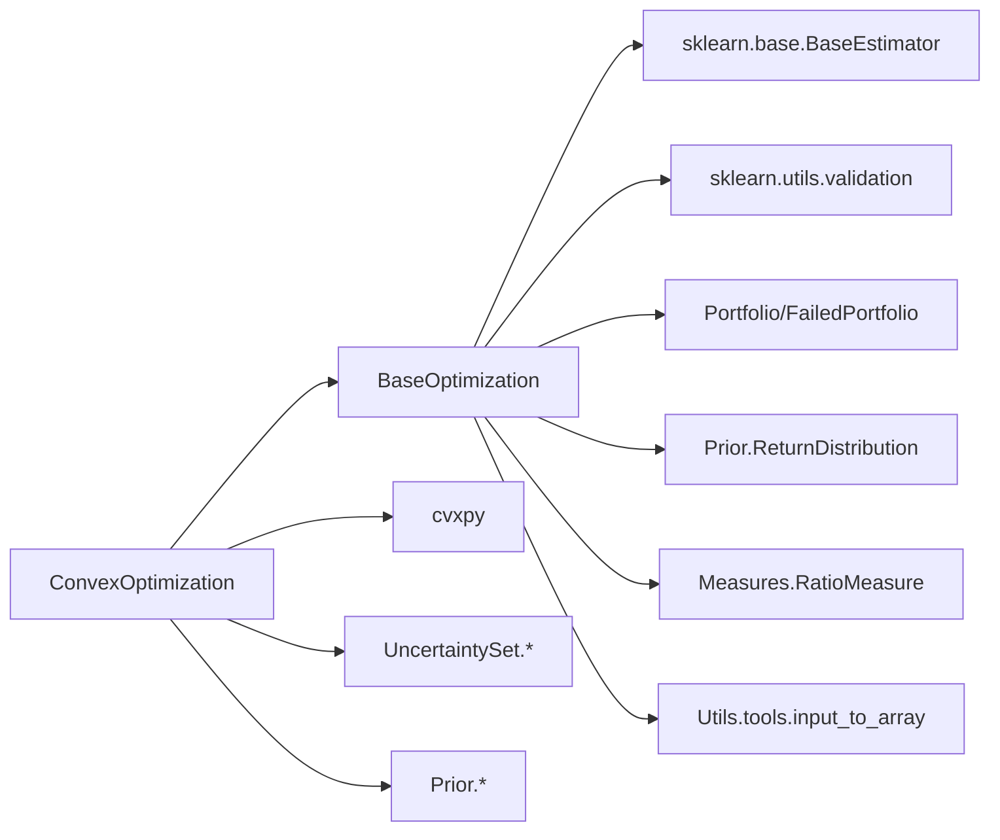

# 优化器框架 (BaseOptimization)

<cite>
**本文引用的文件**
- [src/skfolio/optimization/_base.py](file://src/skfolio/optimization/_base.py)
- [src/skfolio/optimization/convex/_base.py](file://src/skfolio/optimization/convex/_base.py)
- [src/skfolio/optimization/convex/_mean_risk.py](file://src/skfolio/optimization/convex/_mean_risk.py)
- [src/skfolio/optimization/naive/_naive.py](file://src/skfolio/optimization/naive/_naive.py)
- [src/skfolio/portfolio/_base.py](file://src/skfolio/portfolio/_base.py)
- [tests/test_optimization/test_fallback.py](file://tests/test_optimization/test_fallback.py)
</cite>

## 目录
1. [引言](#引言)
2. [项目结构](#项目结构)
3. [核心组件](#核心组件)
4. [架构总览](#架构总览)
5. [详细组件分析](#详细组件分析)
6. [依赖分析](#依赖分析)
7. [性能考虑](#性能考虑)
8. [故障排查指南](#故障排查指南)
9. [结论](#结论)
10. [附录](#附录)

## 引言
本文件系统性解析 skfolio 的优化器框架，重点围绕 BaseOptimization 基类的设计理念与技术实现，说明其如何遵循 scikit-learn Estimator 接口规范，定义 fit 和 predict 方法的契约；解释 fit 如何接收历史收益率数据并执行优化算法，predict 如何生成 Portfolio 对象；阐述该基类提供的通用能力：参数验证、状态管理、与 Pipeline 集成；并通过测试用例展示自定义优化器继承 BaseOptimization 的实现方式；最后讨论优化失败时的回退机制（fallback）处理流程，并结合测试逻辑说明异常恢复策略。

## 项目结构
- 优化器框架位于 optimization 子模块：
  - 基类：BaseOptimization（定义 Estimator 接口、fallback 回退、预测与评分）
  - 凸优化基类：ConvexOptimization（在 BaseOptimization 上扩展了风险度量、约束、求解器等）
  - 具体优化器：如 MeanRisk、InverseVolatility、EqualWeighted 等
- Portfolio 与 FailedPortfolio 定义于 portfolio 子模块，用于封装优化结果
- 测试用例集中于 tests/test_optimization/test_fallback.py，覆盖 fallback 行为、Pipeline 集成、失败恢复等

图表来源
- [src/skfolio/optimization/_base.py](file://src/skfolio/optimization/_base.py#L1-L583)
- [src/skfolio/optimization/convex/_base.py](file://src/skfolio/optimization/convex/_base.py#L1-L800)
- [src/skfolio/optimization/convex/_mean_risk.py](file://src/skfolio/optimization/convex/_mean_risk.py#L1-L800)
- [src/skfolio/optimization/naive/_naive.py](file://src/skfolio/optimization/naive/_naive.py#L1-L355)
- [src/skfolio/portfolio/_base.py](file://src/skfolio/portfolio/_base.py#L1-L800)

章节来源
- [src/skfolio/optimization/_base.py](file://src/skfolio/optimization/_base.py#L1-L583)
- [src/skfolio/optimization/convex/_base.py](file://src/skfolio/optimization/convex/_base.py#L1-L800)
- [src/skfolio/optimization/convex/_mean_risk.py](file://src/skfolio/optimization/convex/_mean_risk.py#L1-L800)
- [src/skfolio/optimization/naive/_naive.py](file://src/skfolio/optimization/naive/_naive.py#L1-L355)
- [src/skfolio/portfolio/_base.py](file://src/skfolio/portfolio/_base.py#L1-L800)

## 核心组件
- BaseOptimization：定义 Estimator 接口、fit/predict 契约、fallback 回退链、状态字段（weights_、n_features_in_、feature_names_in_、fallback_、fallback_chain_、error_）、评分 score、fit_predict、needs_previous_weights 等
- ConvexOptimization：在 BaseOptimization 上扩展风险度量、预算/权重/阈值/组约束、交易成本/管理费、不确定性集、求解器与缓存等
- Portfolio/FailedPortfolio：封装优化结果，提供度量计算与序列化

章节来源
- [src/skfolio/optimization/_base.py](file://src/skfolio/optimization/_base.py#L1-L583)
- [src/skfolio/optimization/convex/_base.py](file://src/skfolio/optimization/convex/_base.py#L1-L800)
- [src/skfolio/portfolio/_base.py](file://src/skfolio/portfolio/_base.py#L1-L800)

## 架构总览
BaseOptimization 通过装饰器在子类 __init_subclass__ 时自动包装 fit，实现 fallback 回退链；predict 将 weights_ 转换为 Portfolio 或 Population；score 使用 SharpeRatio 进行评估；needs_previous_weights 决定是否在交叉验证中传递 previous_weights。

图表来源
- [src/skfolio/optimization/_base.py](file://src/skfolio/optimization/_base.py#L1-L583)
- [src/skfolio/optimization/convex/_base.py](file://src/skfolio/optimization/convex/_base.py#L1-L800)
- [src/skfolio/optimization/convex/_mean_risk.py](file://src/skfolio/optimization/convex/_mean_risk.py#L1-L800)
- [src/skfolio/optimization/naive/_naive.py](file://src/skfolio/optimization/naive/_naive.py#L1-L355)
- [src/skfolio/portfolio/_base.py](file://src/skfolio/portfolio/_base.py#L1-L800)

## 详细组件分析

### BaseOptimization 设计与实现
- Estimator 接口与契约
  - fit：接收 X（n_obs, n_assets）或 ReturnDistribution，返回 self；支持 y（可选）
  - predict：根据 weights_ 返回单个 Portfolio 或 Population；若 weights_ 为 None 且 raise_on_failure=False，则返回 FailedPortfolio
  - score：基于 SharpeRatio 的评分（单组合或组合集合的均值）
  - fit_predict：先 fit 再 predict
- 状态管理
  - 记录 n_features_in_、feature_names_in_（当 X 列名为字符串时）
  - 记录 fallback_（成功回退的估计器或 "previous_weights"）、fallback_chain_（回退链日志）、error_（错误信息）
- 参数验证与清理
  - _clean_input：将标量/映射/数组统一清理为长度为 n_assets 的数组，缺失资产按 fill_value 填充
  - _clean_previous_weights：对 previous_weights 进行标准化与广播
  - _has_transaction_cost：判断是否存在非零交易成本
- 回退机制（fallback）
  - 自动包装 fit：在子类 __init_subclass__ 时注入包装器，捕获 fit 异常并执行回退链
  - _run_fallback_chain：按顺序尝试 fallback 列表，支持字符串 "previous_weights"
  - _fallback_to_previous_weights_or_raise：回退到 previous_weights 或抛出错误
  - _validate_fallback：校验 fallback 类型（仅允许 BaseOptimization 实例或 "previous_weights"）
- 与 Pipeline 集成
  - needs_previous_weights：当存在交易成本、最大周转率或 fallback 依赖 previous_weights 时，需在交叉验证中顺序传递 weights
- 与 Portfolio/FailedPortfolio 的交互
  - predict：自动将 portfolio_params 中的 transaction_costs、management_fees、previous_weights、risk_free_rate 等传播给 Portfolio/FailedPortfolio
  - 若 weights_ 为 None 且 raise_on_failure=False，predict 返回 FailedPortfolio 并携带 error_

章节来源
- [src/skfolio/optimization/_base.py](file://src/skfolio/optimization/_base.py#L1-L583)

### ConvexOptimization 扩展能力
- 风险度量与目标函数枚举（ObjectiveFunction）
- prior_estimator、mu_uncertainty_set_estimator、covariance_uncertainty_set_estimator
- 权重上下界、预算、长/短仓上限、阈值、分组、线性约束
- 交易成本、管理费、目标权重、风险自由利率
- 求解器选择与参数、问题缓存、表达式覆盖与自定义添加
- 继承 BaseOptimization 的所有特性（包括 fallback）

章节来源
- [src/skfolio/optimization/convex/_base.py](file://src/skfolio/optimization/convex/_base.py#L1-L800)

### MeanRisk 具体实现要点
- 支持多种目标函数（最小化风险、最大化收益、最大化效用、最大化比率）
- 支持多种风险度量（方差、半方差、CVaR、EVaR、最大回撤等）
- 支持预算约束、权重上下界、阈值、分组、线性约束
- 支持交易成本、管理费、目标权重、风险自由利率
- 支持不确定性集（mu 与协方差）
- 继承 ConvexOptimization，天然具备 BaseOptimization 的 fallback 能力

章节来源
- [src/skfolio/optimization/convex/_mean_risk.py](file://src/skfolio/optimization/convex/_mean_risk.py#L1-L800)

### 朴素优化器示例
- EqualWeighted：等权
- InverseVolatility：逆波动率
- Random：Dirichlet 随机权重
- 均继承 BaseOptimization，具备 fallback 与 predict 能力

章节来源
- [src/skfolio/optimization/naive/_naive.py](file://src/skfolio/optimization/naive/_naive.py#L1-L355)

### Predict 工作流（序列图）

图表来源
- [src/skfolio/optimization/_base.py](file://src/skfolio/optimization/_base.py#L288-L375)
- [src/skfolio/portfolio/_base.py](file://src/skfolio/portfolio/_base.py#L1-L800)

### Fit 失败与回退（fallback）流程（流程图）

图表来源
- [src/skfolio/optimization/_base.py](file://src/skfolio/optimization/_base.py#L127-L256)

### 自定义优化器继承 BaseOptimization 的实现方式
- 继承 BaseOptimization，显式声明所有关键字参数（不使用 *args/**kwargs），遵循 scikit-learn 规范
- 实现 fit：接收 X/y，完成参数校验与优化，设置 self.weights_、n_features_in_、feature_names_in_
- 可选：实现 get_metadata_routing（用于元数据路由）
- 可选：在 __init__ 中接受 portfolio_params、fallback、previous_weights、raise_on_failure 等参数
- 可选：在 fit 中调用 sklearn.utils.validation.validate_data 保证输入格式正确
- 可选：在 predict 中根据 weights_ 返回 Portfolio 或 Population

参考路径
- [src/skfolio/optimization/naive/_naive.py](file://src/skfolio/optimization/naive/_naive.py#L120-L159)（InverseVolatility.fit 示例）
- [src/skfolio/optimization/naive/_naive.py](file://src/skfolio/optimization/naive/_naive.py#L237-L256)（EqualWeighted.fit 示例）
- [src/skfolio/optimization/naive/_naive.py](file://src/skfolio/optimization/naive/_naive.py#L335-L355)（Random.fit 示例）

章节来源
- [src/skfolio/optimization/naive/_naive.py](file://src/skfolio/optimization/naive/_naive.py#L1-L355)

### 与 Pipeline 集成与回退
- Pipeline.fit/Pipeline.predict 会调用各步骤的 fit/predict
- 当某步 fit 失败时，fallback 会在该步骤内部接管并回退到备选估计器或 previous_weights
- 若 raise_on_failure=False，最终返回 FailedPortfolio，但 Pipeline 层仍可继续处理

参考路径
- [tests/test_optimization/test_fallback.py](file://tests/test_optimization/test_fallback.py#L420-L442)（Pipeline 集成测试）
- [tests/test_optimization/test_fallback.py](file://tests/test_optimization/test_fallback.py#L444-L470)（Pipeline raise_off 场景）

章节来源
- [tests/test_optimization/test_fallback.py](file://tests/test_optimization/test_fallback.py#L420-L470)

## 依赖分析
- BaseOptimization 依赖
  - sklearn.base.BaseEstimator（scikit-learn Estimator 接口）
  - sklearn.utils.validation.check_is_fitted（预测前校验）
  - skfolio.portfolio.Portfolio/FailedPortfolio（结果封装）
  - skfolio.prior.ReturnDistribution（期望收益/协方差等先验）
  - skfolio.measures.RatioMeasure（评分使用）
  - skfolio.utils.tools.input_to_array（参数清理）
- ConvexOptimization 进一步依赖
  - cvxpy（凸优化建模与求解）
  - skfolio.uncertainty_set.*（不确定性集）
  - skfolio.prior.*（先验估计器）

图表来源
- [src/skfolio/optimization/_base.py](file://src/skfolio/optimization/_base.py#L1-L583)
- [src/skfolio/optimization/convex/_base.py](file://src/skfolio/optimization/convex/_base.py#L1-L800)

章节来源
- [src/skfolio/optimization/_base.py](file://src/skfolio/optimization/_base.py#L1-L583)
- [src/skfolio/optimization/convex/_base.py](file://src/skfolio/optimization/convex/_base.py#L1-L800)

## 性能考虑
- BaseOptimization 的包装器在 __init_subclass__ 注入，避免运行时开销
- ConvexOptimization 使用 _cvx_cache 缓存共享的 CVX 表达式，减少重复构建与提升收敛稳定性
- _clean_input/_clean_previous_weights 在参数清理阶段进行广播与填充，避免后续重复转换
- needs_previous_weights 用于控制交叉验证中是否顺序传递 previous_weights，避免不必要的克隆与重复计算

章节来源
- [src/skfolio/optimization/convex/_base.py](file://src/skfolio/optimization/convex/_base.py#L1-L800)
- [src/skfolio/optimization/_base.py](file://src/skfolio/optimization/_base.py#L453-L523)

## 故障排查指南
- 常见问题
  - fit 抛出异常：检查 fallback 配置与 previous_weights 是否有效
  - predict 抛出 NotFittedError：确认 fit 是否成功，或 raise_on_failure=False 时 weights_ 是否为 None
  - 回退链为空：确认 fallback 是否为 None 或空列表
- 关键字段定位
  - error_：记录 fit 失败时的错误信息
  - fallback_chain_：记录每一步尝试的结果（success 或异常字符串）
  - fallback_：记录最终成功的回退估计器或 "previous_weights"
- 测试用例参考
  - 失败后 raise_on_failure=True：抛出异常，weights_ 不设置
  - 失败后 raise_on_failure=False：警告并设置 weights_=None，predict 返回 FailedPortfolio
  - fallback 列表多级嵌套：逐级尝试，直到成功或全部失败
  - Pipeline 集成：在 Pipeline.fit 中触发回退，不影响后续步骤

章节来源
- [src/skfolio/optimization/_base.py](file://src/skfolio/optimization/_base.py#L127-L256)
- [tests/test_optimization/test_fallback.py](file://tests/test_optimization/test_fallback.py#L256-L314)
- [tests/test_optimization/test_fallback.py](file://tests/test_optimization/test_fallback.py#L316-L330)
- [tests/test_optimization/test_fallback.py](file://tests/test_optimization/test_fallback.py#L331-L390)
- [tests/test_optimization/test_fallback.py](file://tests/test_optimization/test_fallback.py#L392-L418)
- [tests/test_optimization/test_fallback.py](file://tests/test_optimization/test_fallback.py#L420-L470)

## 结论
BaseOptimization 通过自动包装 fit、统一的 Estimator 接口与 fallback 回退链，为所有优化器提供了稳健的失败恢复与可追踪的回退日志；predict 将 weights_ 无缝转换为 Portfolio/FailedPortfolio，便于后续度量与可视化；ConvexOptimization 在此基础上扩展了丰富的风险度量与约束能力。该设计既满足 scikit-learn 生态兼容性，又兼顾金融优化场景的复杂性与鲁棒性。

## 附录
- 自定义优化器实现建议
  - 显式关键字参数，避免 *args/**kwargs
  - 在 fit 中设置 weights_、n_features_in_、feature_names_in_
  - 可选：实现 get_metadata_routing 以支持元数据路由
  - 可选：在 __init__ 中接受 portfolio_params、fallback、previous_weights、raise_on_failure
  - 可选：在 fit 中调用 sklearn.utils.validation.validate_data
- 与 Pipeline 集成注意事项
  - 当存在交易成本、最大周转率或 fallback 依赖 previous_weights 时，needs_previous_weights 为 True，需在交叉验证中顺序传递 weights
  - Pipeline.fit 中的回退不会影响其他步骤，但最终结果可能为 FailedPortfolio

章节来源
- [src/skfolio/optimization/naive/_naive.py](file://src/skfolio/optimization/naive/_naive.py#L1-L355)
- [src/skfolio/optimization/_base.py](file://src/skfolio/optimization/_base.py#L424-L452)
- [tests/test_optimization/test_fallback.py](file://tests/test_optimization/test_fallback.py#L420-L470)