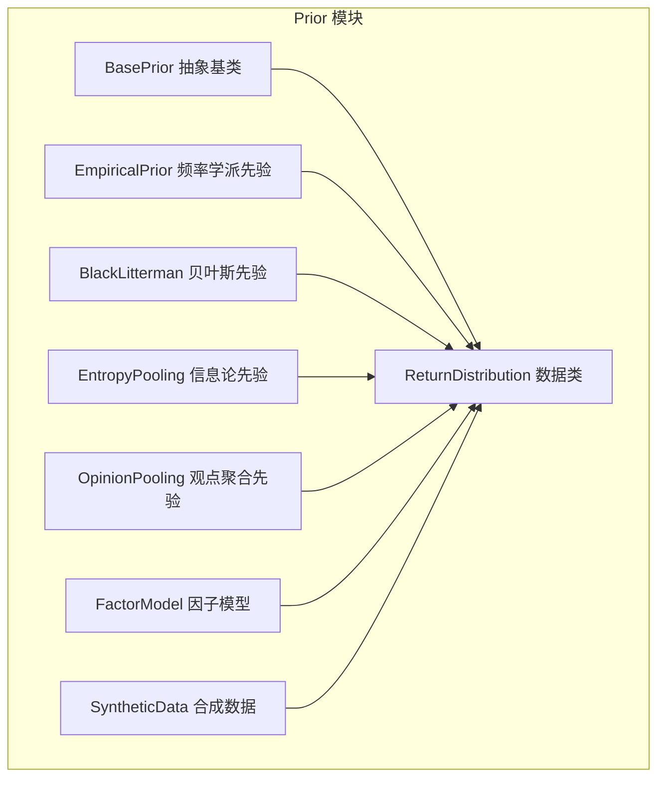
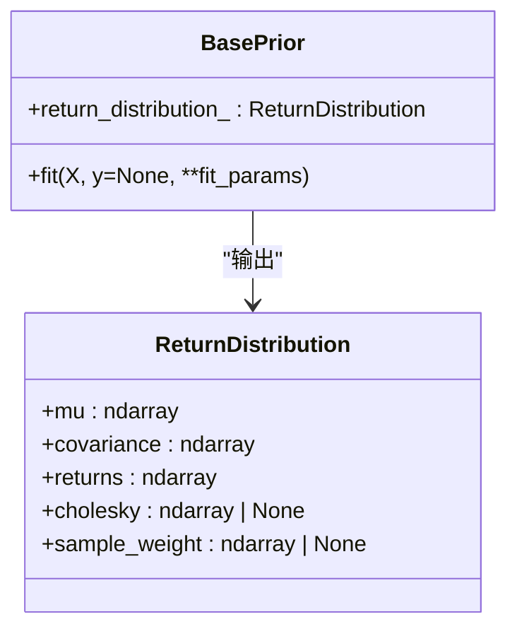
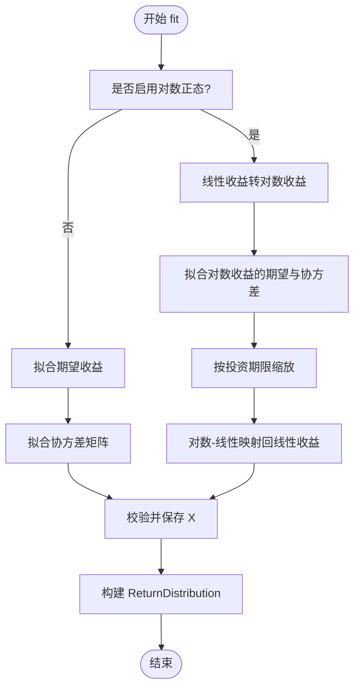
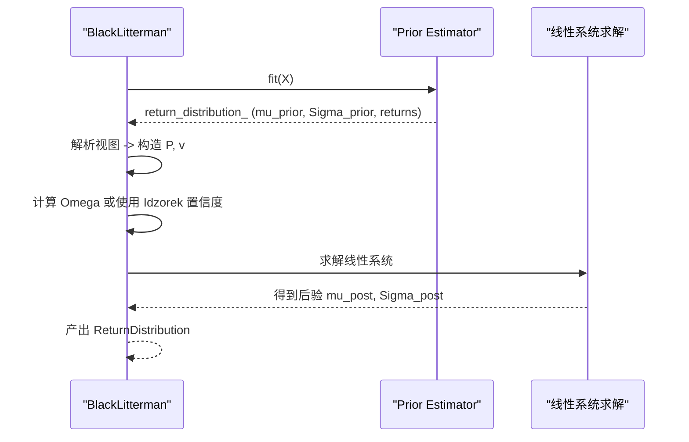
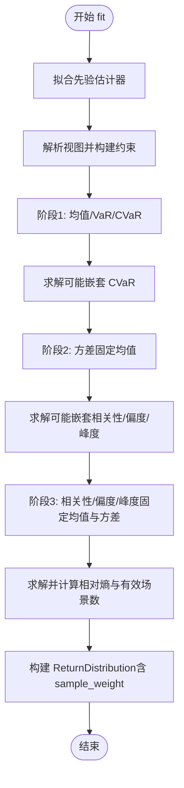
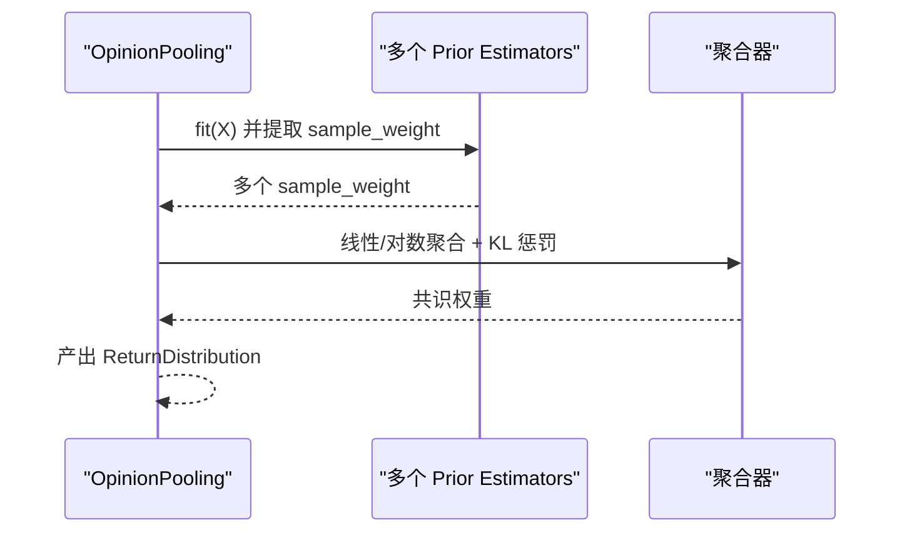
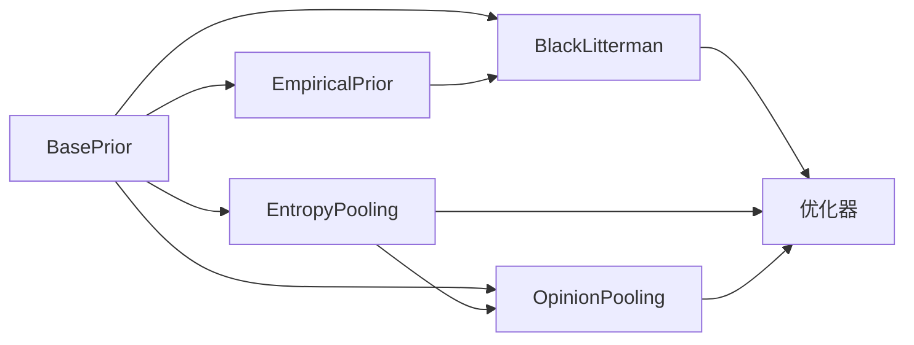

# 先验估计 (Prior)

<cite>
**本文引用的文件列表**
- [src/skfolio/prior/_base.py](file://src/skfolio/prior/_base.py)
- [src/skfolio/prior/_empirical.py](file://src/skfolio/prior/_empirical.py)
- [src/skfolio/prior/_black_litterman.py](file://src/skfolio/prior/_black_litterman.py)
- [src/skfolio/prior/_entropy_pooling.py](file://src/skfolio/prior/_entropy_pooling.py)
- [src/skfolio/prior/_opinion_pooling.py](file://src/skfolio/prior/_opinion_pooling.py)
- [src/skfolio/prior/__init__.py](file://src/skfolio/prior/__init__.py)
- [docs/user_guide/prior.rst](file://docs/user_guide/prior.rst)
- [examples/entropy_pooling/plot_1_entropy_pooling.py](file://examples/entropy_pooling/plot_1_entropy_pooling.py)
- [examples/entropy_pooling/plot_2_opinion_pooling.py](file://examples/entropy_pooling/plot_2_opinion_pooling.py)
- [tests/test_prior/test_empirical.py](file://tests/test_prior/test_empirical.py)
- [tests/test_prior/test_black_litterman.py](file://tests/test_prior/test_black_litterman.py)
- [tests/test_prior/test_entropy_pooling.py](file://tests/test_prior/test_entropy_pooling.py)
</cite>

## 目录
1. [引言](#引言)
2. [项目结构](#项目结构)
3. [核心组件](#核心组件)
4. [架构总览](#架构总览)
5. [详细组件分析](#详细组件分析)
6. [依赖关系分析](#依赖关系分析)
7. [性能考量](#性能考量)
8. [故障排查指南](#故障排查指南)
9. [结论](#结论)
10. [附录](#附录)

## 引言
本篇文档系统性介绍 skfolio 中的“先验估计（Prior）”体系，重点围绕 BasePrior 抽象基类及其在投资组合优化流程中的关键作用展开。先验估计负责从历史或合成的市场数据中学习资产的预期收益与协方差矩阵，并以统一的数据结构 ReturnDistribution 输出，供后续优化器直接消费。文档将对比 EmpiricalPrior、BlackLitterman、EntropyPooling 等不同先验模型的接口与实现差异，阐释它们如何与贝叶斯框架（如熵池化）结合，以及如何在 Pipeline 中串联 Prior 与 Optimization 组件。

## 项目结构
Prior 模块位于 src/skfolio/prior 下，包含抽象基类与多种先验估计器实现：
- 抽象基类：BasePrior、ReturnDistribution
- 具体实现：EmpiricalPrior、BlackLitterman、EntropyPooling、OpinionPooling、SyntheticData（用于生成场景）、FactorModel（因子模型）
- 导出入口：__init__.py



图表来源
- [src/skfolio/prior/_base.py](file://src/skfolio/prior/_base.py#L1-L70)
- [src/skfolio/prior/_empirical.py](file://src/skfolio/prior/_empirical.py#L1-L205)
- [src/skfolio/prior/_black_litterman.py](file://src/skfolio/prior/_black_litterman.py#L1-L269)
- [src/skfolio/prior/_entropy_pooling.py](file://src/skfolio/prior/_entropy_pooling.py#L1-L420)
- [src/skfolio/prior/_opinion_pooling.py](file://src/skfolio/prior/_opinion_pooling.py#L1-L220)
- [src/skfolio/prior/__init__.py](file://src/skfolio/prior/__init__.py#L1-L27)

章节来源
- [src/skfolio/prior/__init__.py](file://src/skfolio/prior/__init__.py#L1-L27)
- [docs/user_guide/prior.rst](file://docs/user_guide/prior.rst#L1-L120)

## 核心组件
- BasePrior：定义所有先验估计器的统一接口，要求实现 fit(X, y=None, **fit_params)，并产出 return_distribution_（ReturnDistribution）。
- ReturnDistribution：统一的先验输出数据结构，包含 mu、covariance、returns、可选的 cholesky、sample_weight 等字段。
- 典型先验估计器：
  - EmpiricalPrior：分别拟合期望收益与协方差，支持对数正态转换与投资期限缩放。
  - BlackLitterman：基于先验分布与分析师观点进行后验更新，支持视图置信度与无风险利率。
  - EntropyPooling：最小化 KL 散度，按约束重加权先验概率，支持均值、方差、偏度、峰度、相关性、VaR、CVaR 等多维视图。
  - OpinionPooling：聚合多个专家先验（基于样本权重）的共识分布，支持线性/对数聚合与鲁棒惩罚。
  - FactorModel/SyntheticData：通过因子模型或合成数据扩展先验，便于压力测试与极端视图。

章节来源
- [src/skfolio/prior/_base.py](file://src/skfolio/prior/_base.py#L1-L70)
- [src/skfolio/prior/_empirical.py](file://src/skfolio/prior/_empirical.py#L1-L205)
- [src/skfolio/prior/_black_litterman.py](file://src/skfolio/prior/_black_litterman.py#L1-L269)
- [src/skfolio/prior/_entropy_pooling.py](file://src/skfolio/prior/_entropy_pooling.py#L1-L420)
- [src/skfolio/prior/_opinion_pooling.py](file://src/skfolio/prior/_opinion_pooling.py#L1-L220)

## 架构总览
先验估计器遵循 scikit-learn 的 Estimator 接口，统一以 fit 输入资产回报矩阵 X，输出 return_distribution_，供优化器读取。优化器通常通过 prior_estimator 参数接收 Prior 实例，从而在优化前注入先验假设。

```mermaid
sequenceDiagram
participant Data as "数据 X"
participant Prior as "Prior Estimator"
participant Opt as "Optimization Estimator"
Data->>Prior : fit(X)
Prior-->>Prior : 计算 mu, Σ, 返回样本权重等
Prior-->>Opt : return_distribution_
Opt->>Opt : 使用 return_distribution_ 进行优化
Opt-->>Data : 优化结果权重/组合
```

图表来源
- [src/skfolio/prior/_base.py](file://src/skfolio/prior/_base.py#L51-L70)
- [src/skfolio/prior/_empirical.py](file://src/skfolio/prior/_empirical.py#L109-L205)
- [src/skfolio/prior/_black_litterman.py](file://src/skfolio/prior/_black_litterman.py#L151-L269)
- [src/skfolio/prior/_entropy_pooling.py](file://src/skfolio/prior/_entropy_pooling.py#L470-L588)
- [src/skfolio/prior/_opinion_pooling.py](file://src/skfolio/prior/_opinion_pooling.py#L334-L435)

## 详细组件分析

### BasePrior 与 ReturnDistribution
- BasePrior
  - 抽象接口：fit(X, y=None, **fit_params) 必须实现；返回 self。
  - 输出：return_distribution_ 属性，类型为 ReturnDistribution。
- ReturnDistribution
  - 字段：mu（期望收益）、covariance（协方差矩阵）、returns（观测收益）、cholesky（可选下三角 Cholesky 分解）、sample_weight（可选样本权重）。
  - 用途：作为优化器的统一输入载体，兼容频率学派、贝叶斯与信息论先验。



图表来源
- [src/skfolio/prior/_base.py](file://src/skfolio/prior/_base.py#L15-L70)

章节来源
- [src/skfolio/prior/_base.py](file://src/skfolio/prior/_base.py#L15-L70)

### EmpiricalPrior：频率学派先验
- 功能要点
  - 分别拟合 mu_estimator 与 covariance_estimator，独立得到期望收益与协方差。
  - 支持 is_log_normal 与 investment_horizon：当 is_log_normal=True 时，先将线性收益转对数收益估计，再按时间尺度缩放回线性收益。
  - 输出 ReturnDistribution，包含 mu、covariance、returns。
- 关键流程
  - fit：根据路由参数配置底层估计器，拟合后构造 ReturnDistribution。
  - 可选：在 is_log_normal=True 且提供 investment_horizon 时，执行时间缩放与对数-线性映射。



图表来源
- [src/skfolio/prior/_empirical.py](file://src/skfolio/prior/_empirical.py#L109-L205)

章节来源
- [src/skfolio/prior/_empirical.py](file://src/skfolio/prior/_empirical.py#L1-L205)
- [tests/test_prior/test_empirical.py](file://tests/test_prior/test_empirical.py#L1-L140)

### BlackLitterman：贝叶斯先验
- 功能要点
  - 基于先验估计器（默认 EmpiricalPrior + EquilibriumMu）得到先验 mu 与 Σ。
  - 将分析师视图（绝对/相对/分组）转化为挑选矩阵 P 与目标向量 v。
  - 采用线性系统求解替代显式矩阵逆，计算后验期望收益与协方差。
  - 支持视图置信度（Idzorek 方法）与无风险利率。
- 关键流程
  - fit：路由先验估计器 → 拟合 → 提取先验分布 → 解析视图 → 构造 Omega → 求解后验 → 产出 ReturnDistribution。



图表来源
- [src/skfolio/prior/_black_litterman.py](file://src/skfolio/prior/_black_litterman.py#L151-L269)

章节来源
- [src/skfolio/prior/_black_litterman.py](file://src/skfolio/prior/_black_litterman.py#L1-L269)
- [tests/test_prior/test_black_litterman.py](file://tests/test_prior/test_black_litterman.py#L1-L200)

### EntropyPooling：信息论先验（熵池化）
- 功能要点
  - 在先验分布上最小化 KL 散度，满足用户定义的多维视图（均值、方差、偏度、峰度、相关性、VaR、CVaR）。
  - 支持等式/不等式/排名/分组视图，支持 prior(...) 引用先验统计量。
  - 两阶段求解：先均值/VaR/CVaR，再方差/偏度/峰度/相关性，必要时引入松弛变量避免不可行。
  - 支持求解器（TNC/Primal CVXPY），并记录相对熵与有效场景数。
- 关键流程
  - fit：拟合先验 → 解析视图 → 构建约束 → 逐步求解 → 产出 ReturnDistribution（含 sample_weight）。



图表来源
- [src/skfolio/prior/_entropy_pooling.py](file://src/skfolio/prior/_entropy_pooling.py#L470-L588)

章节来源
- [src/skfolio/prior/_entropy_pooling.py](file://src/skfolio/prior/_entropy_pooling.py#L1-L800)
- [tests/test_prior/test_entropy_pooling.py](file://tests/test_prior/test_entropy_pooling.py#L1-L200)

### OpinionPooling：观点聚合先验
- 功能要点
  - 聚合多个 Prior 估计器（每个应能产生 sample_weight）的共识分布。
  - 支持线性（算术）或对数（几何）聚合，并可施加 KL 惩罚以降低极端/离群专家的影响。
  - 可选统一先验（prior_estimator）以确保各专家在同一基础分布上拟合。
- 关键流程
  - fit：验证与路由 → 可选统一先验 → 并行拟合各专家 → 收集 sample_weight → 计算共识权重（含鲁棒惩罚）→ 产出 ReturnDistribution。



图表来源
- [src/skfolio/prior/_opinion_pooling.py](file://src/skfolio/prior/_opinion_pooling.py#L334-L435)

章节来源
- [src/skfolio/prior/_opinion_pooling.py](file://src/skfolio/prior/_opinion_pooling.py#L1-L476)

### 先验估计与贝叶斯框架的结合：熵池化（Entropy Pooling）
- EntropyPooling 以最小化 KL 散度的方式，将用户主观视图（如均值、方差、VaR、CVaR、相关性、偏度、峰度）融入先验分布，形成“后验”分布（以 sample_weight 表示）。
- 该过程天然体现贝叶斯思想：先验分布（历史或合成）+ 视图约束 → 后验分布（最接近先验但满足约束）。
- 与 BlackLitterman 的区别
  - BlackLitterman 以解析公式在期望收益与协方差层面进行后验更新，强调“分析师观点”与“市场均衡”的融合。
  - EntropyPooling 在概率空间（样本权重）上进行非参数投影，更灵活地处理多维、非线性与复合视图。

章节来源
- [src/skfolio/prior/_entropy_pooling.py](file://src/skfolio/prior/_entropy_pooling.py#L1-L200)
- [src/skfolio/prior/_black_litterman.py](file://src/skfolio/prior/_black_litterman.py#L1-L120)

### 实际调用示例（在 Pipeline 中串联 Prior 与 Optimization）
- EntropyPooling + 优化器
  - 使用 EntropyPooling 对历史收益施加视图，得到 ReturnDistribution（含 sample_weight），再传入优化器（如 HierarchicalRiskParity、RiskBudgeting）进行优化。
  - 示例参考：教程脚本展示了如何在 EntropyPooling 后直接优化并进行压力测试。
- OpinionPooling + 优化器
  - 通过 OpinionPooling 聚合多个专家先验（每个先验为 EntropyPooling），得到共识分布，再进行优化与压力测试。
- BlackLitterman + 优化器
  - BlackLitterman 产出后验分布，可直接作为 prior_estimator 传入优化器。

章节来源
- [examples/entropy_pooling/plot_1_entropy_pooling.py](file://examples/entropy_pooling/plot_1_entropy_pooling.py#L260-L320)
- [examples/entropy_pooling/plot_2_opinion_pooling.py](file://examples/entropy_pooling/plot_2_opinion_pooling.py#L150-L220)
- [docs/user_guide/prior.rst](file://docs/user_guide/prior.rst#L215-L380)

## 依赖关系分析
- 组件耦合
  - 所有 Prior 实现均依赖 BasePrior 接口与 ReturnDistribution 结构，保证优化器的统一输入格式。
  - BlackLitterman 默认依赖 EmpiricalPrior（或 FactorModel 等）作为先验估计器，形成“先验 → 后验”的链式结构。
  - EntropyPooling 与 OpinionPooling 依赖 prior_estimator（或多个 estimators）产出的 sample_weight，从而在概率空间上进行聚合或投影。
- 外部依赖
  - 数值计算：numpy、scipy（EntropyPooling 内部求解器）、cvxpy（可选）。
  - 工具函数：equations_to_matrix（视图解析）、tools.check_estimator（估计器校验）。



图表来源
- [src/skfolio/prior/_base.py](file://src/skfolio/prior/_base.py#L51-L70)
- [src/skfolio/prior/_black_litterman.py](file://src/skfolio/prior/_black_litterman.py#L151-L269)
- [src/skfolio/prior/_entropy_pooling.py](file://src/skfolio/prior/_entropy_pooling.py#L470-L588)
- [src/skfolio/prior/_opinion_pooling.py](file://src/skfolio/prior/_opinion_pooling.py#L334-L435)

章节来源
- [src/skfolio/prior/_base.py](file://src/skfolio/prior/_base.py#L51-L70)
- [src/skfolio/prior/_black_litterman.py](file://src/skfolio/prior/_black_litterman.py#L1-L120)
- [src/skfolio/prior/_entropy_pooling.py](file://src/skfolio/prior/_entropy_pooling.py#L1-L120)
- [src/skfolio/prior/_opinion_pooling.py](file://src/skfolio/prior/_opinion_pooling.py#L1-L120)

## 性能考量
- EmpiricalPrior
  - is_log_normal=True 时需进行对数变换与时间缩放，注意数值稳定性与内存占用。
  - 可通过选择高效的协方差/收益估计器（如 Ledoit-Wolf、Shrinkage）提升稳定性与速度。
- BlackLitterman
  - 使用线性系统求解替代矩阵逆，减少数值不稳定与计算开销。
  - 视图数量与置信度会影响 Omega 的规模与求解难度。
- EntropyPooling
  - 求解器选择（TNC vs CVXPY）影响速度与精度；多阶段求解与 CVaR 约束会增加复杂度。
  - 视图过多或过于严格可能导致不可行，建议引入松弛变量或适度放宽约束。
- OpinionPooling
  - 并行拟合多个专家先验可加速，但需注意资源分配与一致性（统一 prior_estimator）。

[本节为通用指导，无需特定文件引用]

## 故障排查指南
- 视图格式错误
  - EntropyPooling：视图必须符合支持的模式（等式/不等式/排名/分组），否则解析失败或约束非法。
  - BlackLitterman：视图必须为绝对/相对形式，且不支持不等式（仅等式）。
- 参数配置问题
  - EmpiricalPrior：is_log_normal=True 时必须提供 investment_horizon；否则抛出异常。
  - BlackLitterman：view_confidences 值域应在 [0,1]，否则报错。
- 先验支持不足
  - EntropyPooling：若历史分布缺乏极端尾部数据，直接施加极端 CVaR 视图可能不可行，建议结合 SyntheticData 生成更丰富的场景。
- 路由与元数据
  - 使用 enable_metadata_routing=True 时，需正确设置底层估计器的 fit 请求参数，否则在 fit 阶段可能抛出异常。

章节来源
- [src/skfolio/prior/_entropy_pooling.py](file://src/skfolio/prior/_entropy_pooling.py#L740-L800)
- [src/skfolio/prior/_black_litterman.py](file://src/skfolio/prior/_black_litterman.py#L224-L269)
- [src/skfolio/prior/_empirical.py](file://src/skfolio/prior/_empirical.py#L145-L195)
- [tests/test_prior/test_entropy_pooling.py](file://tests/test_prior/test_entropy_pooling.py#L1-L120)
- [tests/test_prior/test_black_litterman.py](file://tests/test_prior/test_black_litterman.py#L615-L635)
- [tests/test_prior/test_empirical.py](file://tests/test_prior/test_empirical.py#L127-L140)

## 结论
- BasePrior 与 ReturnDistribution 提供了统一的先验输出接口，使不同先验模型（频率学派、贝叶斯、信息论）能够无缝接入优化器。
- EmpiricalPrior 适合稳健的频率学派估计；BlackLitterman 适合引入分析师观点的贝叶斯更新；EntropyPooling 适合灵活的多维/非线性视图与极端场景；OpinionPooling 适合聚合多个专家意见。
- 在 Pipeline 中，Prior 与 Optimization 的串联非常自然：Prior.fit 输出 ReturnDistribution，优化器直接消费该分布即可完成优化与压力测试。

[本节为总结，无需特定文件引用]

## 附录
- 用户指南与示例
  - Prior 用户指南：涵盖各类先验估计器的使用场景与示例。
  - EntropyPooling/OpinionPooling 教程：演示如何在 Pipeline 中串联 Prior 与优化器，并进行压力测试。
- 测试用例
  - 验证 EmpiricalPrior 的输出形状与典型值、BlackLitterman 的解析与后验一致性、EntropyPooling 的多视图满足度与相对熵。

章节来源
- [docs/user_guide/prior.rst](file://docs/user_guide/prior.rst#L1-L526)
- [examples/entropy_pooling/plot_1_entropy_pooling.py](file://examples/entropy_pooling/plot_1_entropy_pooling.py#L1-L120)
- [examples/entropy_pooling/plot_2_opinion_pooling.py](file://examples/entropy_pooling/plot_2_opinion_pooling.py#L1-L120)
- [tests/test_prior/test_empirical.py](file://tests/test_prior/test_empirical.py#L1-L140)
- [tests/test_prior/test_black_litterman.py](file://tests/test_prior/test_black_litterman.py#L1-L200)
- [tests/test_prior/test_entropy_pooling.py](file://tests/test_prior/test_entropy_pooling.py#L1-L200)