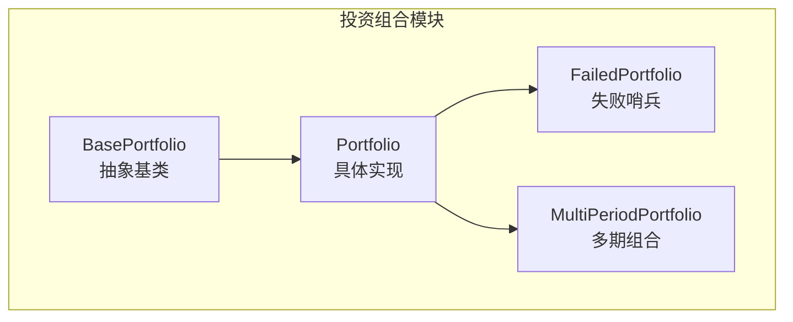
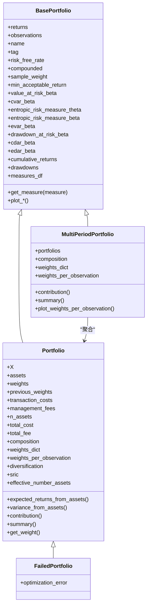
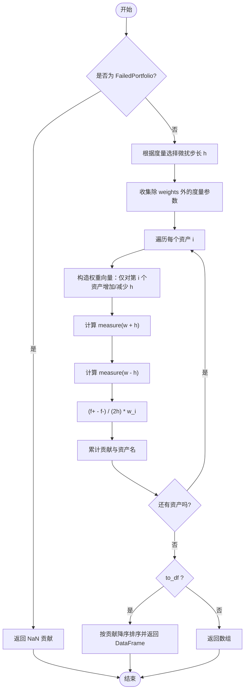
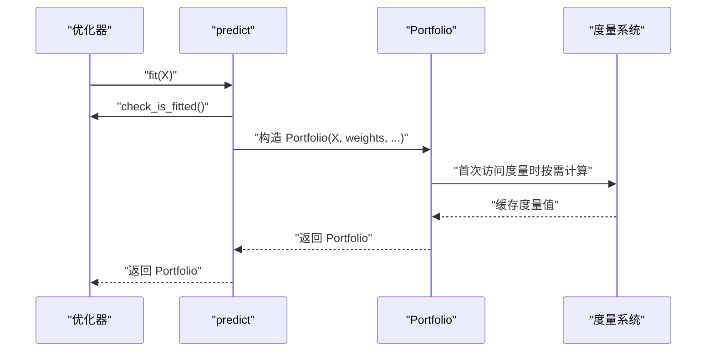
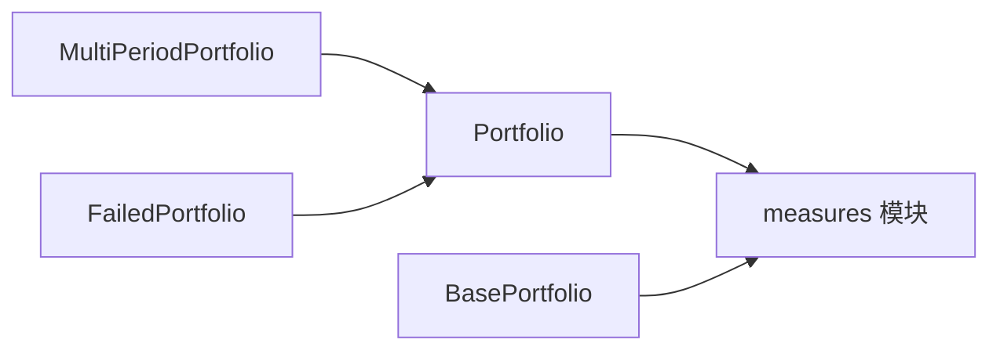

# 投资组合 (Portfolio)

<cite>
**本文引用的文件**
- [src/skfolio/portfolio/_base.py](file://src/skfolio/portfolio/_base.py)
- [src/skfolio/portfolio/_portfolio.py](file://src/skfolio/portfolio/_portfolio.py)
- [src/skfolio/portfolio/_failed_portfolio.py](file://src/skfolio/portfolio/_failed_portfolio.py)
- [src/skfolio/portfolio/_multi_period_portfolio.py](file://src/skfolio/portfolio/_multi_period_portfolio.py)
- [src/skfolio/portfolio/__init__.py](file://src/skfolio/portfolio/__init__.py)
- [src/skfolio/optimization/_base.py](file://src/skfolio/optimization/_base.py)
- [examples/risk_budgeting/plot_1_risk_parity_variance.py](file://examples/risk_budgeting/plot_1_risk_parity_variance.py)
- [examples/maximum_diversification/plot_1_maximum_diversification.py](file://examples/maximum_diversification/plot_1_maximum_diversification.py)
</cite>

## 目录
1. [引言](#引言)
2. [项目结构](#项目结构)
3. [核心组件](#核心组件)
4. [架构总览](#架构总览)
5. [详细组件分析](#详细组件分析)
6. [依赖关系分析](#依赖关系分析)
7. [性能考量](#性能考量)
8. [故障排查指南](#故障排查指南)
9. [结论](#结论)
10. [附录](#附录)

## 引言
本文件系统性阐述 Portfolio 类的设计与实现，重点说明其作为优化结果核心容器所承载的属性与能力，包括资产权重、预期收益、风险度量（方差、CVaR 等）、跟踪误差、夏普比率等；并解释 Portfolio 如何通过分析方法提供绩效归因、风险分解与组合结构可视化；结合优化器 predict 方法返回 Portfolio 的流程，给出从优化到分析的完整路径；最后说明 FailedPortfolio 与 MultiPeriodPortfolio 的特殊用途及与基础 Portfolio 的关系，并以 UML 类图展示继承结构，帮助开发者理解扩展机制。

## 项目结构
Portfolio 模块位于 src/skfolio/portfolio 下，包含以下关键文件：
- _base.py：定义 BasePortfolio 抽象基类，统一管理度量缓存、序列化、比较、复制与通用可视化接口。
- _portfolio.py：定义 Portfolio 具体实现，负责从资产收益矩阵与权重计算组合收益、成本、度量与贡献分析。
- _failed_portfolio.py：FailedPortfolio 作为失败回测的哨兵对象，保持与 Portfolio 完全兼容的 API。
- _multi_period_portfolio.py：MultiPeriodPortfolio 表示多期投资组合序列，聚合多个 Portfolio 并提供多期可视化与统计。
- __init__.py：导出 Portfolio、BasePortfolio、MultiPeriodPortfolio、FailedPortfolio。

图表来源
- [src/skfolio/portfolio/_base.py](file://src/skfolio/portfolio/_base.py#L75-L120)
- [src/skfolio/portfolio/_portfolio.py](file://src/skfolio/portfolio/_portfolio.py#L30-L120)
- [src/skfolio/portfolio/_failed_portfolio.py](file://src/skfolio/portfolio/_failed_portfolio.py#L15-L40)
- [src/skfolio/portfolio/_multi_period_portfolio.py](file://src/skfolio/portfolio/_multi_period_portfolio.py#L24-L60)

章节来源
- [src/skfolio/portfolio/__init__.py](file://src/skfolio/portfolio/__init__.py#L9-L15)

## 核心组件
- BasePortfolio：提供度量缓存、动态度量求值、累积收益/回撤、样本权重、年化因子、比较与复制等通用能力；所有度量在首次访问时按需计算并缓存，避免重复开销。
- Portfolio：在 BasePortfolio 基础上，接收资产价格收益矩阵 X、权重、交易成本与管理费等输入，计算组合收益、成本、各类风险度量与比率指标，并支持贡献分析与组合可视化。
- FailedPortfolio：当优化失败时返回，保持与 Portfolio 完全一致的 API，但所有度量为 NaN，便于下游分析不中断。
- MultiPeriodPortfolio：由多个 Portfolio 组成，提供多期权重变化可视化、汇总统计与贡献聚合。

章节来源
- [src/skfolio/portfolio/_base.py](file://src/skfolio/portfolio/_base.py#L75-L120)
- [src/skfolio/portfolio/_portfolio.py](file://src/skfolio/portfolio/_portfolio.py#L30-L120)
- [src/skfolio/portfolio/_failed_portfolio.py](file://src/skfolio/portfolio/_failed_portfolio.py#L15-L40)
- [src/skfolio/portfolio/_multi_period_portfolio.py](file://src/skfolio/portfolio/_multi_period_portfolio.py#L24-L60)

## 架构总览
Portfolio 的设计遵循“度量按需计算 + 缓存”的原则，通过 __slots__ 限制属性空间，减少内存占用并提升实例化速度；度量函数来自 measures 模块，参数通过命名约定自动注入，支持全局参数与局部参数（如不同置信水平）。

图表来源
- [src/skfolio/portfolio/_base.py](file://src/skfolio/portfolio/_base.py#L372-L484)
- [src/skfolio/portfolio/_portfolio.py](file://src/skfolio/portfolio/_portfolio.py#L421-L587)
- [src/skfolio/portfolio/_failed_portfolio.py](file://src/skfolio/portfolio/_failed_portfolio.py#L149-L205)
- [src/skfolio/portfolio/_multi_period_portfolio.py](file://src/skfolio/portfolio/_multi_period_portfolio.py#L327-L438)

## 详细组件分析

### Portfolio 类设计与属性
Portfolio 是优化器 predict 返回的核心对象，它将资产权重与资产收益矩阵线性组合得到组合收益，并考虑交易成本与管理费用。其关键属性包括：
- 输入层：X（n×T 资产收益矩阵，n 为观测数，T 为资产数）、weights（资产权重向量或字典映射）、previous_weights（前一期权重，用于交易成本）、transaction_costs（每资产线性交易成本）、management_fees（每资产线性管理费）。
- 计算层：组合收益 = weights · X^T − total_cost − total_fee；total_cost 与 total_fee 分别由交易成本与管理费累加得到。
- 属性层：assets（资产名称数组）、n_assets、X（原始输入）、weights、previous_weights、transaction_costs、management_fees、total_cost、total_fee、fallback_chain（优化回退链路）。
- 度量层：均值、方差、半方差/半标准差、偏度、峰度、VaR、CVaR、EVaR、CDaR、EDaR、最大回撤、平均回撤、溃疡指数、GMD、各类比率（夏普、索提诺、Calmar、VaR/CVaR 等比值）等。
- 可视化与分析：composition（非零权重资产及其权重）、weights_dict（含零权重）、weights_per_observation（每期权重矩阵）、diversification（加权波动率/组合波动率）、sric（Sharpe 信息准则）、effective_number_assets（有效资产数）、contribution（对某度量的资产贡献）、summary（度量汇总）。

章节来源
- [src/skfolio/portfolio/_portfolio.py](file://src/skfolio/portfolio/_portfolio.py#L30-L120)
- [src/skfolio/portfolio/_portfolio.py](file://src/skfolio/portfolio/_portfolio.py#L454-L603)
- [src/skfolio/portfolio/_portfolio.py](file://src/skfolio/portfolio/_portfolio.py#L711-L764)
- [src/skfolio/portfolio/_portfolio.py](file://src/skfolio/portfolio/_portfolio.py#L765-L809)
- [src/skfolio/portfolio/_portfolio.py](file://src/skfolio/portfolio/_portfolio.py#L811-L846)
- [src/skfolio/portfolio/_portfolio.py](file://src/skfolio/portfolio/_portfolio.py#L847-L906)
- [src/skfolio/portfolio/_portfolio.py](file://src/skfolio/portfolio/_portfolio.py#L907-L949)

### 风险度量与比率指标
Portfolio 通过 BasePortfolio 的度量系统统一计算各类风险与收益指标，包括但不限于：
- 收益与波动：均值、年化均值、标准差、年化标准差、半方差、半标准差、偏度、峰度、最差实现。
- 风险度量：VaR、CVaR、EVaR、CDaR、EDaR、最大回撤、平均回撤、溃疡指数、GMD。
- 收益风险比：夏普比率、年化夏普比率、索提诺比率、Calmar 比率、VaR/CVaR 比率、CDaR/EDaR 比率、MaD 比率、第一下偏矩比率、ULC 指数比率等。

这些度量的计算函数来自 measures 模块，Portfolio 在首次访问时动态解析并调用相应函数，参数通过命名约定自动注入（如 annualized_*、*_beta 等）。

章节来源
- [src/skfolio/portfolio/_base.py](file://src/skfolio/portfolio/_base.py#L168-L370)
- [src/skfolio/portfolio/_base.py](file://src/skfolio/portfolio/_base.py#L764-L846)
- [src/skfolio/portfolio/_base.py](file://src/skfolio/portfolio/_base.py#L1242-L1258)

### 绩效归因与风险分解
Portfolio 提供 contribution(measure, spacing, to_df) 方法，基于有限差分法对每个资产的权重进行微扰，计算该资产对目标度量的边际贡献，并乘以该资产权重得到“贡献”。支持：
- 自动选择微扰步长 spacing（针对不同度量采用不同默认步长，如回撤相关度量使用较大步长）。
- to_df=True 时返回按贡献降序排列的 DataFrame，自动过滤零权重资产。
- 对 FailedPortfolio，直接返回 NaN 贡献，保证 API 兼容。

图表来源
- [src/skfolio/portfolio/_portfolio.py](file://src/skfolio/portfolio/_portfolio.py#L847-L906)
- [src/skfolio/portfolio/_portfolio.py](file://src/skfolio/portfolio/_portfolio.py#L950-L989)

章节来源
- [src/skfolio/portfolio/_portfolio.py](file://src/skfolio/portfolio/_portfolio.py#L847-L906)
- [src/skfolio/portfolio/_portfolio.py](file://src/skfolio/portfolio/_portfolio.py#L950-L989)

### 组合结构可视化
Portfolio 提供多种可视化接口：
- composition：非零权重资产的权重条形图。
- plot_contribution：资产对某度量的贡献条形图。
- plot_rolling_measure：滚动窗口度量趋势图。
- plot_returns_distribution：收益密度估计图。
- summary：度量汇总（含有效资产数、资产数量等）。

这些方法复用 Plotly 进行绘制，支持格式化与标注。

章节来源
- [src/skfolio/portfolio/_base.py](file://src/skfolio/portfolio/_base.py#L1143-L1206)
- [src/skfolio/portfolio/_base.py](file://src/skfolio/portfolio/_base.py#L1208-L1241)
- [src/skfolio/portfolio/_portfolio.py](file://src/skfolio/portfolio/_portfolio.py#L907-L949)

### 从优化器 predict 获取 Portfolio 并进行分析
优化器的 predict(X) 返回 Portfolio 或 Population。典型流程如下：
- 使用优化器拟合后调用 predict，传入资产收益矩阵 X。
- predict 内部根据模型权重生成 Portfolio 实例，封装组合收益、权重、成本与度量。
- 可对返回的 Portfolio 执行 contribution、plot_contribution、plot_composition、summary 等分析。

图表来源
- [src/skfolio/optimization/_base.py](file://src/skfolio/optimization/_base.py#L288-L314)
- [src/skfolio/portfolio/_portfolio.py](file://src/skfolio/portfolio/_portfolio.py#L454-L603)
- [src/skfolio/portfolio/_base.py](file://src/skfolio/portfolio/_base.py#L576-L601)

章节来源
- [src/skfolio/optimization/_base.py](file://src/skfolio/optimization/_base.py#L288-L314)
- [examples/risk_budgeting/plot_1_risk_parity_variance.py](file://examples/risk_budgeting/plot_1_risk_parity_variance.py#L48-L60)
- [examples/maximum_diversification/plot_1_maximum_diversification.py](file://examples/maximum_diversification/plot_1_maximum_diversification.py#L48-L54)

### FailedPortfolio 的特殊用途
FailedPortfolio 用于在优化失败时返回，保持与 Portfolio 完全一致的 API，确保回测流程不中断：
- 接收与 Portfolio 相同的初始化参数，但 weights 为 None，组合收益为 NaN。
- optimization_error 字段记录失败原因，fallback_chain 记录回退链路。
- 所有度量（收益、风险、贡献等）均返回 NaN，下游分析可正常处理。

章节来源
- [src/skfolio/portfolio/_failed_portfolio.py](file://src/skfolio/portfolio/_failed_portfolio.py#L15-L40)
- [src/skfolio/portfolio/_failed_portfolio.py](file://src/skfolio/portfolio/_failed_portfolio.py#L149-L205)

### MultiPeriodPortfolio 的特殊用途
MultiPeriodPortfolio 由多个 Portfolio 组成，适用于多期回测场景：
- 聚合各期 Portfolio 的 returns 与 observations，支持检查观测时间不重叠。
- 提供 composition、weights_dict、weights_per_observation 的多期合并视图。
- contribution 聚合每个 Portfolio 的资产贡献，支持 to_df=True 返回宽表。
- summary 增加“失败/回退组合数量”、“每期平均资产数”等统计。
- plot_weights_per_observation：堆叠面积图展示权重随时间变化。

章节来源
- [src/skfolio/portfolio/_multi_period_portfolio.py](file://src/skfolio/portfolio/_multi_period_portfolio.py#L24-L60)
- [src/skfolio/portfolio/_multi_period_portfolio.py](file://src/skfolio/portfolio/_multi_period_portfolio.py#L500-L538)
- [src/skfolio/portfolio/_multi_period_portfolio.py](file://src/skfolio/portfolio/_multi_period_portfolio.py#L620-L657)
- [src/skfolio/portfolio/_multi_period_portfolio.py](file://src/skfolio/portfolio/_multi_period_portfolio.py#L658-L689)
- [src/skfolio/portfolio/_multi_period_portfolio.py](file://src/skfolio/portfolio/_multi_period_portfolio.py#L722-L768)

## 依赖关系分析
Portfolio 的度量系统依赖 measures 模块，通过命名约定自动注入参数；BasePortfolio 的度量缓存与动态求值逻辑贯穿 Portfolio 与 MultiPeriodPortfolio；FailedPortfolio 与 Portfolio 共享相同的读写属性集合，仅在初始化时填充 NaN。

图表来源
- [src/skfolio/portfolio/_base.py](file://src/skfolio/portfolio/_base.py#L764-L846)
- [src/skfolio/portfolio/_portfolio.py](file://src/skfolio/portfolio/_portfolio.py#L847-L906)
- [src/skfolio/portfolio/_multi_period_portfolio.py](file://src/skfolio/portfolio/_multi_period_portfolio.py#L620-L657)

章节来源
- [src/skfolio/portfolio/_base.py](file://src/skfolio/portfolio/_base.py#L764-L846)
- [src/skfolio/portfolio/_portfolio.py](file://src/skfolio/portfolio/_portfolio.py#L847-L906)
- [src/skfolio/portfolio/_multi_period_portfolio.py](file://src/skfolio/portfolio/_multi_period_portfolio.py#L620-L657)

## 性能考量
- __slots__ 与延迟求值：BasePortfolio 使用 __slots__ 限定属性，首次访问度量时才计算并缓存，避免重复计算与内存浪费。
- 年化规则：annualized_* 度量通过 annualized_factor 线性缩放，避免额外缩放计算。
- 贡献分析：有限差分法计算贡献，注意步长选择与数值稳定性；对回撤相关度量采用较大步长以提高稳健性。
- 多期聚合：MultiPeriodPortfolio 合并 returns/observations 时避免 dtype 不一致导致的类型推断开销。

[本节为一般性指导，无需特定文件引用]

## 故障排查指南
- 优化失败：若优化器配置为失败不抛错，predict 将返回 FailedPortfolio；可通过 optimization_error 与 fallback_chain 查看失败原因与回退链路。
- 组合收益出现 NaN：通常由 weights 未提供或计算过程中出现非法操作导致；检查 weights 是否为 NaN。
- 回撤相关度量异常：贡献分析中回撤类度量建议使用较大的微扰步长，避免数值不稳定。
- 多期回测重叠：启用 check_observations_order 可强制要求各期观测不重叠，否则会抛出错误。

章节来源
- [src/skfolio/portfolio/_failed_portfolio.py](file://src/skfolio/portfolio/_failed_portfolio.py#L149-L205)
- [src/skfolio/portfolio/_portfolio.py](file://src/skfolio/portfolio/_portfolio.py#L560-L567)
- [src/skfolio/portfolio/_multi_period_portfolio.py](file://src/skfolio/portfolio/_multi_period_portfolio.py#L523-L533)

## 结论
Portfolio 作为优化结果的核心容器，通过统一的度量系统与缓存机制，高效地承载了组合收益、成本、风险与比率等关键指标；其 contribution 与可视化接口为绩效归因与组合结构分析提供了强大支撑。FailedPortfolio 与 MultiPeriodPortfolio 则分别满足失败回测与多期分析的特殊需求，三者共同构成 skfolio 投资组合分析的完整闭环。

[本节为总结性内容，无需特定文件引用]

## 附录
- 示例参考：
  - 风险预算（方差）：使用 RiskBudgeting 优化器，predict 返回 Portfolio，随后调用 plot_contribution 分析风险贡献。
  - 最大分散化：使用 MaximumDiversification 优化器，predict 返回 Portfolio，随后调用 diversification 属性与组合可视化。

章节来源
- [examples/risk_budgeting/plot_1_risk_parity_variance.py](file://examples/risk_budgeting/plot_1_risk_parity_variance.py#L48-L60)
- [examples/maximum_diversification/plot_1_maximum_diversification.py](file://examples/maximum_diversification/plot_1_maximum_diversification.py#L48-L54)