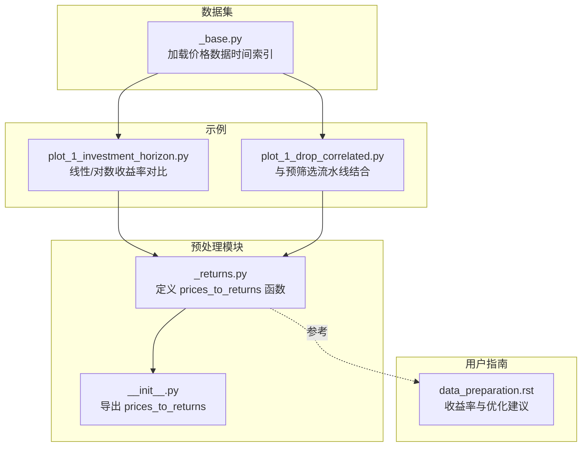
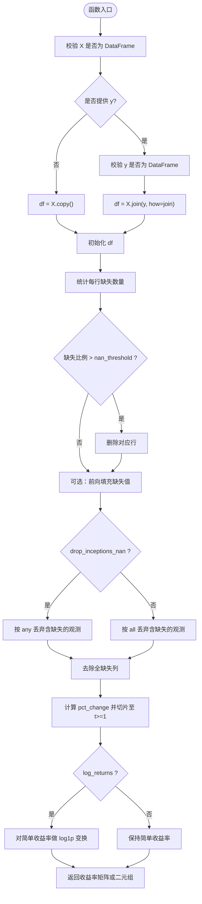
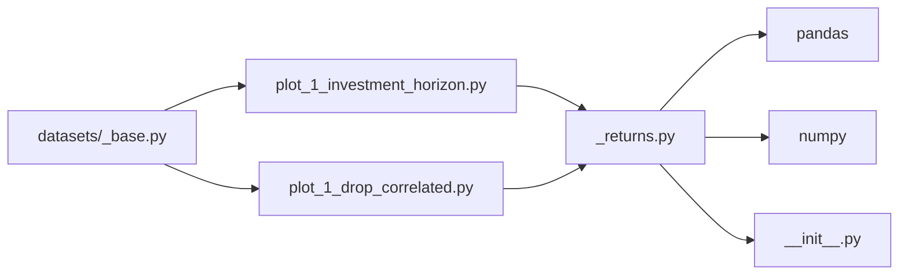

# 数据预处理

<cite>
**本文引用的文件**
- [src/skfolio/preprocessing/_returns.py](file://src/skfolio/preprocessing/_returns.py)
- [src/skfolio/preprocessing/__init__.py](file://src/skfolio/preprocessing/__init__.py)
- [tests/test_preprocessing/test_returns.py](file://tests/test_preprocessing/test_returns.py)
- [docs/user_guide/data_preparation.rst](file://docs/user_guide/data_preparation.rst)
- [examples/data_preparation/plot_1_investment_horizon.py](file://examples/data_preparation/plot_1_investment_horizon.py)
- [examples/pre_selection/plot_1_drop_correlated.py](file://examples/pre_selection/plot_1_drop_correlated.py)
- [src/skfolio/datasets/_base.py](file://src/skfolio/datasets/_base.py)
</cite>

## 目录
1. [引言](#引言)
2. [项目结构](#项目结构)
3. [核心组件](#核心组件)
4. [架构总览](#架构总览)
5. [详细组件分析](#详细组件分析)
6. [依赖关系分析](#依赖关系分析)
7. [性能考量](#性能考量)
8. [故障排查指南](#故障排查指南)
9. [结论](#结论)
10. [附录](#附录)

## 引言
本章节聚焦于投资组合工作流中的“数据预处理”环节，系统阐述如何将原始价格序列转换为适配优化器的收益率矩阵，并解释不同收益率计算方式（简单收益率与对数收益率）对优化结果的影响。我们将基于源码与官方文档，给出参数配置、缺失值与异常值处理策略、以及频率对齐的工程化实践，帮助读者构建稳健的预处理流水线并正确对接后续优化器。

## 项目结构
预处理相关的核心位于 preprocessing 模块，其中 prices_to_returns 是将价格转换为收益率的唯一入口函数；其导出由 __init__.py 统一暴露；配套的用户指南与示例展示了在真实工作流中的用法。



图表来源
- [src/skfolio/preprocessing/_returns.py](file://src/skfolio/preprocessing/_returns.py#L1-L133)
- [src/skfolio/preprocessing/__init__.py](file://src/skfolio/preprocessing/__init__.py#L1-L6)
- [docs/user_guide/data_preparation.rst](file://docs/user_guide/data_preparation.rst#L1-L145)
- [examples/data_preparation/plot_1_investment_horizon.py](file://examples/data_preparation/plot_1_investment_horizon.py#L1-L79)
- [examples/pre_selection/plot_1_drop_correlated.py](file://examples/pre_selection/plot_1_drop_correlated.py#L35-L87)
- [src/skfolio/datasets/_base.py](file://src/skfolio/datasets/_base.py#L1-L200)

章节来源
- [src/skfolio/preprocessing/_returns.py](file://src/skfolio/preprocessing/_returns.py#L1-L133)
- [src/skfolio/preprocessing/__init__.py](file://src/skfolio/preprocessing/__init__.py#L1-L6)
- [docs/user_guide/data_preparation.rst](file://docs/user_guide/data_preparation.rst#L1-L145)
- [examples/data_preparation/plot_1_investment_horizon.py](file://examples/data_preparation/plot_1_investment_horizon.py#L1-L79)
- [examples/pre_selection/plot_1_drop_correlated.py](file://examples/pre_selection/plot_1_drop_correlated.py#L35-L87)
- [src/skfolio/datasets/_base.py](file://src/skfolio/datasets/_base.py#L1-L200)

## 核心组件
- prices_to_returns：将资产价格 DataFrame 转换为线性或对数收益率，同时进行缺失值处理、观测过滤与可选的目标/因子价格对齐。
- 导出：通过 __all__ 将该函数暴露给外部使用。
- 用户指南：明确指出“应优先使用线性收益率作为优化输入”，并对对数收益率的适用场景与注意事项进行说明。

章节来源
- [src/skfolio/preprocessing/_returns.py](file://src/skfolio/preprocessing/_returns.py#L13-L133)
- [src/skfolio/preprocessing/__init__.py](file://src/skfolio/preprocessing/__init__.py#L1-L6)
- [docs/user_guide/data_preparation.rst](file://docs/user_guide/data_preparation.rst#L1-L145)

## 架构总览
下图展示了从原始价格到可用于优化器的收益率矩阵的整体流程，以及与示例脚本的衔接。

```mermaid
sequenceDiagram
participant U as "用户代码"
participant DS as "数据集加载器"
participant PR as "prices_to_returns"
participant PIPE as "预筛选/优化流水线"
participant OPT as "优化器"
U->>DS : 加载价格数据含日期索引
DS-->>U : 返回 DataFrame行=时间，列=资产
U->>PR : 调用 prices_to_returns(X, y?, log_returns, ...)
PR-->>U : 返回收益率矩阵或返回矩阵元组
U->>PIPE : 将收益率矩阵送入预筛选与优化流水线
PIPE->>OPT : fit/fit_predict 使用收益率矩阵
OPT-->>PIPE : 输出组合权重/度量
PIPE-->>U : 返回组合分析结果
```

图表来源
- [src/skfolio/preprocessing/_returns.py](file://src/skfolio/preprocessing/_returns.py#L13-L133)
- [examples/data_preparation/plot_1_investment_horizon.py](file://examples/data_preparation/plot_1_investment_horizon.py#L1-L79)
- [examples/pre_selection/plot_1_drop_correlated.py](file://examples/pre_selection/plot_1_drop_correlated.py#L35-L87)
- [src/skfolio/datasets/_base.py](file://src/skfolio/datasets/_base.py#L168-L200)

## 详细组件分析

### prices_to_returns 函数详解
- 功能定位
  - 输入：资产价格 DataFrame（可选目标/因子价格 DataFrame），输出为对应的收益率矩阵（或二元组）。
  - 支持两种收益率：
    - 线性收益率（简单收益率）：R_lin = S_t / S_{t-1} - 1
    - 对数收益率（连续复利）：R_log = ln(S_t / S_{t-1}）
- 参数与行为
  - log_returns：是否使用对数收益率
  - nan_threshold：按行丢弃缺失比例超过阈值的观测
  - drop_inceptions_nan：是否丢弃起始期存在缺失的观测
  - fill_nan：是否前向填充缺失值
  - join：当提供 y 时，与 X 进行联结的方式（left/right/inner/outer/cross）
  - y：目标/因子价格（可选），用于与 X 同步观测
- 处理流程（算法步骤）
  1) 类型校验：X、y 必须为 DataFrame
  2) 若提供 y，则按 join 方式与 X 对齐
  3) 计算每行缺失数量，按 nan_threshold 过滤观测
  4) 可选前向填充缺失值
  5) 按 drop_inceptions_nan 决定是否丢弃任何缺失的观测
  6) 去除全缺失列
  7) 计算 pct_change 并取首行之后的数据
  8) 若 log_returns=True，则对简单收益率做 log1p 变换
  9) 若未提供 y，返回收益率矩阵；否则返回 (X_returns, y_returns)，二者索引与列均与输入对齐



图表来源
- [src/skfolio/preprocessing/_returns.py](file://src/skfolio/preprocessing/_returns.py#L91-L133)

章节来源
- [src/skfolio/preprocessing/_returns.py](file://src/skfolio/preprocessing/_returns.py#L13-L133)

### 数学公式与参数配置
- 简单收益率（线性收益率）
  - 定义：R_lin = S_t / S_{t-1} - 1
  - 特性：跨证券可加权平均，适合直接用于优化器的期望收益与协方差估计
- 对数收益率（连续复利）
  - 定义：R_log = ln(S_t / S_{t-1})
  - 特性：跨时间可累加，便于时间尺度投影；但不适合直接用于优化器的线性目标函数
- 参数要点
  - log_returns：控制是否使用对数收益率
  - nan_threshold：过滤缺失过多的观测，避免引入噪声
  - drop_inceptions_nan：剔除起始期缺失导致的不完整样本
  - fill_nan：前向填充缺失值，减少样本损失
  - join：当 y 存在时，保证 X 与 y 的观测对齐

章节来源
- [src/skfolio/preprocessing/_returns.py](file://src/skfolio/preprocessing/_returns.py#L22-L46)
- [docs/user_guide/data_preparation.rst](file://docs/user_guide/data_preparation.rst#L1-L145)

### 预处理如何确保输入满足优化器要求
- 缺失值处理
  - nan_threshold：按行过滤缺失比例过高的观测
  - fill_nan：前向填充，减少样本缺失
  - drop_inceptions_nan：剔除起始期缺失，避免因首次缺失导致的无效收益率
  - drop_all_na_cols：去除全缺失列，避免无信息变量进入优化
- 观测对齐
  - 当提供 y 时，通过 join 保证 X 与 y 的索引一致，避免时间错配
- 收益率类型一致性
  - 默认返回简单收益率，满足优化器对线性目标函数的要求
  - 对数收益率仅在需要时间尺度投影或特定估计器内部转换时使用

章节来源
- [src/skfolio/preprocessing/_returns.py](file://src/skfolio/preprocessing/_returns.py#L103-L133)
- [docs/user_guide/data_preparation.rst](file://docs/user_guide/data_preparation.rst#L1-L145)

### 示例：将原始价格数据转化为可用于 fit 的收益率矩阵
- 加载价格数据（示例脚本）
  - 使用数据集加载器获取价格 DataFrame（索引为日期）
- 调用 prices_to_returns
  - 将价格转换为日度简单收益率（默认）
  - 可选：传入 y 以对齐目标/因子价格
- 与流水线结合
  - 在预筛选与优化器之间插入转换步骤，确保输入为收益率矩阵
- 投资期限与对数收益率的对比
  - 示例脚本演示了线性与对数收益率在不同投资期限下的差异与简化流程

章节来源
- [examples/data_preparation/plot_1_investment_horizon.py](file://examples/data_preparation/plot_1_investment_horizon.py#L1-L79)
- [examples/pre_selection/plot_1_drop_correlated.py](file://examples/pre_selection/plot_1_drop_correlated.py#L35-L87)
- [src/skfolio/datasets/_base.py](file://src/skfolio/datasets/_base.py#L168-L200)

### 不同收益率计算方式对优化结果的影响
- 线性收益率
  - 适合直接用于优化器（期望收益与协方差估计），能正确反映组合收益与风险
- 对数收益率
  - 更适合时间尺度投影与分布估计；在某些估计器内部会进行转换
- 用户指南强调：应优先使用线性收益率作为优化输入，除非估计器内部明确支持对数收益率转换

章节来源
- [docs/user_guide/data_preparation.rst](file://docs/user_guide/data_preparation.rst#L1-L145)
- [src/skfolio/preprocessing/_returns.py](file://src/skfolio/preprocessing/_returns.py#L22-L46)

### 最佳实践建议
- 优先使用线性收益率作为优化输入
- 明确投资期限与频率，确保所有成本、收益与协方差与频率一致
- 使用 nan_threshold 与 drop_inceptions_nan 控制样本质量
- 在存在 y（目标/因子）时，使用 join 保证观测对齐
- 对缺失值采用前向填充（fill_nan=True）以减少样本损失
- 在需要时间尺度投影时，考虑对数收益率的适用性与估计器内部转换能力

章节来源
- [docs/user_guide/data_preparation.rst](file://docs/user_guide/data_preparation.rst#L1-L145)
- [src/skfolio/preprocessing/_returns.py](file://src/skfolio/preprocessing/_returns.py#L60-L80)

## 依赖关系分析
- 模块内聚与耦合
  - prices_to_returns 仅依赖 pandas/numpy，功能内聚，对外通过 __all__ 暴露
- 外部依赖
  - 数据集加载器提供标准格式的价格数据（日期索引）
  - 示例脚本展示与预筛选、优化器的集成
- 可能的循环依赖
  - 预处理模块不依赖优化器，避免循环依赖



图表来源
- [src/skfolio/preprocessing/_returns.py](file://src/skfolio/preprocessing/_returns.py#L1-L133)
- [src/skfolio/preprocessing/__init__.py](file://src/skfolio/preprocessing/__init__.py#L1-L6)
- [examples/data_preparation/plot_1_investment_horizon.py](file://examples/data_preparation/plot_1_investment_horizon.py#L1-L79)
- [examples/pre_selection/plot_1_drop_correlated.py](file://examples/pre_selection/plot_1_drop_correlated.py#L35-L87)
- [src/skfolio/datasets/_base.py](file://src/skfolio/datasets/_base.py#L1-L200)

章节来源
- [src/skfolio/preprocessing/_returns.py](file://src/skfolio/preprocessing/_returns.py#L1-L133)
- [src/skfolio/preprocessing/__init__.py](file://src/skfolio/preprocessing/__init__.py#L1-L6)
- [examples/data_preparation/plot_1_investment_horizon.py](file://examples/data_preparation/plot_1_investment_horizon.py#L1-L79)
- [examples/pre_selection/plot_1_drop_correlated.py](file://examples/pre_selection/plot_1_drop_correlated.py#L35-L87)
- [src/skfolio/datasets/_base.py](file://src/skfolio/datasets/_base.py#L1-L200)

## 性能考量
- 时间复杂度
  - 主要瓶颈在于 pct_change 与 dropna 操作，整体近似 O(T×N)，T 为观测数，N 为资产数
- 空间复杂度
  - 中间 df 与 all_returns 占用约 O(T×N)，注意在大规模数据上控制内存峰值
- 优化建议
  - 合理设置 nan_threshold，避免过度丢弃样本
  - 在数据规模较大时，尽量减少 join 操作与列冗余
  - 使用 fill_nan 与 drop_inceptions_nan 的组合，平衡样本完整性与数量

[本节为通用性能讨论，无需列出具体文件来源]

## 故障排查指南
- 常见错误与修复
  - 输入非 DataFrame：确保 X 与 y（若提供）均为 DataFrame
  - nan_threshold 超界：需在 (0, 1] 区间
  - 观测缺失过多：提高 nan_threshold 或增加 fill_nan
  - 起始期缺失导致样本不完整：启用 drop_inceptions_nan
  - y 与 X 观测不一致：检查 join 参数与索引对齐
- 单元测试参考
  - 测试覆盖了简单/对数收益率、缺失值处理、y 对齐等关键路径

章节来源
- [tests/test_preprocessing/test_returns.py](file://tests/test_preprocessing/test_returns.py#L1-L51)
- [src/skfolio/preprocessing/_returns.py](file://src/skfolio/preprocessing/_returns.py#L91-L133)

## 结论
预处理是投资组合工作流的基石。通过 prices_to_returns，我们能够将原始价格数据转换为与优化器兼容的收益率矩阵，并在缺失值、异常值与频率对齐方面提供稳健保障。用户指南明确建议优先使用线性收益率作为优化输入，而对数收益率更适合时间尺度投影与分布估计。结合示例脚本与单元测试，可以构建可靠的预处理流水线，确保后续优化结果的稳定性与可解释性。

[本节为总结性内容，无需列出具体文件来源]

## 附录
- 关键参数速查
  - log_returns：是否使用对数收益率
  - nan_threshold：按行缺失比例阈值
  - drop_inceptions_nan：是否丢弃起始期缺失的观测
  - fill_nan：是否前向填充缺失值
  - join：与 y 联结方式（left/right/inner/outer/cross）

章节来源
- [src/skfolio/preprocessing/_returns.py](file://src/skfolio/preprocessing/_returns.py#L60-L80)