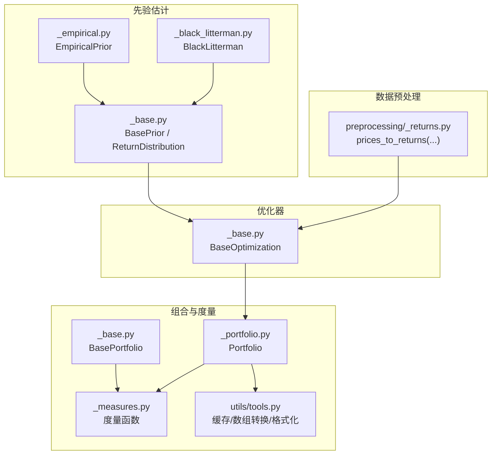
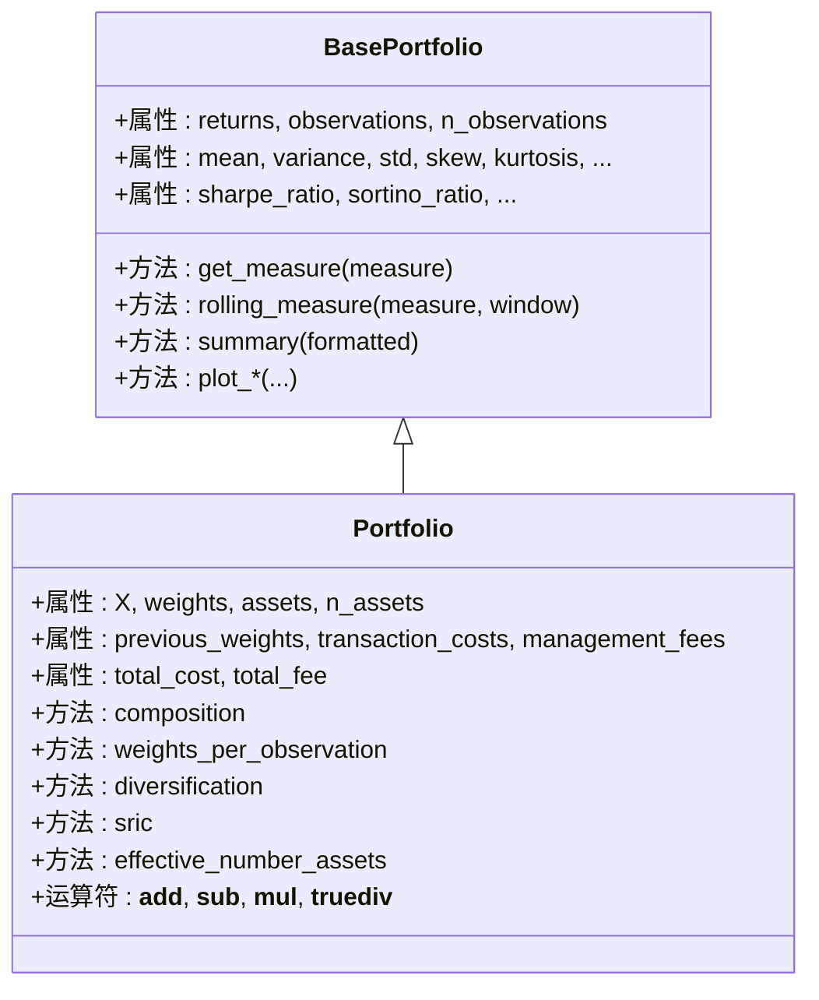
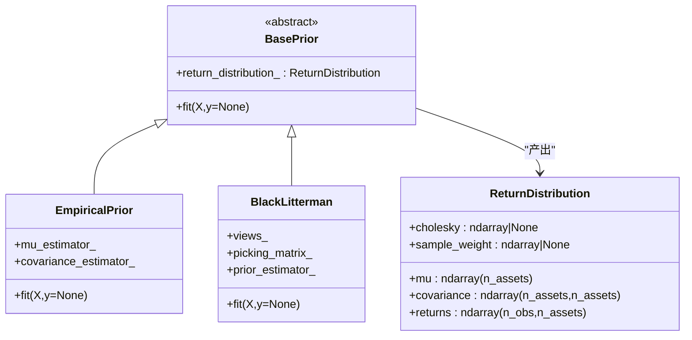
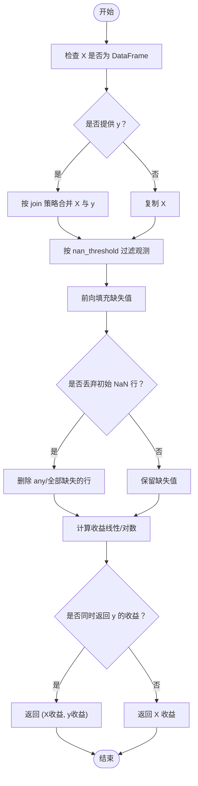
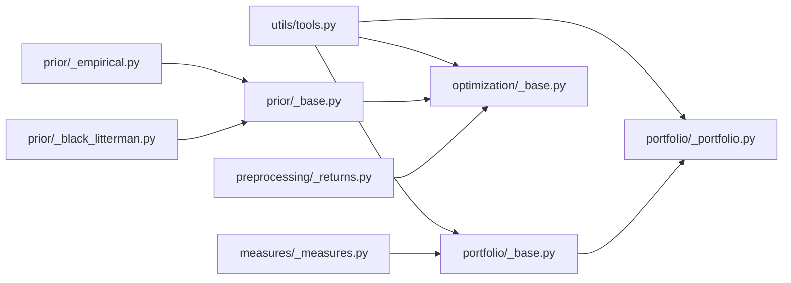

# 核心概念

<cite>
**本文引用的文件**
- [src/skfolio/portfolio/_base.py](file://src/skfolio/portfolio/_base.py)
- [src/skfolio/portfolio/_portfolio.py](file://src/skfolio/portfolio/_portfolio.py)
- [src/skfolio/optimization/_base.py](file://src/skfolio/optimization/_base.py)
- [src/skfolio/prior/_base.py](file://src/skfolio/prior/_base.py)
- [src/skfolio/prior/_empirical.py](file://src/skfolio/prior/_empirical.py)
- [src/skfolio/prior/_black_litterman.py](file://src/skfolio/prior/_black_litterman.py)
- [src/skfolio/preprocessing/_returns.py](file://src/skfolio/preprocessing/_returns.py)
- [src/skfolio/measures/_measures.py](file://src/skfolio/measures/_measures.py)
- [src/skfolio/utils/tools.py](file://src/skfolio/utils/tools.py)
</cite>

## 目录
1. [引言](#引言)
2. [项目结构](#项目结构)
3. [核心组件](#核心组件)
4. [架构总览](#架构总览)
5. [详细组件分析](#详细组件分析)
6. [依赖关系分析](#依赖关系分析)
7. [性能考量](#性能考量)
8. [故障排查指南](#故障排查指南)
9. [结论](#结论)
10. [附录](#附录)

## 引言
本文件系统化阐述 skfolio 的核心概念与领域模型，重点围绕以下主题：
- Portfolio 类的设计：属性（权重、风险、收益、跟踪误差等）与分析方法
- BaseOptimization 基类：fit/predict 契约与生成 Portfolio 的流程
- BasePrior 类：为优化器提供期望收益与协方差估计的机制
- 数据预处理函数（如 prices_to_returns）在工作流中的位置与重要性
- 通过 UML 类图与序列图可视化核心组件之间的关系与数据流

## 项目结构
skfolio 采用模块化分层设计：
- portfolio 层：定义基础与具体组合类，提供度量、贡献、滚动分析与绘图能力
- optimization 层：定义优化器基类与通用预测/评分逻辑，支持回退策略
- prior 层：定义先验估计器接口与多种实现（经验先验、Black-Litterman）
- preprocessing 层：提供价格到收益转换等数据预处理工具
- measures/utils：提供度量函数与通用工具（缓存、数组转换、格式化等）



图表来源
- [src/skfolio/preprocessing/_returns.py](file://src/skfolio/preprocessing/_returns.py#L1-L133)
- [src/skfolio/prior/_base.py](file://src/skfolio/prior/_base.py#L1-L70)
- [src/skfolio/prior/_empirical.py](file://src/skfolio/prior/_empirical.py#L1-L205)
- [src/skfolio/prior/_black_litterman.py](file://src/skfolio/prior/_black_litterman.py#L1-L269)
- [src/skfolio/optimization/_base.py](file://src/skfolio/optimization/_base.py#L1-L583)
- [src/skfolio/portfolio/_base.py](file://src/skfolio/portfolio/_base.py#L1-L1258)
- [src/skfolio/portfolio/_portfolio.py](file://src/skfolio/portfolio/_portfolio.py#L1-L989)
- [src/skfolio/measures/_measures.py](file://src/skfolio/measures/_measures.py#L1-L1118)
- [src/skfolio/utils/tools.py](file://src/skfolio/utils/tools.py#L1-L796)

章节来源
- [src/skfolio/preprocessing/_returns.py](file://src/skfolio/preprocessing/_returns.py#L1-L133)
- [src/skfolio/prior/_base.py](file://src/skfolio/prior/_base.py#L1-L70)
- [src/skfolio/optimization/_base.py](file://src/skfolio/optimization/_base.py#L1-L583)
- [src/skfolio/portfolio/_base.py](file://src/skfolio/portfolio/_base.py#L1-L1258)
- [src/skfolio/portfolio/_portfolio.py](file://src/skfolio/portfolio/_portfolio.py#L1-L989)
- [src/skfolio/measures/_measures.py](file://src/skfolio/measures/_measures.py#L1-L1118)
- [src/skfolio/utils/tools.py](file://src/skfolio/utils/tools.py#L1-L796)

## 核心组件
本节聚焦四大核心组件及其职责边界与交互方式。

- Portfolio 类（具体组合）
  - 职责：封装单个投资组合的权重、收益序列、度量与分析方法；支持成本（交易成本、管理费）、前一时刻权重、回测观察索引等
  - 关键属性：权重、资产名、前一权重、交易成本、管理费、总成本/费用、非零资产集合等
  - 关键方法：组合构成、权重分布、多样化指标、SRIC、度量贡献、滚动度量、汇总与可视化

- BasePortfolio 类（抽象基类）
  - 职责：统一度量计算与缓存策略；动态按需加载度量；提供 DOMINANCE、滚动度量、汇总与绘图等通用能力
  - 关键机制：基于 __slots__ 的高效存储；__getattribute__/__setattr__ 动态加载与缓存失效；cached_property_slots 缓存装饰器

- BaseOptimization 类（优化器基类）
  - 职责：定义 fit/predict 契约；自动包装 fit 实现回退链；根据 weights_ 生成 Portfolio 或 Population；提供评分（Sharpe Ratio）
  - 关键机制：__init_subclass__ 包装 fit；_run_fallback_chain 执行回退；predict 将返回值映射为 Portfolio/Population

- BasePrior 与 ReturnDistribution
  - 职责：定义先验估计器接口；ReturnDistribution 作为优化器输入的统一数据载体（mu、协方差、收益、可选 Cholesky、样本权重）
  - 典型实现：EmpiricalPrior（经验估计），BlackLitterman（贝叶斯视角结合分析师观点）

章节来源
- [src/skfolio/portfolio/_portfolio.py](file://src/skfolio/portfolio/_portfolio.py#L1-L989)
- [src/skfolio/portfolio/_base.py](file://src/skfolio/portfolio/_base.py#L1-L1258)
- [src/skfolio/optimization/_base.py](file://src/skfolio/optimization/_base.py#L1-L583)
- [src/skfolio/prior/_base.py](file://src/skfolio/prior/_base.py#L1-L70)
- [src/skfolio/prior/_empirical.py](file://src/skfolio/prior/_empirical.py#L1-L205)
- [src/skfolio/prior/_black_litterman.py](file://src/skfolio/prior/_black_litterman.py#L1-L269)

## 架构总览
下图展示从数据预处理到优化器再到组合分析的整体流程与组件关系。

```mermaid
sequenceDiagram
participant Data as "原始数据<br/>价格/因子"
participant Pre as "预处理<br/>prices_to_returns"
participant Prior as "先验估计器<br/>BasePrior/EmpiricalPrior/BlackLitterman"
participant Opt as "优化器<br/>BaseOptimization"
participant Portf as "组合<br/>Portfolio"
participant Meas as "度量函数<br/>measures/_measures.py"
Data->>Pre : 提供价格/因子
Pre-->>Opt : 返回线性/对数收益
Opt->>Prior : fit(X) 估计 ReturnDistribution
Prior-->>Opt : return_distribution_(mu, covariance, returns, ...)
Opt->>Opt : fit(X) 计算最优权重
Opt->>Portf : predict(X) -> Portfolio(weights,...)
Portf->>Meas : 按需计算度量均值、方差、VaR、CVaR、夏普比率等
Portf-->>Opt : 可用于评分/选择
```

图表来源
- [src/skfolio/preprocessing/_returns.py](file://src/skfolio/preprocessing/_returns.py#L1-L133)
- [src/skfolio/prior/_base.py](file://src/skfolio/prior/_base.py#L1-L70)
- [src/skfolio/prior/_empirical.py](file://src/skfolio/prior/_empirical.py#L1-L205)
- [src/skfolio/prior/_black_litterman.py](file://src/skfolio/prior/_black_litterman.py#L1-L269)
- [src/skfolio/optimization/_base.py](file://src/skfolio/optimization/_base.py#L288-L375)
- [src/skfolio/portfolio/_portfolio.py](file://src/skfolio/portfolio/_portfolio.py#L454-L603)
- [src/skfolio/measures/_measures.py](file://src/skfolio/measures/_measures.py#L1-L1118)

## 详细组件分析

### Portfolio 类设计与分析
Portfolio 是优化器输出的“组合”对象，继承自 BasePortfolio，并扩展了与实际投资组合相关的属性与行为：
- 关键属性
  - 权重、资产名、前一权重、交易成本、管理费、总成本/费用
  - 非零资产集合、多样化、SRIC、有效资产数等派生属性
- 关键方法
  - 组合构成与权重分布
  - 度量贡献（支持有限差分间距）
  - 滚动度量（支持年化调整）
  - 汇总与可视化（累计收益、回撤、收益分布、滚动指标、组合权重条形图）



图表来源
- [src/skfolio/portfolio/_base.py](file://src/skfolio/portfolio/_base.py#L1-L1258)
- [src/skfolio/portfolio/_portfolio.py](file://src/skfolio/portfolio/_portfolio.py#L1-L989)

章节来源
- [src/skfolio/portfolio/_portfolio.py](file://src/skfolio/portfolio/_portfolio.py#L454-L989)
- [src/skfolio/portfolio/_base.py](file://src/skfolio/portfolio/_base.py#L746-L1258)

### BaseOptimization 基类：fit/predict 契约与回退机制
BaseOptimization 定义了优化器的统一接口与生命周期：
- fit 契约
  - 接收训练数据 X（n×T 矩阵，行=观测、列=资产）
  - 可选 y（目标/因子）
  - 派生类必须实现 fit(self, X, y=None)
- predict 契约
  - 输入：X 或 ReturnDistribution
  - 输出：单个 Portfolio 或 Population（多权重时）
  - 自动传播参数（交易成本、管理费、前一权重、无风险利率等）
- 回退机制
  - 支持配置多个回退策略（其他优化器或“previous_weights”）
  - 自动包装 fit，捕获异常并按顺序尝试回退
  - 记录回退链与最终成功者

```mermaid
sequenceDiagram
participant Est as "优化器(BaseOptimization子类)"
participant X as "训练数据"
participant Pred as "预测结果"
Est->>Est : __init_subclass__ 包装 fit
Est->>Est : fit(X, y, **fit_params)
alt 成功
Est-->>Pred : weights_ 已设置
else 失败
Est->>Est : _run_fallback_chain(...)
opt 使用 previous_weights
Est-->>Pred : weights_ 已设置
opt 使用其他优化器
Est-->>Pred : weights_ 已设置
end
Est->>Pred : predict(X 或 ReturnDistribution)
Pred-->>Est : Portfolio 或 Population
```

图表来源
- [src/skfolio/optimization/_base.py](file://src/skfolio/optimization/_base.py#L127-L287)
- [src/skfolio/optimization/_base.py](file://src/skfolio/optimization/_base.py#L288-L375)
- [src/skfolio/optimization/_base.py](file://src/skfolio/optimization/_base.py#L376-L452)

章节来源
- [src/skfolio/optimization/_base.py](file://src/skfolio/optimization/_base.py#L1-L583)

### BasePrior 与 ReturnDistribution：为优化器提供先验
- ReturnDistribution
  - 统一承载 mu、协方差、收益、Cholesky、样本权重
- BasePrior
  - 抽象接口，要求实现 fit(X, y=None)
- 典型实现
  - EmpiricalPrior：分别拟合期望收益与协方差估计器，支持对数正态场景下的时间尺度转换
  - BlackLitterman：以先验为基础，结合分析师观点与不确定性矩阵得到后验分布



图表来源
- [src/skfolio/prior/_base.py](file://src/skfolio/prior/_base.py#L1-L70)
- [src/skfolio/prior/_empirical.py](file://src/skfolio/prior/_empirical.py#L1-L205)
- [src/skfolio/prior/_black_litterman.py](file://src/skfolio/prior/_black_litterman.py#L1-L269)

章节来源
- [src/skfolio/prior/_base.py](file://src/skfolio/prior/_base.py#L1-L70)
- [src/skfolio/prior/_empirical.py](file://src/skfolio/prior/_empirical.py#L1-L205)
- [src/skfolio/prior/_black_litterman.py](file://src/skfolio/prior/_black_litterman.py#L1-L269)

### 数据预处理：prices_to_returns 在工作流中的位置与重要性
- 作用：将价格序列转换为线性/对数收益，进行缺失值处理、观测过滤与连接策略控制
- 重要性：线性收益更适合组合优化（收益可跨证券加权平均），而对数收益更适合时间聚合
- 流程：输入价格/因子 → 合并 → 过滤 → 计算收益 → 返回收益矩阵



图表来源
- [src/skfolio/preprocessing/_returns.py](file://src/skfolio/preprocessing/_returns.py#L1-L133)

章节来源
- [src/skfolio/preprocessing/_returns.py](file://src/skfolio/preprocessing/_returns.py#L1-L133)

## 依赖关系分析
- 组件耦合
  - Portfolio 依赖 measures/_measures.py 中的度量函数，通过 BasePortfolio 的动态解析机制调用
  - BaseOptimization 依赖 Portfolio/Population 生成预测结果，并使用 ReturnDistribution 作为输入
  - BasePrior 产出 ReturnDistribution，供优化器消费
  - utils/tools.py 提供缓存、数组转换、格式化等通用能力，被 Portfolio/BasePortfolio/优化器广泛使用
- 外部依赖
  - numpy/pandas/scipy 用于数值计算与统计
  - sklearn 基础框架（BaseEstimator、元数据路由）用于兼容 scikit-learn 生态



图表来源
- [src/skfolio/utils/tools.py](file://src/skfolio/utils/tools.py#L1-L796)
- [src/skfolio/portfolio/_base.py](file://src/skfolio/portfolio/_base.py#L1-L1258)
- [src/skfolio/portfolio/_portfolio.py](file://src/skfolio/portfolio/_portfolio.py#L1-L989)
- [src/skfolio/optimization/_base.py](file://src/skfolio/optimization/_base.py#L1-L583)
- [src/skfolio/prior/_base.py](file://src/skfolio/prior/_base.py#L1-L70)
- [src/skfolio/prior/_empirical.py](file://src/skfolio/prior/_empirical.py#L1-L205)
- [src/skfolio/prior/_black_litterman.py](file://src/skfolio/prior/_black_litterman.py#L1-L269)
- [src/skfolio/preprocessing/_returns.py](file://src/skfolio/preprocessing/_returns.py#L1-L133)

章节来源
- [src/skfolio/utils/tools.py](file://src/skfolio/utils/tools.py#L1-L796)
- [src/skfolio/measures/_measures.py](file://src/skfolio/measures/_measures.py#L1-L1118)

## 性能考量
- BasePortfolio 使用 __slots__ 与 cached_property_slots 实现高效实例化与度量缓存，避免重复计算
- 度量函数在 measures/_measures.py 中针对不同输入类型（1D/2D、带/不带样本权重）做了优化路径
- Portfolio 在构造时仅计算必要的派生量（如总成本/费用），并在需要时才触发度量计算
- 优化器的回退链在失败时尽量减少重复拟合，必要时克隆并传递 previous_weights

## 故障排查指南
- 优化器 fit 失败
  - 若启用回退链，检查 fallback_chain_ 与 error_ 字段，定位失败步骤
  - 当使用 previous_weights 回退但未提供时会抛出明确错误
- Portfolio 构造异常
  - 传入的 weights 与 X 的资产数量不匹配或形状不一致
  - 交易成本/管理费与权重类型不一致（字典需配合 DataFrame 列名）
- 度量计算 NaN
  - 某些度量在全 NaN 输入时返回 NaN，注意数据质量与缺失处理策略

章节来源
- [src/skfolio/optimization/_base.py](file://src/skfolio/optimization/_base.py#L168-L287)
- [src/skfolio/optimization/_base.py](file://src/skfolio/optimization/_base.py#L288-L375)
- [src/skfolio/portfolio/_portfolio.py](file://src/skfolio/portfolio/_portfolio.py#L454-L603)
- [src/skfolio/portfolio/_base.py](file://src/skfolio/portfolio/_base.py#L746-L980)

## 结论
skfolio 通过清晰的分层与契约设计，将数据预处理、先验估计、优化求解与组合分析有机串联：
- BasePortfolio/Portfolio 提供统一的度量与分析能力
- BaseOptimization 规范化优化流程并内置稳健的回退策略
- BasePrior/ReturnDistribution 为优化器提供标准化的输入
- preprocessors 与 utils 提供高质量的数据与工具支撑

该体系既满足学术研究的严谨性，也兼顾工程实践的可维护性与可扩展性。

## 附录
- 常用路径参考
  - Portfolio 构造与派生属性：[src/skfolio/portfolio/_portfolio.py](file://src/skfolio/portfolio/_portfolio.py#L454-L989)
  - BasePortfolio 动态度量与缓存：[src/skfolio/portfolio/_base.py](file://src/skfolio/portfolio/_base.py#L746-L1258)
  - 优化器回退与预测：[src/skfolio/optimization/_base.py](file://src/skfolio/optimization/_base.py#L127-L375)
  - 先验估计器与 ReturnDistribution：[src/skfolio/prior/_base.py](file://src/skfolio/prior/_base.py#L1-L70), [src/skfolio/prior/_empirical.py](file://src/skfolio/prior/_empirical.py#L1-L205), [src/skfolio/prior/_black_litterman.py](file://src/skfolio/prior/_black_litterman.py#L1-L269)
  - 价格到收益转换：[src/skfolio/preprocessing/_returns.py](file://src/skfolio/preprocessing/_returns.py#L1-L133)
  - 度量函数集合：[src/skfolio/measures/_measures.py](file://src/skfolio/measures/_measures.py#L1-L1118)
  - 通用工具（缓存/数组转换/格式化）：[src/skfolio/utils/tools.py](file://src/skfolio/utils/tools.py#L1-L796)