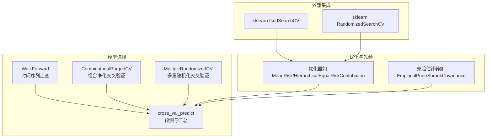
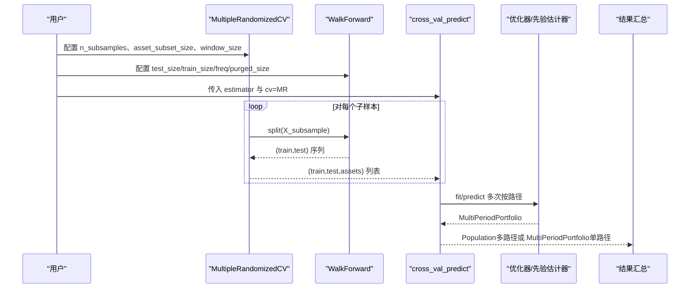
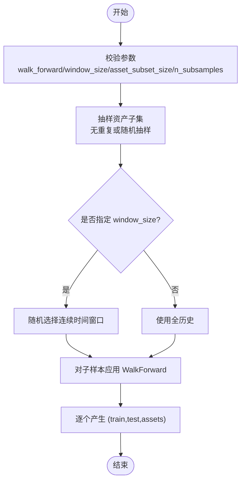
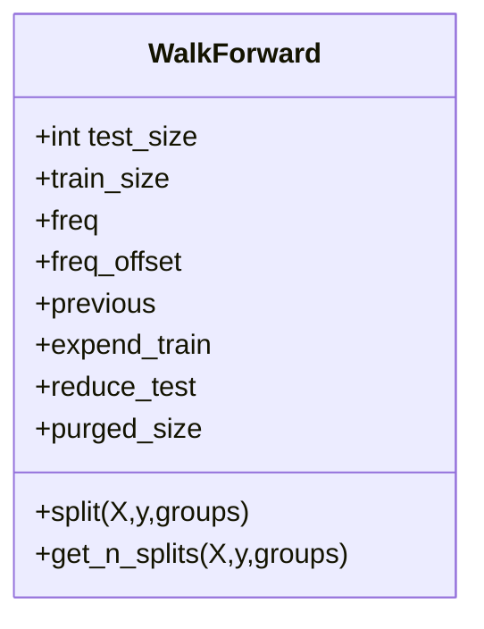
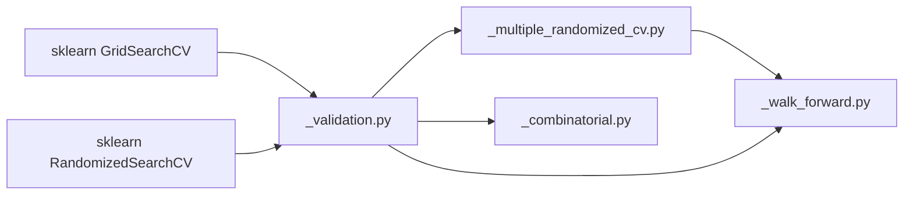

# 模型选择与超参数调优

<cite>
**本文引用的文件**
- [src/skfolio/model_selection/__init__.py](file://src/skfolio/model_selection/__init__.py)
- [src/skfolio/model_selection/_multiple_randomized_cv.py](file://src/skfolio/model_selection/_multiple_randomized_cv.py)
- [src/skfolio/model_selection/_walk_forward.py](file://src/skfolio/model_selection/_walk_forward.py)
- [src/skfolio/model_selection/_validation.py](file://src/skfolio/model_selection/_validation.py)
- [src/skfolio/model_selection/_combinatorial.py](file://src/skfolio/model_selection/_combinatorial.py)
- [examples/model_selection/plot_1_multiple_randomized_cv.py](file://examples/model_selection/plot_1_multiple_randomized_cv.py)
- [docs/user_guide/model_selection.rst](file://docs/user_guide/model_selection.rst)
- [docs/user_guide/hyper_parameters_tuning.rst](file://docs/user_guide/hyper_parameters_tuning.rst)
- [tests/test_model_selection/test_multiple_randomized_cv.py](file://tests/test_model_selection/test_multiple_randomized_cv.py)
- [tests/test_model_selection/test_validation.py](file://tests/test_model_selection/test_validation.py)
</cite>

## 目录
1. [引言](#引言)
2. [项目结构](#项目结构)
3. [核心组件](#核心组件)
4. [架构总览](#架构总览)
5. [详细组件分析](#详细组件分析)
6. [依赖关系分析](#依赖关系分析)
7. [性能考量](#性能考量)
8. [故障排查指南](#故障排查指南)
9. [结论](#结论)
10. [附录](#附录)

## 引言
本文件面向使用 skfolio 进行投资组合策略建模与评估的用户，系统讲解如何利用 model_selection 模块进行稳健的模型选择与超参数调优。重点覆盖：
- 使用 MultipleRandomizedCV 在资产子集与连续时间窗口上进行蒙特卡洛风格的交叉验证，以捕捉时序与横截面双重波动性；
- 如何在策略中对优化器与先验估计器的超参数进行网格或随机搜索；
- 与 scikit-learn 的 GridSearchCV、RandomizedSearchCV 的无缝集成；
- MultipleRandomizedCV 防止前视偏差的机制及其相较传统时间序列交叉验证的优势；
- 调优过程中的计算成本与过拟合风险控制建议。

## 项目结构
skfolio 的模型选择与验证能力由以下模块协同实现：
- model_selection：提供 WalkForward、CombinatorialPurgedCV、MultipleRandomizedCV 以及 cross_val_predict 等工具；
- optimization 与 prior：为调优提供可配置的优化器与先验估计器；
- examples 与 docs：提供教程与用户指南，演示如何在真实数据上执行调优与稳健评估。



图表来源
- [src/skfolio/model_selection/_walk_forward.py](file://src/skfolio/model_selection/_walk_forward.py#L21-L120)
- [src/skfolio/model_selection/_combinatorial.py](file://src/skfolio/model_selection/_combinatorial.py#L46-L120)
- [src/skfolio/model_selection/_multiple_randomized_cv.py](file://src/skfolio/model_selection/_multiple_randomized_cv.py#L21-L120)
- [src/skfolio/model_selection/_validation.py](file://src/skfolio/model_selection/_validation.py#L35-L138)

章节来源
- [src/skfolio/model_selection/__init__.py](file://src/skfolio/model_selection/__init__.py#L6-L22)
- [docs/user_guide/model_selection.rst](file://docs/user_guide/model_selection.rst#L1-L201)

## 核心组件
- WalkForward：基于训练/测试长度或日历频率的走查式划分，支持“净化期”与“禁用期”，避免标签重叠导致的数据泄漏。
- CombinatorialPurgedCV：通过组合多个训练/测试集合生成多条测试路径，结合净化与禁用期进一步降低泄漏。
- MultipleRandomizedCV：在资产子集与连续时间窗口上进行重复抽样，再对每个子样本应用内层 WalkForward，从而同时捕获跨时序与跨截面的波动性。
- cross_val_predict：统一的预测与汇总接口，兼容单路径与多路径输出；自动处理需要“前权重传播”的优化器（如带交易成本的模型）。

章节来源
- [src/skfolio/model_selection/_walk_forward.py](file://src/skfolio/model_selection/_walk_forward.py#L21-L120)
- [src/skfolio/model_selection/_combinatorial.py](file://src/skfolio/model_selection/_combinatorial.py#L46-L120)
- [src/skfolio/model_selection/_multiple_randomized_cv.py](file://src/skfolio/model_selection/_multiple_randomized_cv.py#L21-L120)
- [src/skfolio/model_selection/_validation.py](file://src/skfolio/model_selection/_validation.py#L35-L138)

## 架构总览
下图展示了 MultipleRandomizedCV 的工作流：对每个子样本（时间窗口 × 资产子集），执行内层 WalkForward，产出多条路径；随后通过 cross_val_predict 将每条路径的预测结果组织为 Population/MultiPeriodPortfolio。



图表来源
- [src/skfolio/model_selection/_multiple_randomized_cv.py](file://src/skfolio/model_selection/_multiple_randomized_cv.py#L212-L311)
- [src/skfolio/model_selection/_walk_forward.py](file://src/skfolio/model_selection/_walk_forward.py#L256-L339)
- [src/skfolio/model_selection/_validation.py](file://src/skfolio/model_selection/_validation.py#L187-L318)

## 详细组件分析

### MultipleRandomizedCV 组件分析
- 设计要点
  - 子样本数量 n_subsamples 控制蒙特卡洛采样规模；
  - asset_subset_size 控制每次抽取的资产子集大小；
  - window_size 可选，用于限定连续时间窗口，或全历史；
  - 内层使用 WalkForward，确保时序一致性与前视偏差控制。
- 关键行为
  - 参数校验：walk_forward 类型、window_size 合法范围、asset_subset_size 合法范围、n_subsamples 上下界；
  - 资产子集抽样：当组合数较小（binomial 较小）时采用无重复抽样；当组合数巨大时退化为随机抽样；
  - 时间窗口抽样：随机选取起始点，保证连续观测；
  - 路径标识：get_path_ids 返回每个测试集所属的子样本路径编号，便于后续分组统计。
- 输出形态
  - 单路径 CV（如 WalkForward）返回 MultiPeriodPortfolio；
  - 多路径 CV（如 MultipleRandomizedCV）返回 Population，包含多条 MultiPeriodPortfolio。



图表来源
- [src/skfolio/model_selection/_multiple_randomized_cv.py](file://src/skfolio/model_selection/_multiple_randomized_cv.py#L236-L311)

章节来源
- [src/skfolio/model_selection/_multiple_randomized_cv.py](file://src/skfolio/model_selection/_multiple_randomized_cv.py#L21-L120)
- [src/skfolio/model_selection/_multiple_randomized_cv.py](file://src/skfolio/model_selection/_multiple_randomized_cv.py#L236-L311)
- [tests/test_model_selection/test_multiple_randomized_cv.py](file://tests/test_model_selection/test_multiple_randomized_cv.py#L89-L165)

### WalkForward 组件分析
- 设计要点
  - 通过 train_size/test_size 控制每步训练/测试长度；
  - 支持 freq/freq_offset/previous 等日历频率与偏移，适配月度/季度等再平衡周期；
  - purged_size 控制训练与测试之间的“净化期”，减少标签重叠；
  - expend_train/reduce_test 控制训练集扩展与最后不完整测试集保留。
- 输出形态
  - 生成 (train,test) 索引序列，保证严格时序顺序，避免打乱。



图表来源
- [src/skfolio/model_selection/_walk_forward.py](file://src/skfolio/model_selection/_walk_forward.py#L236-L339)

章节来源
- [src/skfolio/model_selection/_walk_forward.py](file://src/skfolio/model_selection/_walk_forward.py#L21-L120)
- [src/skfolio/model_selection/_walk_forward.py](file://src/skfolio/model_selection/_walk_forward.py#L256-L339)

### cross_val_predict 组件分析
- 设计要点
  - 兼容 sklearn CV 分割器与 skfolio 自定义分割器；
  - 对需要“前权重传播”的优化器（如带交易成本），按路径顺序串行处理，自动传递上一折权重；
  - 对非路径型 CV，支持并行 fit/predict；
  - 输出形态：单路径返回 MultiPeriodPortfolio，多路径返回 Population。
- 关键逻辑
  - 路径型 CV（WalkForward、MultipleRandomizedCV）：按 path_ids 分组，串行运行；
  - 非路径型 CV：克隆估计器并行运行；
  - 资产列索引与元数据路由：支持 transform_output=pandas 与 metadata routing。

```mermaid
sequenceDiagram
participant CV as "cross_val_predict"
participant SPLIT as "CV 分割器"
participant EST as "估计器/Pipeline"
participant PATH as "_run_path"
participant PAR as "并行器"
CV->>SPLIT : split(X)
alt 路径型CV
SPLIT-->>CV : (train,test,assets)*
CV->>PATH : 按 path 分组运行
PATH->>EST : fit/predict传递 previous_weights
EST-->>PATH : Portfolio
PATH-->>CV : MultiPeriodPortfolio 列表
else 非路径型CV
SPLIT-->>CV : (train,test)*
CV->>PAR : 并行 fit_and_predict
PAR-->>CV : Portfolio 列表
end
CV-->>CV : 组装 MultiPeriodPortfolio 或 Population
```

图表来源
- [src/skfolio/model_selection/_validation.py](file://src/skfolio/model_selection/_validation.py#L187-L318)

章节来源
- [src/skfolio/model_selection/_validation.py](file://src/skfolio/model_selection/_validation.py#L35-L138)
- [src/skfolio/model_selection/_validation.py](file://src/skfolio/model_selection/_validation.py#L187-L318)
- [tests/test_model_selection/test_validation.py](file://tests/test_model_selection/test_validation.py#L88-L232)

### 与 scikit-learn 的 GridSearchCV/RandomizedSearchCV 集成
- 集成方式
  - 在调优阶段，将包含预筛选与优化器的 Pipeline 作为 estimator，使用 sklearn 的 GridSearchCV/RandomizedSearchCV；
  - cv 参数可直接传入 WalkForward 或 KFold 等；
  - 通过 param_grid/param_distributions 定义优化器与先验估计器的超参数空间；
  - 使用 make_scorer 指定目标度量（如 CVaR 比率、年化夏普比率等）。
- 示例参考
  - 教程示例展示了如何对“选择前 K 资产 + 均值-方差优化 + 收缩协方差”的 Pipeline 进行随机搜索；
  - 用户指南提供了网格搜索与随机搜索的完整示例与参数分布定义方法。

章节来源
- [examples/model_selection/plot_1_multiple_randomized_cv.py](file://examples/model_selection/plot_1_multiple_randomized_cv.py#L94-L113)
- [docs/user_guide/hyper_parameters_tuning.rst](file://docs/user_guide/hyper_parameters_tuning.rst#L42-L183)

## 依赖关系分析
- 组件耦合
  - MultipleRandomizedCV 依赖 WalkForward 作为内层分割器；
  - cross_val_predict 依赖多种 CV 分割器（含路径型与非路径型），并对需要 previous_weights 的优化器进行路径级串行处理；
  - CombinatorialPurgedCV 提供组合路径型 CV，与 cross_val_predict 的多路径输出形态兼容。
- 外部依赖
  - 与 sklearn.model_selection 的兼容性良好，可直接复用 GridSearchCV/RandomizedSearchCV；
  - 与 pandas DatetimeIndex 的集成用于日历频率走查。



图表来源
- [src/skfolio/model_selection/_multiple_randomized_cv.py](file://src/skfolio/model_selection/_multiple_randomized_cv.py#L16-L21)
- [src/skfolio/model_selection/_validation.py](file://src/skfolio/model_selection/_validation.py#L27-L33)
- [src/skfolio/model_selection/_combinatorial.py](file://src/skfolio/model_selection/_combinatorial.py#L28-L45)

章节来源
- [src/skfolio/model_selection/__init__.py](file://src/skfolio/model_selection/__init__.py#L6-L22)

## 性能考量
- 计算复杂度
  - MultipleRandomizedCV 的总拆分次数约为 n_subsamples × 内层 WalkForward 折数；
  - 当资产组合数较大时，采用随机抽样避免组合爆炸；
  - 通过 n_jobs 并行化 fit/predict，显著缩短整体耗时。
- 过拟合风险
  - MultipleRandomizedCV 通过跨资产与跨时间窗口的重复采样，降低单一样本对评估结果的影响；
  - 建议在调优阶段使用更稳健的 CV（如 MultipleRandomizedCV 或 CombinatorialPurgedCV）而非单路径 WalkForward；
  - 适度增加 n_subsamples 与 window_size，有助于提升评估稳定性。
- 数据泄漏防护
  - 必须保持时间序列不打乱（shuffle=False），并合理设置 purged_size；
  - 对高频交易或延迟执行场景，应启用 purged_size 以避免前视信息泄露。

[本节为通用指导，无需列出具体文件来源]

## 故障排查指南
- 常见错误与修复
  - 参数越界：如 asset_subset_size 超出资产总数、n_subsamples 超出组合上限、window_size 不合法；
  - 未先调用 split 即调用 get_path_ids；
  - 非路径型 CV 使用了需要 previous_weights 的优化器且并行度大于 1；
  - 未设置 shuffle=False 导致时间序列打乱引发泄漏。
- 测试参考
  - 多重随机化 CV 的参数校验、路径标识、时间序列走查等均有单元测试覆盖，可对照定位问题。

章节来源
- [tests/test_model_selection/test_multiple_randomized_cv.py](file://tests/test_model_selection/test_multiple_randomized_cv.py#L24-L74)
- [tests/test_model_selection/test_multiple_randomized_cv.py](file://tests/test_model_selection/test_multiple_randomized_cv.py#L75-L88)
- [tests/test_model_selection/test_validation.py](file://tests/test_model_selection/test_validation.py#L88-L111)

## 结论
- MultipleRandomizedCV 通过在资产子集与连续时间窗口上的重复采样，结合内层 WalkForward，有效提升了投资组合策略评估的稳健性与代表性；
- 与 sklearn 的 GridSearchCV/RandomizedSearchCV 集成顺畅，可在 Pipeline 中对优化器与先验估计器的超参数进行高效搜索；
- 在调优过程中，优先采用多路径 CV（如 MultipleRandomizedCV/CombinatorialPurgedCV）以降低过拟合风险，并注意前视偏差控制与计算资源分配。

[本节为总结性内容，无需列出具体文件来源]

## 附录
- 实战建议
  - 调优阶段：使用 RandomizedSearchCV 并设定合理的 n_iter，结合连续分布（如 uniform/loguniform）探索超参数；
  - 评估阶段：使用 MultipleRandomizedCV 或 CombinatorialPurgedCV 获取多路径分布，再以 Population 形式进行统计分析；
  - 指标选择：优先使用年化夏普比率、CVaR 比率等稳健指标，并关注分布的均值与标准差。
- 参考示例
  - 教程示例展示了从数据加载、管道构建、调优到多路径评估的完整流程。

章节来源
- [examples/model_selection/plot_1_multiple_randomized_cv.py](file://examples/model_selection/plot_1_multiple_randomized_cv.py#L1-L229)
- [docs/user_guide/model_selection.rst](file://docs/user_guide/model_selection.rst#L165-L201)
- [docs/user_guide/hyper_parameters_tuning.rst](file://docs/user_guide/hyper_parameters_tuning.rst#L42-L183)