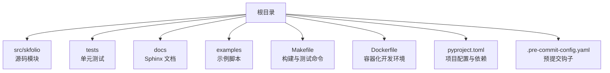
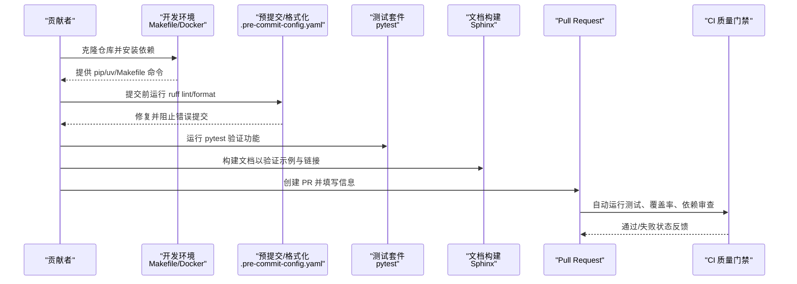
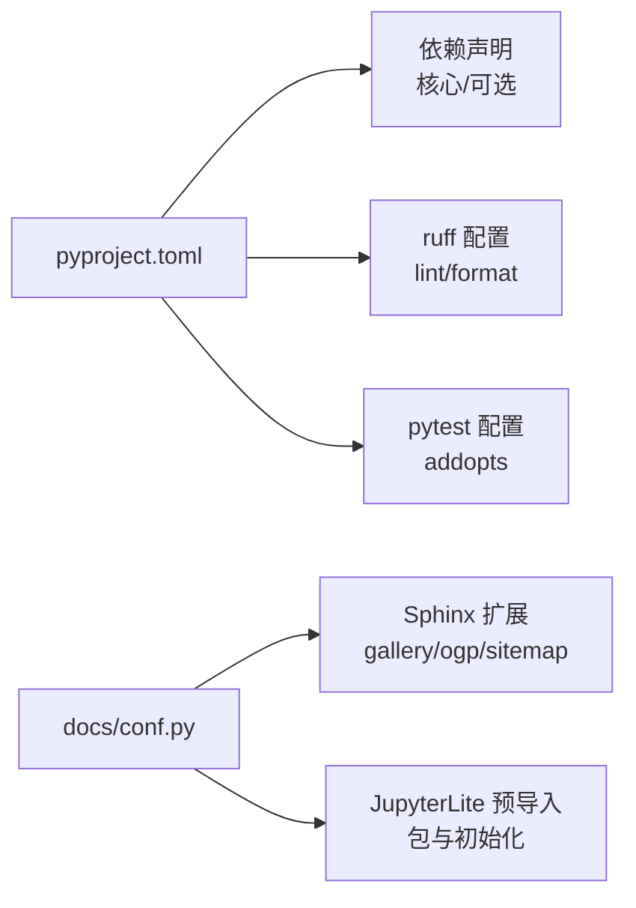

# 贡献指南

<cite>
**本文引用的文件**
- [CONTRIBUTING.md](file://CONTRIBUTING.md)
- [Makefile](file://Makefile)
- [Dockerfile](file://Dockerfile)
- [.pre-commit-config.yaml](file://.pre-commit-config.yaml)
- [SECURITY.md](file://SECURITY.md)
- [CODE_OF_CONDUCT.md](file://CODE_OF_CONDUCT.md)
- [pyproject.toml](file://pyproject.toml)
- [tests/conftest.py](file://tests/conftest.py)
- [tests/test_portfolio/test_portfolio.py](file://tests/test_portfolio/test_portfolio.py)
- [docs/conf.py](file://docs/conf.py)
</cite>

## 目录
1. [简介](#简介)
2. [项目结构](#项目结构)
3. [核心组件](#核心组件)
4. [架构总览](#架构总览)
5. [详细组件分析](#详细组件分析)
6. [依赖分析](#依赖分析)
7. [性能考虑](#性能考虑)
8. [故障排查指南](#故障排查指南)
9. [结论](#结论)
10. [附录](#附录)

## 简介
本贡献指南面向希望为 skfolio 做出贡献的开发者与研究者，覆盖从本地开发环境搭建（使用 Makefile 和 Dockerfile）、代码风格与预提交检查、测试套件结构与编写规范、文档更新流程，以及安全漏洞报告与社区行为准则等。我们鼓励社区参与，欢迎通过 Issue 报告问题、讨论特性或提交 Pull Request。

## 项目结构
本仓库采用按功能域分层的组织方式：
- 源码位于 src/skfolio 下，按模块划分（如 optimization、moments、metrics、portfolio 等）
- 测试位于 tests/ 下，与源码模块一一对应，便于回归与验证
- 文档位于 docs/ 下，使用 Sphinx 构建，examples/ 提供可运行示例
- 开发工具与配置集中在根目录：Makefile、Dockerfile、pyproject.toml、.pre-commit-config.yaml 等

图表来源
- [Makefile](file://Makefile#L1-L16)
- [Dockerfile](file://Dockerfile#L1-L49)
- [pyproject.toml](file://pyproject.toml#L1-L152)

章节来源
- [Makefile](file://Makefile#L1-L16)
- [Dockerfile](file://Dockerfile#L1-L49)
- [pyproject.toml](file://pyproject.toml#L1-L152)

## 核心组件
- 本地开发与测试
  - 使用 pip 或 uv 安装开发依赖，运行 pytest 执行测试
  - 使用 Makefile 提供的便捷命令进行格式化与静态检查
- 代码风格与预提交
  - 通过 ruff 实现 lint 与格式化；在 pre-commit 中强制执行
  - 配置了 YAML 检查、换行符修复等基础钩子
- 文档构建
  - 使用 Sphinx 构建文档，支持示例自动抓图与 JupyterLite 内容
- 安全与合规
  - 通过 SECURITY.md 规范漏洞上报流程与响应窗口
  - 项目遵循 BSD 许可，CI 中启用依赖审查与 CodeQL 扫描

章节来源
- [CONTRIBUTING.md](file://CONTRIBUTING.md#L37-L141)
- [Makefile](file://Makefile#L1-L16)
- [.pre-commit-config.yaml](file://.pre-commit-config.yaml#L1-L19)
- [pyproject.toml](file://pyproject.toml#L115-L151)
- [SECURITY.md](file://SECURITY.md#L1-L92)
- [docs/conf.py](file://docs/conf.py#L289-L363)

## 架构总览
贡献工作流从本地开发开始，贯穿代码风格、测试、文档与 PR 提交流程，最终由 CI 进行质量门禁。

图表来源
- [CONTRIBUTING.md](file://CONTRIBUTING.md#L37-L141)
- [.pre-commit-config.yaml](file://.pre-commit-config.yaml#L1-L19)
- [Makefile](file://Makefile#L1-L16)
- [pyproject.toml](file://pyproject.toml#L115-L151)
- [SECURITY.md](file://SECURITY.md#L62-L87)

## 详细组件分析

### 本地开发与环境搭建
- 使用 pip 或 uv 安装开发依赖，进入开发模式
- 分支命名建议遵循约定式路径，便于追踪与分类
- 推荐使用 Makefile 的便捷命令进行格式化与测试，或直接使用 uv run

章节来源
- [CONTRIBUTING.md](file://CONTRIBUTING.md#L37-L141)
- [Makefile](file://Makefile#L1-L16)

### Docker 开发环境
- 使用带 uv 的官方镜像作为基础，利用缓存层优化安装速度
- 通过 uv 同步依赖与项目代码，再安装 JupyterLab 扩展
- 默认暴露 8888 端口并启动 JupyterLab，便于交互式开发与示例运行

章节来源
- [Dockerfile](file://Dockerfile#L1-L49)

### 代码风格与预提交检查
- 预提交钩子包括：
  - 基础钩子：检查 YAML、修复文件末尾换行
  - ruff 钩子：lint 与 format，且在修复时退出非零以阻止错误提交
- 本地开发中，建议先运行 ruff 检查与格式化，再提交
- CI 中同样会执行 ruff check 与 ruff format --check，确保一致性

章节来源
- [.pre-commit-config.yaml](file://.pre-commit-config.yaml#L1-L19)
- [pyproject.toml](file://pyproject.toml#L115-L151)

### 测试套件结构与编写规范
- 测试组织方式
  - tests/ 下按功能模块划分，与 src/skfolio 对应
  - tests/conftest.py 提供全局与模块级 fixture，统一数据与配置
- 编写单元测试的建议
  - 使用 pytest 参数化与 fixture，减少重复代码
  - 针对新增功能，补充最小可复现用例，覆盖边界条件与异常路径
  - 保持测试命名清晰，描述性强，便于定位问题
- 示例参考
  - tests/test_portfolio/test_portfolio.py 展示了丰富的参数化与断言模式，可作为新测试编写的模板

章节来源
- [tests/conftest.py](file://tests/conftest.py#L1-L203)
- [tests/test_portfolio/test_portfolio.py](file://tests/test_portfolio/test_portfolio.py#L1-L528)

### 文档更新与构建
- 文档使用 Sphinx 构建，支持示例自动抓图与 JupyterLite
- 在本地验证文档构建时，可安装 docs 依赖并使用 sphinx-build
- 文档配置中包含示例排序、重定向、SEO、站点地图等高级选项

章节来源
- [CONTRIBUTING.md](file://CONTRIBUTING.md#L98-L112)
- [docs/conf.py](file://docs/conf.py#L289-L363)
- [pyproject.toml](file://pyproject.toml#L78-L94)

### 安全漏洞报告流程
- 不要在公开 Issue 中披露漏洞
- 优先使用 GitHub 私有漏洞报告通道，或邮件联系维护者
- 报告需包含受影响组件、版本、复现步骤、影响评估与相关日志
- 维护者承诺在不同严重级别下的响应时间目标，并协调披露时间线

章节来源
- [SECURITY.md](file://SECURITY.md#L1-L92)

### 社区行为准则与代码审查标准
- 行为准则是开放、尊重与包容，强调技术贡献与共识
- 代码审查建议关注：
  - 功能正确性与边界处理
  - 可读性与注释质量
  - 性能与内存占用
  - 测试覆盖与稳定性
  - 文档与示例同步更新

章节来源
- [CODE_OF_CONDUCT.md](file://CODE_OF_CONDUCT.md#L1-L17)
- [CONTRIBUTING.md](file://CONTRIBUTING.md#L131-L141)

## 依赖分析
- 语言与工具链
  - Python 版本要求与核心依赖在 pyproject.toml 中定义
  - 开发依赖（pytest、ruff、pre-commit）与文档依赖（Sphinx 生态）在 extras 中声明
- 代码风格与测试工具
  - ruff 用于 lint 与格式化，配置在 pyproject.toml 的 [tool.ruff] 中
  - pytest 作为测试框架，通过 addopts 控制导入模式
- 文档与示例
  - Sphinx 配置在 docs/conf.py 中，包含示例抓图、重定向、SEO、JupyterLite 初始化等

图表来源
- [pyproject.toml](file://pyproject.toml#L52-L94)
- [pyproject.toml](file://pyproject.toml#L115-L151)
- [docs/conf.py](file://docs/conf.py#L300-L363)
- [docs/conf.py](file://docs/conf.py#L588-L631)

章节来源
- [pyproject.toml](file://pyproject.toml#L52-L94)
- [pyproject.toml](file://pyproject.toml#L115-L151)
- [docs/conf.py](file://docs/conf.py#L300-L363)
- [docs/conf.py](file://docs/conf.py#L588-L631)

## 性能考虑
- 单元测试中可使用参数化与共享 fixture，避免重复数据加载
- 对于计算密集型模块，建议在测试中关注缓存命中与属性访问开销
- 文档示例尽量控制绘图与计算复杂度，避免 CI 超时

章节来源
- [tests/test_portfolio/test_portfolio.py](file://tests/test_portfolio/test_portfolio.py#L352-L405)
- [tests/conftest.py](file://tests/conftest.py#L1-L203)

## 故障排查指南
- 预提交失败
  - 现象：提交被阻止或 ruff 修复后仍失败
  - 处理：先运行 ruff check --fix 与 ruff format，确保本地一致后再提交
- 测试失败
  - 现象：pytest 报错或覆盖率不达标
  - 处理：使用 pytest 逐项定位，结合 conftest 中的 fixture 数据进行调试
- 文档构建异常
  - 现象：Sphinx 报错或示例抓图失败
  - 处理：确认依赖安装完整，检查 docs/conf.py 中的示例抓图与重定向配置
- Docker 环境问题
  - 现象：JupyterLab 无法启动或端口冲突
  - 处理：确认端口映射与挂载路径，必要时重建镜像

章节来源
- [.pre-commit-config.yaml](file://.pre-commit-config.yaml#L1-L19)
- [Makefile](file://Makefile#L1-L16)
- [Dockerfile](file://Dockerfile#L35-L49)
- [docs/conf.py](file://docs/conf.py#L524-L587)

## 结论
通过本指南，贡献者可以快速建立一致的开发环境，遵循统一的代码风格与测试规范，高质量地完成文档与示例更新，并在安全与合规的前提下提交变更。我们期待你的参与，共同提升 skfolio 的质量与影响力。

## 附录
- 常用命令速查
  - 安装开发依赖：pip install --editable ".[dev]" 或 uv pip install --editable ".[dev]"
  - 运行测试：pytest 或 uv run pytest
  - 格式化与检查：ruff check --fix 与 ruff format
  - 文档构建：pip install --editable ".[docs]" 后在 docs 目录执行 sphinx-build
- 分支命名建议
  - 使用约定式路径：category/reference/description-in-kebab-case
    - category：feature、fix、refactor、chore
    - reference：issue-<issue number> 或 no-ref
- 提交信息规范
  - 遵循约定式提交，例如 feat(something): 详细描述变更内容

章节来源
- [CONTRIBUTING.md](file://CONTRIBUTING.md#L37-L141)
- [Makefile](file://Makefile#L1-L16)
- [pyproject.toml](file://pyproject.toml#L115-L151)