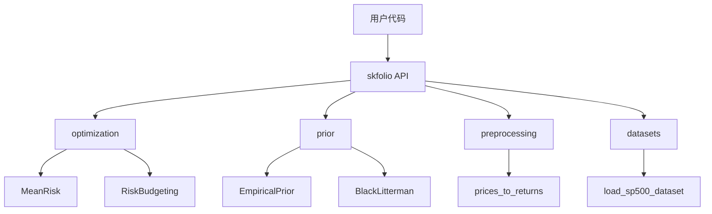
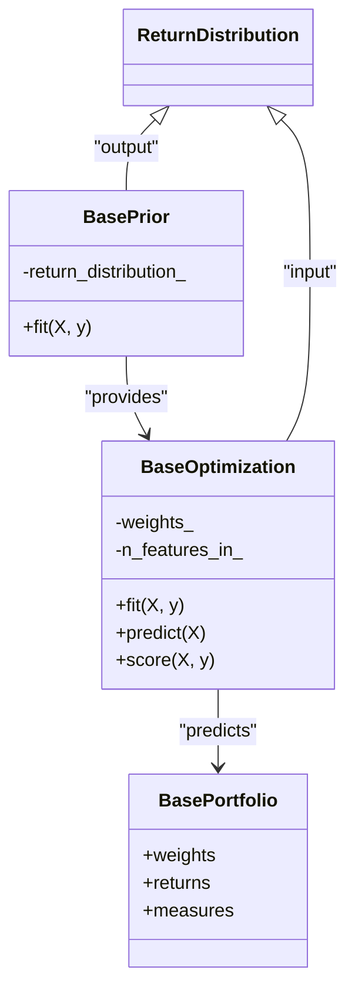
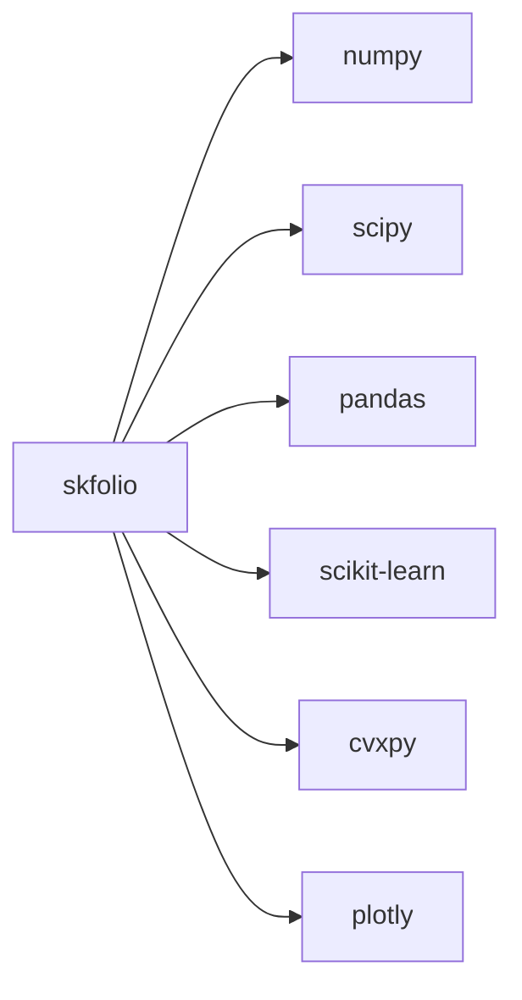

# 项目概述

<cite>
**本文档引用的文件**   
- [README.rst](file://README.rst)
- [__init__.py](file://src/skfolio/__init__.py)
- [_base.py](file://src/skfolio/optimization/_base.py)
- [_base.py](file://src/skfolio/prior/_base.py)
- [_base.py](file://src/skfolio/portfolio/_base.py)
- [_mean_risk.py](file://src/skfolio/optimization/convex/_mean_risk.py)
- [_empirical.py](file://src/skfolio/prior/_empirical.py)
- [_returns.py](file://src/skfolio/preprocessing/_returns.py)
- [_base.py](file://src/skfolio/datasets/_base.py)
- [_measures.py](file://src/skfolio/measures/_measures.py)
- [_population.py](file://src/skfolio/population/_population.py)
</cite>

## 目录
1. [引言](#引言)
2. [项目结构](#项目结构)
3. [核心组件](#核心组件)
4. [架构概述](#架构概述)
5. [详细组件分析](#详细组件分析)
6. [依赖分析](#依赖分析)
7. [性能考虑](#性能考虑)
8. [故障排除指南](#故障排除指南)
9. [结论](#结论)

## 引言

skfolio 是一个基于 scikit-learn 构建的 Python 库，专为投资组合优化和风险管理而设计。它提供了一套与 scikit-learn 兼容的统一接口和工具，用于构建、微调、交叉验证和压力测试投资组合模型。该项目旨在解决传统均值-方差优化（MVO）的诸多缺陷，如对输入参数的高敏感性、权重集中、高换手率和样本外表现不佳等问题。通过集成多种先进的优化方法、先验估计、模型选择和风险度量，skfolio 为用户提供了一个强大的机器学习框架，以进行稳健的投资组合管理。

**Section sources**
- [README.rst](file://README.rst#L64-L66)

## 项目结构

skfolio 项目遵循模块化设计，其源代码位于 `src/skfolio/` 目录下。主要模块包括：
- `optimization/`: 包含各种投资组合优化算法，如均值-风险、风险预算、分层聚类等。
- `prior/`: 提供先验估计器，如经验先验、Black-Litterman 模型、因子模型等。
- `moments/`: 实现期望收益和协方差矩阵的估计方法。
- `portfolio/`: 定义投资组合类，用于存储和计算投资组合的权重、收益和风险度量。
- `preprocessing/`: 提供数据预处理工具，如将价格转换为收益率。
- `datasets/`: 包含用于示例和测试的内置数据集。
- `model_selection/`: 支持与 scikit-learn 兼容的交叉验证和超参数调优。

**Diagram sources**
- [__init__.py](file://src/skfolio/__init__.py)
- [project_structure](file://project_structure)

**Section sources**
- [project_structure](file://project_structure)

## 核心组件

skfolio 的核心组件包括 `BaseOptimization`、`BasePrior` 和 `BasePortfolio`。`BaseOptimization` 是所有优化器的基类，继承自 scikit-learn 的 `BaseEstimator`，并实现了 `fit` 和 `predict` 方法。`BasePrior` 是所有先验估计器的基类，负责估计资产的期望收益、协方差矩阵和收益率分布。`BasePortfolio` 类用于表示一个投资组合，包含其权重、收益和各种风险度量。

**Section sources**
- [_base.py](file://src/skfolio/optimization/_base.py#L39-L105)
- [_base.py](file://src/skfolio/prior/_base.py#L51-L59)
- [_base.py](file://src/skfolio/portfolio/_base.py#L75-L168)

## 架构概述

skfolio 的架构设计原则是与 scikit-learn 的 Estimator 接口无缝集成。所有优化器和先验估计器都遵循 scikit-learn 的 API，支持 `fit`、`predict` 和 `score` 方法。这种设计使得 skfolio 可以轻松地与 scikit-learn 的模型选择和交叉验证工具结合使用。组件间的交互关系是通过 `ReturnDistribution` 数据类来实现的，该类封装了先验估计器的输出，并作为优化器的输入。

**Diagram sources**
- [_base.py](file://src/skfolio/optimization/_base.py#L39-L105)
- [_base.py](file://src/skfolio/prior/_base.py#L51-L59)
- [_base.py](file://src/skfolio/portfolio/_base.py#L75-L168)

## 详细组件分析

### 投资组合优化模块分析

`MeanRisk` 优化器是 `ConvexOptimization` 的一个具体实现，它支持最小化风险、最大化收益、最大化效用和最大化比率四种目标函数。它通过 `prior_estimator` 参数与先验估计器集成，可以使用不同的风险度量，如方差、CVaR 等，并支持各种约束和正则化。

**Section sources**
- [_mean_risk.py](file://src/skfolio/optimization/convex/_mean_risk.py#L31-L200)

### 先验估计模块分析

`EmpiricalPrior` 是 `BasePrior` 的一个具体实现，它通过分别拟合 `mu_estimator` 和 `covariance_estimator` 来估计 `ReturnDistribution`。默认情况下，它使用 `EmpiricalMu` 和 `EmpiricalCovariance`，但用户可以指定其他估计器，如 `ShrunkMu` 或 `LedoitWolf`。

**Section sources**
- [_empirical.py](file://src/skfolio/prior/_empirical.py#L17-L200)

## 依赖分析

skfolio 依赖于多个核心库，包括 numpy、scipy、pandas、scikit-learn、cvxpy 和 plotly。这些依赖项在 `pyproject.toml` 文件中定义。skfolio 通过 `__init__.py` 文件将各个模块的公共接口暴露给用户，实现了模块间的解耦。

**Diagram sources**
- [pyproject.toml](file://pyproject.toml)
- [__init__.py](file://src/skfolio/__init__.py)

**Section sources**
- [pyproject.toml](file://pyproject.toml)
- [__init__.py](file://src/skfolio/__init__.py)

## 性能考虑

skfolio 在设计时考虑了性能和计算效率。例如，`BasePortfolio` 类使用 `__slots__` 而不是 `__dict__` 来存储属性，这可以加快投资组合的实例化速度。此外，度量值是惰性计算并缓存的，只有在需要时才会计算，从而避免了不必要的重复计算。

**Section sources**
- [_base.py](file://src/skfolio/portfolio/_base.py#L7-L30)

## 故障排除指南

当优化失败时，skfolio 提供了 `fallback` 机制，允许用户指定备用优化器或回退到之前的权重。`FailedPortfolio` 类用于表示优化失败的投资组合，用户可以通过检查 `error_` 和 `fallback_chain_` 属性来诊断问题。

**Section sources**
- [_base.py](file://src/skfolio/optimization/_base.py#L50-L71)
- [exceptions.py](file://src/skfolio/exceptions.py)

## 结论

skfolio 是一个功能强大且灵活的投资组合优化库，它通过与 scikit-learn 的深度集成，为用户提供了一个现代化的机器学习框架。其模块化设计、丰富的功能集和清晰的 API 使其成为进行投资组合研究和实践的理想选择。