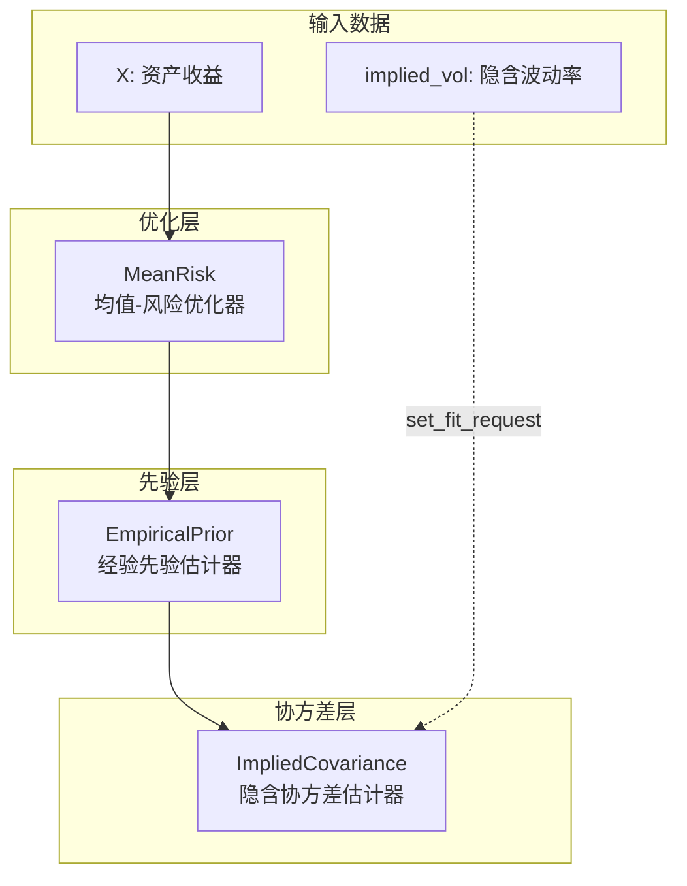
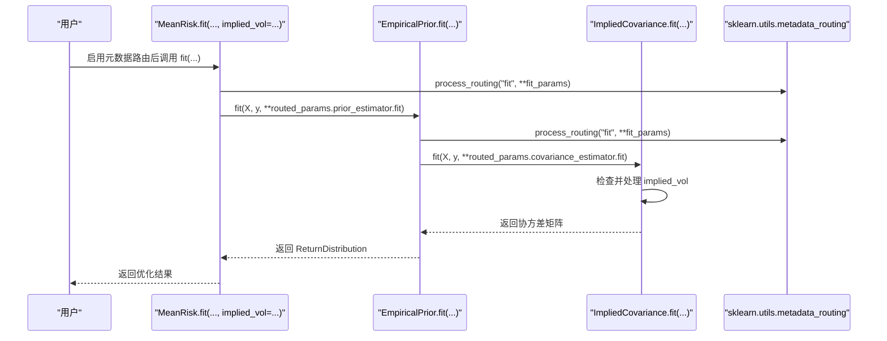
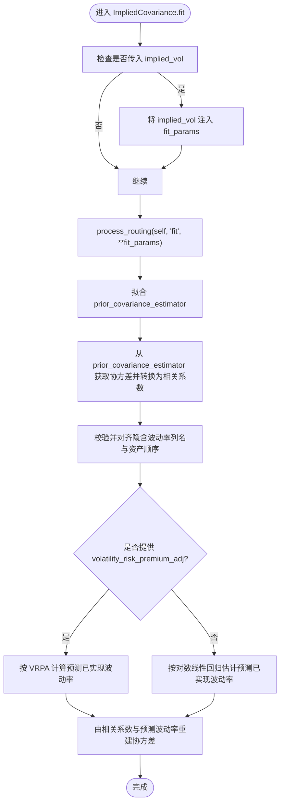
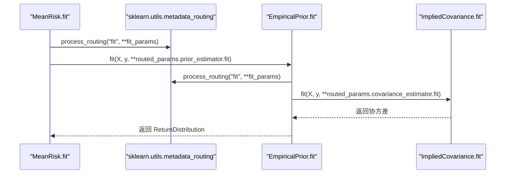
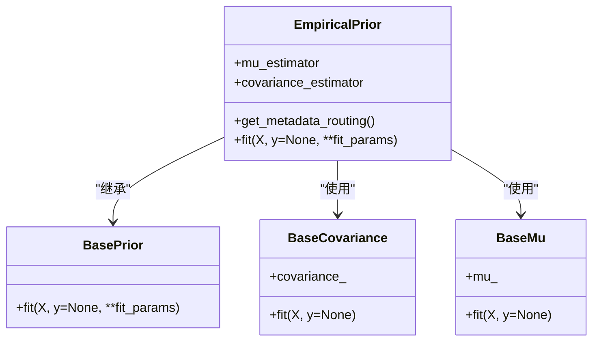
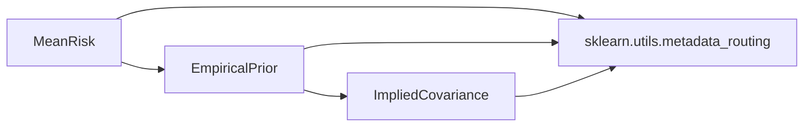

# 元数据路由

<cite>
**本文引用的文件**
- [src/skfolio/moments/covariance/_implied_covariance.py](file://src/skfolio/moments/covariance/_implied_covariance.py)
- [src/skfolio/optimization/convex/_mean_risk.py](file://src/skfolio/optimization/convex/_mean_risk.py)
- [src/skfolio/prior/_empirical.py](file://src/skfolio/prior/_empirical.py)
- [src/skfolio/prior/_base.py](file://src/skfolio/prior/_base.py)
- [src/skfolio/moments/covariance/_base.py](file://src/skfolio/moments/covariance/_base.py)
- [docs/user_guide/metadata_routing.rst](file://docs/user_guide/metadata_routing.rst)
- [examples/metadata_routing/plot_1_implied_volatility.py](file://examples/metadata_routing/plot_1_implied_volatility.py)
- [tests/test_moment/test_covariance/test_implied_covariance.py](file://tests/test_moment/test_covariance/test_implied_covariance.py)
- [tests/test_prior/test_empirical.py](file://tests/test_prior/test_empirical.py)
- [src/skfolio/model_selection/_validation.py](file://src/skfolio/model_selection/_validation.py)
</cite>

## 目录
1. [简介](#简介)
2. [项目结构](#项目结构)
3. [核心组件](#核心组件)
4. [架构总览](#架构总览)
5. [组件详解](#组件详解)
6. [依赖关系分析](#依赖关系分析)
7. [性能考量](#性能考量)
8. [故障排查指南](#故障排查指南)
9. [结论](#结论)
10. [附录](#附录)

## 简介
本篇文档系统性阐述 skfolio 中“元数据路由（metadata routing）”机制的实现与应用，重点围绕以下目标展开：
- 解释如何在 fit 和 predict 过程中，将额外信息（如样本权重、隐含波动率等）从上层估计器传递到嵌套估计器。
- 以 ImpliedCovariance 协方差估计器为例，演示如何通过 set_fit_request 方法将隐含波动率数据从 MeanRisk 优化器路由到协方差估计器。
- 提供完整流程：启用元数据路由（set_config）、配置请求、调用 fit 方法传递元数据的全过程。
- 讨论该机制与 scikit-learn 生态系统的集成优势，以及在复杂投资组合管道中的实际应用场景。

## 项目结构
与元数据路由直接相关的核心文件分布如下：
- 估算器与路由实现
  - ImpliedCovariance：协方差估计器，支持接收隐含波动率并进行回归估计。
  - MeanRisk：均值-风险优化器，内部使用 Prior 估计器，并可将元数据路由到其嵌套估计器。
  - EmpiricalPrior：经验先验估计器，封装 mu 与协方差估计器，并负责元数据路由。
- 用户指南与示例
  - 文档：用户指南对元数据路由进行简要说明与示例链接。
  - 示例：使用 ImpliedCovariance 与 MeanRisk 的完整示例脚本。
- 测试与验证
  - 针对元数据路由行为的单元测试，覆盖错误提示与正确路径。

图表来源
- [src/skfolio/optimization/convex/_mean_risk.py](file://src/skfolio/optimization/convex/_mean_risk.py#L800-L818)
- [src/skfolio/prior/_empirical.py](file://src/skfolio/prior/_empirical.py#L94-L107)
- [src/skfolio/moments/covariance/_implied_covariance.py](file://src/skfolio/moments/covariance/_implied_covariance.py#L198-L208)

章节来源
- [src/skfolio/optimization/convex/_mean_risk.py](file://src/skfolio/optimization/convex/_mean_risk.py#L800-L818)
- [src/skfolio/prior/_empirical.py](file://src/skfolio/prior/_empirical.py#L94-L107)
- [src/skfolio/moments/covariance/_implied_covariance.py](file://src/skfolio/moments/covariance/_implied_covariance.py#L198-L208)

## 核心组件
- ImpliedCovariance
  - 支持通过 fit 接收隐含波动率参数，并在内部进行非重叠窗口的对数线性回归，估计各资产的已实现波动率，再结合先验协方差估计器得到最终协方差矩阵。
  - 实现 get_metadata_routing，声明自身可接收名为 implied_vol 的元数据，并将其映射到 fit 方法。
- MeanRisk
  - 内部持有 Prior 估计器（默认 EmpiricalPrior），并在 get_metadata_routing 中声明将 fit 请求路由到 Prior 及其嵌套的不确定性集合估计器。
- EmpiricalPrior
  - 将 fit 请求分别路由到 mu_estimator 与 covariance_estimator，并在 fit 中按顺序拟合两者，产出 ReturnDistribution 供优化器使用。
- 基类约束
  - BaseCovariance 定义了协方差估计器的通用接口与正定性处理逻辑；BasePrior 定义了返回分布的数据结构与抽象接口。

章节来源
- [src/skfolio/moments/covariance/_implied_covariance.py](file://src/skfolio/moments/covariance/_implied_covariance.py#L198-L208)
- [src/skfolio/optimization/convex/_mean_risk.py](file://src/skfolio/optimization/convex/_mean_risk.py#L800-L818)
- [src/skfolio/prior/_empirical.py](file://src/skfolio/prior/_empirical.py#L94-L107)
- [src/skfolio/moments/covariance/_base.py](file://src/skfolio/moments/covariance/_base.py#L20-L110)
- [src/skfolio/prior/_base.py](file://src/skfolio/prior/_base.py#L15-L70)

## 架构总览
下图展示了从 MeanRisk 到 EmpiricalPrior 再到 ImpliedCovariance 的元数据路由路径，以及 fit 参数如何被分发到嵌套估计器。

图表来源
- [src/skfolio/optimization/convex/_mean_risk.py](file://src/skfolio/optimization/convex/_mean_risk.py#L838-L853)
- [src/skfolio/prior/_empirical.py](file://src/skfolio/prior/_empirical.py#L132-L161)
- [src/skfolio/moments/covariance/_implied_covariance.py](file://src/skfolio/moments/covariance/_implied_covariance.py#L242-L254)

## 组件详解

### ImpliedCovariance：元数据路由与隐含波动率处理
- 元数据路由声明
  - get_metadata_routing 返回一个 MetadataRouter，声明自身 owner 名称，并添加自身为自请求对象，同时将 prior_covariance_estimator 的 fit 方法映射到 caller 的 fit。
- fit 参数处理
  - 若外部传入 implied_vol，则将其注入 fit_params；随后通过 process_routing 对 fit_params 进行路由解析，得到 routed_params。
  - 在 fit 中，先拟合 prior_covariance_estimator（默认 EmpiricalCovariance），获取其协方差矩阵并计算相关系数矩阵，再基于隐含波动率进行回归或 VRPA 调整，重建协方差矩阵。
- 关键点
  - 当启用元数据路由时，ImpliedCovariance 可通过 set_fit_request(implied_vol=True) 接收来自上层的隐含波动率元数据。
  - 若未启用元数据路由而直接传入 implied_vol，将触发错误；必须显式 set_fit_request 并在 fit 时通过 fit_params 传递。

图表来源
- [src/skfolio/moments/covariance/_implied_covariance.py](file://src/skfolio/moments/covariance/_implied_covariance.py#L210-L327)

章节来源
- [src/skfolio/moments/covariance/_implied_covariance.py](file://src/skfolio/moments/covariance/_implied_covariance.py#L198-L208)
- [src/skfolio/moments/covariance/_implied_covariance.py](file://src/skfolio/moments/covariance/_implied_covariance.py#L210-L327)

### MeanRisk：将元数据路由到 Prior 及其嵌套估计器
- 元数据路由声明
  - get_metadata_routing 继承父类路由，并为 prior_estimator、mu_uncertainty_set_estimator、covariance_uncertainty_set_estimator 添加方法映射（caller=fit → callee=fit）。
- fit 流程
  - 通过 process_routing 解析 fit_params，然后拟合 prior_estimator（默认 EmpiricalPrior），从而获得 ReturnDistribution。
  - 在后续优化构建中，若使用不确定性集合估计器，也会按相同路由机制将元数据传递到对应嵌套估计器。

图表来源
- [src/skfolio/optimization/convex/_mean_risk.py](file://src/skfolio/optimization/convex/_mean_risk.py#L800-L818)
- [src/skfolio/prior/_empirical.py](file://src/skfolio/prior/_empirical.py#L132-L161)
- [src/skfolio/moments/covariance/_implied_covariance.py](file://src/skfolio/moments/covariance/_implied_covariance.py#L242-L254)

章节来源
- [src/skfolio/optimization/convex/_mean_risk.py](file://src/skfolio/optimization/convex/_mean_risk.py#L800-L818)
- [src/skfolio/prior/_empirical.py](file://src/skfolio/prior/_empirical.py#L132-L161)

### EmpiricalPrior：将元数据路由到 mu 与协方差估计器
- 元数据路由声明
  - get_metadata_routing 为 mu_estimator 与 covariance_estimator 分别添加方法映射（caller=fit → callee=fit）。
- fit 流程
  - 通过 process_routing 解析 fit_params，分别拟合 mu_estimator 与 covariance_estimator，并将二者结果封装为 ReturnDistribution。

图表来源
- [src/skfolio/prior/_empirical.py](file://src/skfolio/prior/_empirical.py#L94-L107)
- [src/skfolio/prior/_empirical.py](file://src/skfolio/prior/_empirical.py#L132-L161)
- [src/skfolio/moments/covariance/_base.py](file://src/skfolio/moments/covariance/_base.py#L20-L110)
- [src/skfolio/prior/_base.py](file://src/skfolio/prior/_base.py#L51-L70)

章节来源
- [src/skfolio/prior/_empirical.py](file://src/skfolio/prior/_empirical.py#L94-L107)
- [src/skfolio/prior/_empirical.py](file://src/skfolio/prior/_empirical.py#L132-L161)

### 用户指南与示例：启用元数据路由与 set_fit_request
- 用户指南要点
  - 元数据路由需显式启用；启用后，可通过 set_fit_request 显式声明希望路由的元数据名称。
  - 示例展示了在 MeanRisk 中将 implied_vol 路由到内部的 EmpiricalPrior 与 ImpliedCovariance。
- 示例脚本要点
  - 使用 sklearn.set_config 启用元数据路由。
  - 在 Prior 的协方差估计器上调用 set_fit_request(implied_vol=True)。
  - 在 fit 时通过 fit_params 传递 implied_vol。

章节来源
- [docs/user_guide/metadata_routing.rst](file://docs/user_guide/metadata_routing.rst#L1-L61)
- [examples/metadata_routing/plot_1_implied_volatility.py](file://examples/metadata_routing/plot_1_implied_volatility.py#L1-L266)

## 依赖关系分析
- 组件耦合与职责
  - MeanRisk 仅负责声明路由并调用 Prior；具体数据处理由 Prior 与底层估计器承担。
  - EmpiricalPrior 将路由参数分别传递给 mu 与协方差估计器，保持高内聚低耦合。
  - ImpliedCovariance 专注于协方差估计与隐含波动率处理，通过 get_metadata_routing 与 set_fit_request 与上层解耦。
- 外部依赖
  - 依赖 sklearn.utils.metadata_routing 进行路由解析与分发。
  - 依赖 sklearn.utils.validation 进行输入校验与数组格式化。
- 循环依赖
  - 无循环依赖；路由声明在各估计器内部完成，不形成闭环。

图表来源
- [src/skfolio/optimization/convex/_mean_risk.py](file://src/skfolio/optimization/convex/_mean_risk.py#L800-L818)
- [src/skfolio/prior/_empirical.py](file://src/skfolio/prior/_empirical.py#L94-L107)
- [src/skfolio/moments/covariance/_implied_covariance.py](file://src/skfolio/moments/covariance/_implied_covariance.py#L198-L208)

章节来源
- [src/skfolio/optimization/convex/_mean_risk.py](file://src/skfolio/optimization/convex/_mean_risk.py#L800-L818)
- [src/skfolio/prior/_empirical.py](file://src/skfolio/prior/_empirical.py#L94-L107)
- [src/skfolio/moments/covariance/_implied_covariance.py](file://src/skfolio/moments/covariance/_implied_covariance.py#L198-L208)

## 性能考量
- 元数据路由本身不引入额外计算开销，但会增加参数解析与校验步骤。在大规模网格搜索或交叉验证场景中，建议：
  - 仅在必要时启用元数据路由（set_config）。
  - 通过 set_fit_request 精确声明所需元数据，避免不必要的参数传递。
  - 在 ImpliedCovariance 中合理设置 window_size，确保非重叠样本数量满足回归最小折叠数要求，减少无效尝试带来的重复开销。
- 优化器求解阶段（如 CVXPY）的性能主要取决于问题规模与约束数量，与元数据路由无直接关系。

## 故障排查指南
- 启用元数据路由前直接传入元数据
  - 现象：在启用元数据路由前，直接传入 implied_vol 会导致错误。
  - 处理：先调用 sklearn.set_config(enable_metadata_routing=True)，再在嵌套估计器上调用 set_fit_request(implied_vol=True)。
- 未显式声明元数据请求
  - 现象：在启用元数据路由后，若未对嵌套估计器调用 set_fit_request，将抛出未设置元数据的异常。
  - 处理：在 Prior 的协方差估计器上调用 set_fit_request(implied_vol=True)。
- 数据资产列名不一致
  - 现象：当 returns 与 implied_vol 的资产列名不一致或缺失时，会触发资产缺失错误。
  - 处理：确保两者的资产列名一致且顺序匹配，或在输入层面进行对齐。
- 非法参数（如 window_size 过小、VRPA 非正值）
  - 现象：参数校验失败导致异常。
  - 处理：调整 window_size 至满足最小折叠数要求；确保 volatility_risk_premium_adj 为严格正值。

章节来源
- [tests/test_moment/test_covariance/test_implied_covariance.py](file://tests/test_moment/test_covariance/test_implied_covariance.py#L246-L266)
- [tests/test_prior/test_empirical.py](file://tests/test_prior/test_empirical.py#L127-L139)
- [src/skfolio/moments/covariance/_implied_covariance.py](file://src/skfolio/moments/covariance/_implied_covariance.py#L238-L241)
- [src/skfolio/moments/covariance/_implied_covariance.py](file://src/skfolio/moments/covariance/_implied_covariance.py#L264-L267)
- [src/skfolio/moments/covariance/_implied_covariance.py](file://src/skfolio/moments/covariance/_implied_covariance.py#L293-L302)

## 结论
skfolio 的元数据路由机制通过 sklearn 的 metadata_routing 与估计器自身的 get_metadata_routing/set_fit_request 协作，实现了从上层估计器（如 MeanRisk）到嵌套估计器（如 EmpiricalPrior、ImpliedCovariance）的透明参数传递。以隐含波动率为例，该机制允许在不破坏 scikit-learn 生态一致性的同时，将额外信息（如样本权重、隐含波动率等）安全地传递到嵌套估计器，从而提升投资组合建模的灵活性与准确性。在复杂管道中（如网格搜索、交叉验证、堆叠优化），该机制显著简化了参数传播与错误处理，增强了可维护性与可扩展性。

## 附录

### 完整流程示例（以隐含波动率为例）
- 步骤一：启用元数据路由
  - 调用 sklearn.set_config(enable_metadata_routing=True)。
- 步骤二：配置请求
  - 在 Prior 的协方差估计器上调用 set_fit_request(implied_vol=True)。
- 步骤三：调用 fit
  - 在上层估计器（如 MeanRisk）的 fit 中，通过 fit_params 传递 implied_vol。
- 步骤四：验证与使用
  - 通过测试与示例脚本验证路由成功，得到预期的协方差矩阵与优化结果。

章节来源
- [docs/user_guide/metadata_routing.rst](file://docs/user_guide/metadata_routing.rst#L1-L61)
- [examples/metadata_routing/plot_1_implied_volatility.py](file://examples/metadata_routing/plot_1_implied_volatility.py#L120-L171)
- [tests/test_moment/test_covariance/test_implied_covariance.py](file://tests/test_moment/test_covariance/test_implied_covariance.py#L246-L266)
- [tests/test_prior/test_empirical.py](file://tests/test_prior/test_empirical.py#L127-L139)