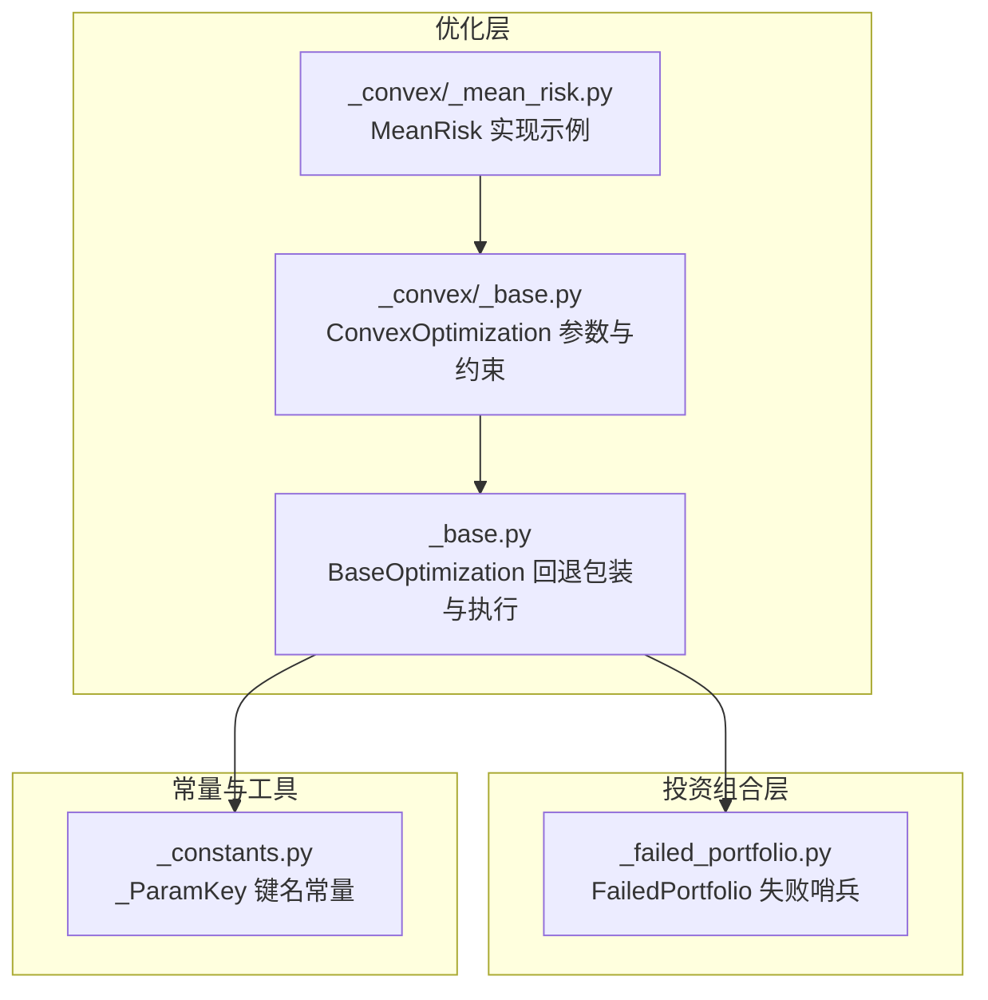
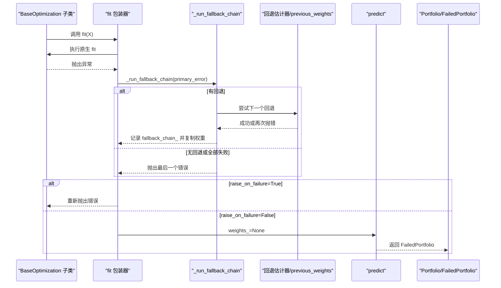
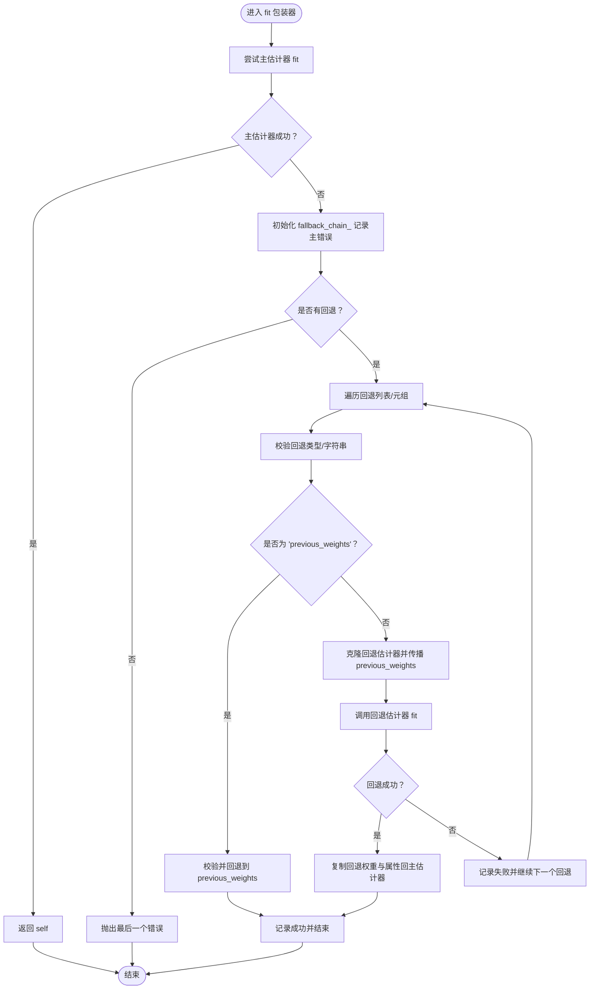
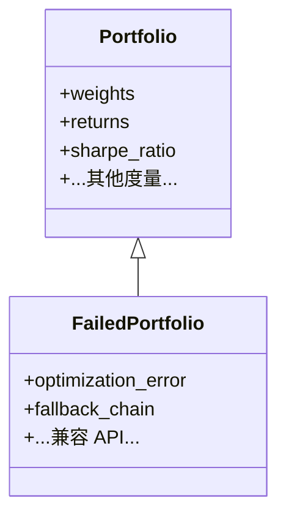
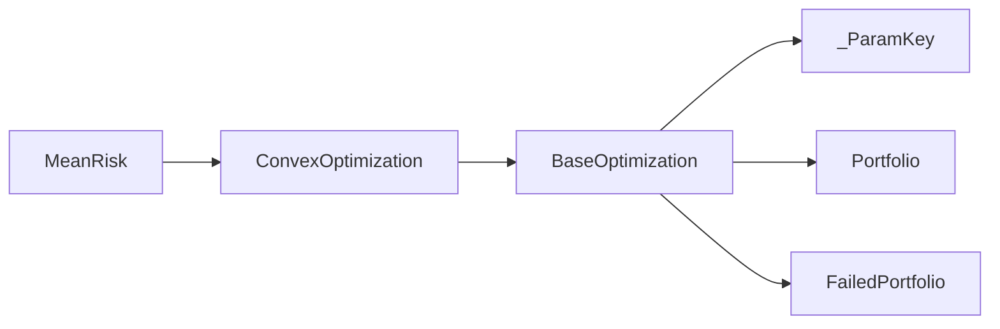

# 回退机制

<cite>
**本文引用的文件**
- [src/skfolio/optimization/_base.py](file://src/skfolio/optimization/_base.py)
- [src/skfolio/portfolio/_failed_portfolio.py](file://src/skfolio/portfolio/_failed_portfolio.py)
- [src/skfolio/_constants.py](file://src/skfolio/_constants.py)
- [tests/test_optimization/test_fallback.py](file://tests/test_optimization/test_fallback.py)
- [examples/mean_risk/plot_17_failure_and_fallbacks.py](file://examples/mean_risk/plot_17_failure_and_fallbacks.py)
- [src/skfolio/optimization/convex/_base.py](file://src/skfolio/optimization/convex/_base.py)
- [src/skfolio/optimization/convex/_mean_risk.py](file://src/skfolio/optimization/convex/_mean_risk.py)
</cite>

## 目录
1. [引言](#引言)
2. [项目结构](#项目结构)
3. [核心组件](#核心组件)
4. [架构总览](#架构总览)
5. [详细组件分析](#详细组件分析)
6. [依赖关系分析](#依赖关系分析)
7. [性能考量](#性能考量)
8. [故障排查指南](#故障排查指南)
9. [结论](#结论)
10. [附录](#附录)

## 引言
本文件系统化梳理 skfolio 的“回退机制”（fallback mechanism），重点解释当主优化器在 fit 过程中失败时，系统如何自动切换到备用优化策略，从而确保投资组合生成的鲁棒性。文档将详细说明 FailedPortfolio 类的作用及其与回退链（fallback_chain）的关联；阐述如何通过 fallback 参数配置单一或链式回退策略，包括使用“previous_weights”作为最终回退选项的场景；结合测试代码中的示例，展示回退机制在交易成本约束导致优化失败时的处理流程，以及 previous_weights 的传播机制；最后提供实际应用示例，演示如何构建可靠的容错投资组合优化管道。

## 项目结构
围绕回退机制的关键代码分布在以下模块：
- 优化基类：定义回退行为、回退链记录、失败时的返回策略等
- 失败投资组合：在 raise_on_failure=False 或所有回退失败时返回的诊断型对象
- 常量：统一参数键名（如 previous_weights）
- 示例与测试：验证回退链、previous_weights 传播、跨验证与流水线集成

图表来源
- [src/skfolio/optimization/_base.py](file://src/skfolio/optimization/_base.py#L127-L167)
- [src/skfolio/portfolio/_failed_portfolio.py](file://src/skfolio/portfolio/_failed_portfolio.py#L1-L205)
- [src/skfolio/_constants.py](file://src/skfolio/_constants.py#L12-L26)
- [src/skfolio/optimization/convex/_base.py](file://src/skfolio/optimization/convex/_base.py#L409-L459)
- [src/skfolio/optimization/convex/_mean_risk.py](file://src/skfolio/optimization/convex/_mean_risk.py#L1-L200)

章节来源
- [src/skfolio/optimization/_base.py](file://src/skfolio/optimization/_base.py#L127-L167)
- [src/skfolio/portfolio/_failed_portfolio.py](file://src/skfolio/portfolio/_failed_portfolio.py#L1-L205)
- [src/skfolio/_constants.py](file://src/skfolio/_constants.py#L12-L26)
- [src/skfolio/optimization/convex/_base.py](file://src/skfolio/optimization/convex/_base.py#L409-L459)
- [src/skfolio/optimization/convex/_mean_risk.py](file://src/skfolio/optimization/convex/_mean_risk.py#L1-L200)

## 核心组件
- BaseOptimization.fit 包装器：在子类 fit 外围注入回退逻辑，捕获异常并按顺序尝试回退链
- _run_fallback_chain：执行回退链，支持单个或列表形式，支持字符串“previous_weights”
- _fallback_to_previous_weights_or_raise：当 fallback 指定为“previous_weights”时，校验并回退到上期权重
- FailedPortfolio：在 raise_on_failure=False 或所有回退失败时返回，携带诊断信息（optimization_error、fallback_chain）
- _ParamKey：统一参数键名，保证 previous_weights 在回退传播中的一致性

章节来源
- [src/skfolio/optimization/_base.py](file://src/skfolio/optimization/_base.py#L127-L167)
- [src/skfolio/optimization/_base.py](file://src/skfolio/optimization/_base.py#L168-L256)
- [src/skfolio/optimization/_base.py](file://src/skfolio/optimization/_base.py#L257-L283)
- [src/skfolio/optimization/_base.py](file://src/skfolio/optimization/_base.py#L346-L374)
- [src/skfolio/portfolio/_failed_portfolio.py](file://src/skfolio/portfolio/_failed_portfolio.py#L1-L205)
- [src/skfolio/_constants.py](file://src/skfolio/_constants.py#L12-L26)

## 架构总览
下图展示了从 fit 到预测的回退路径，以及失败时的返回形态：

图表来源
- [src/skfolio/optimization/_base.py](file://src/skfolio/optimization/_base.py#L136-L166)
- [src/skfolio/optimization/_base.py](file://src/skfolio/optimization/_base.py#L168-L256)
- [src/skfolio/optimization/_base.py](file://src/skfolio/optimization/_base.py#L346-L374)

## 详细组件分析

### 组件一：BaseOptimization 回退包装与执行
- __init_subclass__ 注入 fit 包装器，自动捕获 fit 异常并触发回退链
- _run_fallback_chain 支持：
  - 单个回退或列表/元组形式
  - 字符串“previous_weights”的特殊处理
  - 将主估计器的 previous_weights 自动传播给每个回退估计器
  - 成功后将回退估计器的权重与属性复制回主估计器，保持原始实例引用
- _fallback_to_previous_weights_or_raise 校验并回退到上期权重，否则抛错
- predict 在 weights_=None 且 raise_on_failure=False 时返回 FailedPortfolio

图表来源
- [src/skfolio/optimization/_base.py](file://src/skfolio/optimization/_base.py#L136-L166)
- [src/skfolio/optimization/_base.py](file://src/skfolio/optimization/_base.py#L168-L256)
- [src/skfolio/optimization/_base.py](file://src/skfolio/optimization/_base.py#L257-L283)

章节来源
- [src/skfolio/optimization/_base.py](file://src/skfolio/optimization/_base.py#L127-L167)
- [src/skfolio/optimization/_base.py](file://src/skfolio/optimization/_base.py#L168-L256)
- [src/skfolio/optimization/_base.py](file://src/skfolio/optimization/_base.py#L257-L283)
- [src/skfolio/optimization/_base.py](file://src/skfolio/optimization/_base.py#L346-L374)

### 组件二：FailedPortfolio 失败哨兵
- 当 weights_=None 且 raise_on_failure=False 时，predict 返回 FailedPortfolio
- FailedPortfolio 保留 Portfolio 完整 API 兼容性，但内部返回 NaN 的收益、权重等，便于下游分析不中断
- 携带 optimization_error 与 fallback_chain（若存在），用于审计与诊断
- 与 Portfolio 的区别在于：不进行风险度量计算，直接返回 NaN

图表来源
- [src/skfolio/portfolio/_failed_portfolio.py](file://src/skfolio/portfolio/_failed_portfolio.py#L1-L205)
- [src/skfolio/optimization/_base.py](file://src/skfolio/optimization/_base.py#L346-L374)

章节来源
- [src/skfolio/portfolio/_failed_portfolio.py](file://src/skfolio/portfolio/_failed_portfolio.py#L1-L205)
- [src/skfolio/optimization/_base.py](file://src/skfolio/optimization/_base.py#L346-L374)

### 组件三：fallback 参数与 previous_weights 传播
- fallback 可为：
  - 单个 BaseOptimization 子类实例
  - 字符串“previous_weights”
  - 列表/元组形式的混合（可包含“previous_weights”）
- previous_weights 会在回退链中被自动传播到每个回退估计器，避免重复设置
- 当 fallback 指向“previous_weights”，且主估计器未提供有效 previous_weights 时，会抛出明确错误提示

章节来源
- [src/skfolio/optimization/_base.py](file://src/skfolio/optimization/_base.py#L497-L536)
- [src/skfolio/optimization/_base.py](file://src/skfolio/optimization/_base.py#L550-L582)
- [tests/test_optimization/test_fallback.py](file://tests/test_optimization/test_fallback.py#L472-L516)
- [tests/test_optimization/test_fallback.py](file://tests/test_optimization/test_fallback.py#L517-L583)

### 组件四：交易成本与回退链的耦合
- ConvexOptimization 中的交易成本参数会影响回退链的传播与需求
- 当回退链中任一估计器或 fallback 指向“previous_weights”时，needs_previous_weights 为真，需在流水线/交叉验证中按序传递上期权重
- 示例：MeanRisk 在 fallback 中包含交易成本或最大换手率时，needs_previous_weights 为真

章节来源
- [src/skfolio/optimization/convex/_base.py](file://src/skfolio/optimization/convex/_base.py#L205-L277)
- [src/skfolio/optimization/convex/_base.py](file://src/skfolio/optimization/convex/_base.py#L409-L459)
- [tests/test_optimization/test_fallback.py](file://tests/test_optimization/test_fallback.py#L552-L583)

## 依赖关系分析
- BaseOptimization 依赖：
  - _constants._ParamKey：统一参数键名（如 previous_weights）
  - Portfolio/FailedPortfolio：预测阶段返回对象
  - sklearn.base.BaseEstimator：scikit-learn 风格接口
- ConvexOptimization 继承 BaseOptimization，并扩展了大量参数（权重上下界、预算、交易成本、管理费、不确定性集等）
- MeanRisk 作为 ConvexOptimization 的具体实现，体现回退机制在复杂约束下的稳健性

图表来源
- [src/skfolio/optimization/_base.py](file://src/skfolio/optimization/_base.py#L1-L126)
- [src/skfolio/_constants.py](file://src/skfolio/_constants.py#L12-L26)
- [src/skfolio/optimization/convex/_base.py](file://src/skfolio/optimization/convex/_base.py#L409-L459)
- [src/skfolio/optimization/convex/_mean_risk.py](file://src/skfolio/optimization/convex/_mean_risk.py#L1-L200)

章节来源
- [src/skfolio/optimization/_base.py](file://src/skfolio/optimization/_base.py#L1-L126)
- [src/skfolio/_constants.py](file://src/skfolio/_constants.py#L12-L26)
- [src/skfolio/optimization/convex/_base.py](file://src/skfolio/optimization/convex/_base.py#L409-L459)
- [src/skfolio/optimization/convex/_mean_risk.py](file://src/skfolio/optimization/convex/_mean_risk.py#L1-L200)

## 性能考量
- 回退链的代价：每次回退都会额外一次优化求解，增加计算时间
- 建议：
  - 优先选择“简单即可行”的回退策略（如 EqualWeighted、较宽松约束的 MeanRisk）
  - 将“previous_weights”放在链末尾作为最终兜底，避免不必要的求解
  - 对于交易成本/换手率敏感场景，确保 needs_previous_weights 为真，减少无效回退

## 故障排查指南
- 现象：fit 抛错且 raise_on_failure=True
  - 处理：直接抛出异常，检查主估计器参数与数据
- 现象：fit 抛错且 raise_on_failure=False
  - 处理：predict 返回 FailedPortfolio，检查 optimization_error 与 fallback_chain
- 现象：fallback_chain 显示“previous_weights”失败
  - 处理：确认主估计器是否提供了有效的 previous_weights；否则在主估计器上显式设置
- 现象：回退链中某估计器也失败
  - 处理：检查该估计器的参数是否合理（如最小权重、预算、线性约束等）

章节来源
- [src/skfolio/optimization/_base.py](file://src/skfolio/optimization/_base.py#L136-L166)
- [src/skfolio/optimization/_base.py](file://src/skfolio/optimization/_base.py#L168-L256)
- [src/skfolio/optimization/_base.py](file://src/skfolio/optimization/_base.py#L346-L374)
- [tests/test_optimization/test_fallback.py](file://tests/test_optimization/test_fallback.py#L256-L314)

## 结论
skfolio 的回退机制通过 BaseOptimization 的自动包装与链式回退执行，实现了在生产与研究场景下的稳健优化。FailedPortfolio 保证了失败时的诊断能力与下游分析的连续性。通过 fallback 参数与 previous_weights 的灵活配置，系统能够在严格约束导致不可行时，自动切换到更宽松或历史权重策略，显著提升鲁棒性与可维护性。建议在实际应用中：
- 明确回退顺序与兜底策略（优先简单可行，最后使用 previous_weights）
- 在交易成本/换手率敏感场景中启用 needs_previous_weights 的流水线传递
- 使用示例与测试中的模式快速验证与调试

## 附录

### 实际应用示例：构建可靠的容错优化管道
- 场景：最小方差问题在某些日期因严格最小权重约束而不可行
- 步骤：
  1) 主估计器：严格约束的 MeanRisk（min_weights 较高）
  2) 回退链：先尝试较宽松约束的 MeanRisk，再尝试 EqualWeighted，最后以 previous_weights 作为兜底
  3) 在 raise_on_failure=False 下运行交叉验证，收集 fallback_chain 与失败统计
  4) 对失败周期重放优化，定位约束失效原因

章节来源
- [examples/mean_risk/plot_17_failure_and_fallbacks.py](file://examples/mean_risk/plot_17_failure_and_fallbacks.py#L1-L282)
- [tests/test_optimization/test_fallback.py](file://tests/test_optimization/test_fallback.py#L92-L162)
- [tests/test_optimization/test_fallback.py](file://tests/test_optimization/test_fallback.py#L164-L187)