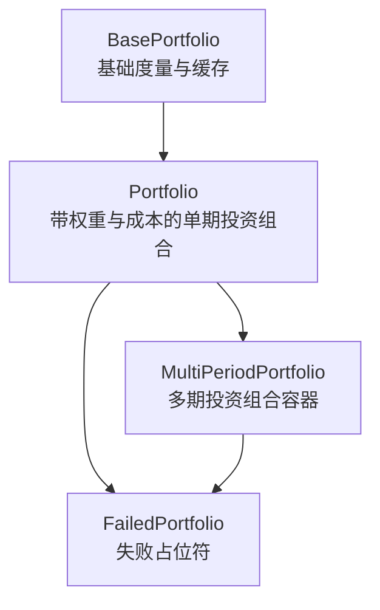
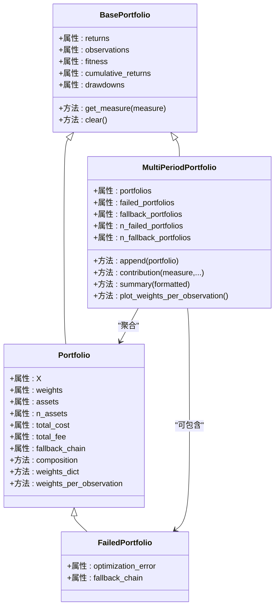
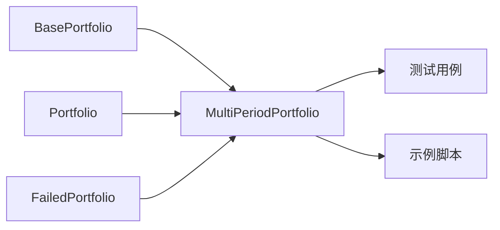

# 多周期投资组合

<cite>
**本文引用的文件**
- [src/skfolio/portfolio/_multi_period_portfolio.py](file://src/skfolio/portfolio/_multi_period_portfolio.py)
- [src/skfolio/portfolio/_base.py](file://src/skfolio/portfolio/_base.py)
- [src/skfolio/portfolio/_portfolio.py](file://src/skfolio/portfolio/_portfolio.py)
- [src/skfolio/portfolio/_failed_portfolio.py](file://src/skfolio/portfolio/_failed_portfolio.py)
- [tests/test_portfolio/test_multi_period_portfolio.py](file://tests/test_portfolio/test_multi_period_portfolio.py)
- [examples/ensemble/plot_1_stacking.py](file://examples/ensemble/plot_1_stacking.py)
- [examples/mean_risk/plot_17_failure_and_fallbacks.py](file://examples/mean_risk/plot_17_failure_and_fallbacks.py)
</cite>

## 目录
1. [简介](#简介)
2. [项目结构](#项目结构)
3. [核心组件](#核心组件)
4. [架构总览](#架构总览)
5. [详细组件分析](#详细组件分析)
6. [依赖关系分析](#依赖关系分析)
7. [性能考量](#性能考量)
8. [故障排查指南](#故障排查指南)
9. [结论](#结论)
10. [附录](#附录)

## 简介
本文件系统性文档化 MultiPeriodPortfolio 类的设计与功能，重点阐述其作为多个 Portfolio 对象容器的角色，如何支持动态再平衡与时间序列投资组合分析。我们将详细说明：
- 继承自 BasePortfolio 的接口一致性与度量缓存机制
- 作为列表的迭代与索引行为（含切片、赋值、删除、成员检测）
- 关键属性 portfolios、failed_portfolios、fallback_portfolios 的用途，以及 n_failed_portfolios、n_fallback_portfolios 等诊断性度量
- 通过示例展示如何构建包含不同时间段投资组合的多周期实例，并演示其在回测与绩效分析中的应用
- 强调该类在模拟真实世界投资组合随时间演变场景中的核心作用

## 项目结构
MultiPeriodPortfolio 位于 portfolio 模块中，与 Portfolio、FailedPortfolio、BasePortfolio 共同构成投资组合建模与分析的核心层次。测试与示例展示了其在滚动预测、回测与诊断统计中的典型用法。

图表来源
- [src/skfolio/portfolio/_base.py](file://src/skfolio/portfolio/_base.py#L75-L120)
- [src/skfolio/portfolio/_portfolio.py](file://src/skfolio/portfolio/_portfolio.py#L30-L120)
- [src/skfolio/portfolio/_multi_period_portfolio.py](file://src/skfolio/portfolio/_multi_period_portfolio.py#L24-L60)
- [src/skfolio/portfolio/_failed_portfolio.py](file://src/skfolio/portfolio/_failed_portfolio.py#L15-L40)

章节来源
- [src/skfolio/portfolio/_multi_period_portfolio.py](file://src/skfolio/portfolio/_multi_period_portfolio.py#L24-L120)
- [src/skfolio/portfolio/_base.py](file://src/skfolio/portfolio/_base.py#L75-L120)
- [src/skfolio/portfolio/_portfolio.py](file://src/skfolio/portfolio/_portfolio.py#L30-L120)
- [src/skfolio/portfolio/_failed_portfolio.py](file://src/skfolio/portfolio/_failed_portfolio.py#L15-L40)

## 核心组件
- MultiPeriodPortfolio：由多个 Portfolio 组成的投资组合容器，支持按时间顺序拼接收益与观测，提供多期度量汇总与可视化。
- Portfolio：单期投资组合，封装资产收益矩阵、权重、交易成本与管理费，计算各类风险收益指标。
- FailedPortfolio：优化失败时返回的占位符，保持 API 兼容，携带诊断信息（如 fallback_chain）。
- BasePortfolio：所有投资组合的抽象基类，统一度量计算、缓存与属性访问模式。

章节来源
- [src/skfolio/portfolio/_multi_period_portfolio.py](file://src/skfolio/portfolio/_multi_period_portfolio.py#L24-L120)
- [src/skfolio/portfolio/_portfolio.py](file://src/skfolio/portfolio/_portfolio.py#L30-L120)
- [src/skfolio/portfolio/_failed_portfolio.py](file://src/skfolio/portfolio/_failed_portfolio.py#L15-L40)
- [src/skfolio/portfolio/_base.py](file://src/skfolio/portfolio/_base.py#L75-L120)

## 架构总览
MultiPeriodPortfolio 通过聚合多个 Portfolio，将各期收益与观测连接为整体序列，同时保留每期的 composition、weights_dict、weights_per_observation 等维度信息，便于时间序列分析与可视化。

图表来源
- [src/skfolio/portfolio/_base.py](file://src/skfolio/portfolio/_base.py#L75-L120)
- [src/skfolio/portfolio/_portfolio.py](file://src/skfolio/portfolio/_portfolio.py#L420-L520)
- [src/skfolio/portfolio/_failed_portfolio.py](file://src/skfolio/portfolio/_failed_portfolio.py#L149-L205)
- [src/skfolio/portfolio/_multi_period_portfolio.py](file://src/skfolio/portfolio/_multi_period_portfolio.py#L539-L768)

## 详细组件分析

### MultiPeriodPortfolio 类设计与行为
- 容器语义与列表操作
  - 支持长度、索引、切片、迭代、成员检测、删除与赋值；赋值与删除会触发内部缓存清理。
  - 支持算术运算（加减乘除、整除、取负、取绝对值、四舍五入、向下取整、截断），对每个子 Portfolio 应用相同操作并返回新的 MultiPeriodPortfolio 实例。
- 观测顺序校验
  - 可选参数 check_observations_order 控制是否要求各期观测不重叠且严格递增，避免时间线交叉导致的分析偏差。
- 内部状态与缓存
  - 内部维护 _portfolios 列表，以及 returns、observations 的拼接数组；设置 portfolios 或追加新 Portfolio 时会更新这些字段并清空相关度量缓存。
- 诊断属性
  - failed_portfolios：仅包含 FailedPortfolio 的列表
  - fallback_portfolios：包含任何带有 fallback_chain 的 Portfolio（包括 FailedPortfolio）
  - n_failed_portfolios、n_fallback_portfolios：失败与回退计数
- 资产与权重视图
  - assets：每期资产名列表
  - composition：每期组合权重的拼接 DataFrame，列名去重并填充零
  - weights_dict、previous_weights_dict：每期名称到权重字典映射
  - weights_per_observation：按观测索引排列的权重矩阵，排序后填充零
- 贡献度分析
  - contribution(measure, spacing, to_df)：对每期计算资产对某度量的贡献，支持 DataFrame 或数组列表形式
- 摘要与可视化
  - summary(formatted)：在基础摘要基础上增加“平均每期资产数”、“期数”、“失败期数”、“回退期数”
  - plot_weights_per_observation()：绘制权重随时间堆叠面积图，展示资产配置随时间变化

章节来源
- [src/skfolio/portfolio/_multi_period_portfolio.py](file://src/skfolio/portfolio/_multi_period_portfolio.py#L377-L488)
- [src/skfolio/portfolio/_multi_period_portfolio.py](file://src/skfolio/portfolio/_multi_period_portfolio.py#L499-L538)
- [src/skfolio/portfolio/_multi_period_portfolio.py](file://src/skfolio/portfolio/_multi_period_portfolio.py#L539-L768)

### 与 BasePortfolio 的接口一致性
- MultiPeriodPortfolio 继承 BasePortfolio，复用其度量缓存机制与属性访问模式，包括：
  - 使用 cached_property_slots 动态计算并缓存度量
  - 通过 get_measure(measure) 调用 measures 模块函数，按全局与局部参数计算
  - clear() 清理度量、累计收益与回撤缓存
- MultiPeriodPortfolio 在初始化时将 returns、observations 设为空数组，随后由 _set_portfolios 合并各期数据；当 check_observations_order 为真时，强制检查相邻期观测起点与终点的时序关系。

章节来源
- [src/skfolio/portfolio/_base.py](file://src/skfolio/portfolio/_base.py#L576-L616)
- [src/skfolio/portfolio/_base.py](file://src/skfolio/portfolio/_base.py#L758-L800)
- [src/skfolio/portfolio/_multi_period_portfolio.py](file://src/skfolio/portfolio/_multi_period_portfolio.py#L333-L376)
- [src/skfolio/portfolio/_multi_period_portfolio.py](file://src/skfolio/portfolio/_multi_period_portfolio.py#L500-L538)

### 与 Portfolio 的关系与差异
- Portfolio 是单期投资组合，包含资产矩阵 X、权重 weights、交易成本与管理费、前一期权重 previous_weights、fallback_chain 等。
- MultiPeriodPortfolio 聚合多个 Portfolio，但本身不直接持有资产矩阵或权重，而是通过各期 Portfolio 的 composition、weights_dict 等导出视图。
- FailedPortfolio 继承 Portfolio，用于表示失败的优化结果，保持 API 兼容并在度量上返回 NaN，从而不影响整体分析流程。

章节来源
- [src/skfolio/portfolio/_portfolio.py](file://src/skfolio/portfolio/_portfolio.py#L420-L520)
- [src/skfolio/portfolio/_failed_portfolio.py](file://src/skfolio/portfolio/_failed_portfolio.py#L149-L205)

### 关键属性与诊断度量
- portfolios：只读列表，保存各期 Portfolio；setter 会重建 returns/observations 并清理缓存
- failed_portfolios：仅包含 FailedPortfolio 的列表，便于统计失败期数
- fallback_portfolios：包含任何带有 fallback_chain 的 Portfolio（包括 FailedPortfolio），便于统计回退次数
- n_failed_portfolios、n_fallback_portfolios：失败与回退期数，summary 中扩展显示

章节来源
- [src/skfolio/portfolio/_multi_period_portfolio.py](file://src/skfolio/portfolio/_multi_period_portfolio.py#L553-L577)
- [src/skfolio/portfolio/_multi_period_portfolio.py](file://src/skfolio/portfolio/_multi_period_portfolio.py#L658-L690)

### 时间序列与动态再平衡支持
- MultiPeriodPortfolio 将各期 Portfolio 的 returns 与 observations 连接为整体序列，支持按观测索引进行权重可视化与贡献度分析。
- 通过 weights_per_observation，可以直观观察资产权重随时间的变化轨迹，辅助再平衡策略评估。
- 在回测场景中，MultiPeriodPortfolio 通常由 cross_val_predict 返回，其中每期 Portfolio 可能来自不同估计器或失败回退链，summary 提供全局统计。

章节来源
- [src/skfolio/portfolio/_multi_period_portfolio.py](file://src/skfolio/portfolio/_multi_period_portfolio.py#L611-L619)
- [examples/ensemble/plot_1_stacking.py](file://examples/ensemble/plot_1_stacking.py#L137-L146)
- [examples/mean_risk/plot_17_failure_and_fallbacks.py](file://examples/mean_risk/plot_17_failure_and_fallbacks.py#L154-L171)

### 示例：构建多周期实例与回测应用
- 示例一：使用 WalkForward 在测试集上生成滚动预测，返回 MultiPeriodPortfolio，随后加入 Population 进行汇总分析与可视化。
- 示例二：在失败与回退场景中，MultiPeriodPortfolio 包含 Portfolio 与 FailedPortfolio，summary 展示失败与回退统计，绘图对失败期留空以反映缺失。

章节来源
- [examples/ensemble/plot_1_stacking.py](file://examples/ensemble/plot_1_stacking.py#L137-L146)
- [examples/ensemble/plot_1_stacking.py](file://examples/ensemble/plot_1_stacking.py#L146-L173)
- [examples/mean_risk/plot_17_failure_and_fallbacks.py](file://examples/mean_risk/plot_17_failure_and_fallbacks.py#L154-L171)
- [examples/mean_risk/plot_17_failure_and_fallbacks.py](file://examples/mean_risk/plot_17_failure_and_fallbacks.py#L248-L282)

## 依赖关系分析
- MultiPeriodPortfolio 依赖 BasePortfolio 的度量缓存与属性系统，依赖 Portfolio 的 composition、weights_dict、weights_per_observation 等视图，依赖 FailedPortfolio 提供失败诊断能力。
- 测试覆盖了多期度量、索引与切片、失败与回退统计、贡献度分析、权重随时间可视化等关键路径。

图表来源
- [src/skfolio/portfolio/_base.py](file://src/skfolio/portfolio/_base.py#L75-L120)
- [src/skfolio/portfolio/_portfolio.py](file://src/skfolio/portfolio/_portfolio.py#L420-L520)
- [src/skfolio/portfolio/_failed_portfolio.py](file://src/skfolio/portfolio/_failed_portfolio.py#L149-L205)
- [src/skfolio/portfolio/_multi_period_portfolio.py](file://src/skfolio/portfolio/_multi_period_portfolio.py#L539-L768)
- [tests/test_portfolio/test_multi_period_portfolio.py](file://tests/test_portfolio/test_multi_period_portfolio.py#L263-L313)
- [tests/test_portfolio/test_multi_period_portfolio.py](file://tests/test_portfolio/test_multi_period_portfolio.py#L461-L467)
- [tests/test_portfolio/test_multi_period_portfolio.py](file://tests/test_portfolio/test_multi_period_portfolio.py#L567-L615)

章节来源
- [tests/test_portfolio/test_multi_period_portfolio.py](file://tests/test_portfolio/test_multi_period_portfolio.py#L263-L313)
- [tests/test_portfolio/test_multi_period_portfolio.py](file://tests/test_portfolio/test_multi_period_portfolio.py#L461-L467)
- [tests/test_portfolio/test_multi_period_portfolio.py](file://tests/test_portfolio/test_multi_period_portfolio.py#L567-L615)

## 性能考量
- 度量缓存：BasePortfolio 使用 cached_property_slots 动态计算并缓存度量，避免重复计算；MultiPeriodPortfolio 在 portfolios 更新时调用 clear() 清理缓存，确保后续访问获取最新结果。
- 数组拼接：_set_portfolios 与 append 会对 returns 与 observations 进行拼接，注意在大量期数下可能带来内存与时间开销；建议在批量构建时尽量减少中间态更新。
- 可视化：plot_weights_per_observation 会生成堆叠面积图，期数较多时建议分批或抽样展示以提升交互体验。

章节来源
- [src/skfolio/portfolio/_base.py](file://src/skfolio/portfolio/_base.py#L684-L712)
- [src/skfolio/portfolio/_multi_period_portfolio.py](file://src/skfolio/portfolio/_multi_period_portfolio.py#L500-L538)
- [src/skfolio/portfolio/_multi_period_portfolio.py](file://src/skfolio/portfolio/_multi_period_portfolio.py#L722-L768)

## 故障排查指南
- 观测重叠错误：启用 check_observations_order 时，若相邻期观测起止时间非法（如重叠或倒序），将抛出异常。可通过调整期段边界或关闭校验定位问题。
- 失败与回退统计：使用 n_failed_portfolios 与 n_fallback_portfolios 快速识别失败与回退比例；结合 summary 的最后几行查看回退统计。
- 贡献度异常：当某期为 FailedPortfolio 时，其贡献度可能全为 NaN，这是预期行为；可在贡献度 DataFrame 中定位并剔除或插值处理。
- 可视化空白：FailedPortfolio 对应期在累积收益等图中会留空，属正常现象；可结合 fallback_chain 审计回退过程。

章节来源
- [src/skfolio/portfolio/_multi_period_portfolio.py](file://src/skfolio/portfolio/_multi_period_portfolio.py#L523-L533)
- [tests/test_portfolio/test_multi_period_portfolio.py](file://tests/test_portfolio/test_multi_period_portfolio.py#L470-L501)
- [examples/mean_risk/plot_17_failure_and_fallbacks.py](file://examples/mean_risk/plot_17_failure_and_fallbacks.py#L248-L282)

## 结论
MultiPeriodPortfolio 通过聚合多个 Portfolio，将多期投资组合的时间序列特性与诊断信息统一呈现，既满足动态再平衡场景下的回测需求，又提供丰富的度量与可视化能力。其与 BasePortfolio 的接口一致性保证了度量计算的一致性与高效性；与 Portfolio/Fallback 的关系使其能够稳健地处理失败与回退，为生产级回测与研究分析提供了坚实基础。

## 附录
- 回测与滚动预测：示例展示了 MultiPeriodPortfolio 在 WalkForward 预测中的典型用法，以及 Population 对多策略的对比分析。
- 失败与回退：示例演示了 raise_on_failure 与 fallback 参数在跨期回测中的行为，MultiPeriodPortfolio 的 summary 与绘图对失败期进行透明处理。

章节来源
- [examples/ensemble/plot_1_stacking.py](file://examples/ensemble/plot_1_stacking.py#L137-L173)
- [examples/mean_risk/plot_17_failure_and_fallbacks.py](file://examples/mean_risk/plot_17_failure_and_fallbacks.py#L137-L171)