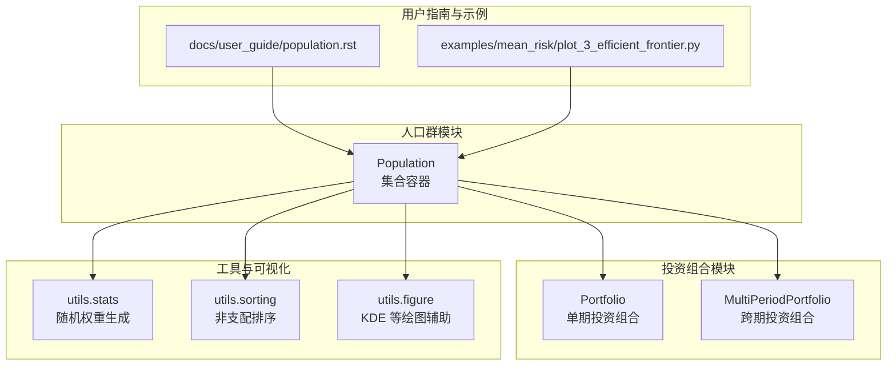
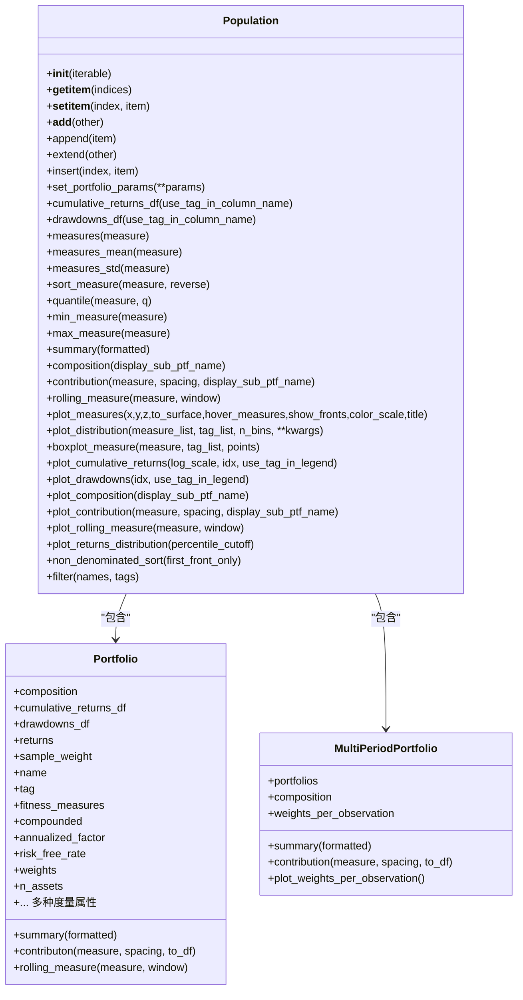
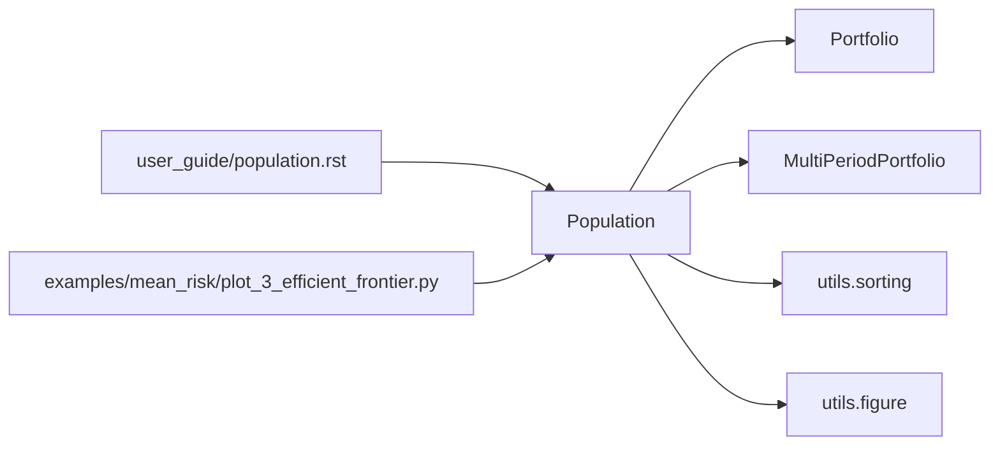
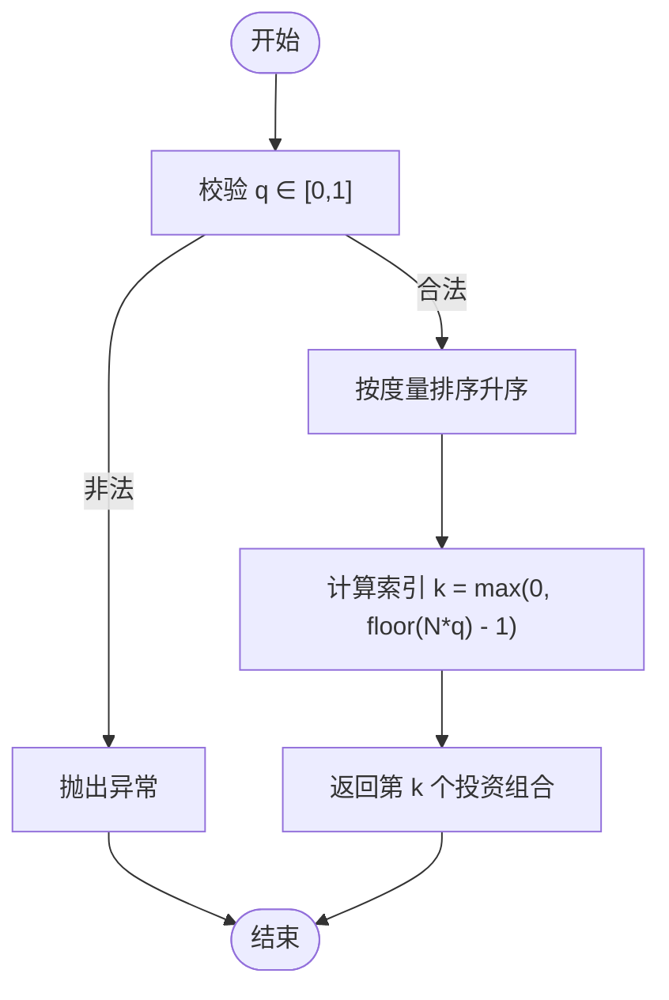
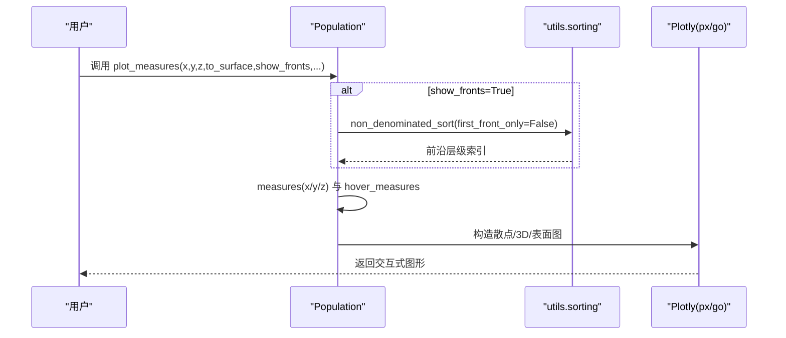

# 投资组合群体与模拟

<cite>
**本文引用的文件**
- [src/skfolio/population/_population.py](file://src/skfolio/population/_population.py)
- [src/skfolio/population/__init__.py](file://src/skfolio/population/__init__.py)
- [src/skfolio/portfolio/_portfolio.py](file://src/skfolio/portfolio/_portfolio.py)
- [src/skfolio/portfolio/_multi_period_portfolio.py](file://src/skfolio/portfolio/_multi_period_portfolio.py)
- [src/skfolio/utils/stats.py](file://src/skfolio/utils/stats.py)
- [src/skfolio/utils/sorting.py](file://src/skfolio/utils/sorting.py)
- [src/skfolio/utils/figure.py](file://src/skfolio/utils/figure.py)
- [docs/user_guide/population.rst](file://docs/user_guide/population.rst)
- [examples/mean_risk/plot_3_efficient_frontier.py](file://examples/mean_risk/plot_3_efficient_frontier.py)
- [tests/test_population/test_population.py](file://tests/test_population/test_population.py)
</cite>

## 目录
1. [引言](#引言)
2. [项目结构](#项目结构)
3. [核心组件](#核心组件)
4. [架构总览](#架构总览)
5. [详细组件分析](#详细组件分析)
6. [依赖关系分析](#依赖关系分析)
7. [性能考量](#性能考量)
8. [故障排查指南](#故障排查指南)
9. [结论](#结论)
10. [附录](#附录)

## 引言
本文件系统性地文档化 Population 类在投资组合模拟与压力测试中的应用。Population 是一个由多个投资组合（单期或跨期）组成的集合容器，继承并扩展了 Python 内置 list 的功能，提供面向群体分析的高级能力，包括：
- 组合构成与贡献分析
- 汇总统计与分位选择
- 非支配排序（帕累托前沿）分析
- 可视化：度量散点图、分布直方图、箱线图、滚动度量、累计回报与回撤曲线、资产权重随时间变化等
- 蒙特卡洛模拟、有效前沿探索与群体比较分析

通过创建 100 个随机投资组合的示例，展示 Population 在蒙特卡洛模拟、有效前沿探索与群体比较分析中的实际应用。

## 项目结构
Population 位于 skfolio/population 子模块中，与 Portfolio、MultiPeriodPortfolio、工具函数及用户指南共同组成完整的投资组合分析体系。

图表来源
- [src/skfolio/population/_population.py](file://src/skfolio/population/_population.py#L1-L1225)
- [src/skfolio/portfolio/_portfolio.py](file://src/skfolio/portfolio/_portfolio.py#L1-L989)
- [src/skfolio/portfolio/_multi_period_portfolio.py](file://src/skfolio/portfolio/_multi_period_portfolio.py#L1-L768)
- [src/skfolio/utils/stats.py](file://src/skfolio/utils/stats.py#L1-L200)
- [src/skfolio/utils/sorting.py](file://src/skfolio/utils/sorting.py#L1-L200)
- [src/skfolio/utils/figure.py](file://src/skfolio/utils/figure.py#L1-L200)
- [docs/user_guide/population.rst](file://docs/user_guide/population.rst#L1-L110)
- [examples/mean_risk/plot_3_efficient_frontier.py](file://examples/mean_risk/plot_3_efficient_frontier.py#L1-L104)

章节来源
- [src/skfolio/population/_population.py](file://src/skfolio/population/_population.py#L1-L1225)
- [src/skfolio/population/__init__.py](file://src/skfolio/population/__init__.py#L1-L6)

## 核心组件
- Population：继承 list，作为 Portfolio 与 MultiPeriodPortfolio 的集合容器，提供群体级分析与可视化方法。
- Portfolio：单期投资组合，包含丰富的风险与收益度量属性。
- MultiPeriodPortfolio：跨期投资组合，由多个 Portfolio 组成，支持按时间序列的权重变化分析。
- 工具模块：随机权重生成、非支配排序、KDE 绘图辅助等。

章节来源
- [src/skfolio/population/_population.py](file://src/skfolio/population/_population.py#L1-L1225)
- [src/skfolio/portfolio/_portfolio.py](file://src/skfolio/portfolio/_portfolio.py#L1-L989)
- [src/skfolio/portfolio/_multi_period_portfolio.py](file://src/skfolio/portfolio/_multi_period_portfolio.py#L1-L768)
- [src/skfolio/utils/stats.py](file://src/skfolio/utils/stats.py#L1-L200)
- [src/skfolio/utils/sorting.py](file://src/skfolio/utils/sorting.py#L1-L200)
- [src/skfolio/utils/figure.py](file://src/skfolio/utils/figure.py#L1-L200)

## 架构总览
Population 将多个投资组合封装为一个统一对象，提供以下能力：
- 数据访问：累积回报、回撤、滚动度量、度量向量与均值/标准差
- 分析方法：composition、summary、measures、quantile、min_measure、max_measure、sort_measure、filter、non_denominated_sort
- 可视化：plot_measures、plot_distribution、boxplot_measure、plot_cumulative_returns、plot_drawdowns、plot_composition、plot_contribution、plot_rolling_measure、plot_returns_distribution

图表来源
- [src/skfolio/population/_population.py](file://src/skfolio/population/_population.py#L1-L1225)
- [src/skfolio/portfolio/_portfolio.py](file://src/skfolio/portfolio/_portfolio.py#L1-L989)
- [src/skfolio/portfolio/_multi_period_portfolio.py](file://src/skfolio/portfolio/_multi_period_portfolio.py#L1-L768)

## 详细组件分析

### Population 类：继承与扩展
- 继承 list 并重写关键魔术方法，确保元素类型一致性（仅接受 Portfolio 或 MultiPeriodPortfolio），并在切片时返回 Population 实例。
- 提供参数批量设置方法，对所有内部投资组合统一更新构造参数。
- 提供数据聚合与验证：校验是否全部使用复利或非复利回报，避免混合导致的不一致。

章节来源
- [src/skfolio/population/_population.py](file://src/skfolio/population/_population.py#L1-L120)

### 组合与汇总分析
- composition(display_sub_ptf_name)：输出每个投资组合的资产权重构成，支持多期组合列名前缀处理。
- summary(formatted)：对每个投资组合生成汇总表，横向以名称为键，纵向为度量指标。
- contribution(measure, spacing, display_sub_ptf_name)：计算资产对某度量的边际贡献，支持多期组合列名前缀处理。

章节来源
- [src/skfolio/population/_population.py](file://src/skfolio/population/_population.py#L474-L561)
- [src/skfolio/portfolio/_portfolio.py](file://src/skfolio/portfolio/_portfolio.py#L724-L764)
- [src/skfolio/portfolio/_multi_period_portfolio.py](file://src/skfolio/portfolio/_multi_period_portfolio.py#L584-L657)

### 度量与分位选择
- measures(measure)：返回每个投资组合指定度量的一维数组。
- measures_mean(measure)、measures_std(measure)：返回群体对该度量的均值与标准差。
- sort_measure(measure, reverse)：按指定度量排序，自动过滤失败的投资组合。
- quantile(measure, q)、min_measure(measure)、max_measure(measure)：基于度量进行分位选择与极值选择。

章节来源
- [src/skfolio/population/_population.py](file://src/skfolio/population/_population.py#L296-L439)

### 帕累托前沿分析：non_denominated_sort
- non_denominated_sort(first_front_only)：基于群体的 fitness_measures 进行快速非支配排序，返回各前沿层级的索引列表；若存在混合 fitness_measures，会抛出错误。
- plot_measures 支持 show_fronts=True 时高亮显示前沿层级。

章节来源
- [src/skfolio/population/_population.py](file://src/skfolio/population/_population.py#L219-L253)
- [src/skfolio/utils/sorting.py](file://src/skfolio/utils/sorting.py#L1-L200)

### 可视化方法
- plot_measures(x, y, z, to_surface, hover_measures, show_fronts, color_scale, title)：绘制二维/三维散点图或表面图，支持按标签着色、前沿高亮与悬停度量。
- plot_distribution(measure_list, tag_list, n_bins, **kwargs)：绘制度量分布直方图，支持按标签分组叠加。
- boxplot_measure(measure, tag_list, points)：绘制箱线图，支持按标签分组。
- plot_cumulative_returns(log_scale, idx, use_tag_in_legend)：绘制累计回报曲线，支持复利与对数刻度。
- plot_drawdowns(idx, use_tag_in_legend)：绘制回撤曲线。
- plot_composition(display_sub_ptf_name)：绘制组合权重条形图。
- plot_contribution(measure, spacing, display_sub_ptf_name)：绘制资产对度量的贡献条形图。
- plot_rolling_measure(measure, window)：绘制滚动度量曲线。
- plot_returns_distribution(percentile_cutoff)：绘制回报密度估计（KDE）曲线。

章节来源
- [src/skfolio/population/_population.py](file://src/skfolio/population/_population.py#L593-L1219)
- [src/skfolio/utils/figure.py](file://src/skfolio/utils/figure.py#L1-L200)

### 示例：创建 100 个随机投资组合并应用 Population
- 使用随机权重生成器生成 100 个权重向量，构建 100 个 Portfolio 并加入 Population。
- 展示 composition、summary、quantile、set_portfolio_params、non_denominated_sort、plot_measures、plot_cumulative_returns、plot_distribution、plot_composition 等用法。
- 有效前沿示例：通过 MeanRisk 模型预测得到 Population，再进行可视化与汇总分析。

章节来源
- [docs/user_guide/population.rst](file://docs/user_guide/population.rst#L1-L110)
- [examples/mean_risk/plot_3_efficient_frontier.py](file://examples/mean_risk/plot_3_efficient_frontier.py#L1-L104)
- [src/skfolio/utils/stats.py](file://src/skfolio/utils/stats.py#L154-L181)
- [tests/test_population/test_population.py](file://tests/test_population/test_population.py#L1-L271)

## 依赖关系分析
- Population 依赖 Portfolio/MultiPeriodPortfolio 的度量属性与方法（如 composition、summary、returns、sample_weight 等）。
- Population 依赖 utils.sorting 的非支配排序算法。
- 可视化依赖 Plotly（px/go）与 utils.figure 的 KDE 辅助。
- 用户指南与示例提供使用场景与最佳实践参考。

图表来源
- [src/skfolio/population/_population.py](file://src/skfolio/population/_population.py#L1-L1225)
- [src/skfolio/utils/sorting.py](file://src/skfolio/utils/sorting.py#L1-L200)
- [src/skfolio/utils/figure.py](file://src/skfolio/utils/figure.py#L1-L200)
- [docs/user_guide/population.rst](file://docs/user_guide/population.rst#L1-L110)
- [examples/mean_risk/plot_3_efficient_frontier.py](file://examples/mean_risk/plot_3_efficient_frontier.py#L1-L104)

## 性能考量
- 非支配排序复杂度约为 O(M·N^2)，其中 M 为目标数量，N 为投资组合数量；当 N 较大时应谨慎使用 show_fronts 或 first_front_only。
- 绘图操作涉及大量 Pandas 合并与 Plotly 渲染，建议在大数据集上限制显示项数或使用子集。
- 累计回报与回撤计算依赖内部投资组合的 returns 与 sample_weight，确保输入规模合理以避免内存峰值。

[本节为通用指导，无需列出具体文件来源]

## 故障排查指南
- 空 Population 或混合复利/非复利回报：在调用 cumulative_returns_df、drawdowns_df、plot_cumulative_returns、plot_drawdowns 前，先通过 set_portfolio_params(compounded=True/False) 明确回报模式。
- 混合 fitness_measures：non_denominated_sort 会拒绝混合目标，需统一 Portfolio 的 fitness_measures。
- 对数刻度限制：仅适用于复利累计回报，否则会抛出异常。
- 失败投资组合：在贡献与分布可视化中会自动跳过 FailedPortfolio，确保结果稳健。

章节来源
- [src/skfolio/population/_population.py](file://src/skfolio/population/_population.py#L156-L218)
- [src/skfolio/population/_population.py](file://src/skfolio/population/_population.py#L725-L835)
- [tests/test_population/test_population.py](file://tests/test_population/test_population.py#L190-L213)

## 结论
Population 将单个与跨期投资组合统一为可分析的群体对象，提供从数据聚合、度量分位到前沿识别与可视化的完整工具链。结合随机权重生成与优化模型预测，Population 能高效支撑蒙特卡洛模拟、有效前沿探索与群体比较分析，是投资组合研究与压力测试的重要基础设施。

[本节为总结性内容，无需列出具体文件来源]

## 附录

### 关键流程图：quantile 选择流程

图表来源
- [src/skfolio/population/_population.py](file://src/skfolio/population/_population.py#L377-L403)

### 关键序列图：plot_measures 可视化流程

图表来源
- [src/skfolio/population/_population.py](file://src/skfolio/population/_population.py#L911-L1120)
- [src/skfolio/utils/sorting.py](file://src/skfolio/utils/sorting.py#L1-L200)

### 示例：创建 100 个随机投资组合
- 使用随机权重生成器生成权重向量，构建 Portfolio 并加入 Population。
- 展示 composition、summary、quantile、set_portfolio_params、non_denominated_sort、plot_measures、plot_cumulative_returns、plot_distribution、plot_composition 等方法。
- 有效前沿示例：通过 MeanRisk 模型预测得到 Population，再进行可视化与汇总分析。

章节来源
- [docs/user_guide/population.rst](file://docs/user_guide/population.rst#L1-L110)
- [examples/mean_risk/plot_3_efficient_frontier.py](file://examples/mean_risk/plot_3_efficient_frontier.py#L1-L104)
- [src/skfolio/utils/stats.py](file://src/skfolio/utils/stats.py#L154-L181)
- [tests/test_population/test_population.py](file://tests/test_population/test_population.py#L1-L271)