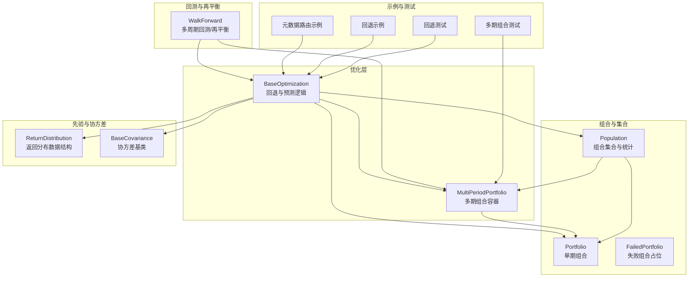
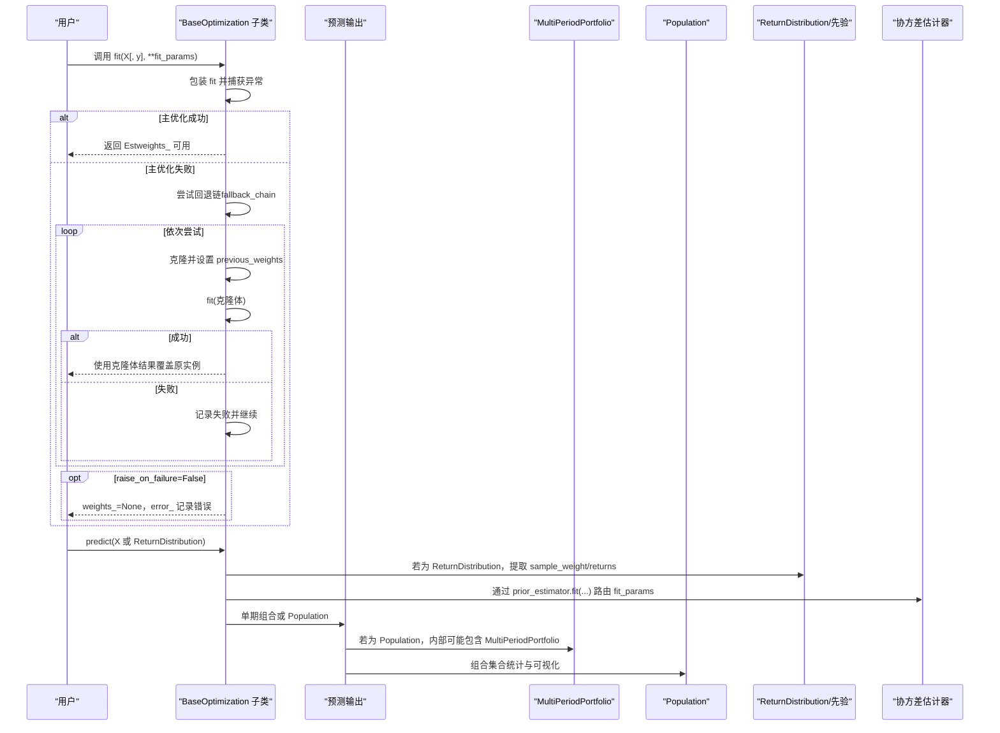
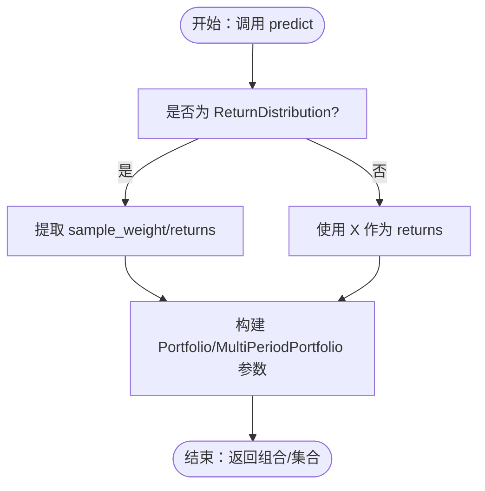
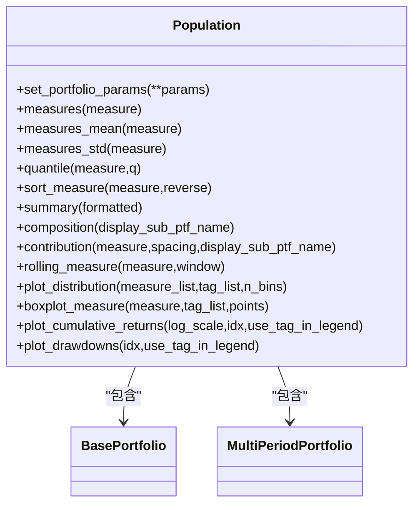
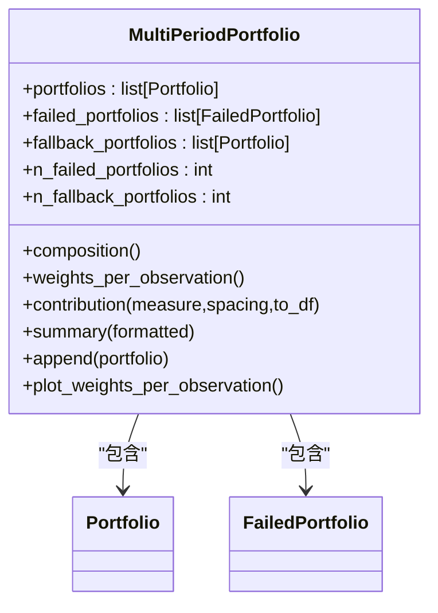
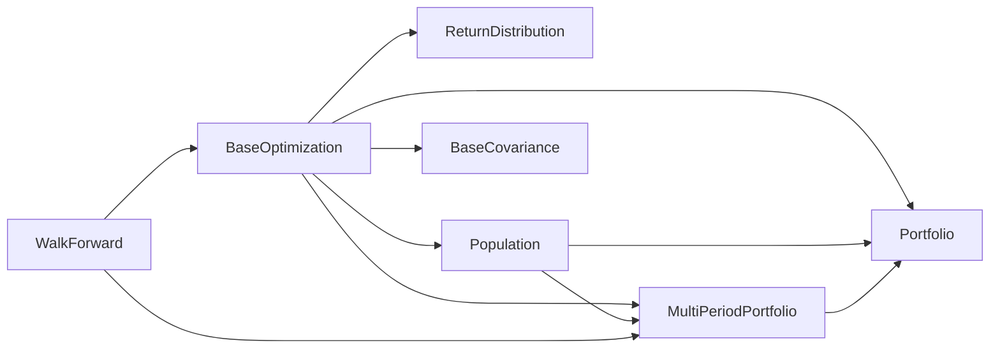

# 高级特性

<cite>
**本文引用的文件列表**
- [src/skfolio/optimization/_base.py](file://src/skfolio/optimization/_base.py)
- [src/skfolio/population/_population.py](file://src/skfolio/population/_population.py)
- [src/skfolio/portfolio/_multi_period_portfolio.py](file://src/skfolio/portfolio/_multi_period_portfolio.py)
- [src/skfolio/prior/_base.py](file://src/skfolio/prior/_base.py)
- [src/skfolio/moments/covariance/_base.py](file://src/skfolio/moments/covariance/_base.py)
- [src/skfolio/model_selection/_walk_forward.py](file://src/skfolio/model_selection/_walk_forward.py)
- [examples/metadata_routing/plot_1_implied_volatility.py](file://examples/metadata_routing/plot_1_implied_volatility.py)
- [examples/mean_risk/plot_17_failure_and_fallbacks.py](file://examples/mean_risk/plot_17_failure_and_fallbacks.py)
- [tests/test_optimization/test_fallback.py](file://tests/test_optimization/test_fallback.py)
- [tests/test_portfolio/test_multi_period_portfolio.py](file://tests/test_portfolio/test_multi_period_portfolio.py)
</cite>

## 目录
1. [简介](#简介)
2. [项目结构](#项目结构)
3. [核心组件](#核心组件)
4. [架构总览](#架构总览)
5. [详细组件分析](#详细组件分析)
6. [依赖关系分析](#依赖关系分析)
7. [性能考量](#性能考量)
8. [故障排查指南](#故障排查指南)
9. [结论](#结论)
10. [附录：使用示例与最佳实践](#附录使用示例与最佳实践)

## 简介
本章节系统性地记录 skfolio 框架的高级功能，重点围绕以下主题展开：
- 元数据路由（metadata routing）：如何在 fit 和 predict 过程中传递额外信息（如样本权重、隐含波动率等），并将其安全地路由到嵌套估计器。
- 回退机制（fallback）：当主优化器在 fit 失败时，自动尝试备用策略（包括“上期权重”回退），并保留可审计的回退链路。
- Population 类：用于集合化管理多个单期或多期组合，支持统计汇总、可视化与批量分析，便于模拟与压力测试。
- MultiPeriodPortfolio：在多周期回测场景下返回由多个单期组合构成的序列，支持动态再平衡策略与诊断指标。
- 实际用法示例：展示如何在优化中使用自定义协方差矩阵、如何进行多周期回测与动态再平衡。

## 项目结构
本节概览与高级特性直接相关的模块与文件组织方式，帮助读者快速定位实现位置与调用路径。

图表来源
- [src/skfolio/optimization/_base.py](file://src/skfolio/optimization/_base.py#L1-L200)
- [src/skfolio/portfolio/_multi_period_portfolio.py](file://src/skfolio/portfolio/_multi_period_portfolio.py#L1-L120)
- [src/skfolio/population/_population.py](file://src/skfolio/population/_population.py#L1-L120)
- [src/skfolio/prior/_base.py](file://src/skfolio/prior/_base.py#L1-L70)
- [src/skfolio/moments/covariance/_base.py](file://src/skfolio/moments/covariance/_base.py#L1-L110)
- [src/skfolio/model_selection/_walk_forward.py](file://src/skfolio/model_selection/_walk_forward.py#L1-L120)
- [examples/metadata_routing/plot_1_implied_volatility.py](file://examples/metadata_routing/plot_1_implied_volatility.py#L1-L120)
- [examples/mean_risk/plot_17_failure_and_fallbacks.py](file://examples/mean_risk/plot_17_failure_and_fallbacks.py#L1-L120)
- [tests/test_optimization/test_fallback.py](file://tests/test_optimization/test_fallback.py#L92-L180)
- [tests/test_portfolio/test_multi_period_portfolio.py](file://tests/test_portfolio/test_multi_period_portfolio.py#L61-L120)

章节来源
- [src/skfolio/optimization/_base.py](file://src/skfolio/optimization/_base.py#L1-L200)
- [src/skfolio/portfolio/_multi_period_portfolio.py](file://src/skfolio/portfolio/_multi_period_portfolio.py#L1-L120)
- [src/skfolio/population/_population.py](file://src/skfolio/population/_population.py#L1-L120)
- [src/skfolio/prior/_base.py](file://src/skfolio/prior/_base.py#L1-L70)
- [src/skfolio/moments/covariance/_base.py](file://src/skfolio/moments/covariance/_base.py#L1-L110)
- [src/skfolio/model_selection/_walk_forward.py](file://src/skfolio/model_selection/_walk_forward.py#L1-L120)

## 核心组件
- BaseOptimization：统一的优化估计器基类，负责包装 fit 的回退流程、参数传播、预测输出（单期组合或组合集合）、以及样本权重等元数据的处理。
- MultiPeriodPortfolio：多期组合容器，保存一系列单期组合，支持动态再平衡、权重轨迹可视化、失败组合统计等。
- Population：组合集合，支持批量统计、排序、筛选、贡献度分析、滚动指标与可视化，便于模拟与压力测试。
- ReturnDistribution：优化器使用的返回分布数据结构，包含期望收益、协方差、观测收益、Cholesky 分解与样本权重。
- BaseCovariance：协方差估计器基类，提供正定性校正与近似最近正定矩阵的工具。
- WalkForward：时间序列多周期回测/再平衡交叉验证器，支持按日历频率与偏移量进行动态再平衡。

章节来源
- [src/skfolio/optimization/_base.py](file://src/skfolio/optimization/_base.py#L1-L200)
- [src/skfolio/portfolio/_multi_period_portfolio.py](file://src/skfolio/portfolio/_multi_period_portfolio.py#L1-L120)
- [src/skfolio/population/_population.py](file://src/skfolio/population/_population.py#L1-L120)
- [src/skfolio/prior/_base.py](file://src/skfolio/prior/_base.py#L1-L70)
- [src/skfolio/moments/covariance/_base.py](file://src/skfolio/moments/covariance/_base.py#L1-L110)
- [src/skfolio/model_selection/_walk_forward.py](file://src/skfolio/model_selection/_walk_forward.py#L1-L120)

## 架构总览
下面的序列图展示了元数据路由与回退机制在优化流程中的交互，以及多周期回测如何驱动预测输出。

图表来源
- [src/skfolio/optimization/_base.py](file://src/skfolio/optimization/_base.py#L120-L200)
- [src/skfolio/prior/_base.py](file://src/skfolio/prior/_base.py#L1-L70)
- [src/skfolio/moments/covariance/_base.py](file://src/skfolio/moments/covariance/_base.py#L1-L110)
- [src/skfolio/portfolio/_multi_period_portfolio.py](file://src/skfolio/portfolio/_multi_period_portfolio.py#L1-L120)
- [src/skfolio/population/_population.py](file://src/skfolio/population/_population.py#L1-L120)

## 详细组件分析

### 元数据路由（metadata routing）：在 fit/predict 中传递样本权重与隐含波动率
- 核心思想
  - 在优化器的 fit/predict 中，除了核心输入 X（或 ReturnDistribution）外，还可以通过元数据路由传递额外参数（如样本权重、隐含波动率等）到嵌套估计器。
  - 通过启用元数据路由配置与 set_fit_request 声明需要路由的参数键，即可将这些参数安全地传递给子估计器。
- 关键实现点
  - BaseOptimization.predict 会从 ReturnDistribution 中提取 sample_weight，并将其传入 Portfolio/MultiPeriodPortfolio 的构造参数中，从而影响后续度量与回测。
  - 在示例中，通过 set_config 启用元数据路由，并使用 set_fit_request 指定将 implied_vol 路由到协方差估计器，随后在 GridSearchCV 与 cross_val_predict 中使用该参数完成多周期回测。
- 实践要点
  - 当使用 ReturnDistribution 作为 predict 输入时，其携带的 sample_weight 会被正确传递至组合对象，确保度量计算考虑了观测权重。
  - 对于协方差估计器（如 ImpliedCovariance），可通过元数据路由传入隐含波动率时间序列，以提升协方差估计质量。

图表来源
- [src/skfolio/optimization/_base.py](file://src/skfolio/optimization/_base.py#L288-L375)
- [src/skfolio/prior/_base.py](file://src/skfolio/prior/_base.py#L1-L70)

章节来源
- [src/skfolio/optimization/_base.py](file://src/skfolio/optimization/_base.py#L288-L375)
- [src/skfolio/prior/_base.py](file://src/skfolio/prior/_base.py#L1-L70)
- [examples/metadata_routing/plot_1_implied_volatility.py](file://examples/metadata_routing/plot_1_implied_volatility.py#L1-L120)

### 回退机制（fallback）：主优化失败时自动切换到备用策略
- 核心思想
  - BaseOptimization 在 __init_subclass__ 中自动包装 fit，使其具备回退能力：当主优化器抛出异常时，按顺序尝试 fallback 列表中的估计器；若仍失败，则根据 raise_on_failure 决定抛错或返回 FailedPortfolio。
  - 支持字符串 "previous_weights" 作为最终安全网，回退到上期权重；同时记录完整的回退链路 fallback_chain_，便于审计。
- 关键实现点
  - 包装后的 fit 会捕获主优化器异常，调用 _run_fallback_chain 逐个尝试回退策略，并在成功后将克隆体的权重与属性复制回原实例。
  - _fallback_to_previous_weights_or_raise 会对上期权重进行清理与形状校验，确保与资产数一致。
  - needs_previous_weights 属性用于判断是否需要在交叉验证中按序传递上期权重（例如存在交易成本、最大换手或依赖 previous_weights 的回退）。
- 实践要点
  - 在生产环境中建议设置 raise_on_failure=False，以便在研究/交叉验证中收集失败诊断，同时避免中断流水线。
  - 可将多种回退策略串联（列表或嵌套），形成渐进式放宽约束的策略链。

图表来源
- [src/skfolio/optimization/_base.py](file://src/skfolio/optimization/_base.py#L128-L200)
- [src/skfolio/optimization/_base.py](file://src/skfolio/optimization/_base.py#L168-L256)
- [src/skfolio/optimization/_base.py](file://src/skfolio/optimization/_base.py#L257-L283)
- [src/skfolio/optimization/_base.py](file://src/skfolio/optimization/_base.py#L424-L451)

章节来源
- [src/skfolio/optimization/_base.py](file://src/skfolio/optimization/_base.py#L128-L200)
- [src/skfolio/optimization/_base.py](file://src/skfolio/optimization/_base.py#L168-L256)
- [src/skfolio/optimization/_base.py](file://src/skfolio/optimization/_base.py#L257-L283)
- [src/skfolio/optimization/_base.py](file://src/skfolio/optimization/_base.py#L424-L451)
- [examples/mean_risk/plot_17_failure_and_fallbacks.py](file://examples/mean_risk/plot_17_failure_and_fallbacks.py#L1-L120)
- [tests/test_optimization/test_fallback.py](file://tests/test_optimization/test_fallback.py#L92-L180)

### Population 类：集合化管理与模拟/压力测试
- 功能概述
  - Population 是一个组合列表，支持：
    - 批量统计（均值、标准差、分位数、排序）
    - 按名称/标签过滤
    - 贡献度分析、滚动指标、组合与回撤可视化
    - 统一汇总与交互式探索
- 设计要点
  - 内部对组合类型进行严格校验，确保只接受 Portfolio 或 MultiPeriodPortfolio。
  - 提供 set_portfolio_params 动态设置组合参数，便于批量实验。
  - 对 compounded 标志进行一致性检查，避免混合使用。
- 实践要点
  - 在网格搜索或多周期回测中，将多个 Portfolio/MultiPeriodPortfolio 收集到 Population，可一键生成汇总报告与可视化图表，便于对比不同策略的稳健性与风险特征。

图表来源
- [src/skfolio/population/_population.py](file://src/skfolio/population/_population.py#L1-L200)
- [src/skfolio/population/_population.py](file://src/skfolio/population/_population.py#L200-L500)

章节来源
- [src/skfolio/population/_population.py](file://src/skfolio/population/_population.py#L1-L200)
- [src/skfolio/population/_population.py](file://src/skfolio/population/_population.py#L200-L500)

### MultiPeriodPortfolio：多周期回测与动态再平衡
- 功能概述
  - MultiPeriodPortfolio 是一组单期组合的有序序列，常由 WalkForward 回测产生；支持：
    - 权重轨迹可视化（堆叠面积图）
    - 组合构成与失败组合统计
    - 多期贡献度分析、汇总统计
- 设计要点
  - 内部维护 portfolios 列表，并在添加新组合时校验观测时间连续性（可选）。
  - 支持 fallback_chain 与 optimization_error 的传播，便于诊断每期失败原因。
- 实践要点
  - 在回测中，每个 Portfolio 对应一次再平衡窗口；通过 MultiPeriodPortfolio 可直观观察权重随时间变化与失败期的缺口。

图表来源
- [src/skfolio/portfolio/_multi_period_portfolio.py](file://src/skfolio/portfolio/_multi_period_portfolio.py#L1-L120)
- [src/skfolio/portfolio/_multi_period_portfolio.py](file://src/skfolio/portfolio/_multi_period_portfolio.py#L520-L768)

章节来源
- [src/skfolio/portfolio/_multi_period_portfolio.py](file://src/skfolio/portfolio/_multi_period_portfolio.py#L1-L120)
- [src/skfolio/portfolio/_multi_period_portfolio.py](file://src/skfolio/portfolio/_multi_period_portfolio.py#L520-L768)
- [tests/test_portfolio/test_multi_period_portfolio.py](file://tests/test_portfolio/test_multi_period_portfolio.py#L61-L120)

### 动态再平衡策略与多周期回测
- WalkForward 的设计目标
  - 通过 test_size/train_size/freq/freq_offset 等参数，灵活定义再平衡频率与训练窗口大小；支持按日历频率（如 WOM-3FRI）与偏移量进行精确再平衡。
  - 支持 purged_size 控制前瞻/回看，减少样本污染；支持 expend_train 与 reduce_test 等选项以适应不同回测需求。
- 与 MultiPeriodPortfolio 的结合
  - cross_val_predict 返回 MultiPeriodPortfolio，其中每个 Portfolio 对应一次再平衡窗口；结合 Population 可进行批量分析与可视化。
- 实践要点
  - 在高频再平衡场景下，建议设置 purged_size>=1 以避免过乐观的结果；对于日价资产或流动性较差的市场，更应谨慎设置前瞻控制。

章节来源
- [src/skfolio/model_selection/_walk_forward.py](file://src/skfolio/model_selection/_walk_forward.py#L1-L120)
- [src/skfolio/model_selection/_walk_forward.py](file://src/skfolio/model_selection/_walk_forward.py#L236-L393)

## 依赖关系分析
- BaseOptimization 依赖
  - ReturnDistribution：在 predict 中读取 sample_weight 与 returns。
  - Portfolio/MultiPeriodPortfolio：根据 weights_ 生成单期或集合输出。
  - Population：当 weights_ 为二维时，生成 Population。
  - BaseCovariance：通过 prior_estimator.fit(...) 间接使用协方差估计器（受元数据路由影响）。
- Population 依赖
  - BasePortfolio/MultiPeriodPortfolio：集合内元素类型校验与统计聚合。
  - 组合度量与贡献度分析：基于组合内部方法。
- MultiPeriodPortfolio 依赖
  - Portfolio：序列化存储与可视化。
  - FailedPortfolio：失败期占位与统计。
- WalkForward 依赖
  - 时间索引与日期偏移：用于按日历频率再平衡。
  - BaseOptimization：作为回测驱动器，产出 MultiPeriodPortfolio。

图表来源
- [src/skfolio/optimization/_base.py](file://src/skfolio/optimization/_base.py#L288-L375)
- [src/skfolio/population/_population.py](file://src/skfolio/population/_population.py#L1-L120)
- [src/skfolio/portfolio/_multi_period_portfolio.py](file://src/skfolio/portfolio/_multi_period_portfolio.py#L1-L120)
- [src/skfolio/model_selection/_walk_forward.py](file://src/skfolio/model_selection/_walk_forward.py#L1-L120)

章节来源
- [src/skfolio/optimization/_base.py](file://src/skfolio/optimization/_base.py#L288-L375)
- [src/skfolio/population/_population.py](file://src/skfolio/population/_population.py#L1-L120)
- [src/skfolio/portfolio/_multi_period_portfolio.py](file://src/skfolio/portfolio/_multi_period_portfolio.py#L1-L120)
- [src/skfolio/model_selection/_walk_forward.py](file://src/skfolio/model_selection/_walk_forward.py#L1-L120)

## 性能考量
- 元数据路由
  - 启用元数据路由会增加参数解析与路由开销，但在大多数情况下可忽略不计；建议仅对确需的参数启用路由。
- 回退机制
  - 回退链越长，失败时的总耗时越高；建议优先使用“上期权重”作为最后兜底，减少复杂回退链的尝试次数。
- 协方差估计
  - BaseCovariance 默认进行正定性校正，Higham 算法较慢；在大规模数据时可关闭 higham 或调整 higham_max_iteration。
- 多周期回测
  - WalkForward 的 purged_size 与 reduce_test 会影响样本数量与折数；在资源受限时可适当增大 test_size 或减少折数。

## 故障排查指南
- 优化失败
  - 设置 raise_on_failure=False 并检查 error_ 与 fallback_chain_，定位失败原因与回退路径。
  - 使用 FailedPortfolio 进行诊断，查看 optimization_error 与 fallback_chain。
- 协方差非正定
  - 观察 BaseCovariance 的 _sanity_check 与 cov_nearest 警告，必要时开启 higham 或增大 nearest 阈值。
- 多周期回测缺口
  - 检查 MultiPeriodPortfolio 中 failed_portfolios 与 n_failed_portfolios，确认失败期并补回重算。

章节来源
- [src/skfolio/optimization/_base.py](file://src/skfolio/optimization/_base.py#L128-L200)
- [src/skfolio/moments/covariance/_base.py](file://src/skfolio/moments/covariance/_base.py#L74-L110)
- [src/skfolio/portfolio/_multi_period_portfolio.py](file://src/skfolio/portfolio/_multi_period_portfolio.py#L550-L620)

## 结论
skfolio 的高级特性通过元数据路由、回退机制、Population 与 MultiPeriodPortfolio 的协同，提供了从“参数安全传递”到“失败可诊断”再到“集合化分析与可视化”的完整闭环。在多周期回测与动态再平衡场景中，这些能力显著提升了策略开发、评估与生产的可靠性与可追溯性。

## 附录：使用示例与最佳实践
- 使用自定义协方差矩阵（示例：隐含波动率）
  - 步骤
    - 启用元数据路由：set_config(enable_metadata_routing=True)
    - 在协方差估计器上调用 set_fit_request(implied_vol=True)
    - 将 implied_vol 作为 params 传入 GridSearchCV/cross_val_predict
  - 参考路径
    - [examples/metadata_routing/plot_1_implied_volatility.py](file://examples/metadata_routing/plot_1_implied_volatility.py#L1-L120)
- 多周期回测与动态再平衡
  - 步骤
    - 定义 WalkForward（test_size/train_size/freq/freq_offset）
    - 使用 cross_val_predict 返回 MultiPeriodPortfolio
    - 将 MultiPeriodPortfolio 放入 Population 进行汇总与可视化
  - 参考路径
    - [src/skfolio/model_selection/_walk_forward.py](file://src/skfolio/model_selection/_walk_forward.py#L1-L120)
    - [examples/metadata_routing/plot_1_implied_volatility.py](file://examples/metadata_routing/plot_1_implied_volatility.py#L120-L266)
- 回退策略与失败处理
  - 步骤
    - 在优化器中设置 fallback（可为单个估计器、列表或字符串 "previous_weights"）
    - 设置 raise_on_failure=False 以收集失败诊断
    - 通过 fallback_chain_ 与 error_ 追踪失败原因
  - 参考路径
    - [examples/mean_risk/plot_17_failure_and_fallbacks.py](file://examples/mean_risk/plot_17_failure_and_fallbacks.py#L1-L120)
    - [tests/test_optimization/test_fallback.py](file://tests/test_optimization/test_fallback.py#L92-L180)