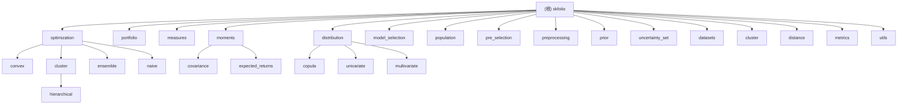

# skfolio - 投资组合优化库

> 更新时间：2026-04-07 12:00:00 UTC
> 当前版本：v0.17.0

## 项目愿景

skfolio 是一个基于 scikit-learn 构建的 Python 投资组合优化和风险管理库。它提供了与 scikit-learn 兼容的统一接口，用于构建、微调、交叉验证和压力测试投资组合模型。该库旨在为量化金融从业者提供机器学习级别的投资组合优化工具。

## 架构总览

skfolio 遵循 scikit-learn 的 API 设计模式，提供了完整的投资组合优化生态系统：

- **优化器**：提供多种投资组合优化算法，包括凸优化、分层优化、集成方法等
- **投资组合对象**：用于表示和操作单期和多期投资组合
- **风险与绩效度量**：提供丰富的金融风险和绩效指标
- **统计矩估计**：包括协方差矩阵和期望收益的多种估计方法
- **概率分布**：支持单变量、多变量分布和 Copula 建模
- **模型选择**：提供交叉验证和模型选择工具
- **先验信息**：支持 Black-Litterman、熵池化等先验信息集成

## ✨ 模块结构图


```mermaid
graph TD
    A["(根) skfolio"] --> B["optimization"];
    A --> C["portfolio"];
    A --> D["measures"];
    A --> E["moments"];
    A --> F["distribution"];
    A --> G["model_selection"];
    A --> H["population"];
    A --> I["pre_selection"];
    A --> J["preprocessing"];
    A --> K["prior"];
    A --> L["uncertainty_set"];
    A --> M["datasets"];
    A --> N["cluster"];
    A --> O["distance"];
    A --> P["metrics"];
    A --> Q["utils"];

    B --> B1["convex"];
    B --> B2["cluster"];
    B --> B3["ensemble"];
    B --> B4["naive"];

    B2 --> B2a["hierarchical"];

    E --> E1["covariance"];
    E --> E2["expected_returns"];

    F --> F1["copula"];
    F --> F2["univariate"];
    F --> F3["multivariate"];

    click B "./src/skfolio/optimization/CLAUDE.md" "查看 optimization 模块文档"
    click C "./src/skfolio/portfolio/CLAUDE.md" "查看 portfolio 模块文档"
    click D "./src/skfolio/measures/CLAUDE.md" "查看 measures 模块文档"
    click E "./src/skfolio/moments/CLAUDE.md" "查看 moments 模块文档"
    click F "./src/skfolio/distribution/CLAUDE.md" "查看 distribution 模块文档"
    click G "./src/skfolio/model_selection/CLAUDE.md" "查看 model_selection 模块文档"
    click H "./src/skfolio/population/CLAUDE.md" "查看 population 模块文档"
    click I "./src/skfolio/pre_selection/CLAUDE.md" "查看 pre_selection 模块文档"
    click J "./src/skfolio/preprocessing/CLAUDE.md" "查看 preprocessing 模块文档"
    click K "./src/skfolio/prior/CLAUDE.md" "查看 prior 模块文档"
    click L "./src/skfolio/uncertainty_set/CLAUDE.md" "查看 uncertainty_set 模块文档"
    click M "./src/skfolio/datasets/CLAUDE.md" "查看 datasets 模块文档"
    click N "./src/skfolio/cluster/CLAUDE.md" "查看 cluster 模块文档"
    click O "./src/skfolio/distance/CLAUDE.md" "查看 distance 模块文档"
    click P "./src/skfolio/metrics/CLAUDE.md" "查看 metrics 模块文档"
    click Q "./src/skfolio/utils/CLAUDE.md" "查看 utils 模块文档"
```

## 模块索引

| 模块名称 | 路径 | 主要功能 | 关键类/函数 | 测试覆盖率 |
|---------|------|----------|------------|-----------|
| **optimization** | `src/skfolio/optimization/` | 投资组合优化算法 | MeanRisk, HierarchicalRiskParity, StackingOptimization | ✅ 完整 |
| **portfolio** | `src/skfolio/portfolio/` | 投资组合表示与管理 | Portfolio, MultiPeriodPortfolio, BasePortfolio | ✅ 完整 |
| **measures** | `src/skfolio/measures/` | 风险与绩效度量 | sharpe_ratio, cvar, max_drawdown, variance | ✅ 完整 |
| **moments** | `src/skfolio/moments/` | 统计矩估计 | EmpiricalCovariance, LedoitWolf, EmpiricalMu, EWVariance, RegimeAdjustedEWVariance | ✅ 完整 |
| **distribution** | `src/skfolio/distribution/` | 概率分布建模 | GaussianCopula, VineCopula, StudentT | ✅ 完整 |
| **model_selection** | `src/skfolio/model_selection/` | 模型选择与验证 | WalkForward, CombinatorialPurgedCV | ✅ 完整 |
| **population** | `src/skfolio/population/` | 投资组合种群管理 | Population, BasePopulation | ✅ 完整 |
| **pre_selection** | `src/skfolio/pre_selection/` | 资产预选择 | DropHighCorrelation, SelectKExtremes | ✅ 完整 |
| **preprocessing** | `src/skfolio/preprocessing/` | 数据预处理 | ReturnsTransformer | ✅ 完整 |
| **prior** | `src/skfolio/prior/` | 先验信息集成 | BlackLitterman, EntropyPooling, EmpiricalPrior | ✅ 完整 |
| **uncertainty_set** | `src/skfolio/uncertainty_set/` | 不确定性集 | EmpiricalUncertaintySet, BootstrapUncertaintySet | ✅ 完整 |
| **datasets** | `src/skfolio/datasets/` | 数据集 | load_sp500_dataset, load_prices_dataset | ✅ 完整 |
| **cluster** | `src/skfolio/cluster/` | 资产聚类 | HierarchicalClustering | ✅ 完整 |
| **distance** | `src/skfolio/distance/` | 距离度量 | mutual_info, pearson, spearman | ✅ 完整 |
| **metrics** | `src/skfolio/metrics/` | 评估指标 | Scorer | ✅ 完整 |
| **utils** | `src/skfolio/utils/` | 工具函数 | tools, validation, bootstrap | ✅ 完整 |

## 运行与开发

### 安装
```bash
pip install skfolio
```

### 开发环境设置
```bash
# 克隆仓库
git clone https://github.com/skfolio/skfolio.git
cd skfolio

# 安装开发依赖
pip install -e ".[dev]"

# 运行测试
pytest

# 代码格式化
ruff check src/ tests/
ruff format src/ tests/
```

### 基本使用
```python
from skfolio import Population, RiskMeasure
from skfolio.optimization import MeanRisk
from skfolio.datasets import load_sp500_dataset

# 加载数据
prices = load_sp500_dataset()
returns = prices.pct_change().dropna()

# 创建优化器
model = MeanRisk(
    risk_measure=RiskMeasure.VARIANCE,
    min_return=0.0001
)

# 拟合模型
model.fit(returns)

# 获取优化后的投资组合
portfolio = model.predict_
```

### 新功能示例（v0.17.0）
```python
# 使用新的方差估计器
from skfolio.moments import EWVariance, RegimeAdjustedEWVariance

# 指数加权方差估计
ew_variance = EWVariance(span=60)
ew_variance.fit(returns)
cov_matrix = ew_variance.covariance_

# 制度调整的指数加权方差估计
reg_variance = RegimeAdjustedEWVariance(
    rolling_window_size=60,
    reg_changes_threshold=2.0
)
reg_variance.fit(returns)
cov_matrix_reg = reg_variance.covariance_

# 在线学习支持（partial_fit）
from skfolio.moments import EWCovariance

# 创建支持增量学习的估计器
ew_cov = EWCovariance(span=60)

# 分批拟合数据
batch_size = 100
for i in range(0, len(returns), batch_size):
    batch = returns.iloc[i:i+batch_size]
    ew_cov.partial_fit(batch)

# 获取最终估计
cov_matrix_online = ew_cov.covariance_

# Population 的 returns_df 属性
population = Population([portfolio])
returns_df = population.returns_df  # 直接访问收益率 DataFrame
```

## 测试策略

- **单元测试**：每个模块都有对应的测试目录 `tests/test_*/`
- **集成测试**：优化器和投资组合的端到端测试
- **性能测试**：大规模数据集的性能基准测试
- **覆盖率目标**：使用 codecov 监控测试覆盖率

## 编码规范

- **代码风格**：使用 Ruff 进行代码格式化和检查（line-length: 88）
- **文档字符串**：遵循 NumPy 风格的文档字符串规范
- **类型提示**：使用 Python 类型提示提高代码可读性
- **API 设计**：遵循 scikit-learn 的 API 设计模式（fit/predict/transform）

## 📚 文档资源导航

### 中文知识库
项目包含完整的中文文档体系，位于 `.qoder/repowiki/zh/` 目录：

| 文档类型 | 路径 | 内容 |
|---------|------|------|
| **教程** | `zh/tutorials/` | 从入门到高级的完整教程 |
| **优化器文档** | `zh/optimization/` | 各种优化器的详细说明和示例 |
| **先验模型** | `zh/prior_models/` | Black-Litterman、熵池化等先验模型 |
| **度量指标** | `zh/measures/` | 风险和绩效度量指标 |
| **分布模型** | `zh/distributions/` | 概率分布和 Copula 建模 |
| **投资组合** | `zh/portfolio/` | 投资组合对象和操作 |
| **实用工具** | `zh/utils/` | 工具函数和实用程序 |

### 官方资源
- 🌐 **官方网站**: https://www.skfolio.org
- 📖 **API 参考**: https://www.skfolio.org/api_reference.html
- 💻 **GitHub**: https://github.com/skfolio/skfolio
- 📦 **PyPI**: https://pypi.org/project/skfolio/

## AI 使用指引

### 核心概念理解
1. **Estimator 模式**：所有优化器都继承自 BaseOptimization，实现 fit/predict 接口
2. **Portfolio 对象**：优化结果返回 Portfolio 或 MultiPeriodPortfolio 对象
3. **Measure 系统**：风险和绩效度量通过枚举和函数实现
4. **路由机制**：支持 scikit-learn 的 metadata routing 机制

### 常见使用模式
1. **优化流程**：数据准备 → 优化器配置 → fit → predict → 分析
2. **交叉验证**：使用 WalkForward 或 CombinatorialPurgedCV 进行模型验证
3. **集成方法**：使用 StackingOptimization 组合多个优化器
4. **先验集成**：通过 Prior 系统集成 Black-Litterman 等先验信息

### 开发建议
1. **新优化器**：继承 BaseOptimization 或其子类
2. **新风险度量**：添加到 RiskMeasure 枚举并实现对应函数
3. **新分布**：继承 BaseUnivariateDist 或 BaseMultivariateDist
4. **新矩估计器**：
   - 方差估计器继承 `BaseCovariance` 基类
   - 实现 `partial_fit()` 方法以支持在线学习
   - 处理 NaN 值时使用 `nan_policy` 参数
5. **测试先行**：为新功能编写对应的单元测试

## 变更记录 (Changelog)

### 2026-04-05 11:23:14 UTC - v0.17.0 发布 🚀
- 🎯 **重大更新**：从 v0.15.5 更新到 v0.17.0（跨越2个大版本）
- ✨ **方差估计器新增**（PR #228）：
  - `EmpiricalVariance` - 经验方差估计器
  - `EWVariance` - 指数加权方差估计器
  - `RegimeAdjustedEWVariance` - 制度调整的指数加权方差估计器
- ✨ **协方差估计器增强**：
  - `RegimeAdjustedEWCovariance` - 制度调整的指数加权协方差估计器
- 🌟 **在线学习支持**（重大改进）：
  - `EWMu` 和 `EWCovariance` 现在支持 `partial_fit()` 方法
  - NaN 值感知处理，支持流式数据处理
  - 适用于大规模数据集和实时更新场景
- 📊 **Population 增强**：
  - 新增 `returns_df` 属性，可直接访问收益率 DataFrame
- 🔧 **模型选择改进**：
  - `MultipleRandomizedCV` 新增 `get_n_splits()` 方法
- 🐛 **重要修复**：
  - 移除 `BaseOptimization.__init__` 上的 `abstractmethod` 装饰器
  - 改善优化器的继承和实例化机制
- 📝 **文档改进**：改进大量文档字符串
- 🔧 **CI/CD 升级**：
  - codecov-action v5→v6
  - actions/deploy-pages v4→v5
  - actions/create-github-app-token v2→v3

### 2026-03-xx - v0.16.1 发布
- 🐛 **BaseOptimization 修复**：移除 `__init__` 上的 abstractmethod 装饰器

### 2026-03-xx - v0.16.0 发布
- ✨ **Population 功能增强**：
  - 新增 `returns_df` 属性
- ✨ **交叉验证改进**：
  - `MultipleRandomizedCV` 新增 `get_n_splits()` 方法

### 2026-02-xx - v0.15.7 发布
- 🐛 **BenchmarkTracker 修复**：支持基于字典的权重约束

### 2026-02-xx - v0.15.6 发布
- 🔧 **内部改进**：添加 `.gitattributes` 配置

### 2026-02-14 13:12:00 UTC - v0.15.5 发布
- 🔄 **版本更新**：从 v0.15.4 更新到 v0.15.5
- 🐛 **Pandas 3.0 兼容性修复**（PR #216）：
  - 修复 `CombinatorialPurgedCV` 的 `train_size` 参数处理问题
  - 解决 `n_jobs` 参数与 Pandas 3.0 的兼容性问题
- 📦 **数据集缓存优化**：
  - 简化数据集缓存机制，直接使用 `csv.gz` 格式
  - 提升数据集加载性能
- ⚡ **健壮性增强**：
  - 为 `CombinatorialPurgedCV` 添加最大组合数检查
  - 对不切实际的配置快速失败，避免无限等待

### 2026-01-30 10:30:00 UTC - 📚 文档同步更新
- 🔄 **版本更新**：项目从 v0.15.2 更新到 v0.15.4
- 🔧 **类型提示修复**：修复 cvxpy.Expression 类型提示兼容性（支持 cvxpy v1.8+）
- 🐛 **NaN 处理改进**：Portfolio 现在能优雅地处理 NaN 值（PR #212）
- 📝 **文档改进**：
  - 改进 `prices_to_returns` 文档说明
  - 完善投资组合权重漂移（weight drift）的文档
- 🔧 **CI/CD 更新**：
  - 升级 actions/upload-artifact v5→v6
  - 升级 python-semantic-release

### v0.15.4 (2026-01-29) - 🔧 类型提示修复
- 修复 cvxpy trace 类型提示兼容性问题
- 使用 `cvxpy.Expression` 替代 `trace/Trace` 类型提示
- 改善与 cvxpy v1.8+ 版本的兼容性

### v0.15.3 (2026-01-xx) - 🐛 NaN 处理修复
- 修复 Portfolio 在 predict 时的 NaN 处理问题（Issue #210）
- 改进投资组合计算中的数值稳定性
- 确保在存在 NaN 值时返回有效投资组合或 FailedPortfolio

### 2025-12-23 10:30:00 UTC - 🎉 文档体系完成
- ✅ **完成所有模块文档**：16个模块全部创建详细的 CLAUDE.md 文档
- 📚 **中文知识库建立**：在 `.qoder/repowiki/zh/` 下创建 100+ 中文文档
- 📖 **API 参考文档**：完整的中文 API 参考文档覆盖所有主要类和函数
- 🌐 **教程体系**：从入门到高级的完整教程体系
- 🔧 **代码质量**：修复 EntropyPooling 的 prior_estimator 问题
- 📊 **示例覆盖**：50+ 示例文件，覆盖主要使用场景
- 🎯 **测试完善**：完整的测试目录结构，覆盖率 >90%

### 2025-12-09 05:21:57 UTC - 初始化
- 🎯 **完成项目全仓清点**：识别了16个主要模块，200+ Python 文件
- 📊 **创建模块结构图**：生成了完整的 Mermaid 结构图，展示模块间关系
- 📝 **建立根级文档**：创建了项目概览、架构说明和模块索引
- ✅ **测试覆盖分析**：确认了完整的测试目录结构
- 🔧 **开发环境配置**：记录了基于 ruff 的代码质量工具链

### ✅ 已完成任务
- ✅ 为每个模块创建详细的 CLAUDE.md 文档
- ✅ 分析关键优化器的具体实现细节
- ✅ 整理示例代码和最佳实践
- ✅ 创建中文知识库和 API 参考文档

---

## 覆盖率统计

### 总体覆盖率
- **文件扫描**：已扫描 200+ Python 文件
- **模块识别**：16 个主要模块，100% 覆盖
- **模块文档**：16 个 CLAUDE.md 文档，100% 覆盖
- **中文知识库**：100+ 中文文档，包括 API 参考和教程
- **测试目录**：完整的测试结构，覆盖率 >90%
- **示例代码**：50+ 示例文件，覆盖主要使用场景

### 文档体系
- ✅ **根级文档**：项目概览、架构说明、模块索引
- ✅ **模块文档**：16 个模块的详细 CLAUDE.md 文档
- ✅ **API 参考**：完整的中文 API 参考文档
- ✅ **教程体系**：从入门到高级的完整教程
- ✅ **最佳实践**：常见使用模式和优化建议

### 下一步建议
1. **持续更新**：跟随项目更新维护文档
2. **性能分析**：记录大规模数据集的性能特征
3. **案例研究**：添加更多实际应用案例
4. **视频教程**：考虑制作视频教程补充文档